# GO enrichment of all genes obtained

We use `GO_enrichment_FDR.R` which allows us to choose between multiple procedures for multiple testing correction. Here we are interested in controlling the FDR ; we can use either `pAdjustMethod = "BH"` (Benjamini-Hochberg, default parameter) or `pAdjustMethod = "fdr"`.

All results (list of genes and detailed GO enrichment) can be found here:

```
/work2/project/regenet/workspace/thoellinger/shared/2022/promoter_capture_hic/
```

## Dependencies

We use R 4.0. We need the `clusterProfiler` package. See `custom_go.md` for installation details.

## Main remarks

- From time to time, one may get the following error while using `GO_enrichment_FDR.R`:

  ```R
  Error in `[.data.frame`(d, , 2) : undefined columns selected
  ```

  This is expected, and should be considered as a warning only (I did not take the time to handle the case with an exception). This happens when no significant GO terms are found ; in such case, no graphical outputs are computed.

## Collecting the list of genes of interest

```bash
cd /work2/project/regenet/workspace/thoellinger/shared/2022/promoter_capture_hic/
```

We obtained this list using our R markdown doing network analysis of E-G pairs starting from genes directly involved in hemochromatosis or involved in the regulation of iron metabolism.

We saved this list of 54 (12 known + 42 inferred) genes as `new_genes_v1.list`. For each one of the 13 initial genes, we also saved separately the corresponding inferred genes. I a few cases, no genes were inferred starting from one of the 13 genes (+ for one of the 13, we did not have CHiC data at all):

> ```bash
> └── results
>  ...
> ├── 13_initial_genes.list # 13
> ├── new_genes_v1.list # 54
> └── separate
>     ├── BMP6.list 1
>     ├── CIAPIN1.list # 8
>     ├── CYBRD1.list 1
>     ├── HFE2.list # 5
>     ├── HFE.list 1
>     ├── NEO1.list # 2
>     ├── SLC11A2.list # 8
>     ├── SLC39A14.list # 4
>     ├── SLC40A1.list 1
>     ├── TFR2.list # 15
>     ├── TFRC.list 1
>     └── TMPRSS6.list # 7
> ```

## GO enrichment

```bash
module load system/R-4.0.4_gcc-9.3.0
```

### All 54 genes (original + inferred)

```bash
mkdir -p GO_FDR/all_genes/symbol
```

```bash
Rscript GO_enrichment_FDR.R -k "SYMBOL" -G results/new_genes_v1.list -f 0.05 -c "BP" -a "BH" -o "default_universe" -d "GO_FDR/all_genes/symbol"
```

> ```R
> ...
> [1] "Loading input data..."
> [1] "Warning: using defaut universe automatically provided by the clusterProfiler package"
> [1] "Done."
> [1] "Computing GO enrichment..."
> `universe` is not in character and will be ignored...
> [1] "Done."
> [1] "18866 (default) background genes"
> [1] "54 provided genes; 49 found by `enrichGO`"
> [1] "Computed GO enrichment (whether significant or not) for 1086 distinct GO terms"
> [1] "Of those 1086 GO terms, 18 have a BH-adjusted p-val < 0.05"
> [1] "Writing outputs tables..."
> [1] "Done. Writing output images..."
> ...
> [1] "Done."
> ```

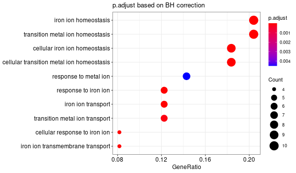


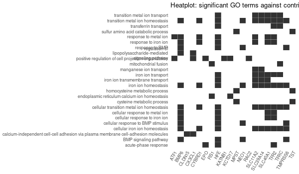

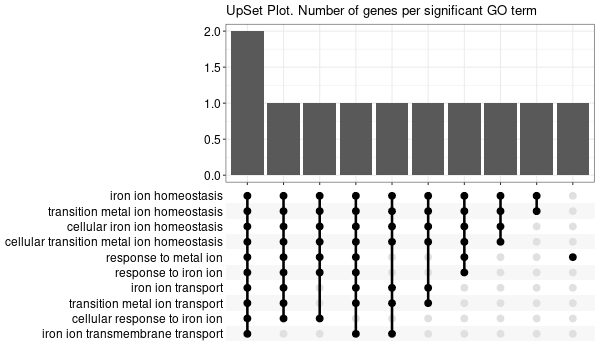


### All 42 genes (inferred only ; w/o original genes)

```bash
mkdir -p GO_FDR/all_genes_wo_orig/symbol
```

```bash
Rscript GO_enrichment_FDR.R -k "SYMBOL" -G results/new_genes_v1_without_original.list -f 0.05 -c "BP" -a "BH" -o "default_universe" -d "GO_FDR/all_genes_wo_orig/symbol"
```

> ```R
> ...
> [1] "Loading input data..."
> [1] "Warning: using defaut universe automatically provided by the clusterProfiler package"
> [1] "Done."
> [1] "Computing GO enrichment..."
> `universe` is not in character and will be ignored...
> [1] "Done."
> [1] "18866 (default) background genes"
> [1] "42 provided genes; 38 found by `enrichGO`"
> [1] "Computed GO enrichment (whether significant or not) for 740 distinct GO terms"
> [1] "Of those 740 GO terms, 0 have a BH-adjusted p-val < 0.05"
> [1] "Writing outputs tables..."
> [1] "Done. Writing output images..."
> ...
> [1] "Done."
> ```

### All genes co-expressed in liver

Those are: HFE + TFR2 + HJV (HFE2) + HAMP + TMPRSS6

Note: we have no CHiC data for HAMP, and there are no inferred genes from HFE. 

```bash
mkdir -p GO_FDR/genes_inferred_from_that_expressed_in_liver/symbol
```

```bash
Rscript GO_enrichment_FDR.R -k "SYMBOL" -G results/genes_inferred_from_that_expressed_in_liver.list -f 0.05 -c "BP" -a "BH" -o "default_universe" -d "GO_FDR/genes_inferred_from_that_expressed_in_liver/symbol"
```

> ```R
> ...
> [1] "Loading input data..."
> [1] "Warning: using defaut universe automatically provided by the clusterProfiler package"
> [1] "Done."
> [1] "Computing GO enrichment..."
> `universe` is not in character and will be ignored...
> [1] "Done."
> [1] "18866 (default) background genes"
> [1] "24 provided genes; 21 found by `enrichGO`"
> [1] "Computed GO enrichment (whether significant or not) for 421 distinct GO terms"
> [1] "Of those 421 GO terms, 4 have a BH-adjusted p-val < 0.05"
> [1] "Writing outputs tables..."
> [1] "Done. Writing output images..."
> ...
> [1] "Done."
> ```

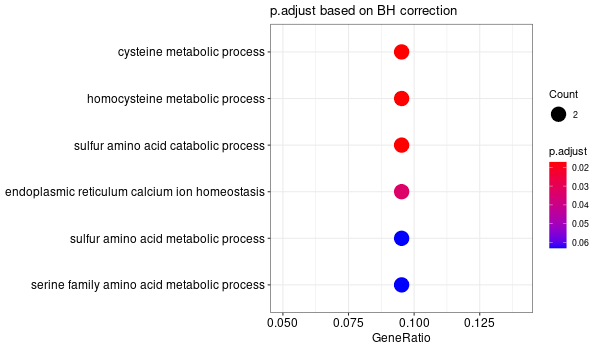


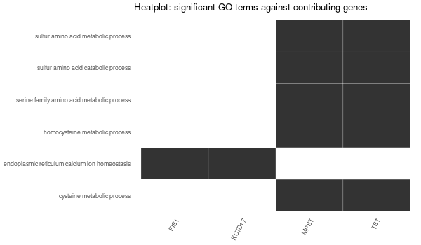

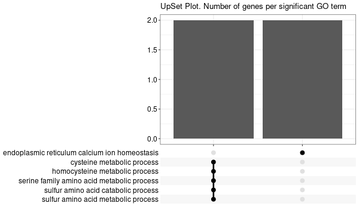

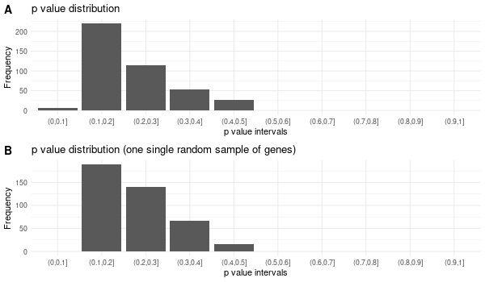


### All genes expressed in intestine

Those are: DCYTB (CYBRD1) / DMT1 (SLC11A2) / SLC40A1

Note: there are no inferred genes from CYBRD1 nor SLC40A1 => so the GO enrichment is basically that of SLC11A2. Please refer to the above section.

### Each original gene separately

#### Inferred from CIAPIN1

```bash
mkdir -p GO_FDR/separate/CIAPIN1/symbol
```

```bash
Rscript GO_enrichment_FDR.R -k "SYMBOL" -G results/separate/CIAPIN1.list -f 0.05 -c "BP" -a "BH" -o "default_universe" -d "GO_FDR/separate/CIAPIN1/symbol"
```

> ```R
> ...
> [1] "Loading input data..."
> [1] "Warning: using defaut universe automatically provided by the clusterProfiler package"
> [1] "Done."
> [1] "Computing GO enrichment..."
> `universe` is not in character and will be ignored...
> [1] "Done."
> [1] "18866 (default) background genes"
> [1] "8 provided genes; 7 found by `enrichGO`"
> [1] "Computed GO enrichment (whether significant or not) for 313 distinct GO terms"
> [1] "Of those 313 GO terms, 64 have a BH-adjusted p-val < 0.05"
> [1] "Writing outputs tables..."
> [1] "Done. Writing output images..."
> ...
> [1] "Done."
> ```


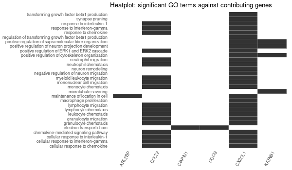


#### Inferred from CIAPIN1 w/o CIAPIN1

```bash
mkdir -p GO_FDR/separate/CIAPIN1_wo_orig/symbol
```

```bash
Rscript GO_enrichment_FDR.R -k "SYMBOL" -G results/separate/CIAPIN1_wo_original.list -f 0.05 -c "BP" -a "BH" -o "default_universe" -d "GO_FDR/separate/CIAPIN1_wo_orig/symbol"
```

> ```R
> ...
> [1] "Loading input data..."
> [1] "Warning: using defaut universe automatically provided by the clusterProfiler package"
> [1] "Done."
> [1] "Computing GO enrichment..."
> `universe` is not in character and will be ignored...
> [1] "Done."
> [1] "18866 (default) background genes"
> [1] "7 provided genes; 6 found by `enrichGO`"
> [1] "Computed GO enrichment (whether significant or not) for 310 distinct GO terms"
> [1] "Of those 310 GO terms, 73 have a BH-adjusted p-val < 0.05"
> [1] "Writing outputs tables..."
> [1] "Done. Writing output images..."
> ...
> [1] "Done."
> ```


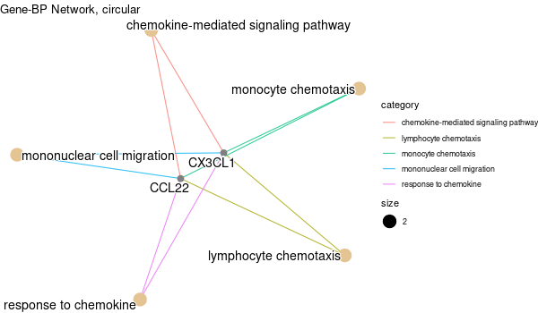

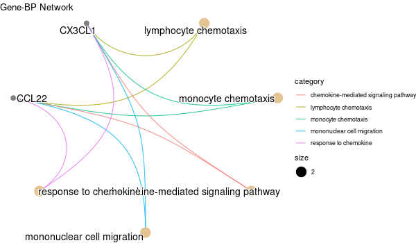

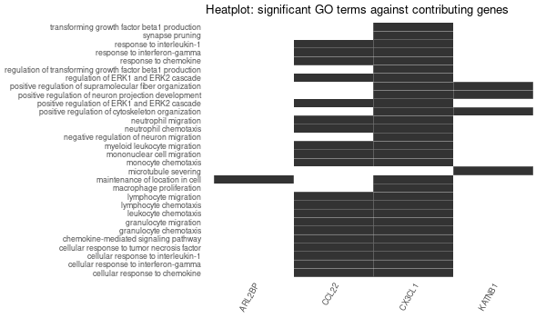


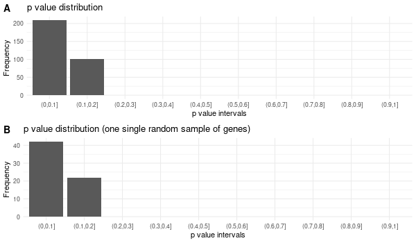

#### Inferred from HFE2

```bash
mkdir -p GO_FDR/separate/HFE2/symbol
```

```bash
Rscript GO_enrichment_FDR.R -k "SYMBOL" -G results/separate/HFE2.list -f 0.05 -c "BP" -a "BH" -o "default_universe" -d "GO_FDR/separate/HFE2/symbol"
```

> ```R
> ...
> [1] "Loading input data..."
> [1] "Warning: using defaut universe automatically provided by the clusterProfiler package"
> [1] "Done."
> [1] "Computing GO enrichment..."
> `universe` is not in character and will be ignored...
> [1] "Done."
> [1] "18866 (default) background genes"
> [1] "5 provided genes; 3 found by `enrichGO`"
> [1] "Computed GO enrichment (whether significant or not) for 17 distinct GO terms"
> [1] "Of those 17 GO terms, 15 have a BH-adjusted p-val < 0.05"
> [1] "Writing outputs tables..."
> [1] "Done. Writing output images..."
> ...
> [1] "Done."
> ```


#### Inferred from HFE2 w/o HFE2

```bash
mkdir -p GO_FDR/separate/HFE2_wo_orig/symbol
```

```bash
Rscript GO_enrichment_FDR.R -k "SYMBOL" -G results/separate/HFE2_wo_original.list -f 0.05 -c "BP" -a "BH" -o "default_universe" -d "GO_FDR/separate/HFE2_wo_orig/symbol"
```

> ```R
> ...
> [1] "Loading input data..."
> [1] "Warning: using defaut universe automatically provided by the clusterProfiler package"
> [1] "Done."
> [1] "Computing GO enrichment..."
> `universe` is not in character and will be ignored...
> [1] "Done."
> [1] "18866 (default) background genes"
> [1] "4 provided genes; 3 found by `enrichGO`"
> [1] "Computed GO enrichment (whether significant or not) for 17 distinct GO terms"
> [1] "Of those 17 GO terms, 15 have a BH-adjusted p-val < 0.05"
> [1] "Writing outputs tables..."
> [1] "Done. Writing output images..."
> ...
> [1] "Done."
> ```


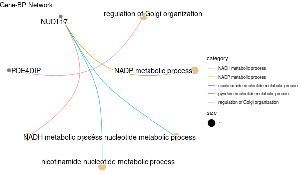


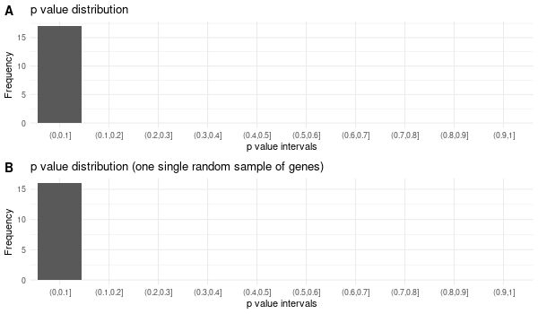

#### Inferred from NEO1

```bash
mkdir -p GO_FDR/separate/NEO1/symbol
```

```bash
Rscript GO_enrichment_FDR.R -k "SYMBOL" -G results/separate/NEO1.list -c "BP" -a "BH" -o "default_universe" -d "GO_FDR/separate/NEO1/symbol"
```

> ```R
> ...
> [1] "Loading input data..."
> [1] "Warning: using defaut universe automatically provided by the clusterProfiler package"
> [1] "Done."
> [1] "Computing GO enrichment..."
> `universe` is not in character and will be ignored...
> [1] "Done."
> [1] "18866 (default) background genes"
> [1] "2 provided genes; 2 found by `enrichGO`"
> [1] "Computed GO enrichment (whether significant or not) for 45 distinct GO terms"
> [1] "Of those 45 GO terms, 45 have a BH-adjusted p-val < 0.1"
> [1] "Writing outputs tables..."
> [1] "Done. Writing output images..."
> ...
> [1] "Done."
> ```


#### Inferred from NEO1 w/o NEO1

```bash
mkdir -p GO_FDR/separate/NEO1_wo_orig/symbol
```

```bash
Rscript GO_enrichment_FDR.R -k "SYMBOL" -G results/separate/NEO1_wo_original.list -c "BP" -a "BH" -o "default_universe" -d "GO_FDR/separate/NEO1_wo_orig/symbol"
```

> ```R
> ...
> [1] "Loading input data..."
> [1] "Warning: using defaut universe automatically provided by the clusterProfiler package"
> [1] "Done."
> [1] "Computing GO enrichment..."
> `universe` is not in character and will be ignored...
> [1] "Done."
> [1] "18866 (default) background genes"
> [1] "1 provided genes; 1 found by `enrichGO`"
> [1] "Computed GO enrichment (whether significant or not) for 31 distinct GO terms"
> [1] "Of those 31 GO terms, 31 have a BH-adjusted p-val < 0.1"
> [1] "Writing outputs tables..."
> [1] "Done. Writing output images..."
> wrong orderBy parameter; set to default `orderBy = "x"`
> [1] "Writing last output image (this one might take some time)..."
> `universe` is not in character and will be ignored...
> No gene set have size > 10 ...
> --> return NULL...
> Warning message:
> The `add` argument of `group_by()` is deprecated as of dplyr 1.0.0.
> Please use the `.add` argument instead.
> This warning is displayed once every 8 hours.
> Call `lifecycle::last_warnings()` to see where this warning was generated. 
> Error in UseMethod("mutate") : 
>   no applicable method for 'mutate' applied to an object of class "NULL"
> Calls: pbar -> %>% -> ggplot -> summarise -> group_by -> mutate
> Execution halted
> ```


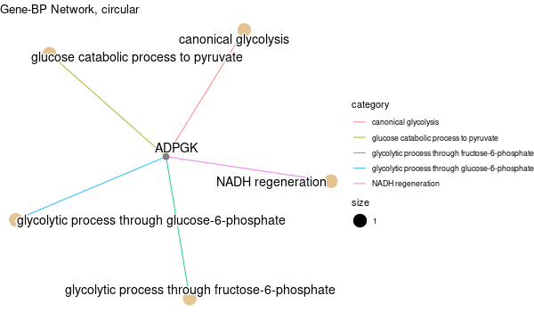

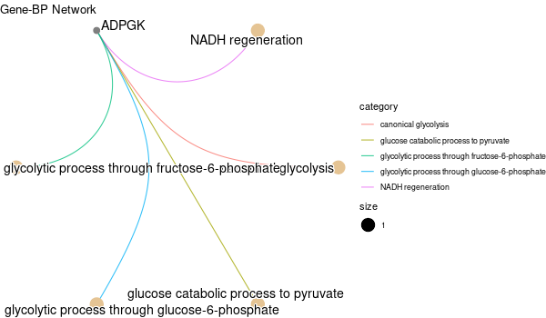

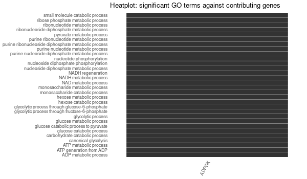

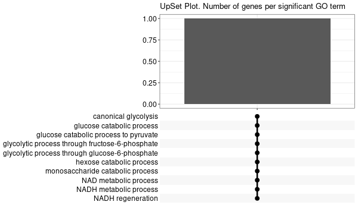

#### Inferred from SLC11A2

```bash
mkdir -p GO_FDR/separate/SLC11A2/symbol
```

```bash
Rscript GO_enrichment_FDR.R -k "SYMBOL" -G results/separate/SLC11A2.list -c "BP" -a "BH" -o "default_universe" -d "GO_FDR/separate/SLC11A2/symbol"
```

> ```R
> ...
> [1] "Loading input data..."
> [1] "Warning: using defaut universe automatically provided by the clusterProfiler package"
> [1] "Done."
> [1] "Computing GO enrichment..."
> `universe` is not in character and will be ignored...
> [1] "Done."
> [1] "18866 (default) background genes"
> [1] "8 provided genes; 8 found by `enrichGO`"
> [1] "Computed GO enrichment (whether significant or not) for 104 distinct GO terms"
> [1] "Of those 104 GO terms, 18 have a BH-adjusted p-val < 0.1"
> [1] "Writing outputs tables..."
> [1] "Done. Writing output images..."
> ...
> [1] "Done."
> ```


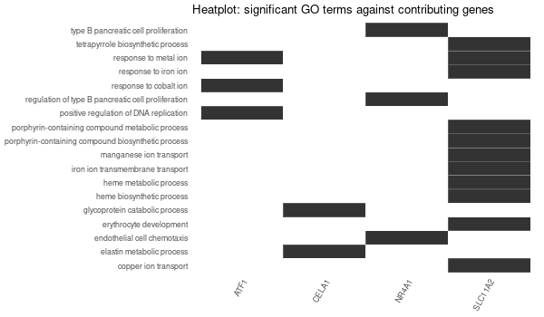

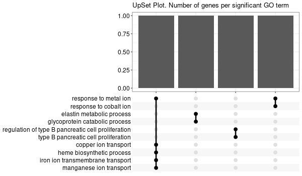


#### Inferred from SLC11A2 w/o SLC11A2

```bash
mkdir -p GO_FDR/separate/SLC11A2_wo_orig/symbol
```

```bash
Rscript GO_enrichment_FDR.R -k "SYMBOL" -G results/separate/SLC11A2_wo_original.list -c "BP" -a "BH" -o "default_universe" -d "GO_FDR/separate/SLC11A2_wo_orig/symbol"
```

> ```R
> ...
> [1] "Loading input data..."
> [1] "Warning: using defaut universe automatically provided by the clusterProfiler package"
> [1] "Done."
> [1] "Computing GO enrichment..."
> `universe` is not in character and will be ignored...
> [1] "Done."
> [1] "18866 (default) background genes"
> [1] "7 provided genes; 7 found by `enrichGO`"
> [1] "Computed GO enrichment (whether significant or not) for 68 distinct GO terms"
> [1] "Of those 68 GO terms, 0 have a BH-adjusted p-val < 0.1"
> [1] "Writing outputs tables..."
> [1] "Done. Writing output images..."
> Error in `[.data.frame`(d, , 2) : undefined columns selected
> Calls: upsetplot ... eval_tidy -> split -> split.default -> [ -> [.data.frame
> Execution halted
> ```

#### Inferred from SLC39A14

```bash
mkdir -p GO_FDR/separate/SLC39A14/symbol
```

```bash
Rscript GO_enrichment_FDR.R -k "SYMBOL" -G results/separate/SLC39A14.list -c "BP" -a "BH" -o "default_universe" -d "GO_FDR/separate/SLC39A14/symbol"
```

> ```R
> ...
> [1] "Loading input data..."
> [1] "Warning: using defaut universe automatically provided by the clusterProfiler package"
> [1] "Done."
> [1] "Computing GO enrichment..."
> `universe` is not in character and will be ignored...
> [1] "Done."
> [1] "18866 (default) background genes"
> [1] "4 provided genes; 4 found by `enrichGO`"
> [1] "Computed GO enrichment (whether significant or not) for 70 distinct GO terms"
> [1] "Of those 70 GO terms, 69 have a BH-adjusted p-val < 0.1"
> [1] "Writing outputs tables..."
> [1] "Done. Writing output images..."
> ...
> [1] "Done."
> ```


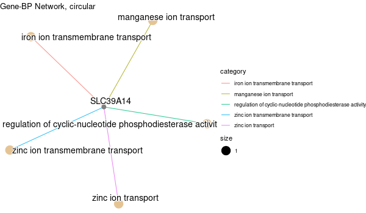

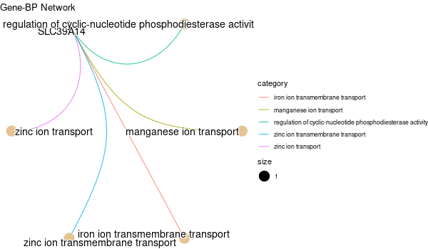

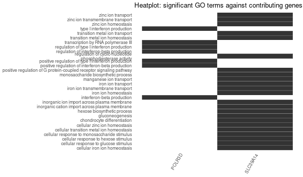


#### Inferred from SLC39A14 w/o SLC39A14

```bash
mkdir -p GO_FDR/separate/SLC39A14_wo_orig/symbol
```

```bash
Rscript GO_enrichment_FDR.R -k "SYMBOL" -G results/separate/SLC39A14_wo_original.list -c "BP" -a "BH" -o "default_universe" -d "GO_FDR/separate/SLC39A14_wo_orig/symbol"
```

> ```R
> ...
> [1] "Loading input data..."
> [1] "Warning: using defaut universe automatically provided by the clusterProfiler package"
> [1] "Done."
> [1] "Computing GO enrichment..."
> `universe` is not in character and will be ignored...
> [1] "Done."
> [1] "18866 (default) background genes"
> [1] "3 provided genes; 3 found by `enrichGO`"
> [1] "Computed GO enrichment (whether significant or not) for 19 distinct GO terms"
> [1] "Of those 19 GO terms, 19 have a BH-adjusted p-val < 0.1"
> [1] "Writing outputs tables..."
> [1] "Done. Writing output images..."
> ...
> [1] "Done."
> ```


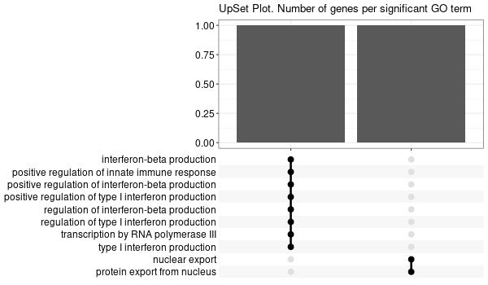


#### Inferred from TFR2

```bash
mkdir -p GO_FDR/separate/TFR2/symbol
```

```bash
Rscript GO_enrichment_FDR.R -k "SYMBOL" -G results/separate/TFR2.list -c "BP" -a "BH" -o "default_universe" -d "GO_FDR/separate/TFR2/symbol"
```

> ```R
> ...
> [1] "Loading input data..."
> [1] "Warning: using defaut universe automatically provided by the clusterProfiler package"
> [1] "Done."
> [1] "Computing GO enrichment..."
> `universe` is not in character and will be ignored...
> [1] "Done."
> [1] "18866 (default) background genes"
> [1] "15 provided genes; 14 found by `enrichGO`"
> [1] "Computed GO enrichment (whether significant or not) for 305 distinct GO terms"
> [1] "Of those 305 GO terms, 0 have a BH-adjusted p-val < 0.1"
> [1] "Writing outputs tables..."
> [1] "Done. Writing output images..."
> Error in `[.data.frame`(d, , 2) : undefined columns selected
> Calls: upsetplot ... eval_tidy -> split -> split.default -> [ -> [.data.frame
> Execution halted
> ```

No significant enrichment found in any GO term.

#### Inferred from TFR2 w/o TFR2

```bash
mkdir -p GO_FDR/separate/TFR2_wo_orig/symbol
```

```bash
Rscript GO_enrichment_FDR.R -k "SYMBOL" -G results/separate/TFR2_wo_original.list -c "BP" -a "BH" -o "default_universe" -d "GO_FDR/separate/TFR2_wo_orig/symbol"
```

> ```R
> ...
> [1] "Loading input data..."
> [1] "Warning: using defaut universe automatically provided by the clusterProfiler package"
> [1] "Done."
> [1] "Computing GO enrichment..."
> `universe` is not in character and will be ignored...
> [1] "Done."
> [1] "18866 (default) background genes"
> [1] "14 provided genes; 13 found by `enrichGO`"
> [1] "Computed GO enrichment (whether significant or not) for 276 distinct GO terms"
> [1] "Of those 276 GO terms, 0 have a BH-adjusted p-val < 0.1"
> [1] "Writing outputs tables..."
> [1] "Done. Writing output images..."
> Error in `[.data.frame`(d, , 2) : undefined columns selected
> Calls: upsetplot ... eval_tidy -> split -> split.default -> [ -> [.data.frame
> Execution halted
> ```

No significant enrichment found in any GO term.


#### Inferred from TMPRSS6

```bash
mkdir -p GO_FDR/separate/TMPRSS6/symbol
```

```bash
Rscript GO_enrichment_FDR.R -k "SYMBOL" -G results/separate/TMPRSS6.list -f 0.05 -c "BP" -a "BH" -o "default_universe" -d "GO_FDR/separate/TMPRSS6/symbol"
```

> ```R
> ...
> [1] "Loading input data..."
> [1] "Warning: using defaut universe automatically provided by the clusterProfiler package"
> [1] "Done."
> [1] "Computing GO enrichment..."
> `universe` is not in character and will be ignored...
> [1] "Done."
> [1] "18866 (default) background genes"
> [1] "7 provided genes; 6 found by `enrichGO`"
> [1] "Computed GO enrichment (whether significant or not) for 185 distinct GO terms"
> [1] "Of those 185 GO terms, 46 have a BH-adjusted p-val < 0.05"
> [1] "Writing outputs tables..."
> [1] "Done. Writing output images..."
> ...
> [1] "Done."
> ```


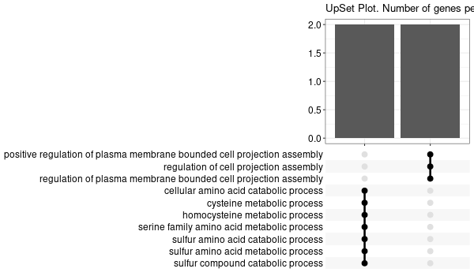


#### Inferred from TMPRSS6 w/o TMPRSS6

```bash
mkdir -p GO_FDR/separate/TMPRSS6_wo_orig/symbol
```

```bash
Rscript GO_enrichment_FDR.R -k "SYMBOL" -G results/separate/TMPRSS6_wo_original.list -f 0.05 -c "BP" -a "BH" -o "default_universe" -d "GO_FDR/separate/TMPRSS6_wo_orig/symbol"
```

> ```R
> ...
> [1] "Loading input data..."
> [1] "Warning: using defaut universe automatically provided by the clusterProfiler package"
> [1] "Done."
> [1] "Computing GO enrichment..."
> `universe` is not in character and will be ignored...
> [1] "Done."
> [1] "18866 (default) background genes"
> [1] "6 provided genes; 5 found by `enrichGO`"
> [1] "Computed GO enrichment (whether significant or not) for 165 distinct GO terms"
> [1] "Of those 165 GO terms, 69 have a BH-adjusted p-val < 0.05"
> [1] "Writing outputs tables..."
> [1] "Done. Writing output images..."
> ...
> [1] "Done."
> ```


