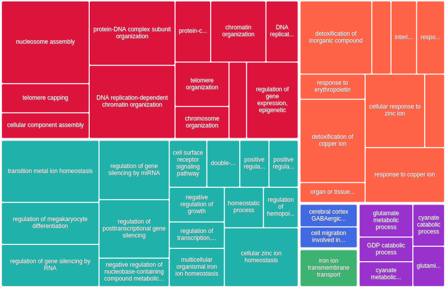
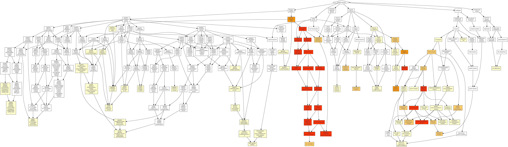
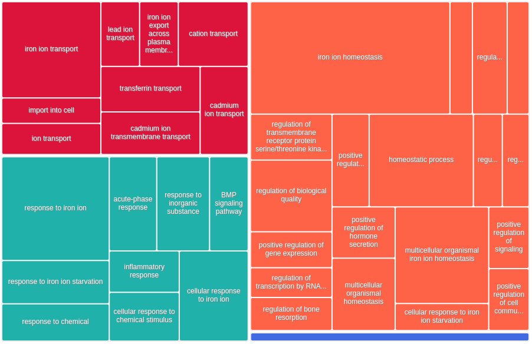
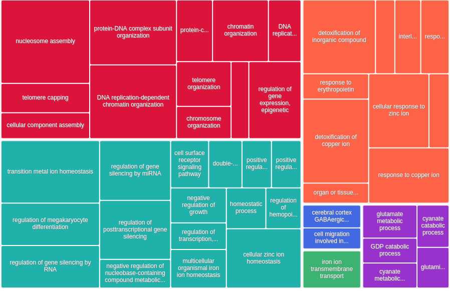

# GO enrichment with GOrilla

We use `GOrilla` to compute GO enrichment of inferred genes: http://cbl-gorilla.cs.technion.ac.il/

***We performed all analysis below on January 5th, 2022. At this time, the GOrilla database had last been updated on March 6th, 2021 (using the GO database and other sources)***

All results (list of genes and detailed GO enrichment) can be found here:

```
/work2/project/regenet/workspace/thoellinger/shared/2022/networks_hemochromatosis
```

## Collecting the list of genes of interest

```bash
cd /work2/project/regenet/workspace/thoellinger/shared/2022/networks_hemochromatosis
```

We obtained this list using our R markdown doing network analysis of E-G pairs starting from genes directly involved in hemochromatosis or involved in the regulation of iron metabolism.

We saved this list of 457 (13 known + 444 inferred) genes as `new_genes_v7.list`. For each one of the 13 initial genes, we also saved separately the corresponding inferred genes:

> ```bash
> └── results
> ...
> ├── new_genes_v7.list # 457
> └── separate
>   ├── BMP6.list # 17
>   ├── CIAPIN1.list # 56
>   ├── CYBRD1.list # 35
>   ├── HAMP.list # 35
>   ├── HFE2.list # 27
>   ├── HFE.list # 61
>   ├── NEO1.list # 39
>   ├── SLC11A2.list # 68
>   ├── SLC39A14.list # 35
>   ├── SLC40A1.list # 26
>   ├── TFR2.list # 34
>   ├── TFRC.list # 10
>   └── TMPRSS6.list # 14
> ```

## GO enrichment

### All 457 genes (original + inferred)

#### Method

We provided GOrilla with two lists:

* the list of background genes: their 23,221 `RefSeq` ids, which we saved as `all_genes_in_eg_pairs_131_biosamples.list` (note that GOrilla found only 21,304 of them, but this is still better than the number of default background genes used by our custom script)

  > The system has recognized 21304 genes out of 23545 gene terms entered by the user. 21304 genes were recognised by gene symbol and 0 genes by other gene IDs.
  > 314 duplicate genes were removed (keeping the highest ranking instance of each gene) leaving  a total of 20990 genes. Only 17621 of these genes are associated with a GO term.

  

* the list of the 457 genes for which we want to test enrichment in GO terms, which we denoted `new_genes_v7.list` (note that GOrilla only found 430 of them, yet our custom script only found 336, so GOrilla did better than us. In other for GOrilla to give us this information, we had to run a separate analysis with this list as single list, ie without background)

  > The system has recognized 430 genes out of 457 gene terms entered by the user.
  >  430 genes were recognized by gene symbol and 0 genes by other gene IDs .
  > Only 388 of these genes are associated with a GO term.

Note that we set the p-value threshold to the largest possible value in GOrilla, which is 10^-3. The FDR q-value given by GOrilla are obtained by performing the Benjamini and Hochberg correction - the same as that performed by default in our custom script:

> **'P-value'** is the enrichment p-value computed according to the mHG or HG model. This p-value is not corrected for multiple testing of  15373 GO terms.
>
> **'FDR q-value'** is the correction of the above p-value for multiple testing using the Benjamini and Hochberg (1995) method. Namely, for the ith term (ranked according to p-value) the FDR q-value is (p-value * number of GO terms) / i. 
>
> **Enrichment (N, B, n, b)** is defined as follows:
> N - is the total number of genes
> B - is the total number of genes associated with a specific GO term
> n - is the number of genes in the top of the user's input list or in the target set when appropriate
> b - is the number of genes in the intersection
> Enrichment = (b/n) / (B/N)
>
> **Genes:** For each GO term you can see the list of associated genes that appear in the optimal top of the list. Each gene name is specified by gene symbol followed by a short description of the gene

#### Results

We saved the results in: `/work2/project/regenet/workspace/thoellinger/shared/2022/networks_hemochromatosis/results/GO_FDR/all_genes/GOrilla_all_genes.xls`

| **GO term**                                                  | **Description**                                              | **[P-value](http://cbl-gorilla.cs.technion.ac.il/GOrilla/dbhyqsac/GOResults.html#p_value_info)** | **[FDR q-value](http://cbl-gorilla.cs.technion.ac.il/GOrilla/dbhyqsac/GOResults.html#fdr_info)** | **[ Enrichment (N, B, n, b) ](http://cbl-gorilla.cs.technion.ac.il/GOrilla/dbhyqsac/GOResults.html#enrich_info)** |
| ------------------------------------------------------------ | ------------------------------------------------------------ | ------------------------------------------------------------ | ------------------------------------------------------------ | ------------------------------------------------------------ |
| [GO:0006334](http://www.godatabase.org/cgi-bin/amigo/go.cgi?query=GO:0006334&view=details) | nucleosome assembly                                          | 2.44E-18                                                     | 3.74E-14                                                     | 9.45 (17621,125,388,26)                                      |
| [GO:0034728](http://www.godatabase.org/cgi-bin/amigo/go.cgi?query=GO:0034728&view=details) | nucleosome organization                                      | 2.05E-16                                                     | 1.57E-12                                                     | 7.57 (17621,162,388,27)                                      |
| [GO:0034723](http://www.godatabase.org/cgi-bin/amigo/go.cgi?query=GO:0034723&view=details) | DNA replication-dependent nucleosome organization            | 5.27E-16                                                     | 2.7E-12                                                      | 21.19 (17621,30,388,14)                                      |
| [GO:0006335](http://www.godatabase.org/cgi-bin/amigo/go.cgi?query=GO:0006335&view=details) | DNA replication-dependent nucleosome assembly                | 5.27E-16                                                     | 2.03E-12                                                     | 21.19 (17621,30,388,14)                                      |
| [GO:0055076](http://www.godatabase.org/cgi-bin/amigo/go.cgi?query=GO:0055076&view=details) | transition metal ion homeostasis                             | 2.24E-15                                                     | 6.88E-12                                                     | 8.56 (17621,122,388,23)                                      |
| [GO:0065004](http://www.godatabase.org/cgi-bin/amigo/go.cgi?query=GO:0065004&view=details) | protein-DNA complex assembly                                 | 2.28E-15                                                     | 5.85E-12                                                     | 6.59 (17621,193,388,28)                                      |
| [GO:0046916](http://www.godatabase.org/cgi-bin/amigo/go.cgi?query=GO:0046916&view=details) | cellular transition metal ion homeostasis                    | 5.87E-15                                                     | 1.29E-11                                                     | 9.35 (17621,102,388,21)                                      |
| [GO:0071824](http://www.godatabase.org/cgi-bin/amigo/go.cgi?query=GO:0071824&view=details) | protein-DNA complex subunit organization                     | 3.83E-14                                                     | 7.35E-11                                                     | 5.68 (17621,232,388,29)                                      |
| [GO:0010273](http://www.godatabase.org/cgi-bin/amigo/go.cgi?query=GO:0010273&view=details) | detoxification of copper ion                                 | 6.5E-14                                                      | 1.11E-10                                                     | 30.28 (17621,15,388,10)                                      |
| [GO:0000183](http://www.godatabase.org/cgi-bin/amigo/go.cgi?query=GO:0000183&view=details) | chromatin silencing at rDNA                                  | 9.01E-14                                                     | 1.39E-10                                                     | 17.89 (17621,33,388,13)                                      |
| [GO:0061687](http://www.godatabase.org/cgi-bin/amigo/go.cgi?query=GO:0061687&view=details) | detoxification of inorganic compound                         | 1.7E-13                                                      | 2.38E-10                                                     | 28.38 (17621,16,388,10)                                      |
| [GO:0060968](http://www.godatabase.org/cgi-bin/amigo/go.cgi?query=GO:0060968&view=details) | regulation of gene silencing                                 | 3.52E-13                                                     | 4.51E-10                                                     | 6.83 (17621,153,388,23)                                      |
| [GO:0006333](http://www.godatabase.org/cgi-bin/amigo/go.cgi?query=GO:0006333&view=details) | chromatin assembly or disassembly                            | 4.51E-13                                                     | 5.33E-10                                                     | 8.72 (17621,99,388,19)                                       |
| [GO:0006342](http://www.godatabase.org/cgi-bin/amigo/go.cgi?query=GO:0006342&view=details) | chromatin silencing                                          | 1.09E-12                                                     | 1.2E-9                                                       | 8.98 (17621,91,388,18)                                       |
| [GO:0071280](http://www.godatabase.org/cgi-bin/amigo/go.cgi?query=GO:0071280&view=details) | cellular response to copper ion                              | 7.87E-12                                                     | 8.06E-9                                                      | 17.84 (17621,28,388,11)                                      |
| [GO:0071294](http://www.godatabase.org/cgi-bin/amigo/go.cgi?query=GO:0071294&view=details) | cellular response to zinc ion                                | 2.12E-11                                                     | 2.03E-8                                                      | 19.75 (17621,23,388,10)                                      |
| [GO:0046688](http://www.godatabase.org/cgi-bin/amigo/go.cgi?query=GO:0046688&view=details) | response to copper ion                                       | 2.51E-11                                                     | 2.27E-8                                                      | 13.97 (17621,39,388,12)                                      |
| [GO:0045814](http://www.godatabase.org/cgi-bin/amigo/go.cgi?query=GO:0045814&view=details) | negative regulation of gene expression, epigenetic           | 2.68E-11                                                     | 2.29E-8                                                      | 7.50 (17621,109,388,18)                                      |
| [GO:0006882](http://www.godatabase.org/cgi-bin/amigo/go.cgi?query=GO:0006882&view=details) | cellular zinc ion homeostasis                                | 2.92E-11                                                     | 2.36E-8                                                      | 16.11 (17621,31,388,11)                                      |
| [GO:0060964](http://www.godatabase.org/cgi-bin/amigo/go.cgi?query=GO:0060964&view=details) | regulation of gene silencing by miRNA                        | 7.84E-11                                                     | 6.03E-8                                                      | 7.05 (17621,116,388,18)                                      |
| [GO:0055069](http://www.godatabase.org/cgi-bin/amigo/go.cgi?query=GO:0055069&view=details) | zinc ion homeostasis                                         | 9.31E-11                                                     | 6.81E-8                                                      | 14.69 (17621,34,388,11)                                      |
| [GO:0060966](http://www.godatabase.org/cgi-bin/amigo/go.cgi?query=GO:0060966&view=details) | regulation of gene silencing by RNA                          | 1.05E-10                                                     | 7.34E-8                                                      | 6.93 (17621,118,388,18)                                      |
| [GO:0060147](http://www.godatabase.org/cgi-bin/amigo/go.cgi?query=GO:0060147&view=details) | regulation of posttranscriptional gene silencing             | 1.05E-10                                                     | 7.02E-8                                                      | 6.93 (17621,118,388,18)                                      |
| [GO:0045652](http://www.godatabase.org/cgi-bin/amigo/go.cgi?query=GO:0045652&view=details) | regulation of megakaryocyte differentiation                  | 1.08E-10                                                     | 6.92E-8                                                      | 8.85 (17621,77,388,15)                                       |
| [GO:0040029](http://www.godatabase.org/cgi-bin/amigo/go.cgi?query=GO:0040029&view=details) | regulation of gene expression, epigenetic                    | 2.61E-10                                                     | 1.6E-7                                                       | 4.58 (17621,248,388,25)                                      |
| [GO:0016458](http://www.godatabase.org/cgi-bin/amigo/go.cgi?query=GO:0016458&view=details) | gene silencing                                               | 6.61E-10                                                     | 3.91E-7                                                      | 5.50 (17621,165,388,20)                                      |
| [GO:0071276](http://www.godatabase.org/cgi-bin/amigo/go.cgi?query=GO:0071276&view=details) | cellular response to cadmium ion                             | 4.89E-9                                                      | 2.79E-6                                                      | 12.27 (17621,37,388,10)                                      |
| [GO:0006325](http://www.godatabase.org/cgi-bin/amigo/go.cgi?query=GO:0006325&view=details) | chromatin organization                                       | 6.28E-9                                                      | 3.45E-6                                                      | 2.72 (17621,684,388,41)                                      |
| [GO:0055072](http://www.godatabase.org/cgi-bin/amigo/go.cgi?query=GO:0055072&view=details) | iron ion homeostasis                                         | 7.27E-9                                                      | 3.85E-6                                                      | 7.98 (17621,74,388,13)                                       |
| [GO:0010043](http://www.godatabase.org/cgi-bin/amigo/go.cgi?query=GO:0010043&view=details) | response to zinc ion                                         | 2.1E-8                                                       | 1.07E-5                                                      | 9.25 (17621,54,388,11)                                       |
| [GO:0045653](http://www.godatabase.org/cgi-bin/amigo/go.cgi?query=GO:0045653&view=details) | negative regulation of megakaryocyte differentiation         | 2.29E-8                                                      | 1.14E-5                                                      | 19.87 (17621,16,388,7)                                       |
| [GO:0006879](http://www.godatabase.org/cgi-bin/amigo/go.cgi?query=GO:0006879&view=details) | cellular iron ion homeostasis                                | 6.67E-8                                                      | 3.2E-5                                                       | 8.33 (17621,60,388,11)                                       |
| [GO:0046686](http://www.godatabase.org/cgi-bin/amigo/go.cgi?query=GO:0046686&view=details) | response to cadmium ion                                      | 4.86E-7                                                      | 2.26E-4                                                      | 7.83 (17621,58,388,10)                                       |
| [GO:0010038](http://www.godatabase.org/cgi-bin/amigo/go.cgi?query=GO:0010038&view=details) | response to metal ion                                        | 5.77E-7                                                      | 2.61E-4                                                      | 3.21 (17621,340,388,24)                                      |
| [GO:0016233](http://www.godatabase.org/cgi-bin/amigo/go.cgi?query=GO:0016233&view=details) | telomere capping                                             | 5.96E-7                                                      | 2.62E-4                                                      | 13.25 (17621,24,388,7)                                       |
| [GO:0045637](http://www.godatabase.org/cgi-bin/amigo/go.cgi?query=GO:0045637&view=details) | regulation of myeloid cell differentiation                   | 6.11E-7                                                      | 2.61E-4                                                      | 3.68 (17621,247,388,20)                                      |
| [GO:0071248](http://www.godatabase.org/cgi-bin/amigo/go.cgi?query=GO:0071248&view=details) | cellular response to metal ion                               | 6.41E-7                                                      | 2.66E-4                                                      | 4.22 (17621,183,388,17)                                      |
| [GO:0010039](http://www.godatabase.org/cgi-bin/amigo/go.cgi?query=GO:0010039&view=details) | response to iron ion                                         | 1.44E-6                                                      | 5.84E-4                                                      | 11.77 (17621,27,388,7)                                       |
| [GO:0032200](http://www.godatabase.org/cgi-bin/amigo/go.cgi?query=GO:0032200&view=details) | telomere organization                                        | 1.5E-6                                                       | 5.92E-4                                                      | 5.13 (17621,115,388,13)                                      |
| [GO:0034622](http://www.godatabase.org/cgi-bin/amigo/go.cgi?query=GO:0034622&view=details) | cellular protein-containing complex assembly                 | 1.71E-6                                                      | 6.57E-4                                                      | 2.24 (17621,812,388,40)                                      |
| [GO:0065003](http://www.godatabase.org/cgi-bin/amigo/go.cgi?query=GO:0065003&view=details) | protein-containing complex assembly                          | 1.92E-6                                                      | 7.19E-4                                                      | 1.94 (17621,1262,388,54)                                     |
| [GO:0022607](http://www.godatabase.org/cgi-bin/amigo/go.cgi?query=GO:0022607&view=details) | cellular component assembly                                  | 3.32E-6                                                      | 1.22E-3                                                      | 1.66 (17621,2162,388,79)                                     |
| [GO:0034755](http://www.godatabase.org/cgi-bin/amigo/go.cgi?query=GO:0034755&view=details) | iron ion transmembrane transport                             | 3.52E-6                                                      | 1.26E-3                                                      | 18.92 (17621,12,388,5)                                       |
| [GO:0071241](http://www.godatabase.org/cgi-bin/amigo/go.cgi?query=GO:0071241&view=details) | cellular response to inorganic substance                     | 4.29E-6                                                      | 1.5E-3                                                       | 3.68 (17621,210,388,17)                                      |
| [GO:0043933](http://www.godatabase.org/cgi-bin/amigo/go.cgi?query=GO:0043933&view=details) | protein-containing complex subunit organization              | 5.12E-6                                                      | 1.75E-3                                                      | 1.79 (17621,1544,388,61)                                     |
| [GO:0060586](http://www.godatabase.org/cgi-bin/amigo/go.cgi?query=GO:0060586&view=details) | multicellular organismal iron ion homeostasis                | 7.69E-6                                                      | 2.57E-3                                                      | 25.95 (17621,7,388,4)                                        |
| [GO:0010035](http://www.godatabase.org/cgi-bin/amigo/go.cgi?query=GO:0010035&view=details) | response to inorganic substance                              | 1.06E-5                                                      | 3.47E-3                                                      | 2.53 (17621,485,388,27)                                      |
| [GO:0006336](http://www.godatabase.org/cgi-bin/amigo/go.cgi?query=GO:0006336&view=details) | DNA replication-independent nucleosome assembly              | 1.43E-5                                                      | 4.58E-3                                                      | 7.12 (17621,51,388,8)                                        |
| [GO:0045934](http://www.godatabase.org/cgi-bin/amigo/go.cgi?query=GO:0045934&view=details) | negative regulation of nucleobase-containing compound metabolic process | 1.46E-5                                                      | 4.58E-3                                                      | 1.78 (17621,1457,388,57)                                     |
| [GO:0034724](http://www.godatabase.org/cgi-bin/amigo/go.cgi?query=GO:0034724&view=details) | DNA replication-independent nucleosome organization          | 1.66E-5                                                      | 5.1E-3                                                       | 6.99 (17621,52,388,8)                                        |
| [GO:0055065](http://www.godatabase.org/cgi-bin/amigo/go.cgi?query=GO:0055065&view=details) | metal ion homeostasis                                        | 1.8E-5                                                       | 5.41E-3                                                      | 2.32 (17621,587,388,30)                                      |
| [GO:0016584](http://www.godatabase.org/cgi-bin/amigo/go.cgi?query=GO:0016584&view=details) | nucleosome positioning                                       | 1.8E-5                                                       | 5.33E-3                                                      | 14.19 (17621,16,388,5)                                       |
| [GO:0045926](http://www.godatabase.org/cgi-bin/amigo/go.cgi?query=GO:0045926&view=details) | negative regulation of growth                                | 2.23E-5                                                      | 6.46E-3                                                      | 3.24 (17621,238,388,17)                                      |
| [GO:0038111](http://www.godatabase.org/cgi-bin/amigo/go.cgi?query=GO:0038111&view=details) | interleukin-7-mediated signaling pathway                     | 2.74E-5                                                      | 7.8E-3                                                       | 9.73 (17621,28,388,6)                                        |
| [GO:0034080](http://www.godatabase.org/cgi-bin/amigo/go.cgi?query=GO:0034080&view=details) | CENP-A containing nucleosome assembly                        | 2.8E-5                                                       | 7.83E-3                                                      | 7.75 (17621,41,388,7)                                        |
| [GO:0055080](http://www.godatabase.org/cgi-bin/amigo/go.cgi?query=GO:0055080&view=details) | cation homeostasis                                           | 3.47E-5                                                      | 9.52E-3                                                      | 2.17 (17621,669,388,32)                                      |
| [GO:0006536](http://www.godatabase.org/cgi-bin/amigo/go.cgi?query=GO:0006536&view=details) | glutamate metabolic process                                  | 4.16E-5                                                      | 1.12E-2                                                      | 9.08 (17621,30,388,6)                                        |
| [GO:0006875](http://www.godatabase.org/cgi-bin/amigo/go.cgi?query=GO:0006875&view=details) | cellular metal ion homeostasis                               | 4.4E-5                                                       | 1.17E-2                                                      | 2.33 (17621,526,388,27)                                      |
| [GO:0031936](http://www.godatabase.org/cgi-bin/amigo/go.cgi?query=GO:0031936&view=details) | negative regulation of chromatin silencing                   | 4.55E-5                                                      | 1.18E-2                                                      | 11.95 (17621,19,388,5)                                       |
| [GO:0098771](http://www.godatabase.org/cgi-bin/amigo/go.cgi?query=GO:0098771&view=details) | inorganic ion homeostasis                                    | 4.61E-5                                                      | 1.18E-2                                                      | 2.14 (17621,679,388,32)                                      |
| [GO:0031055](http://www.godatabase.org/cgi-bin/amigo/go.cgi?query=GO:0031055&view=details) | chromatin remodeling at centromere                           | 5.24E-5                                                      | 1.32E-2                                                      | 7.06 (17621,45,388,7)                                        |
| [GO:0007166](http://www.godatabase.org/cgi-bin/amigo/go.cgi?query=GO:0007166&view=details) | cell surface receptor signaling pathway                      | 5.33E-5                                                      | 1.32E-2                                                      | 1.57 (17621,2109,388,73)                                     |
| [GO:0051276](http://www.godatabase.org/cgi-bin/amigo/go.cgi?query=GO:0051276&view=details) | chromosome organization                                      | 6.2E-5                                                       | 1.51E-2                                                      | 2.55 (17621,392,388,22)                                      |
| [GO:0030003](http://www.godatabase.org/cgi-bin/amigo/go.cgi?query=GO:0030003&view=details) | cellular cation homeostasis                                  | 7.83E-5                                                      | 1.88E-2                                                      | 2.18 (17621,605,388,29)                                      |
| [GO:0036017](http://www.godatabase.org/cgi-bin/amigo/go.cgi?query=GO:0036017&view=details) | response to erythropoietin                                   | 1.03E-4                                                      | 2.42E-2                                                      | 27.25 (17621,5,388,3)                                        |
| [GO:0006873](http://www.godatabase.org/cgi-bin/amigo/go.cgi?query=GO:0006873&view=details) | cellular ion homeostasis                                     | 1.13E-4                                                      | 2.64E-2                                                      | 2.13 (17621,618,388,29)                                      |
| [GO:0045892](http://www.godatabase.org/cgi-bin/amigo/go.cgi?query=GO:0045892&view=details) | negative regulation of transcription, DNA-templated          | 1.38E-4                                                      | 3.16E-2                                                      | 1.74 (17621,1224,388,47)                                     |
| [GO:0042592](http://www.godatabase.org/cgi-bin/amigo/go.cgi?query=GO:0042592&view=details) | homeostatic process                                          | 1.43E-4                                                      | 3.23E-2                                                      | 1.67 (17621,1438,388,53)                                     |
| [GO:1903507](http://www.godatabase.org/cgi-bin/amigo/go.cgi?query=GO:1903507&view=details) | negative regulation of nucleic acid-templated transcription  | 1.43E-4                                                      | 3.19E-2                                                      | 1.74 (17621,1226,388,47)                                     |
| [GO:0050801](http://www.godatabase.org/cgi-bin/amigo/go.cgi?query=GO:0050801&view=details) | ion homeostasis                                              | 1.44E-4                                                      | 3.16E-2                                                      | 1.99 (17621,754,388,33)                                      |
| [GO:1902679](http://www.godatabase.org/cgi-bin/amigo/go.cgi?query=GO:1902679&view=details) | negative regulation of RNA biosynthetic process              | 1.49E-4                                                      | 3.22E-2                                                      | 1.74 (17621,1228,388,47)                                     |
| [GO:0051252](http://www.godatabase.org/cgi-bin/amigo/go.cgi?query=GO:0051252&view=details) | regulation of RNA metabolic process                          | 1.56E-4                                                      | 3.32E-2                                                      | 1.38 (17621,3595,388,109)                                    |
| [GO:0006303](http://www.godatabase.org/cgi-bin/amigo/go.cgi?query=GO:0006303&view=details) | double-strand break repair via nonhomologous end joining     | 1.8E-4                                                       | 3.79E-2                                                      | 5.05 (17621,72,388,8)                                        |
| [GO:0043486](http://www.godatabase.org/cgi-bin/amigo/go.cgi?query=GO:0043486&view=details) | histone exchange                                             | 1.94E-4                                                      | 4.03E-2                                                      | 5.78 (17621,55,388,7)                                        |
| [GO:0006826](http://www.godatabase.org/cgi-bin/amigo/go.cgi?query=GO:0006826&view=details) | iron ion transport                                           | 1.94E-4                                                      | 3.98E-2                                                      | 5.78 (17621,55,388,7)                                        |
| [GO:2001141](http://www.godatabase.org/cgi-bin/amigo/go.cgi?query=GO:2001141&view=details) | regulation of RNA biosynthetic process                       | 2.16E-4                                                      | 4.37E-2                                                      | 1.39 (17621,3342,388,102)                                    |
| [GO:0000726](http://www.godatabase.org/cgi-bin/amigo/go.cgi?query=GO:0000726&view=details) | non-recombinational repair                                   | 2.18E-4                                                      | 4.35E-2                                                      | 4.91 (17621,74,388,8)                                        |
| [GO:0009889](http://www.godatabase.org/cgi-bin/amigo/go.cgi?query=GO:0009889&view=details) | regulation of biosynthetic process                           | 2.69E-4                                                      | 5.31E-2                                                      | 1.33 (17621,4054,388,119)                                    |
| [GO:0048878](http://www.godatabase.org/cgi-bin/amigo/go.cgi?query=GO:0048878&view=details) | chemical homeostasis                                         | 2.78E-4                                                      | 5.41E-2                                                      | 1.77 (17621,1052,388,41)                                     |
| [GO:0019725](http://www.godatabase.org/cgi-bin/amigo/go.cgi?query=GO:0019725&view=details) | cellular homeostasis                                         | 2.79E-4                                                      | 5.37E-2                                                      | 1.89 (17621,815,388,34)                                      |
| [GO:0098754](http://www.godatabase.org/cgi-bin/amigo/go.cgi?query=GO:0098754&view=details) | detoxification                                               | 2.82E-4                                                      | 5.34E-2                                                      | 3.85 (17621,118,388,10)                                      |
| [GO:0031326](http://www.godatabase.org/cgi-bin/amigo/go.cgi?query=GO:0031326&view=details) | regulation of cellular biosynthetic process                  | 2.93E-4                                                      | 5.5E-2                                                       | 1.34 (17621,3980,388,117)                                    |
| [GO:0006355](http://www.godatabase.org/cgi-bin/amigo/go.cgi?query=GO:0006355&view=details) | regulation of transcription, DNA-templated                   | 3.03E-4                                                      | 5.62E-2                                                      | 1.38 (17621,3332,388,101)                                    |
| [GO:1903506](http://www.godatabase.org/cgi-bin/amigo/go.cgi?query=GO:1903506&view=details) | regulation of nucleic acid-templated transcription           | 3.07E-4                                                      | 5.62E-2                                                      | 1.38 (17621,3333,388,101)                                    |
| [GO:0019219](http://www.godatabase.org/cgi-bin/amigo/go.cgi?query=GO:0019219&view=details) | regulation of nucleobase-containing compound metabolic process | 3.23E-4                                                      | 5.84E-2                                                      | 1.34 (17621,3907,388,115)                                    |
| [GO:1903706](http://www.godatabase.org/cgi-bin/amigo/go.cgi?query=GO:1903706&view=details) | regulation of hemopoiesis                                    | 3.83E-4                                                      | 6.85E-2                                                      | 2.19 (17621,476,388,23)                                      |
| [GO:0002385](http://www.godatabase.org/cgi-bin/amigo/go.cgi?query=GO:0002385&view=details) | mucosal immune response                                      | 3.87E-4                                                      | 6.85E-2                                                      | 7.83 (17621,29,388,5)                                        |
| [GO:0051253](http://www.godatabase.org/cgi-bin/amigo/go.cgi?query=GO:0051253&view=details) | negative regulation of RNA metabolic process                 | 4.09E-4                                                      | 7.14E-2                                                      | 1.65 (17621,1320,388,48)                                     |
| [GO:0055082](http://www.godatabase.org/cgi-bin/amigo/go.cgi?query=GO:0055082&view=details) | cellular chemical homeostasis                                | 4.1E-4                                                       | 7.08E-2                                                      | 1.95 (17621,700,388,30)                                      |
| [GO:1902871](http://www.godatabase.org/cgi-bin/amigo/go.cgi?query=GO:1902871&view=details) | positive regulation of amacrine cell differentiation         | 4.84E-4                                                      | 8.26E-2                                                      | 45.41 (17621,2,388,2)                                        |
| [GO:1902868](http://www.godatabase.org/cgi-bin/amigo/go.cgi?query=GO:1902868&view=details) | positive regulation of retina development in camera-type eye | 4.84E-4                                                      | 8.17E-2                                                      | 45.41 (17621,2,388,2)                                        |
| [GO:0061075](http://www.godatabase.org/cgi-bin/amigo/go.cgi?query=GO:0061075&view=details) | positive regulation of neural retina development             | 4.84E-4                                                      | 8.08E-2                                                      | 45.41 (17621,2,388,2)                                        |
| [GO:0021893](http://www.godatabase.org/cgi-bin/amigo/go.cgi?query=GO:0021893&view=details) | cerebral cortex GABAergic interneuron fate commitment        | 4.84E-4                                                      | 7.99E-2                                                      | 45.41 (17621,2,388,2)                                        |
| [GO:0009439](http://www.godatabase.org/cgi-bin/amigo/go.cgi?query=GO:0009439&view=details) | cyanate metabolic process                                    | 4.84E-4                                                      | 7.91E-2                                                      | 45.41 (17621,2,388,2)                                        |
| [GO:0009440](http://www.godatabase.org/cgi-bin/amigo/go.cgi?query=GO:0009440&view=details) | cyanate catabolic process                                    | 4.84E-4                                                      | 7.83E-2                                                      | 45.41 (17621,2,388,2)                                        |
| [GO:0046712](http://www.godatabase.org/cgi-bin/amigo/go.cgi?query=GO:0046712&view=details) | GDP catabolic process                                        | 4.84E-4                                                      | 7.74E-2                                                      | 45.41 (17621,2,388,2)                                        |
| [GO:0010556](http://www.godatabase.org/cgi-bin/amigo/go.cgi?query=GO:0010556&view=details) | regulation of macromolecule biosynthetic process             | 5.18E-4                                                      | 8.21E-2                                                      | 1.33 (17621,3789,388,111)                                    |
| [GO:0071281](http://www.godatabase.org/cgi-bin/amigo/go.cgi?query=GO:0071281&view=details) | cellular response to iron ion                                | 5.46E-4                                                      | 8.57E-2                                                      | 17.03 (17621,8,388,3)                                        |
| [GO:0006323](http://www.godatabase.org/cgi-bin/amigo/go.cgi?query=GO:0006323&view=details) | DNA packaging                                                | 5.49E-4                                                      | 8.53E-2                                                      | 5.80 (17621,47,388,6)                                        |
| [GO:0043044](http://www.godatabase.org/cgi-bin/amigo/go.cgi?query=GO:0043044&view=details) | ATP-dependent chromatin remodeling                           | 5.65E-4                                                      | 8.68E-2                                                      | 4.27 (17621,85,388,8)                                        |
| [GO:0009064](http://www.godatabase.org/cgi-bin/amigo/go.cgi?query=GO:0009064&view=details) | glutamine family amino acid metabolic process                | 6.64E-4                                                      | 1.01E-1                                                      | 4.74 (17621,67,388,7)                                        |
| [GO:0010558](http://www.godatabase.org/cgi-bin/amigo/go.cgi?query=GO:0010558&view=details) | negative regulation of macromolecule biosynthetic process    | 7.14E-4                                                      | 1.08E-1                                                      | 1.59 (17621,1427,388,50)                                     |
| [GO:0002251](http://www.godatabase.org/cgi-bin/amigo/go.cgi?query=GO:0002251&view=details) | organ or tissue specific immune response                     | 7.2E-4                                                       | 1.08E-1                                                      | 6.88 (17621,33,388,5)                                        |
| [GO:0045638](http://www.godatabase.org/cgi-bin/amigo/go.cgi?query=GO:0045638&view=details) | negative regulation of myeloid cell differentiation          | 7.68E-4                                                      | 1.14E-1                                                      | 4.08 (17621,89,388,8)                                        |
| [GO:0031935](http://www.godatabase.org/cgi-bin/amigo/go.cgi?query=GO:0031935&view=details) | regulation of chromatin silencing                            | 8.29E-4                                                      | 1.21E-1                                                      | 6.68 (17621,34,388,5)                                        |
| [GO:0002042](http://www.godatabase.org/cgi-bin/amigo/go.cgi?query=GO:0002042&view=details) | cell migration involved in sprouting angiogenesis            | 8.48E-4                                                      | 1.23E-1                                                      | 9.08 (17621,20,388,4)                                        |
| [GO:0009890](http://www.godatabase.org/cgi-bin/amigo/go.cgi?query=GO:0009890&view=details) | negative regulation of biosynthetic process                  | 9.54E-4                                                      | 1.37E-1                                                      | 1.55 (17621,1520,388,52)                                     |

Notably, for the 57 first GO terms of the above table, we have a (true) FDR < 1%.




### 13 initial genes only

#### Method

We provided GOrilla with two lists:

* the list of background genes: their 23,221 `RefSeq` ids, just as before

  > The system has recognized 21304 genes out of 23545 gene terms entered by the user. 21304 genes were recognised by gene symbol and 0 genes by other gene IDs.
  > 314 duplicate genes were removed (keeping the highest ranking instance of each gene) leaving  a total of 20990 genes. Only 17621 of these genes are associated with a GO term.

* the list of the 13 initial genes involved in hemochromatosis and iron metabolism regulation we chose to work with. Namely:

  > HFE
  > TFR2
  > HFE2
  > HAMP
  > SLC40A1
  > BMP6
  > TMPRSS6
  > TFRC
  > SLC11A2
  > CYBRD1
  > NEO1
  > CIAPIN1
  > SLC39A14

> The system has recognized 13 genes out of 13 gene terms entered by the user.
> 13 genes were recognized by gene symbol and 0 genes by other gene IDs.

Note that we set the p-value threshold to the largest possible value in GOrilla, which is 10^-3. The FDR q-value given by GOrilla are obtained by performing the Benjamini and Hochberg correction.

#### Results

| **GO term**                                                  | **Description**                                              | **[P-value](http://cbl-gorilla.cs.technion.ac.il/GOrilla/l7eeinlg/GOResults.html#p_value_info)** | **[FDR q-value](http://cbl-gorilla.cs.technion.ac.il/GOrilla/l7eeinlg/GOResults.html#fdr_info)** | **[ Enrichment (N, B, n, b) ](http://cbl-gorilla.cs.technion.ac.il/GOrilla/l7eeinlg/GOResults.html#enrich_info)** |
| ------------------------------------------------------------ | ------------------------------------------------------------ | ------------------------------------------------------------ | ------------------------------------------------------------ | ------------------------------------------------------------ |
| [GO:0055072](http://www.godatabase.org/cgi-bin/amigo/go.cgi?query=GO:0055072&view=details) | iron ion homeostasis                                         | 1.53E-28                                                     | 2.35E-24                                                     | 219.80 (17621,74,13,12)                                      |
| [GO:0006879](http://www.godatabase.org/cgi-bin/amigo/go.cgi?query=GO:0006879&view=details) | cellular iron ion homeostasis                                | 2.09E-26                                                     | 1.61E-22                                                     | 248.50 (17621,60,13,11)                                      |
| [GO:0055076](http://www.godatabase.org/cgi-bin/amigo/go.cgi?query=GO:0055076&view=details) | transition metal ion homeostasis                             | 9E-26                                                        | 4.61E-22                                                     | 133.32 (17621,122,13,12)                                     |
| [GO:0046916](http://www.godatabase.org/cgi-bin/amigo/go.cgi?query=GO:0046916&view=details) | cellular transition metal ion homeostasis                    | 1.08E-23                                                     | 4.17E-20                                                     | 146.18 (17621,102,13,11)                                     |
| [GO:0055065](http://www.godatabase.org/cgi-bin/amigo/go.cgi?query=GO:0055065&view=details) | metal ion homeostasis                                        | 2.11E-17                                                     | 6.49E-14                                                     | 27.71 (17621,587,13,12)                                      |
| [GO:0055080](http://www.godatabase.org/cgi-bin/amigo/go.cgi?query=GO:0055080&view=details) | cation homeostasis                                           | 1.02E-16                                                     | 2.62E-13                                                     | 24.31 (17621,669,13,12)                                      |
| [GO:0098771](http://www.godatabase.org/cgi-bin/amigo/go.cgi?query=GO:0098771&view=details) | inorganic ion homeostasis                                    | 1.22E-16                                                     | 2.69E-13                                                     | 23.96 (17621,679,13,12)                                      |
| [GO:0050801](http://www.godatabase.org/cgi-bin/amigo/go.cgi?query=GO:0050801&view=details) | ion homeostasis                                              | 4.33E-16                                                     | 8.32E-13                                                     | 21.57 (17621,754,13,12)                                      |
| [GO:0006875](http://www.godatabase.org/cgi-bin/amigo/go.cgi?query=GO:0006875&view=details) | cellular metal ion homeostasis                               | 1.12E-15                                                     | 1.91E-12                                                     | 28.35 (17621,526,13,11)                                      |
| [GO:0030003](http://www.godatabase.org/cgi-bin/amigo/go.cgi?query=GO:0030003&view=details) | cellular cation homeostasis                                  | 5.24E-15                                                     | 8.06E-12                                                     | 24.64 (17621,605,13,11)                                      |
| [GO:0006873](http://www.godatabase.org/cgi-bin/amigo/go.cgi?query=GO:0006873&view=details) | cellular ion homeostasis                                     | 6.63E-15                                                     | 9.26E-12                                                     | 24.13 (17621,618,13,11)                                      |
| [GO:0010039](http://www.godatabase.org/cgi-bin/amigo/go.cgi?query=GO:0010039&view=details) | response to iron ion                                         | 1.21E-14                                                     | 1.56E-11                                                     | 301.21 (17621,27,13,6)                                       |
| [GO:0048878](http://www.godatabase.org/cgi-bin/amigo/go.cgi?query=GO:0048878&view=details) | chemical homeostasis                                         | 2.38E-14                                                     | 2.81E-11                                                     | 15.46 (17621,1052,13,12)                                     |
| [GO:0055082](http://www.godatabase.org/cgi-bin/amigo/go.cgi?query=GO:0055082&view=details) | cellular chemical homeostasis                                | 2.61E-14                                                     | 2.87E-11                                                     | 21.30 (17621,700,13,11)                                      |
| [GO:0019725](http://www.godatabase.org/cgi-bin/amigo/go.cgi?query=GO:0019725&view=details) | cellular homeostasis                                         | 1.39E-13                                                     | 1.43E-10                                                     | 18.29 (17621,815,13,11)                                      |
| [GO:0042592](http://www.godatabase.org/cgi-bin/amigo/go.cgi?query=GO:0042592&view=details) | homeostatic process                                          | 1.01E-12                                                     | 9.67E-10                                                     | 11.31 (17621,1438,13,12)                                     |
| [GO:0006826](http://www.godatabase.org/cgi-bin/amigo/go.cgi?query=GO:0006826&view=details) | iron ion transport                                           | 1.18E-12                                                     | 1.06E-9                                                      | 147.87 (17621,55,13,6)                                       |
| [GO:0060586](http://www.godatabase.org/cgi-bin/amigo/go.cgi?query=GO:0060586&view=details) | multicellular organismal iron ion homeostasis                | 6.22E-12                                                     | 5.32E-9                                                      | 774.55 (17621,7,13,4)                                        |
| [GO:0000041](http://www.godatabase.org/cgi-bin/amigo/go.cgi?query=GO:0000041&view=details) | transition metal ion transport                               | 6.06E-11                                                     | 4.9E-8                                                       | 78.20 (17621,104,13,6)                                       |
| [GO:0034755](http://www.godatabase.org/cgi-bin/amigo/go.cgi?query=GO:0034755&view=details) | iron ion transmembrane transport                             | 8.78E-11                                                     | 6.75E-8                                                      | 451.82 (17621,12,13,4)                                       |
| [GO:0071281](http://www.godatabase.org/cgi-bin/amigo/go.cgi?query=GO:0071281&view=details) | cellular response to iron ion                                | 1.75E-8                                                      | 1.28E-5                                                      | 508.30 (17621,8,13,3)                                        |
| [GO:0065008](http://www.godatabase.org/cgi-bin/amigo/go.cgi?query=GO:0065008&view=details) | regulation of biological quality                             | 5.5E-8                                                       | 3.84E-5                                                      | 4.52 (17621,3600,13,12)                                      |
| [GO:0010038](http://www.godatabase.org/cgi-bin/amigo/go.cgi?query=GO:0010038&view=details) | response to metal ion                                        | 7.56E-8                                                      | 5.05E-5                                                      | 23.92 (17621,340,13,6)                                       |
| [GO:0010035](http://www.godatabase.org/cgi-bin/amigo/go.cgi?query=GO:0010035&view=details) | response to inorganic substance                              | 6.14E-7                                                      | 3.93E-4                                                      | 16.77 (17621,485,13,6)                                       |
| [GO:1990641](http://www.godatabase.org/cgi-bin/amigo/go.cgi?query=GO:1990641&view=details) | response to iron ion starvation                              | 1.51E-6                                                      | 9.27E-4                                                      | 903.64 (17621,3,13,2)                                        |
| [GO:0048871](http://www.godatabase.org/cgi-bin/amigo/go.cgi?query=GO:0048871&view=details) | multicellular organismal homeostasis                         | 2.17E-6                                                      | 1.28E-3                                                      | 40.46 (17621,134,13,4)                                       |
| [GO:0015682](http://www.godatabase.org/cgi-bin/amigo/go.cgi?query=GO:0015682&view=details) | ferric iron transport                                        | 2.21E-6                                                      | 1.26E-3                                                      | 112.96 (17621,36,13,3)                                       |
| [GO:0033572](http://www.godatabase.org/cgi-bin/amigo/go.cgi?query=GO:0033572&view=details) | transferrin transport                                        | 2.21E-6                                                      | 1.21E-3                                                      | 112.96 (17621,36,13,3)                                       |
| [GO:0072512](http://www.godatabase.org/cgi-bin/amigo/go.cgi?query=GO:0072512&view=details) | trivalent inorganic cation transport                         | 2.21E-6                                                      | 1.17E-3                                                      | 112.96 (17621,36,13,3)                                       |
| [GO:0030001](http://www.godatabase.org/cgi-bin/amigo/go.cgi?query=GO:0030001&view=details) | metal ion transport                                          | 2.21E-6                                                      | 1.13E-3                                                      | 13.46 (17621,604,13,6)                                       |
| [GO:0006953](http://www.godatabase.org/cgi-bin/amigo/go.cgi?query=GO:0006953&view=details) | acute-phase response                                         | 2.61E-6                                                      | 1.29E-3                                                      | 107.01 (17621,38,13,3)                                       |
| [GO:0033212](http://www.godatabase.org/cgi-bin/amigo/go.cgi?query=GO:0033212&view=details) | iron assimilation                                            | 3.01E-6                                                      | 1.45E-3                                                      | 677.73 (17621,4,13,2)                                        |
| [GO:0015691](http://www.godatabase.org/cgi-bin/amigo/go.cgi?query=GO:0015691&view=details) | cadmium ion transport                                        | 5.02E-6                                                      | 2.34E-3                                                      | 542.18 (17621,5,13,2)                                        |
| [GO:0070574](http://www.godatabase.org/cgi-bin/amigo/go.cgi?query=GO:0070574&view=details) | cadmium ion transmembrane transport                          | 5.02E-6                                                      | 2.27E-3                                                      | 542.18 (17621,5,13,2)                                        |
| [GO:0006812](http://www.godatabase.org/cgi-bin/amigo/go.cgi?query=GO:0006812&view=details) | cation transport                                             | 9.62E-6                                                      | 4.23E-3                                                      | 10.44 (17621,779,13,6)                                       |
| [GO:0042221](http://www.godatabase.org/cgi-bin/amigo/go.cgi?query=GO:0042221&view=details) | response to chemical                                         | 1.01E-5                                                      | 4.3E-3                                                       | 4.85 (17621,2516,13,9)                                       |
| [GO:0002526](http://www.godatabase.org/cgi-bin/amigo/go.cgi?query=GO:0002526&view=details) | acute inflammatory response                                  | 1.1E-5                                                       | 4.58E-3                                                      | 66.66 (17621,61,13,3)                                        |
| [GO:0034756](http://www.godatabase.org/cgi-bin/amigo/go.cgi?query=GO:0034756&view=details) | regulation of iron ion transport                             | 1.4E-5                                                       | 5.68E-3                                                      | 338.87 (17621,8,13,2)                                        |
| [GO:0071421](http://www.godatabase.org/cgi-bin/amigo/go.cgi?query=GO:0071421&view=details) | manganese ion transmembrane transport                        | 1.8E-5                                                       | 7.11E-3                                                      | 301.21 (17621,9,13,2)                                        |
| [GO:0090092](http://www.godatabase.org/cgi-bin/amigo/go.cgi?query=GO:0090092&view=details) | regulation of transmembrane receptor protein serine/threonine kinase signaling pathway | 2.29E-5                                                      | 8.79E-3                                                      | 22.31 (17621,243,13,4)                                       |
| [GO:0030509](http://www.godatabase.org/cgi-bin/amigo/go.cgi?query=GO:0030509&view=details) | BMP signaling pathway                                        | 2.89E-5                                                      | 1.08E-2                                                      | 48.41 (17621,84,13,3)                                        |
| [GO:0006828](http://www.godatabase.org/cgi-bin/amigo/go.cgi?query=GO:0006828&view=details) | manganese ion transport                                      | 5.25E-5                                                      | 1.92E-2                                                      | 180.73 (17621,15,13,2)                                       |
| [GO:0090100](http://www.godatabase.org/cgi-bin/amigo/go.cgi?query=GO:0090100&view=details) | positive regulation of transmembrane receptor protein serine/threonine kinase signaling pathway | 5.32E-5                                                      | 1.9E-2                                                       | 39.48 (17621,103,13,3)                                       |
| [GO:0070887](http://www.godatabase.org/cgi-bin/amigo/go.cgi?query=GO:0070887&view=details) | cellular response to chemical stimulus                       | 5.4E-5                                                       | 1.89E-2                                                      | 5.91 (17621,1606,13,7)                                       |
| [GO:0046887](http://www.godatabase.org/cgi-bin/amigo/go.cgi?query=GO:0046887&view=details) | positive regulation of hormone secretion                     | 9.69E-5                                                      | 3.31E-2                                                      | 32.27 (17621,126,13,3)                                       |
| [GO:0006811](http://www.godatabase.org/cgi-bin/amigo/go.cgi?query=GO:0006811&view=details) | ion transport                                                | 1.41E-4                                                      | 4.72E-2                                                      | 6.50 (17621,1252,13,6)                                       |
| [GO:0002793](http://www.godatabase.org/cgi-bin/amigo/go.cgi?query=GO:0002793&view=details) | positive regulation of peptide secretion                     | 1.62E-4                                                      | 5.31E-2                                                      | 27.11 (17621,150,13,3)                                       |
| [GO:0007178](http://www.godatabase.org/cgi-bin/amigo/go.cgi?query=GO:0007178&view=details) | transmembrane receptor protein serine/threonine kinase signaling pathway | 2.19E-4                                                      | 7.02E-2                                                      | 24.50 (17621,166,13,3)                                       |
| [GO:0097421](http://www.godatabase.org/cgi-bin/amigo/go.cgi?query=GO:0097421&view=details) | liver regeneration                                           | 2.31E-4                                                      | 7.24E-2                                                      | 87.45 (17621,31,13,2)                                        |
| [GO:0010628](http://www.godatabase.org/cgi-bin/amigo/go.cgi?query=GO:0010628&view=details) | positive regulation of gene expression                       | 2.34E-4                                                      | 7.18E-2                                                      | 4.70 (17621,2017,13,7)                                       |
| [GO:0006954](http://www.godatabase.org/cgi-bin/amigo/go.cgi?query=GO:0006954&view=details) | inflammatory response                                        | 2.46E-4                                                      | 7.4E-2                                                       | 12.10 (17621,448,13,4)                                       |
| [GO:0071773](http://www.godatabase.org/cgi-bin/amigo/go.cgi?query=GO:0071773&view=details) | cellular response to BMP stimulus                            | 2.62E-4                                                      | 7.74E-2                                                      | 82.15 (17621,33,13,2)                                        |
| [GO:0071772](http://www.godatabase.org/cgi-bin/amigo/go.cgi?query=GO:0071772&view=details) | response to BMP                                              | 2.62E-4                                                      | 7.6E-2                                                       | 82.15 (17621,33,13,2)                                        |
| [GO:0071248](http://www.godatabase.org/cgi-bin/amigo/go.cgi?query=GO:0071248&view=details) | cellular response to metal ion                               | 2.92E-4                                                      | 8.31E-2                                                      | 22.22 (17621,183,13,3)                                       |
| [GO:0071241](http://www.godatabase.org/cgi-bin/amigo/go.cgi?query=GO:0071241&view=details) | cellular response to inorganic substance                     | 4.37E-4                                                      | 1.22E-1                                                      | 19.36 (17621,210,13,3)                                       |
| [GO:0010817](http://www.godatabase.org/cgi-bin/amigo/go.cgi?query=GO:0010817&view=details) | regulation of hormone levels                                 | 4.59E-4                                                      | 1.26E-1                                                      | 10.27 (17621,528,13,4)                                       |
| [GO:0045124](http://www.godatabase.org/cgi-bin/amigo/go.cgi?query=GO:0045124&view=details) | regulation of bone resorption                                | 4.67E-4                                                      | 1.26E-1                                                      | 61.61 (17621,44,13,2)                                        |
| [GO:0098662](http://www.godatabase.org/cgi-bin/amigo/go.cgi?query=GO:0098662&view=details) | inorganic cation transmembrane transport                     | 4.93E-4                                                      | 1.31E-1                                                      | 10.08 (17621,538,13,4)                                       |
| [GO:0010862](http://www.godatabase.org/cgi-bin/amigo/go.cgi?query=GO:0010862&view=details) | positive regulation of pathway-restricted SMAD protein phosphorylation | 5.56E-4                                                      | 1.45E-1                                                      | 56.48 (17621,48,13,2)                                        |
| [GO:0046850](http://www.godatabase.org/cgi-bin/amigo/go.cgi?query=GO:0046850&view=details) | regulation of bone remodeling                                | 6.28E-4                                                      | 1.61E-1                                                      | 53.16 (17621,51,13,2)                                        |
| [GO:0098657](http://www.godatabase.org/cgi-bin/amigo/go.cgi?query=GO:0098657&view=details) | import into cell                                             | 6.64E-4                                                      | 1.67E-1                                                      | 9.32 (17621,582,13,4)                                        |
| [GO:0010106](http://www.godatabase.org/cgi-bin/amigo/go.cgi?query=GO:0010106&view=details) | cellular response to iron ion starvation                     | 7.38E-4                                                      | 1.83E-1                                                      | 1,355.46 (17621,1,13,1)                                      |
| [GO:0002626](http://www.godatabase.org/cgi-bin/amigo/go.cgi?query=GO:0002626&view=details) | negative regulation of T cell antigen processing and presentation | 7.38E-4                                                      | 1.8E-1                                                       | 1,355.46 (17621,1,13,1)                                      |
| [GO:1904283](http://www.godatabase.org/cgi-bin/amigo/go.cgi?query=GO:1904283&view=details) | negative regulation of antigen processing and presentation of endogenous peptide antigen via MHC class I | 7.38E-4                                                      | 1.77E-1                                                      | 1,355.46 (17621,1,13,1)                                      |
| [GO:1904282](http://www.godatabase.org/cgi-bin/amigo/go.cgi?query=GO:1904282&view=details) | regulation of antigen processing and presentation of endogenous peptide antigen via MHC class I | 7.38E-4                                                      | 1.74E-1                                                      | 1,355.46 (17621,1,13,1)                                      |
| [GO:0015684](http://www.godatabase.org/cgi-bin/amigo/go.cgi?query=GO:0015684&view=details) | ferrous iron transport                                       | 7.38E-4                                                      | 1.72E-1                                                      | 1,355.46 (17621,1,13,1)                                      |
| [GO:0015675](http://www.godatabase.org/cgi-bin/amigo/go.cgi?query=GO:0015675&view=details) | nickel cation transport                                      | 7.38E-4                                                      | 1.69E-1                                                      | 1,355.46 (17621,1,13,1)                                      |
| [GO:0015692](http://www.godatabase.org/cgi-bin/amigo/go.cgi?query=GO:0015692&view=details) | lead ion transport                                           | 7.38E-4                                                      | 1.67E-1                                                      | 1,355.46 (17621,1,13,1)                                      |
| [GO:1903988](http://www.godatabase.org/cgi-bin/amigo/go.cgi?query=GO:1903988&view=details) | ferrous iron export across plasma membrane                   | 7.38E-4                                                      | 1.64E-1                                                      | 1,355.46 (17621,1,13,1)                                      |
| [GO:1903874](http://www.godatabase.org/cgi-bin/amigo/go.cgi?query=GO:1903874&view=details) | ferrous iron transmembrane transport                         | 7.38E-4                                                      | 1.62E-1                                                      | 1,355.46 (17621,1,13,1)                                      |
| [GO:0035444](http://www.godatabase.org/cgi-bin/amigo/go.cgi?query=GO:0035444&view=details) | nickel cation transmembrane transport                        | 7.38E-4                                                      | 1.6E-1                                                       | 1,355.46 (17621,1,13,1)                                      |
| [GO:1903414](http://www.godatabase.org/cgi-bin/amigo/go.cgi?query=GO:1903414&view=details) | iron cation export                                           | 7.38E-4                                                      | 1.58E-1                                                      | 1,355.46 (17621,1,13,1)                                      |
| [GO:0098655](http://www.godatabase.org/cgi-bin/amigo/go.cgi?query=GO:0098655&view=details) | cation transmembrane transport                               | 7.54E-4                                                      | 1.59E-1                                                      | 9.01 (17621,602,13,4)                                        |
| [GO:0010647](http://www.godatabase.org/cgi-bin/amigo/go.cgi?query=GO:0010647&view=details) | positive regulation of cell communication                    | 8.03E-4                                                      | 1.67E-1                                                      | 4.73 (17621,1720,13,6)                                       |
| [GO:0023056](http://www.godatabase.org/cgi-bin/amigo/go.cgi?query=GO:0023056&view=details) | positive regulation of signaling                             | 8.21E-4                                                      | 1.68E-1                                                      | 4.71 (17621,1727,13,6)                                       |
| [GO:0046883](http://www.godatabase.org/cgi-bin/amigo/go.cgi?query=GO:0046883&view=details) | regulation of hormone secretion                              | 8.23E-4                                                      | 1.66E-1                                                      | 15.58 (17621,261,13,3)                                       |
| [GO:1903532](http://www.godatabase.org/cgi-bin/amigo/go.cgi?query=GO:1903532&view=details) | positive regulation of secretion by cell                     | 8.32E-4                                                      | 1.66E-1                                                      | 15.52 (17621,262,13,3)                                       |
| [GO:0006355](http://www.godatabase.org/cgi-bin/amigo/go.cgi?query=GO:0006355&view=details) | regulation of transcription, DNA-templated                   | 8.38E-4                                                      | 1.65E-1                                                      | 3.25 (17621,3332,13,8)                                       |
| [GO:1903506](http://www.godatabase.org/cgi-bin/amigo/go.cgi?query=GO:1903506&view=details) | regulation of nucleic acid-templated transcription           | 8.4E-4                                                       | 1.64E-1                                                      | 3.25 (17621,3333,13,8)                                       |
| [GO:2001141](http://www.godatabase.org/cgi-bin/amigo/go.cgi?query=GO:2001141&view=details) | regulation of RNA biosynthetic process                       | 8.56E-4                                                      | 1.65E-1                                                      | 3.24 (17621,3342,13,8)                                       |
| [GO:0098660](http://www.godatabase.org/cgi-bin/amigo/go.cgi?query=GO:0098660&view=details) | inorganic ion transmembrane transport                        | 8.89E-4                                                      | 1.69E-1                                                      | 8.62 (17621,629,13,4)                                        |
| [GO:0060393](http://www.godatabase.org/cgi-bin/amigo/go.cgi?query=GO:0060393&view=details) | regulation of pathway-restricted SMAD protein phosphorylation | 8.97E-4                                                      | 1.68E-1                                                      | 44.44 (17621,61,13,2)                                        |
| [GO:0006357](http://www.godatabase.org/cgi-bin/amigo/go.cgi?query=GO:0006357&view=details) | regulation of transcription by RNA polymerase II             | 9.57E-4                                                      | 1.77E-1                                                      | 3.75 (17621,2527,13,7)                                       |
| [GO:0070838](http://www.godatabase.org/cgi-bin/amigo/go.cgi?query=GO:0070838&view=details) | divalent metal ion transport                                 | 9.68E-4                                                      | 1.77E-1                                                      | 14.73 (17621,276,13,3)                                       |

Notably, for the 40 first GO terms of the above table, we have a (true) FDR < 1%.






### All 444 genes (inferred only ; w/o original genes)

#### Method

We provided GOrilla with two lists:

* the list of background genes: their 23,221 `RefSeq` ids, just as before

* the list of the 410 inferred genes, which we denoted `new_genes_v7_wo_orig.list` (note that GOrilla only found 430 of them, yet our custom script only found 324, so GOrilla did better than us. In other for GOrilla to give us this information, we had to run a separate analysis with this list as single list, ie without background)

  > The system has recognized 430 genes out of 457 gene terms entered by the user.
  >  430 genes were recognized by gene symbol and 0 genes by other gene IDs .
  > Only 388 of these genes are associated with a GO term.

#### Results

| **GO term**                                                  | **Description**                                              | **[P-value](http://cbl-gorilla.cs.technion.ac.il/GOrilla/q7z4mfue/GOResults.html#p_value_info)** | **[FDR q-value](http://cbl-gorilla.cs.technion.ac.il/GOrilla/q7z4mfue/GOResults.html#fdr_info)** | **[ Enrichment (N, B, n, b) ](http://cbl-gorilla.cs.technion.ac.il/GOrilla/q7z4mfue/GOResults.html#enrich_info)** |
| ------------------------------------------------------------ | ------------------------------------------------------------ | ------------------------------------------------------------ | ------------------------------------------------------------ | ------------------------------------------------------------ |
| [GO:0006334](http://www.godatabase.org/cgi-bin/amigo/go.cgi?query=GO:0006334&view=details) | nucleosome assembly                                          | 2.44E-18                                                     | 3.74E-14                                                     | 9.45 (17621,125,388,26)                                      |
| [GO:0034728](http://www.godatabase.org/cgi-bin/amigo/go.cgi?query=GO:0034728&view=details) | nucleosome organization                                      | 2.05E-16                                                     | 1.57E-12                                                     | 7.57 (17621,162,388,27)                                      |
| [GO:0034723](http://www.godatabase.org/cgi-bin/amigo/go.cgi?query=GO:0034723&view=details) | DNA replication-dependent nucleosome organization            | 5.27E-16                                                     | 2.7E-12                                                      | 21.19 (17621,30,388,14)                                      |
| [GO:0006335](http://www.godatabase.org/cgi-bin/amigo/go.cgi?query=GO:0006335&view=details) | DNA replication-dependent nucleosome assembly                | 5.27E-16                                                     | 2.03E-12                                                     | 21.19 (17621,30,388,14)                                      |
| [GO:0055076](http://www.godatabase.org/cgi-bin/amigo/go.cgi?query=GO:0055076&view=details) | transition metal ion homeostasis                             | 2.24E-15                                                     | 6.88E-12                                                     | 8.56 (17621,122,388,23)                                      |
| [GO:0065004](http://www.godatabase.org/cgi-bin/amigo/go.cgi?query=GO:0065004&view=details) | protein-DNA complex assembly                                 | 2.28E-15                                                     | 5.85E-12                                                     | 6.59 (17621,193,388,28)                                      |
| [GO:0046916](http://www.godatabase.org/cgi-bin/amigo/go.cgi?query=GO:0046916&view=details) | cellular transition metal ion homeostasis                    | 5.87E-15                                                     | 1.29E-11                                                     | 9.35 (17621,102,388,21)                                      |
| [GO:0071824](http://www.godatabase.org/cgi-bin/amigo/go.cgi?query=GO:0071824&view=details) | protein-DNA complex subunit organization                     | 3.83E-14                                                     | 7.35E-11                                                     | 5.68 (17621,232,388,29)                                      |
| [GO:0010273](http://www.godatabase.org/cgi-bin/amigo/go.cgi?query=GO:0010273&view=details) | detoxification of copper ion                                 | 6.5E-14                                                      | 1.11E-10                                                     | 30.28 (17621,15,388,10)                                      |
| [GO:0000183](http://www.godatabase.org/cgi-bin/amigo/go.cgi?query=GO:0000183&view=details) | chromatin silencing at rDNA                                  | 9.01E-14                                                     | 1.39E-10                                                     | 17.89 (17621,33,388,13)                                      |
| [GO:0061687](http://www.godatabase.org/cgi-bin/amigo/go.cgi?query=GO:0061687&view=details) | detoxification of inorganic compound                         | 1.7E-13                                                      | 2.38E-10                                                     | 28.38 (17621,16,388,10)                                      |
| [GO:0060968](http://www.godatabase.org/cgi-bin/amigo/go.cgi?query=GO:0060968&view=details) | regulation of gene silencing                                 | 3.52E-13                                                     | 4.51E-10                                                     | 6.83 (17621,153,388,23)                                      |
| [GO:0006333](http://www.godatabase.org/cgi-bin/amigo/go.cgi?query=GO:0006333&view=details) | chromatin assembly or disassembly                            | 4.51E-13                                                     | 5.33E-10                                                     | 8.72 (17621,99,388,19)                                       |
| [GO:0006342](http://www.godatabase.org/cgi-bin/amigo/go.cgi?query=GO:0006342&view=details) | chromatin silencing                                          | 1.09E-12                                                     | 1.2E-9                                                       | 8.98 (17621,91,388,18)                                       |
| [GO:0071280](http://www.godatabase.org/cgi-bin/amigo/go.cgi?query=GO:0071280&view=details) | cellular response to copper ion                              | 7.87E-12                                                     | 8.06E-9                                                      | 17.84 (17621,28,388,11)                                      |
| [GO:0071294](http://www.godatabase.org/cgi-bin/amigo/go.cgi?query=GO:0071294&view=details) | cellular response to zinc ion                                | 2.12E-11                                                     | 2.03E-8                                                      | 19.75 (17621,23,388,10)                                      |
| [GO:0046688](http://www.godatabase.org/cgi-bin/amigo/go.cgi?query=GO:0046688&view=details) | response to copper ion                                       | 2.51E-11                                                     | 2.27E-8                                                      | 13.97 (17621,39,388,12)                                      |
| [GO:0045814](http://www.godatabase.org/cgi-bin/amigo/go.cgi?query=GO:0045814&view=details) | negative regulation of gene expression, epigenetic           | 2.68E-11                                                     | 2.29E-8                                                      | 7.50 (17621,109,388,18)                                      |
| [GO:0006882](http://www.godatabase.org/cgi-bin/amigo/go.cgi?query=GO:0006882&view=details) | cellular zinc ion homeostasis                                | 2.92E-11                                                     | 2.36E-8                                                      | 16.11 (17621,31,388,11)                                      |
| [GO:0060964](http://www.godatabase.org/cgi-bin/amigo/go.cgi?query=GO:0060964&view=details) | regulation of gene silencing by miRNA                        | 7.84E-11                                                     | 6.03E-8                                                      | 7.05 (17621,116,388,18)                                      |
| [GO:0055069](http://www.godatabase.org/cgi-bin/amigo/go.cgi?query=GO:0055069&view=details) | zinc ion homeostasis                                         | 9.31E-11                                                     | 6.81E-8                                                      | 14.69 (17621,34,388,11)                                      |
| [GO:0060966](http://www.godatabase.org/cgi-bin/amigo/go.cgi?query=GO:0060966&view=details) | regulation of gene silencing by RNA                          | 1.05E-10                                                     | 7.34E-8                                                      | 6.93 (17621,118,388,18)                                      |
| [GO:0060147](http://www.godatabase.org/cgi-bin/amigo/go.cgi?query=GO:0060147&view=details) | regulation of posttranscriptional gene silencing             | 1.05E-10                                                     | 7.02E-8                                                      | 6.93 (17621,118,388,18)                                      |
| [GO:0045652](http://www.godatabase.org/cgi-bin/amigo/go.cgi?query=GO:0045652&view=details) | regulation of megakaryocyte differentiation                  | 1.08E-10                                                     | 6.92E-8                                                      | 8.85 (17621,77,388,15)                                       |
| [GO:0040029](http://www.godatabase.org/cgi-bin/amigo/go.cgi?query=GO:0040029&view=details) | regulation of gene expression, epigenetic                    | 2.61E-10                                                     | 1.6E-7                                                       | 4.58 (17621,248,388,25)                                      |
| [GO:0016458](http://www.godatabase.org/cgi-bin/amigo/go.cgi?query=GO:0016458&view=details) | gene silencing                                               | 6.61E-10                                                     | 3.91E-7                                                      | 5.50 (17621,165,388,20)                                      |
| [GO:0071276](http://www.godatabase.org/cgi-bin/amigo/go.cgi?query=GO:0071276&view=details) | cellular response to cadmium ion                             | 4.89E-9                                                      | 2.79E-6                                                      | 12.27 (17621,37,388,10)                                      |
| [GO:0006325](http://www.godatabase.org/cgi-bin/amigo/go.cgi?query=GO:0006325&view=details) | chromatin organization                                       | 6.28E-9                                                      | 3.45E-6                                                      | 2.72 (17621,684,388,41)                                      |
| [GO:0055072](http://www.godatabase.org/cgi-bin/amigo/go.cgi?query=GO:0055072&view=details) | iron ion homeostasis                                         | 7.27E-9                                                      | 3.85E-6                                                      | 7.98 (17621,74,388,13)                                       |
| [GO:0010043](http://www.godatabase.org/cgi-bin/amigo/go.cgi?query=GO:0010043&view=details) | response to zinc ion                                         | 2.1E-8                                                       | 1.07E-5                                                      | 9.25 (17621,54,388,11)                                       |
| [GO:0045653](http://www.godatabase.org/cgi-bin/amigo/go.cgi?query=GO:0045653&view=details) | negative regulation of megakaryocyte differentiation         | 2.29E-8                                                      | 1.14E-5                                                      | 19.87 (17621,16,388,7)                                       |
| [GO:0006879](http://www.godatabase.org/cgi-bin/amigo/go.cgi?query=GO:0006879&view=details) | cellular iron ion homeostasis                                | 6.67E-8                                                      | 3.2E-5                                                       | 8.33 (17621,60,388,11)                                       |
| [GO:0046686](http://www.godatabase.org/cgi-bin/amigo/go.cgi?query=GO:0046686&view=details) | response to cadmium ion                                      | 4.86E-7                                                      | 2.26E-4                                                      | 7.83 (17621,58,388,10)                                       |
| [GO:0010038](http://www.godatabase.org/cgi-bin/amigo/go.cgi?query=GO:0010038&view=details) | response to metal ion                                        | 5.77E-7                                                      | 2.61E-4                                                      | 3.21 (17621,340,388,24)                                      |
| [GO:0016233](http://www.godatabase.org/cgi-bin/amigo/go.cgi?query=GO:0016233&view=details) | telomere capping                                             | 5.96E-7                                                      | 2.62E-4                                                      | 13.25 (17621,24,388,7)                                       |
| [GO:0045637](http://www.godatabase.org/cgi-bin/amigo/go.cgi?query=GO:0045637&view=details) | regulation of myeloid cell differentiation                   | 6.11E-7                                                      | 2.61E-4                                                      | 3.68 (17621,247,388,20)                                      |
| [GO:0071248](http://www.godatabase.org/cgi-bin/amigo/go.cgi?query=GO:0071248&view=details) | cellular response to metal ion                               | 6.41E-7                                                      | 2.66E-4                                                      | 4.22 (17621,183,388,17)                                      |
| [GO:0010039](http://www.godatabase.org/cgi-bin/amigo/go.cgi?query=GO:0010039&view=details) | response to iron ion                                         | 1.44E-6                                                      | 5.84E-4                                                      | 11.77 (17621,27,388,7)                                       |
| [GO:0032200](http://www.godatabase.org/cgi-bin/amigo/go.cgi?query=GO:0032200&view=details) | telomere organization                                        | 1.5E-6                                                       | 5.92E-4                                                      | 5.13 (17621,115,388,13)                                      |
| [GO:0034622](http://www.godatabase.org/cgi-bin/amigo/go.cgi?query=GO:0034622&view=details) | cellular protein-containing complex assembly                 | 1.71E-6                                                      | 6.57E-4                                                      | 2.24 (17621,812,388,40)                                      |
| [GO:0065003](http://www.godatabase.org/cgi-bin/amigo/go.cgi?query=GO:0065003&view=details) | protein-containing complex assembly                          | 1.92E-6                                                      | 7.19E-4                                                      | 1.94 (17621,1262,388,54)                                     |
| [GO:0022607](http://www.godatabase.org/cgi-bin/amigo/go.cgi?query=GO:0022607&view=details) | cellular component assembly                                  | 3.32E-6                                                      | 1.22E-3                                                      | 1.66 (17621,2162,388,79)                                     |
| [GO:0034755](http://www.godatabase.org/cgi-bin/amigo/go.cgi?query=GO:0034755&view=details) | iron ion transmembrane transport                             | 3.52E-6                                                      | 1.26E-3                                                      | 18.92 (17621,12,388,5)                                       |
| [GO:0071241](http://www.godatabase.org/cgi-bin/amigo/go.cgi?query=GO:0071241&view=details) | cellular response to inorganic substance                     | 4.29E-6                                                      | 1.5E-3                                                       | 3.68 (17621,210,388,17)                                      |
| [GO:0043933](http://www.godatabase.org/cgi-bin/amigo/go.cgi?query=GO:0043933&view=details) | protein-containing complex subunit organization              | 5.12E-6                                                      | 1.75E-3                                                      | 1.79 (17621,1544,388,61)                                     |
| [GO:0060586](http://www.godatabase.org/cgi-bin/amigo/go.cgi?query=GO:0060586&view=details) | multicellular organismal iron ion homeostasis                | 7.69E-6                                                      | 2.57E-3                                                      | 25.95 (17621,7,388,4)                                        |
| [GO:0010035](http://www.godatabase.org/cgi-bin/amigo/go.cgi?query=GO:0010035&view=details) | response to inorganic substance                              | 1.06E-5                                                      | 3.47E-3                                                      | 2.53 (17621,485,388,27)                                      |
| [GO:0006336](http://www.godatabase.org/cgi-bin/amigo/go.cgi?query=GO:0006336&view=details) | DNA replication-independent nucleosome assembly              | 1.43E-5                                                      | 4.58E-3                                                      | 7.12 (17621,51,388,8)                                        |
| [GO:0045934](http://www.godatabase.org/cgi-bin/amigo/go.cgi?query=GO:0045934&view=details) | negative regulation of nucleobase-containing compound metabolic process | 1.46E-5                                                      | 4.58E-3                                                      | 1.78 (17621,1457,388,57)                                     |
| [GO:0034724](http://www.godatabase.org/cgi-bin/amigo/go.cgi?query=GO:0034724&view=details) | DNA replication-independent nucleosome organization          | 1.66E-5                                                      | 5.1E-3                                                       | 6.99 (17621,52,388,8)                                        |
| [GO:0055065](http://www.godatabase.org/cgi-bin/amigo/go.cgi?query=GO:0055065&view=details) | metal ion homeostasis                                        | 1.8E-5                                                       | 5.41E-3                                                      | 2.32 (17621,587,388,30)                                      |
| [GO:0016584](http://www.godatabase.org/cgi-bin/amigo/go.cgi?query=GO:0016584&view=details) | nucleosome positioning                                       | 1.8E-5                                                       | 5.33E-3                                                      | 14.19 (17621,16,388,5)                                       |
| [GO:0045926](http://www.godatabase.org/cgi-bin/amigo/go.cgi?query=GO:0045926&view=details) | negative regulation of growth                                | 2.23E-5                                                      | 6.46E-3                                                      | 3.24 (17621,238,388,17)                                      |
| [GO:0038111](http://www.godatabase.org/cgi-bin/amigo/go.cgi?query=GO:0038111&view=details) | interleukin-7-mediated signaling pathway                     | 2.74E-5                                                      | 7.8E-3                                                       | 9.73 (17621,28,388,6)                                        |
| [GO:0034080](http://www.godatabase.org/cgi-bin/amigo/go.cgi?query=GO:0034080&view=details) | CENP-A containing nucleosome assembly                        | 2.8E-5                                                       | 7.83E-3                                                      | 7.75 (17621,41,388,7)                                        |
| [GO:0055080](http://www.godatabase.org/cgi-bin/amigo/go.cgi?query=GO:0055080&view=details) | cation homeostasis                                           | 3.47E-5                                                      | 9.52E-3                                                      | 2.17 (17621,669,388,32)                                      |
| [GO:0006536](http://www.godatabase.org/cgi-bin/amigo/go.cgi?query=GO:0006536&view=details) | glutamate metabolic process                                  | 4.16E-5                                                      | 1.12E-2                                                      | 9.08 (17621,30,388,6)                                        |
| [GO:0006875](http://www.godatabase.org/cgi-bin/amigo/go.cgi?query=GO:0006875&view=details) | cellular metal ion homeostasis                               | 4.4E-5                                                       | 1.17E-2                                                      | 2.33 (17621,526,388,27)                                      |
| [GO:0031936](http://www.godatabase.org/cgi-bin/amigo/go.cgi?query=GO:0031936&view=details) | negative regulation of chromatin silencing                   | 4.55E-5                                                      | 1.18E-2                                                      | 11.95 (17621,19,388,5)                                       |
| [GO:0098771](http://www.godatabase.org/cgi-bin/amigo/go.cgi?query=GO:0098771&view=details) | inorganic ion homeostasis                                    | 4.61E-5                                                      | 1.18E-2                                                      | 2.14 (17621,679,388,32)                                      |
| [GO:0031055](http://www.godatabase.org/cgi-bin/amigo/go.cgi?query=GO:0031055&view=details) | chromatin remodeling at centromere                           | 5.24E-5                                                      | 1.32E-2                                                      | 7.06 (17621,45,388,7)                                        |
| [GO:0007166](http://www.godatabase.org/cgi-bin/amigo/go.cgi?query=GO:0007166&view=details) | cell surface receptor signaling pathway                      | 5.33E-5                                                      | 1.32E-2                                                      | 1.57 (17621,2109,388,73)                                     |
| [GO:0051276](http://www.godatabase.org/cgi-bin/amigo/go.cgi?query=GO:0051276&view=details) | chromosome organization                                      | 6.2E-5                                                       | 1.51E-2                                                      | 2.55 (17621,392,388,22)                                      |
| [GO:0030003](http://www.godatabase.org/cgi-bin/amigo/go.cgi?query=GO:0030003&view=details) | cellular cation homeostasis                                  | 7.83E-5                                                      | 1.88E-2                                                      | 2.18 (17621,605,388,29)                                      |
| [GO:0036017](http://www.godatabase.org/cgi-bin/amigo/go.cgi?query=GO:0036017&view=details) | response to erythropoietin                                   | 1.03E-4                                                      | 2.42E-2                                                      | 27.25 (17621,5,388,3)                                        |
| [GO:0006873](http://www.godatabase.org/cgi-bin/amigo/go.cgi?query=GO:0006873&view=details) | cellular ion homeostasis                                     | 1.13E-4                                                      | 2.64E-2                                                      | 2.13 (17621,618,388,29)                                      |
| [GO:0045892](http://www.godatabase.org/cgi-bin/amigo/go.cgi?query=GO:0045892&view=details) | negative regulation of transcription, DNA-templated          | 1.38E-4                                                      | 3.16E-2                                                      | 1.74 (17621,1224,388,47)                                     |
| [GO:0042592](http://www.godatabase.org/cgi-bin/amigo/go.cgi?query=GO:0042592&view=details) | homeostatic process                                          | 1.43E-4                                                      | 3.23E-2                                                      | 1.67 (17621,1438,388,53)                                     |
| [GO:1903507](http://www.godatabase.org/cgi-bin/amigo/go.cgi?query=GO:1903507&view=details) | negative regulation of nucleic acid-templated transcription  | 1.43E-4                                                      | 3.19E-2                                                      | 1.74 (17621,1226,388,47)                                     |
| [GO:0050801](http://www.godatabase.org/cgi-bin/amigo/go.cgi?query=GO:0050801&view=details) | ion homeostasis                                              | 1.44E-4                                                      | 3.16E-2                                                      | 1.99 (17621,754,388,33)                                      |
| [GO:1902679](http://www.godatabase.org/cgi-bin/amigo/go.cgi?query=GO:1902679&view=details) | negative regulation of RNA biosynthetic process              | 1.49E-4                                                      | 3.22E-2                                                      | 1.74 (17621,1228,388,47)                                     |
| [GO:0051252](http://www.godatabase.org/cgi-bin/amigo/go.cgi?query=GO:0051252&view=details) | regulation of RNA metabolic process                          | 1.56E-4                                                      | 3.32E-2                                                      | 1.38 (17621,3595,388,109)                                    |
| [GO:0006303](http://www.godatabase.org/cgi-bin/amigo/go.cgi?query=GO:0006303&view=details) | double-strand break repair via nonhomologous end joining     | 1.8E-4                                                       | 3.79E-2                                                      | 5.05 (17621,72,388,8)                                        |
| [GO:0043486](http://www.godatabase.org/cgi-bin/amigo/go.cgi?query=GO:0043486&view=details) | histone exchange                                             | 1.94E-4                                                      | 4.03E-2                                                      | 5.78 (17621,55,388,7)                                        |
| [GO:0006826](http://www.godatabase.org/cgi-bin/amigo/go.cgi?query=GO:0006826&view=details) | iron ion transport                                           | 1.94E-4                                                      | 3.98E-2                                                      | 5.78 (17621,55,388,7)                                        |
| [GO:2001141](http://www.godatabase.org/cgi-bin/amigo/go.cgi?query=GO:2001141&view=details) | regulation of RNA biosynthetic process                       | 2.16E-4                                                      | 4.37E-2                                                      | 1.39 (17621,3342,388,102)                                    |
| [GO:0000726](http://www.godatabase.org/cgi-bin/amigo/go.cgi?query=GO:0000726&view=details) | non-recombinational repair                                   | 2.18E-4                                                      | 4.35E-2                                                      | 4.91 (17621,74,388,8)                                        |
| [GO:0009889](http://www.godatabase.org/cgi-bin/amigo/go.cgi?query=GO:0009889&view=details) | regulation of biosynthetic process                           | 2.69E-4                                                      | 5.31E-2                                                      | 1.33 (17621,4054,388,119)                                    |
| [GO:0048878](http://www.godatabase.org/cgi-bin/amigo/go.cgi?query=GO:0048878&view=details) | chemical homeostasis                                         | 2.78E-4                                                      | 5.41E-2                                                      | 1.77 (17621,1052,388,41)                                     |
| [GO:0019725](http://www.godatabase.org/cgi-bin/amigo/go.cgi?query=GO:0019725&view=details) | cellular homeostasis                                         | 2.79E-4                                                      | 5.37E-2                                                      | 1.89 (17621,815,388,34)                                      |
| [GO:0098754](http://www.godatabase.org/cgi-bin/amigo/go.cgi?query=GO:0098754&view=details) | detoxification                                               | 2.82E-4                                                      | 5.34E-2                                                      | 3.85 (17621,118,388,10)                                      |
| [GO:0031326](http://www.godatabase.org/cgi-bin/amigo/go.cgi?query=GO:0031326&view=details) | regulation of cellular biosynthetic process                  | 2.93E-4                                                      | 5.5E-2                                                       | 1.34 (17621,3980,388,117)                                    |
| [GO:0006355](http://www.godatabase.org/cgi-bin/amigo/go.cgi?query=GO:0006355&view=details) | regulation of transcription, DNA-templated                   | 3.03E-4                                                      | 5.62E-2                                                      | 1.38 (17621,3332,388,101)                                    |
| [GO:1903506](http://www.godatabase.org/cgi-bin/amigo/go.cgi?query=GO:1903506&view=details) | regulation of nucleic acid-templated transcription           | 3.07E-4                                                      | 5.62E-2                                                      | 1.38 (17621,3333,388,101)                                    |
| [GO:0019219](http://www.godatabase.org/cgi-bin/amigo/go.cgi?query=GO:0019219&view=details) | regulation of nucleobase-containing compound metabolic process | 3.23E-4                                                      | 5.84E-2                                                      | 1.34 (17621,3907,388,115)                                    |
| [GO:1903706](http://www.godatabase.org/cgi-bin/amigo/go.cgi?query=GO:1903706&view=details) | regulation of hemopoiesis                                    | 3.83E-4                                                      | 6.85E-2                                                      | 2.19 (17621,476,388,23)                                      |
| [GO:0002385](http://www.godatabase.org/cgi-bin/amigo/go.cgi?query=GO:0002385&view=details) | mucosal immune response                                      | 3.87E-4                                                      | 6.85E-2                                                      | 7.83 (17621,29,388,5)                                        |
| [GO:0051253](http://www.godatabase.org/cgi-bin/amigo/go.cgi?query=GO:0051253&view=details) | negative regulation of RNA metabolic process                 | 4.09E-4                                                      | 7.14E-2                                                      | 1.65 (17621,1320,388,48)                                     |
| [GO:0055082](http://www.godatabase.org/cgi-bin/amigo/go.cgi?query=GO:0055082&view=details) | cellular chemical homeostasis                                | 4.1E-4                                                       | 7.08E-2                                                      | 1.95 (17621,700,388,30)                                      |
| [GO:1902871](http://www.godatabase.org/cgi-bin/amigo/go.cgi?query=GO:1902871&view=details) | positive regulation of amacrine cell differentiation         | 4.84E-4                                                      | 8.26E-2                                                      | 45.41 (17621,2,388,2)                                        |
| [GO:1902868](http://www.godatabase.org/cgi-bin/amigo/go.cgi?query=GO:1902868&view=details) | positive regulation of retina development in camera-type eye | 4.84E-4                                                      | 8.17E-2                                                      | 45.41 (17621,2,388,2)                                        |
| [GO:0061075](http://www.godatabase.org/cgi-bin/amigo/go.cgi?query=GO:0061075&view=details) | positive regulation of neural retina development             | 4.84E-4                                                      | 8.08E-2                                                      | 45.41 (17621,2,388,2)                                        |
| [GO:0021893](http://www.godatabase.org/cgi-bin/amigo/go.cgi?query=GO:0021893&view=details) | cerebral cortex GABAergic interneuron fate commitment        | 4.84E-4                                                      | 7.99E-2                                                      | 45.41 (17621,2,388,2)                                        |
| [GO:0009439](http://www.godatabase.org/cgi-bin/amigo/go.cgi?query=GO:0009439&view=details) | cyanate metabolic process                                    | 4.84E-4                                                      | 7.91E-2                                                      | 45.41 (17621,2,388,2)                                        |
| [GO:0009440](http://www.godatabase.org/cgi-bin/amigo/go.cgi?query=GO:0009440&view=details) | cyanate catabolic process                                    | 4.84E-4                                                      | 7.83E-2                                                      | 45.41 (17621,2,388,2)                                        |
| [GO:0046712](http://www.godatabase.org/cgi-bin/amigo/go.cgi?query=GO:0046712&view=details) | GDP catabolic process                                        | 4.84E-4                                                      | 7.74E-2                                                      | 45.41 (17621,2,388,2)                                        |
| [GO:0010556](http://www.godatabase.org/cgi-bin/amigo/go.cgi?query=GO:0010556&view=details) | regulation of macromolecule biosynthetic process             | 5.18E-4                                                      | 8.21E-2                                                      | 1.33 (17621,3789,388,111)                                    |
| [GO:0071281](http://www.godatabase.org/cgi-bin/amigo/go.cgi?query=GO:0071281&view=details) | cellular response to iron ion                                | 5.46E-4                                                      | 8.57E-2                                                      | 17.03 (17621,8,388,3)                                        |
| [GO:0006323](http://www.godatabase.org/cgi-bin/amigo/go.cgi?query=GO:0006323&view=details) | DNA packaging                                                | 5.49E-4                                                      | 8.53E-2                                                      | 5.80 (17621,47,388,6)                                        |
| [GO:0043044](http://www.godatabase.org/cgi-bin/amigo/go.cgi?query=GO:0043044&view=details) | ATP-dependent chromatin remodeling                           | 5.65E-4                                                      | 8.68E-2                                                      | 4.27 (17621,85,388,8)                                        |
| [GO:0009064](http://www.godatabase.org/cgi-bin/amigo/go.cgi?query=GO:0009064&view=details) | glutamine family amino acid metabolic process                | 6.64E-4                                                      | 1.01E-1                                                      | 4.74 (17621,67,388,7)                                        |
| [GO:0010558](http://www.godatabase.org/cgi-bin/amigo/go.cgi?query=GO:0010558&view=details) | negative regulation of macromolecule biosynthetic process    | 7.14E-4                                                      | 1.08E-1                                                      | 1.59 (17621,1427,388,50)                                     |
| [GO:0002251](http://www.godatabase.org/cgi-bin/amigo/go.cgi?query=GO:0002251&view=details) | organ or tissue specific immune response                     | 7.2E-4                                                       | 1.08E-1                                                      | 6.88 (17621,33,388,5)                                        |
| [GO:0045638](http://www.godatabase.org/cgi-bin/amigo/go.cgi?query=GO:0045638&view=details) | negative regulation of myeloid cell differentiation          | 7.68E-4                                                      | 1.14E-1                                                      | 4.08 (17621,89,388,8)                                        |
| [GO:0031935](http://www.godatabase.org/cgi-bin/amigo/go.cgi?query=GO:0031935&view=details) | regulation of chromatin silencing                            | 8.29E-4                                                      | 1.21E-1                                                      | 6.68 (17621,34,388,5)                                        |
| [GO:0002042](http://www.godatabase.org/cgi-bin/amigo/go.cgi?query=GO:0002042&view=details) | cell migration involved in sprouting angiogenesis            | 8.48E-4                                                      | 1.23E-1                                                      | 9.08 (17621,20,388,4)                                        |
| [GO:0009890](http://www.godatabase.org/cgi-bin/amigo/go.cgi?query=GO:0009890&view=details) | negative regulation of biosynthetic process                  | 9.54E-4                                                      | 1.37E-1                                                      | 1.55 (17621,1520,388,52)                                     |

Notably, for the 56 first GO terms of the above table, we have a (true) FDR < 1%.




