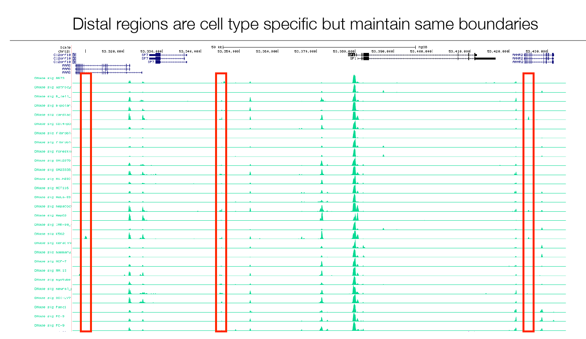
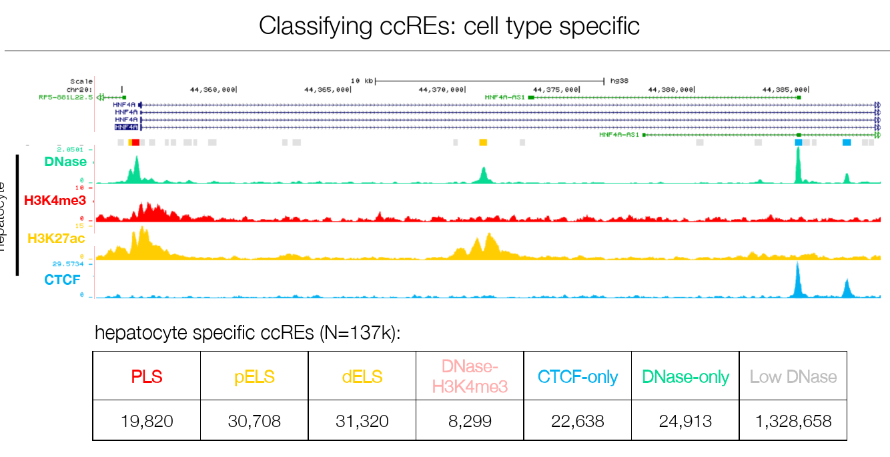
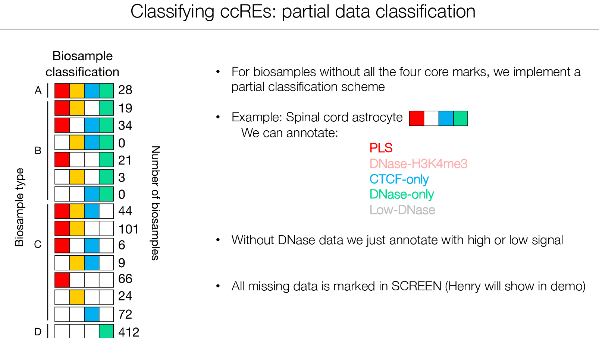
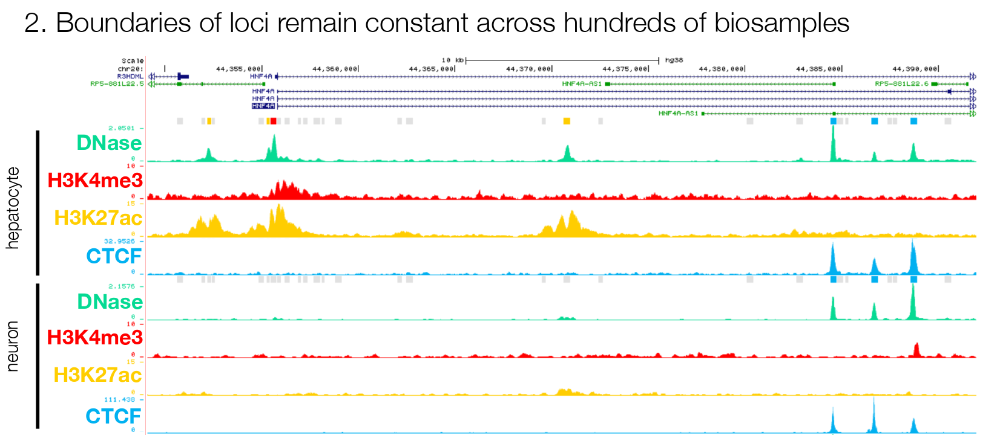

# cCREs : candidate cis-regulatory elements

Les DHSs (DNase I hypersensitivity sites) sont un marqueur (qu'on considérera comme nécessaire) des régions régulatrices de l'ADN. Les pics des profils DHS sont très fortement corrélés avec les pics du Chip-Seq des facteurs de transcription impliqués dans le réagencement et l'ouverture de la chromatine. Les pics de DHS recouvrent également les régions des enhancers et des **innactivateurs** (**silencers**) bien connus. 

Le projet ENCODE a fourni une cartographie des profils DHS de l'ADN humain pour 125 types cellulaires. A partir des profils, ENCODE (2) a identifié 2.9 millions de DHSs. Parmi eux, seule une infime minorité (3692) est ubiquitaire, et ces DHSs ubiquitaires chevauchent généralement des TSS (en tout, 5% des DHSs chevauchent des TSS). Les DHSs distaux sont plus spécifiques du type cellulaire, **mais maintiennent cependant les même frontières**.

*Les DHSs distaux sont plutôt spécifiques du type cellulaire, mais gardent les mêmes frontières.*

***On peut ainsi représenter la chromatine accessible aux échantillons par un ensemble de sites appelés rDHSs, pour representative DNase hypersensitivity sites. ENCODE3 a reporté 2,1 million de rDHSs dans GRCh38.***

Les **ccREs** (candidate cis-regulatory elements) sont un *sous-ensemble* des rDHSs qui présentent à la fois un fort clivage par la DNase I (pics dans les profils DHS) et au moins une des trois choses suivantes, dans au moins un des échantillons biologiques :

1. Un fort signal de présence de H3K4me3 (modification de l'histone H3 relaxant la structure de la chromatine et trouvée dans les régions proximales des TSS des gènes actifs : une marque des promoteurs)
2. Un fort signal de présence de **H3K27ac** (une autre modification épigénétique de l'histone H3 trouvée à la fois dans les régions proximales et distales des TSS : une marque des *enhancers*)
3. Une fort signal de présence de la protéine CTCF (qui régule la structure 3D de la chromatine)

En tout, ENCODE3 a recensé **1,4 million de ccREs** parmi les 2,1 millions de rDHSs, dans GRCh38.

*Classification des ccREs spécifiques aux cellules hépatocytes.*

1. PLS (promoter-like signature) : ***promoteurs candidats***

2. pELS (proximal enhancer-like signature) : ***éléments proximaux avec une signature type enhancer***

3. dELS (distal enhancer-like signature) : ***élément distaux avec une signature type enhancer***

4. DNase-H3K4me3 : régions présentant une signature de promoteurs (H3K4me3) et qui sont des régions ouvertes de la chromatine (clivées par la DNase => pics sur le profil DHS) dans cette lignée cellulaire (ça pourrait ne pas être le cas ; les rDHSs présentent des pics dans certains échantillons pas dans tous). EccREsn d'autres termes, ce sont les ***promoteurs candidats actifs***

   > PAS DU TOUT SUR POUR CELUI LA ! (DNase-H3K4me3)
   >
   > Il me semble que ce sont les ccREs avec une signature de promoteurs, mais qui sont distaux aux TSS, et sont donc difficilement considérables comme des promoteurs potentiels

5. CTCF-only : entre autres, les "nœuds" des boucles d'ADN en lesquels aucun élément régulateur n'est suspecté ("only" wrt les signaux caractéristiques des éléments régulateurs, mais peuvent être des pics conjoints de CTCF et de DNase)

6. DNase-only : région ouverte de la chromatine dans cette lignée cellulaire, mais dont on ne suspecte pas un rôle régulateur dans cette lignée

7. Low DNase : régions fermées de la chromatine dans cette lignée cellulaire, mais qui restent des rDHSs

Parmi les **1,4 million de ccREs** dans GRCh38 recensés par ENCODE 3 :

- 37 000 promoteurs candidats (PLS)
- 1 million d'*enhancers* candidats distaux (dELS) 
- 185 000 *enhancers* candidats proximaux (pELS)
- 154 000 autres éléments régulateurs candidats ("promoteurs candidats actifs" ? et CTCF ni promoteurs ni enhancers)

*Classification des ccREs lorsque les données sont manquantes*

Lorsque certaines données sont manquantes, ENCODE3 établit une classification ordonnée des régions les plus probables. Si d'aventure il n'y a pas de pic de données d'ouverture de la chromatine (DNase-Seq, profils de DHS), les régions de la lignée cellulaire considérées sont seulement annotées selon que les différents autres signaux y sont forts ou faibles.

Les cCREs sont fournis avec une ***très bonne résolution*** : les éléments classifiés ont des tailles comprises entre 150 et 350 pb. Qui plus est, les frontières des régions classifiées comme des cCREs sont les mêmes entre les échantillons.

