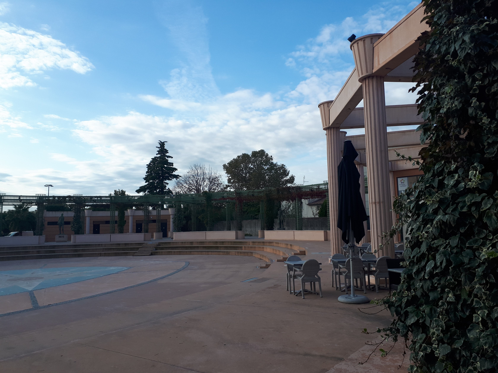

# A propos

Cette page regroupe des notes personnelles de vocabulaire. Il s'agit essentiellement de copier / coller de Wikipédia et de quelques autres sources, non citées. Ces notes n'ont d'autre intérêt que de regrouper au même endroit des informations que je souhaite pouvoir facilement retrouver plus tard !

*Note 1 : les mots importants et simples doivent être en italique. Le gras est réservé aux mots plus techniques / nouveaux, afin qu'ils puissent être repérés plus facilement dans une recherche, sauf s'ils sont mieux définis ailleurs. Si dans un paragraphe on utilise un mot technique défini un peu plus tard seulement, on décide de ne pas mettre le mot en emphase à la première occurrence, mais là on le définit.*

*Note 2 : si on souhaite définir un mot plus tard, on peut lui faire une entrée vide avec quatre dièse (titre de niveau 4). Le niveau 2 est réservé aux entrées déjà documentées ; et le niveau 3 pourra éventuellement être utilisé comme sous-entrées d'entrées plus complexes.*