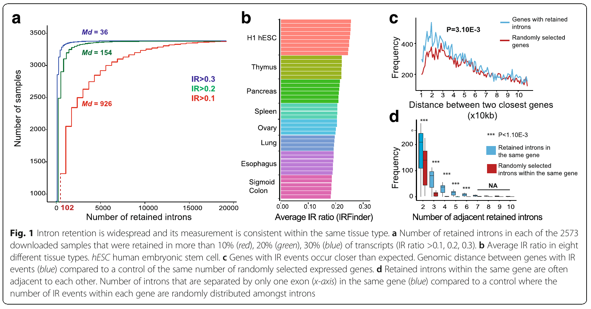
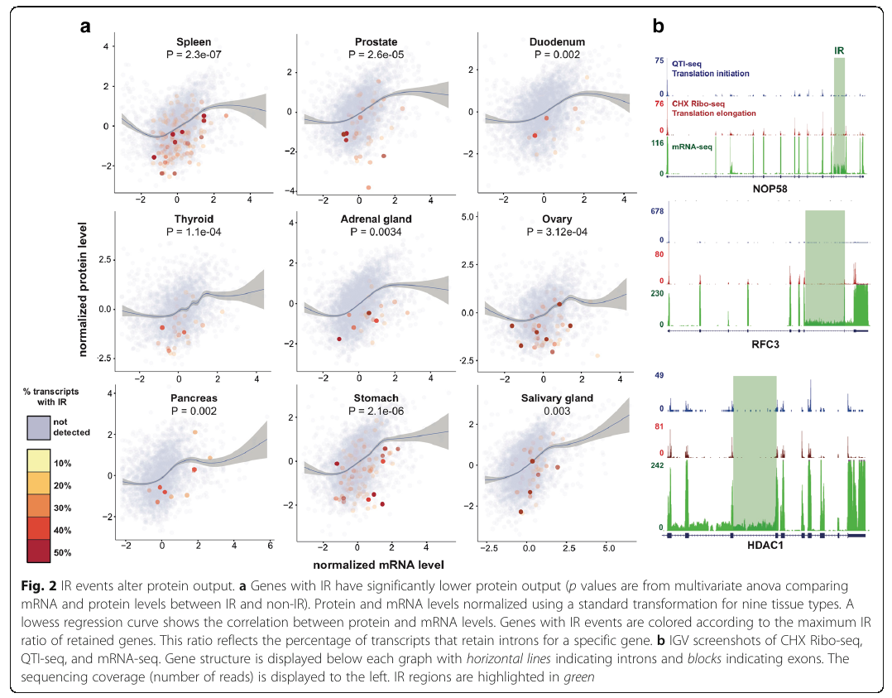
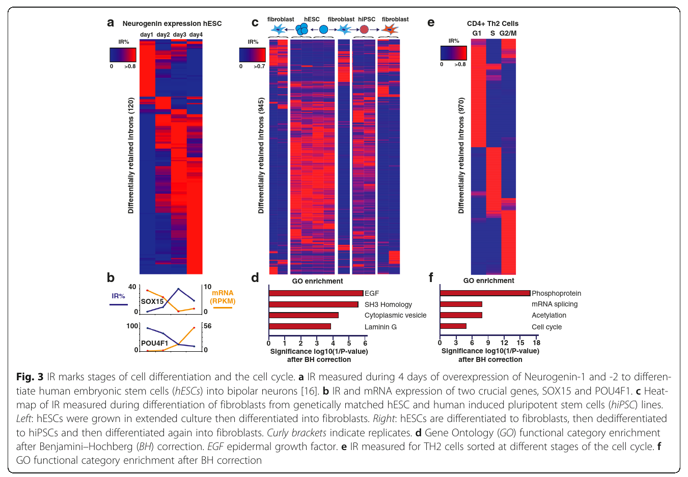
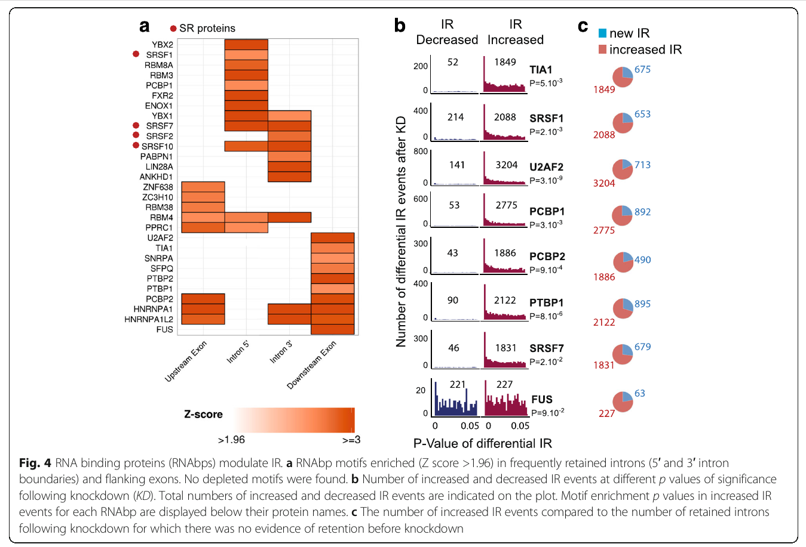

# Rétention d'intron (RI ou IR - *intron retention*)

## Rappels

### Rétention d'intron

La rétention d'intron est un des 5 modes d'épissage alternatif généralement reconnus. La rétention d'intron désigne le fait qu'une séquence puisse être soit excisée soit retenue d'un intron, lors du processus d'épissage de l'ARN pré-messager (mRNA) pour former l'ARN mature (mature mRNA).

*Stricto sensu*, le phénomène de rétention d'intron ne survient en fait qu'*en l'absence* d'épissage. Les sites d'épissage sont bien présents (on a bien un intron) mais des facteurs extérieurs peuvent faire que l'épissage n'a pas lieu.

Si l'intron retenu est dans la région codante, l'intron pourra encoder des acides aminés dans le cadre de lecture des exons adjacents, ou coder un codon STOP, ou causer un saut dans le cadre de lecture menant à des protéines tronquées.

Généralement considéré comme un sous-produit d'épissage défectueux, les transcrits avec RI sont normalement rapidement dégradés par un mécanisme de surveillance appelé *nonsense-mediated decay* (NMD) - le mécanisme de "contrôle qualité" qui assure la dégradation des ARNm comportant un codon STOP prématuré.

Un épissage alternatif anormal a été trouvé dans une large proportion de cellules cancéreuses. Il a été démontré que c'est une réduction de l'épissage alternatif dans les cellules cancéreuses, comparé à des cellules normales, qui causerait certains cancers ; mais les cellules cancéreuses auraient cependant **plus de rétentions d'intron**.

### Splicéosome

Le splicéosome, aussi appelé **particule d'épissage** ou ou *épissosome*, est un complexe dynamique de particules ribonucléiques (composées d'ARNr et de plus de 200 protéines), localisé dans le noyau des cellules. L'assemblage de la particule d'épissage à partir des sous-unités ribonucléiques nécessite de l'ATP.

Son rôle est d'assurer l'excision des introns, des régions non codantes de l'ARN pré-messager, et la suture des exons ; mais également la détection des sites introniques d'épissage. C'est une étape essentielle du processus de maturation des ARN messagers, un mécanisme conservé chez *tous les organismes eucaryotes*. La catalyse de l'épissage par le splicéosome est essentiellement assuré par sa partie ribonucléique (les ARNr) plutôt que sa partie composée de protéines (les facteurs d'épissage).

La structure du splicéosome est remarquablement conservé chez les eucaryotes, de la levure à l'humain.

Le splicéosome est assisté par plus de 200 facteurs agissant en *trans*, qui reconnaissent les séquences cis-régulatrices dans l'ARN pré-messager, et guident le splicéosome en conséquence, pour qu'il exclue ou inclue certains exons spécifiques.

## (2013) Alternative splicing in cancers: implications for biology and therapy

*J Chen, WA Weiss ; Univeristy of California, San Francisco*

### Abstract

L'épissage alternatif a un rôle critique dans le développement normal et peut favoriser le développement et la survie des cellules cancéreuses. Les épissages aberrants - la production de transcrits d'ARN messager spécifiques aux cellules cancéreuses - peuvent conduire à la perte fonctionnelle dans les gènes suppresseurs de tumeur (par exemple P53 - voir la section dédiée dans les notes), ou à l'activation d'*oncogènes*, et donc finalement à diverses voies de développement des cancers.

De nouvelles données suggèrent que les produits d'épissages aberrants et la perte des variants d'épissage canoniques corrèlent avec le stade et la progression des cancers. Dans ce papier, les auteurs commencent par passer en revue les paysages d'épissage de TP53, BARD1 et AR pour éclairer leurs rôles dans l'épissage alternatif au sein des cellules cancéreuses. Ensuite, les auteurs comparent en détails diverses voies d'épissage alternatif, en incluant la RI.

### Introduction

L'épissage alternatif génère de multiples ARN matures différents et protéines aval, en partant d'un seul gène, via l'inclusion ou l'exclusion de certains exons (voir d'introns dans le cas de RI). Ce processus intervient dans 95% des gènes multi-exoniques (*Pan Q, Shai O, Lee L, Frey B, Blencowe B. Deep surveying of alternative splicing complexity in the human transcriptome by high-throughput sequencing. Nat Genet 2008; 40: 1413–1415*) et est catalysé par le splicéosome, un complexe ribonucléoprotéiques aidé par 200 facteurs en *trans*  (les facteurs d'épissage) qui reconnaissent les séquences *cis*-régulatrices dans l'ARN pré-messager et guident le splicéosome en conséquences, pour qu'il inclue ou exclue des exons spécifiques.

L'épissage alternatif confère un avantage évolutif important en fournissant une grande source de diversité protéomique (*Keren H, Lev-Maor G, Ast G. Alternative splicing and evolution: diversification, exon definition and function. Nat Rev Genet 2010; 11: 345–355*).

**Qu'est-ce qu'on appelle "réseau d'interaction protéine-protéine" exactement ? J'ai bien une idée intuitive de ce dont il s'agit, mais une de mes questions est, quels sont les outils qu'on utilise généralement pour étudier le "réseau" d'interaction protéine-protéine ?**

L'épissage alternatif est généralement régulé à l'échelle des tissus, et des variants d'épissages tissus-spécifiques coopèrent pour moduler le réseau d'interaction protéines-protéines (*Ellis JD, Barrios-Rodiles M, Çolak R, Irimia M, Kim T, Calarco JA et al. Tissue-specific alternative splicing remodels protein-protein interaction networks. MolCell 2012; 46: 884–892*). Les cellules souches expriment des variants d'épissages spécifiques à chaque stade de leur différentiation ; les cellules non différenciées étant celle présentant le plus de diversité dans leurs isoformes d'épissage.

ETC A CONTINUER

Plus précisément : parcourir et résumer ici tout le papier ; puis ajouter ici et commenter les figures importantes ; puis revenir sur le résumé et le résumer encore. A la fin, il y aura une page par papier portant sur la RI dans le mkdocs, le tout regroupé dans une section dédiée "RI" (+ une page résumant encore plus toutes les infos utiles / figures importantes de tous les papiers).

## (2014) Widespread intron retention in mammals functionally tunes transcriptomes

### Abstract

L'épissage alternatif d'ARN précurseurs augmente considérablement la diversité fonctionnelle et la capacité régulatrice des génomes eucaryotes. Parmi les différents types d'épissage alternatif (AS), la rétention d'intron demeure (2014) la moins bien comprise. Chez les plantes et les eucaryotes unicellulaires, la rétention d'intron (IR) est la forme d'AS la plus fréquente ; alors que chez les animaux, on pense qu'il s'agit de la forme d'épissage la moins fréquente.

En utilisant les données de séquençage poly(A)+ RNA-seq, les auteurs montrent que la rétention d'introns est beaucoup plus fréquente chez les mammifères que ce qu'on pensait jusqu'alors, affectant les transcrits de *trois quarts des gènes* multi-exoniques.  Un ensemble de caractéristiques en *cis* fortement corrélées, conjointement avec un "code RI" (= séquences susceptibles de provoquer la RI), permet de bien discriminer les introns retenus des introns épissés.

Les auteurs montrent que la RI agit globalement "dans le but" de réduire le niveau d'expression de transcrits peu ou pas requis pour la physiologie du type de cellule ou de tissus dans lequel elle a lieu. Cette fonction "tuning" transcriptomique de la RI agit à travers le NMD (*nonsense-mediated decay* - dégradation des ARNm non-sens, le mécanisme de "contrôle qualité" des ARNm cellulaires *chez les eucaryotes*) et la séquestration nucléaire des produits de RI (= le fait que les produits de RI sont davantage susceptibles d'être retenu dans le noyau).

Les auteurs montrent enfin que la RI est liée à un mécanisme impliquant des décrochages de l'ARN polymérase II (Pol II) et une réduction de la quantité de composants splicéosomaux (eg de facteurs d'épissage) disponibles.

Ces résultats mettent en évidence un mécanisme global de "contrôle" par lequel le couplage d'une réduction du nombre de facteurs d'épissage disponibles couplé à l'inactivation de l'**ARNPII** (= Pol II) permet la suppression, via la RI, des transcrits inappropriés à une échelle globale.

### Introduction

L'épissage alternatif (AS) est un processus très répandu via lequel les sites d'épissage de transcrits primaires sont différentiellement utilisés pour produire une multitude d'ARNm et de **protéines isoformes** (= issus de la traduction d'un même gène) (*Pan et al. 2008; Wang et al. 2008; Nilsen and Graveley 2010*).

L'AS est régulé par un jeu complexe entre des facteurs agissant en *cis* et en *trans* qui promeuvent ou répriment - en tout cas régulent - l'assemblage des particules d'épissages, les splicéosomes. 

L'épissage alternatif par les exons cassettes est généralement considéré comme le type d'AS le plus fréquent chez les animaux, et a beaucoup de conséquences physiologiques. Au contraire, chez les animaux, la RI est considérée (peut-être à tort, au vu du présent papier et des autres résumés ici) comme l'un des types d'AS le moins fréquent, alors qu'il est le plus fréquent chez les plantes, les Fungi, et les eucaryotes unicellulaires.

Des études ont déjà montré que la RI intervient dans le contrôle homéostatique de l'expression de certaines activités d'épissage de l'ARN ; et contrôle également l'expression de gènes régulés au cours du développement, chez les plantes et les animaux.

Par exemple, il a été trouvé qu'un ensemble d'introns retenus dans une lignée de neuroblastes (= cellules souches nerveuses) murins régule négativement des gènes avec des fonctions neuronales. Plusieurs de ces introns sont liés à la rétention nucléaire de transcrits, et d'autres contrôlent les niveaux d'expression de transcrits importants pour la maturation des granulocytes ( = globules blancs non spécifiques) (*Wong et al. 2013*), essentiellement à travers le NMD.

Ces études récentes suggèrent que différents "instances" de RI contrôlent l'expression de gènes à travers différents mécanismes. Cependant, la portée de la régulation des gènes via la RI à travers les différents mécanismes cités et éventuellement d'autres, reste mal connue (2014).

Les auteurs du papier introduisent une pipeline pour la détection de RI et l'appliquent à des données de séquençage poly(A)+ RNA-seq de plus de 40 types de cellules et de tissus chez l'humain et la souris. Au moment de la parution du papier (2014), c'était l'étude la plus détaillée à ce sujet chez les mammifères.

Les auteurs montrent que la RI est beaucoup plus fréquente chez les mammifères que ce qu'on pensait jusqu'alors (2014), affectant les transcrits de la plupart des gènes. Un ensemble de caractéristiques en *cis* permet de bien discriminer les (nombreux) introns retenus des introns épissés. Ces introns retenus comprennent **trois principales classes d'introns avec des origines évolutives distinctes**. Les auteurs fournissent des preuves appuyant que les introns retenus ont largement pour rôle d' "ajuster" / "régler" le transcriptome en réduisant l'expression de transcrits qui ne sont pas pertinents physiologiquement dans la cellule ou le tissus dans lequel ils sont détectés. Finalement, les auteurs montrent que la RI est étroitement liée à un taux d'occupation plus important de l'ARN polymérase II à proximité des séquences d'intron correspondantes, et à la réduction de la quantité de facteurs d'épissage disponibles (facteurs d'épissage qui, pour rappel, sont les protéines qui s'assemblent avec des ARNr pour former le splicéosome).

### Résultats

#### Protocole

Voir aussi les figures plus loin.

Les auteurs utilisent des données de RNA-seq d'ARN polyadénylés sur 40 types cellulaires et tissus chez l'humain et la souris. Les lectures sont alignées un ensemble de référence complet comportant les jonctions exon-intron, des séquences introniques, et des jonctions exon-exon formées par la suppression d'introns.

Le degré de RI est estimé en utilisant la métrique **PIR (Percent Intron Retention)**, c'est-à-dire le pourcentage de transcrits dans lesquels ***un intron donné*** est retenu, parmi tous les transcrits obtenus en partant des transcrits primaires contenant cet intron. Ainsi, le PIR est calculé pour chaque intron.
$$
\textrm{PIR} \equiv \textrm{PIR(intron i)}
$$
En bref, le PIR est calculé comme le nombre moyen de lectures alignés aux extrémités 5' et 3' des jonctions exon-intro, sur la somme du nombre moyen le lectures aux jonctions exon-intron et de lectures aux jonctions exon-exon. De plus, les auteurs requéraient une accumulation équilibrée de lectures alignées aux extrémités 5' et 3' des jonctions exon-intron et au milieu des séquences introniques.  D'autres étapes permettent ensuite de distinguer la RI de sites de début / de fin de transcription alternatifs, d’extrémités d'épissage 5'/3' alternatives, et/ou des recouvrements avec des transcrits d'autres gènes.

#### Résultats généraux

* La RI est présente à différents degrés selon le type cellulaire / le tissu. En général, une plus grande proportion d'introns est retenue dans les cellules neuronales et immunitaires, alors qu'une plus petite proportion d'introns est retenue dans les cellules musculaires. Il semble que ces différences ne soient pas dues à des différences dans la proportion de régions couvertes par les lectures selon le type cellulaire / de tissu, car les différentes données de RNA-seq utilisées par les auteurs avaient une profondeur similaire.
* Les auteurs ont choisi 25 échantillons représentatifs pour lesquels ils ont détecté des RI en utilisant la méthode ci-dessus, pour confirmer expérimentalement les résultats par (RT-)PCR. La présence de RI a été confirmée dans tous les cas.
* L'expression différentielle de PIR selon les types cellulaires / les tissus, obtenue par l'analyse des données RNA-seq, corrèle avec celle obtenue via les mesures expérimentales par PCR (r = 0.63, P < 2.2x10^16, test de corrélation paramétrique de Pearson -> hypothèse de normalité des données ???)

**Le point suivant reste à comprendre**.

* Pour estimer la proportion totale d'introns susceptibles d'être sujets à la rétention chez l'humain et la souris, les auteurs ont estimé la *fréquence de détection de RI*, en échantillonnant aléatoirement un nombre croissant de données de RNA-seq de cellules et de tissus.
* Remarquablement, ~53% et ~51% de tous les introns chez l'humain et chez la souris, respectivement, ont le potentiel d'être retenus dans les transcrits poly(A)+ à un PIR >= 10%. 
* Environ ~9% et 8% sont retenus à un PIR >= 50%
* Qui plus est, ~ 77% des gènes multi-exoniques chez l'humain et la souris contiennent un intron retenu ou plus à un PIR >= 10% ; et 35% contiennent un intron retenu ou plus à un PIR >= 50%

Ces résultats révèlent que la fréquence de RI est comparable à la fréquence d'AS par exons cassettes, et est donc beaucoup plus importance dans les cellules et tissus des mammifères que ce qui était détecté jusqu'alors (2014).

#### Caractéristiques des introns retenus et classes d'introns retenus

* Les introns retenus sont en moyenne plus petits, plus enrichis en C/G, et associés à des sites d'épissage plus faibles, que ne le sont les introns constitutifs (tous les P < 0.001, test de Wilcoxon-Mann-Whitney = test de la somme des rangs de Wilcoxon = *Mann-Whitney U test* = test non paramétrique de H0 : les populations ont la même distribution de proba).
* Les auteurs ont utilisé une régression logistique pour déterminer si ces caractéristiques (taille, enrichissement en C/G, force des sites d'épissage), et d'autres , ou un "code de RI", permettent ou non de bien discriminer les introns retenus (plutôt, "retenables", mais il n'existe pas de tel adverbe en français...)  des introns constitutivement épissés. Le modèle logistique a confirmé que les introns retenus ("retenables"...) sont significativement associés à un contenu plus riche en C/G, une taille réduite, et des sites d'épissage 5' et 3' plus faibles. D'autres caractéristiques sont également importantes : teneur élevée en C/G des séquences exoniques flanquantes, ratio entre la taille de l'intron ou de l'exon amont et la taille de l'exon aval, et localisation de l'intron dans le corps du gène. Remarquablement, bien que ces caractéristiques soient fortement corrélées les unes aux autres, c'est surtout combinées qu'elles permettent de très bien discriminer les introns retenables des introns constitutivement retenus (ROC AUC = 0.79, P < 1 x 10^-300). Ces résultats indiquent que les introns détectés comme retenus par les auteurs à partir des données de poly(A)+ RNA-seq sont associés à un ensemble de caractéristiques qui les démarquent des autres introns.

Pour étudier davantage les caractéristiques en *cis* qui définissent la survenue de RI, les auteurs ont considéré que les introns retenus se répartissent en trois types distincts, avec des origines évolutionnaires distinctes, qu'ils désignent par les types A, B et C.

* Les introns type A sont des introns ancestraux flanqués par des exons constitutifs
* Les type B surviennent par "intronisation" de séquences exoniques
* Les type C sont situés à proximité d'un ou plusieurs exons sujets à épissage alternatif qui ne sont potentiellement pas conservé entre les espèces

Les introns de type A sont les plus fréquents. Ils ont un contenu en C/G et une taille modérés par rapport aux types B et C, et sont individuellement les moins souvent retenus (bien qu'ils soient *in fine* les plus fréquemment retenus, du fait qu'ils sont tout simplement beaucoup plus nombreux).

Les introns de type B sont les moins fréquents, et sont les plus enrichis en C/G, les plus courts, avec les sites d'épissage les plus faibles, et les PIR les plus hauts (= individuellement, les plus souvent retenus).

Les type C sont les moins enrichis en C/G et les plus longs, ce qui suggère une évolution récente qui pourrait être liée à celle des exons alternatifs adjacents.

#### Conservation évolutionnaire de la RI au sein des vertébrés

Pour avoir une meilleure compréhension des cellules et tissus dans lesquels la RI pourrait avoir des fonctions conservées, les auteurs ont examiné dans quelle mesure les RI sont conservées entre des organes équivalents (cerveau, cervelet, coeur, muscle, foie, ...) de jusqu'à 11 espèces vertébrées différentes représentant ~ 440 millions d'années d'évolution. Comme dans le cas de l'AS via les exons cassettes (*Barbosa-Morais et al. 2012 ; Merkin et al. 2012*), ***la RI a rapidement divergé dans tous les tissus au cours de l'évolution des vertébrés**, mais dans une mesure considérablement moindre dans le cerveau que dans les organe comme les testicules, qui montrent le profil de RI le plus divergent.

Un clustering hiérarchique (classification hiérarchique) des échantillons de tissus selon leurs profils PIR à l'échelle du transcriptome entier a conduit à ségréguer ensemble la plupart des tissus cérébraux de primates, alors les autres échantillons se sont plutôt ségrégués selon leurs espèces d'appartenance. Des résultats similaires sont obtenus par ACP.

Ces résultats suggèrent que la RI, bien qu'ayant divergé rapidement dans toutes les organes de toutes les espèces de vertébrés de l'étude, produit plus souvent des fonctions conservées dans les tissus cérébraux qu'au sein des autres tissus. 

#### Régulation globale de l'expression des ARNm via la RI

* Les introns retenus, relativement aux introns constitutifs, sont enrichis en régions non traduites (**UTR**, **untranslated regions**) et en ARN non codants par rapport aux régions codantes des gènes. De plus, les introns retenus dont il n'est pas prédit qu'ils induisent des codons STOP prématurés (**PTC, premature termination codon**) déclenchant le NMD, sont détectés à une fréquence significativement plus élevée dans les régions chevauchant des régions codantes, que ne le sont les introns retenus qui introduisent un PTC (P<4.2e-16, test exact de Fisher - test d'analyse des tables de contingence).

* La RI est aussi détectée plus fréquemment à proximité du bord 3' que du bord 5' des transcrits.

* Les PIR sont plus globalement plus petits dans les cytoplasmes que dans les transcrits nucléaires. Cela suggère, avec d'autres résultats également à l'appui, que les niveaux de transcrits contenant des introns retenus pourrait être réduit dans de nombreuses cellules et tissus par restriction nucléaire et via le NMD. Un autre argument à l'appui est que les auteurs observent une corrélation négative significative entre la détection d'IR et le niveau de transcrits stables

* Pour vérifier si la RI déclenchant le NMD a un impact global significatif sur les transcrits, les auteurs ont analysé les nivaux de transcrits de fibroblastes embryonnaires de souris (MEF) par RNA-seq, dans des cellules souris de type sauvage et des cellules de souris homozygotes chez lesquelles un gène perturbant *Smg1*, qui a un rôle critique dans l'activité de NMD, a été introduit. Les transcrits avec des introns retenus introduisant un PTC sont exprimés significativement plus dans les cellules où *Smg1* a été perturbée que dans les autres ; relativement aux transcrits avec des introns retenus n'introduisant pas de PTC (P=1.4e-5, test de la somme des rangs de Wilcoxon-Mann-Whitney). De plus, ~ 10% des introns retenus dont il est prédit qu'ils introduisent un PTC ont une augmentation de PIR >= 15% par rapport aux cellules de souris de type sauvage ; alors que seulement 2% d'entre eux montrent une baisse de PIC du même ordre. Ces résultats montrent que les introns retenus introduisant des PTC contribuent significativement, à une échelle globale, à la régulation négative du niveau des transcrits via le NMD.

* Les auteurs ont également étudié dans quelles mesure la restriction nucléaire par la RI, plutôt que le NMD déclenché par la RI, impacte l'expression des transcrits stables dans le cytoplasme. Ils ont comparé les ratios de ARNm poly(A)+ cytoplasmiques / nucléaires parmi les transcrits qui introduisent des PTC à ceux qui n'en introduisent pas. Dans tous les cas, lorsqu'on augmente le seuil des PIR pour ne s'intéresser qu'aux introns au delà de ce seuil, on observe que la proportion de transcrits dans le cytoplasme, par rapport aux transcrits dans le noyau, décroît. Cette relation est vraie en générale, mais est encore plus prononcée lorsque les introns retenus introduisent des PTC que lorsqu'ils n'en introduisent pas.

Finalement, la rétention d'introns conduit à une réduction globale du niveau d'expression des transcrits concernés dans le cytoplasme, en raison du double effet de restriction nucléaire et du NMD.

#### La rétention d'intro régule négativement les transcrits non pertinents physiologiquement

Pour étudier le potentiel rôle physiologique de la RI pendant la différentiation cellulaire, les auteurs ont analysé des introns alternativement retenus en se basant à nouveau sur des données de séquençage RNA-seq, générées à différents stades de différentiation de neurones glutamatergiques d'une lignée d'embryons de souris. La vaste majorité (88.7%) des introns différentiellement retenus entre les cellules embryoniques et les neurones matures, montre une croissance progressive de leur rétention au cours de la différentiation.

Conformément à cette observation et à l'hypothèse d'un rôle régulateur global de la RI dans la suppression de l'expression des gènes, les transcrits avec davantage de RI dans les neurones matures sont, en moyenne, exprimés dans un état stable à un niveau significativement moindre que ne le sont les transcrits avec davantage de RI dans les cellules souches embryonnaires.

De plus, parmi tous les gènes dont les niveaux d'expression des transcrits stables décroissent à mesure que la différentiation neurale progresse, les PIR, globalement, augmentent.

Le groupe des gènes qui contiennent les introns davantage sujets à la rétention dans les neurones différentiés, comparés aux cellules souches embryonnaires, est, dans son ensemble, significativement enrichi en plusieurs termes GO, incluant des termes liés au cycle cellulaire. En examinant des gènes individuels qui suivent le même profil de régulation par RI, les auteurs ont trouvé plusieurs exemples dans lesquels les gènes en question possèdent des fonctions effectrices non pertinentes pour les tissus neuronaux. Réciproquement, les gènes comportant des introns dont le taux de rétention est plus faible dans les neurones différentiés, par rapport aux cellules souches embryonnaires, sont significativement enrichis en termes GO qui, eux, sont pertinents pour la biologie neuronale ; spécifiquement, le transport des neurotransmetteurs les synapses.

Ensemble, ces observations suggèrent qu'un taux accru de RI durant la différentiation des cellules neuronales a pour fonction primaire de négativement réguler les transcrits des gènes dont l'expression n'est pas ou est moins pertinente pour la biologie des neurones matures.

Tout cela a également été vérifié expérimentalement par les auteurs, par RT-PCR.

Il est également possible que la RI régule négativement des gènes spécifiques qui, s'ils étaient exprimés, pourraient interférer avec l'identité cellulaire des neurones glutamatergiques.

(Haut de la page 1778. Pas la peine de poursuivre cette section. Par contre il faudra aussi commenter la suivante, qui est intéressante :)

#### Mécanismes de la rétention d'intron

TODO

## (2013) Orchestrated Intron Retention Regulates Normal Granulocyte (= globules blancs non-spécifiques) Differentiation

*Wong et al.*

C'est le papier introduisant, entre autres, l'outil IRFinder. Le papier détaillant le fonctionnement de IRFinder est plus tardif (2017). Voir section suivante.

### Summary

La rétention d'intron (RI) est largement reconnue comme une conséquence d'un épissage défectueux qui conduit à une mauvaise excision des séquences introniques des ARN pré-messagers.

Les analyses de données transcriptomiques et protéomiques de globules blancs pendant leur différentiation, par les auteurs du papier, révèlent l'importance de la RI comme mécanisme physiologique du contrôle de l'expression des gènes. La RI régule l'expression de 86 gènes ayant une activité fonctionnelle, incluant ceux qui déterminent la forme unique du noyau des granulocytes.

La RI dans les gènes ayant une fonction spécifique du type cellulaire / de tissu, sont associés à une régulation négative de facteurs d'épissage et un contenu riche en G/C. La RI, conservée entre la souris et l'humain, conduit à des niveaux d'expression d'ARNm et de protéines réduits, par l’entremise du NMD (*nonsense-mediated decay*, le mécanisme de "contrôle qualité" qui assure la dégradation des ARNm ayant des codons STOP prématurés).

Par opposition à l'idée alors dominante (2013) selon laquelle le NMD est limité aux ARNm codant pour des protéines aberrantes, les données des auteurs montrent que la RI, couplée au NMD, est un mécanisme conservé par la granulopoïèse.

La RI physiologique permettrait de fournir un mécanisme énergétiquement favorable de contrôle dynamique de l'expression des gènes avant traduction.

### Introduction

L'épissage alternatif (AS) de l'ARN affecte presque tous les gènes multi-exoniques et augmente la diversité génétique.

La RI en est la forme la moins bien comprise (2013). C'est une forme d'AS qui survient lorsqu'un intron transcrit dans l'ARN pré-messager, n'est pas excisé. Les transcrits contenant un intron retenu contiennent souvent un PTC (*premature stop codon*), auquel cas :

* soit leur expression est restreinte au noyau
* soit ils sont ciblés et dégradés par le NMD.

En conséquences, la RI avait jusqu'alors été surtout considéré comme un moyen de régulation des gènes, en dépit de cas dans lesquels il a été observé que la RI a des fonctions biologiques.

L'étude minutieuse des mécanismes moléculaires contrôlant la **myélopoïèse** (= formation de la moelle osseuse) a fondé le paradigme de la différentiation cellulaire. L'engagement dans le lignage vers la granulopoïèse (= formation des granulocytes) commence avec la perte par les cellules souches issues de l'hématopoïèse (= formation des cellules sanguines) de leur capacité à s'auto-renouveler, puis l’acquisition progressive, étape par étape, de l'identité spécifique des **myéloïdes** (= lignée des globules blancs - sauf les lymphocytes, qui comprend les **monocytes** et les granulocytes). Les phases terminales du développement des myéloïdes sont caractérisées par des changements transcriptionnels et traductionnels bien distincts, qui incluent des changements dans l'expression de marqueurs de surface cellulaire. Pendant ces phases, surviennent des changements de taille et de forme des cellules, incluant le changement drastique qui conduit à la formation d'un noyau "multi-lobaire" (en forme de plusieurs lobes bien distincts) typique des granulocytes.

Alors même que ce changement morphologique unique en son genre a été très largement étudié, ses mécanismes précis demeurent inconnus.

S'il semble que la destruction des transcrits contenant des PTC par le NMD soit essentiel pour le développement normal des cellules souches hématopoïétiques et des cellules progénitrices en général, l'étendue de l'importance de la RI couplée au NMD n'avait pas encore (2013) été étudiée. Pour étudier l'impact de l'AS, et plus particulièrement de la RI, dans la granulopoïèse, les auteurs ont réalisé un séquençage d'ARNm massivement parallèle (mRNA-seq) et utilisé la spectroscopie de masse sur des populations pures de promyélocytes, de myélocytes et de granulocytes matures isolés à partir de moelle osseuse de souris.

La perte d'ARNm due au NMD et l'abondance de régions introniques de faible complexité (et donc difficiles à aligner) rend la quantification de la RI compliquée. C'est pour résoudre ce problème que les auteurs ont développé l'algorithme IRFinder, qui détecte des changements dans le niveau de RI entre des échantillons à partir de données de mRNA-seq seulement.

A CONTINUER

## (2017) IRFinder: assessing the impact of intron retention on mammalian gene expression

*Robert Middleton et al.*

### Abstract

La RI survient lorsqu'un intron transcrit en ARN pré-messager reste dans l'ARN messager final. Les auteurs ont développé un programme et une base de données, nommés IRFinder, pour détecter avec précision les RI à partir de données de séquençage d'ARNm. L'analyse de 2573 échantillons a montré que la RI survient dans *tous* les tissus analysés, affectant plus de 80% de l'ensemble des gènes codant, et est associée à la différentiation et au cycle cellulaires. Les introns fréquemment retenus sont enrichis en sites de fixation de protéines de liaison de l'ARN spécifiques. Les introns retenus le sont souvent par clusters au sein d'un même gène. La RI est associée à des niveaux d'expression des protéines réduits, et les transcrits avec des RI qui échappent au NMD ne sont pas activement traduits.

### Background

L'AS affecte ~ 95% des gènes multi-exoniques humains. Les 3 principaux types d'AS sont le saut d'exons, l'usage d'extrémités 3' ou 5' alternatives, et la rétention d'introns (RI). La rétention d'intron a longtemps été négligée car il s'agit d'évènements difficiles à mesurer. La RI peut *in fine* :

* introduire de nouveaux éléments fonctionnels dans les ARNm
* ou bien introduire des PTC, conduisant à la dégradation des ARNm par le NMD

Ce processus couplé IR/NMD peut réguler négativement jusqu'à 35% des transcrits alternativement épissés chez les mammifères. Le processus de NMD est absolument essentiel pour le développement embryonnaire. Cependant, une conséquence évidente du NMD est que le ARNm contenant des introns avec PTC sont dégradés et, ce faisant, difficiles à quantifier. En conséquences, le rôle de la RI dans la biologique spécifique des eucaryotes a été peu exploré avant l'émergence des technologies de séquençage ultra-profond.

Il a été découvert récemment (relativement à 2017 - en fait, dans le papier de *Wong et al 2013*, mentionné plus haut) que l'effet couplé RI/NMD n'est pas seulement un sous-produit d'épissage défectueux, mais un moteur essentiel de la différentiation cellulaire des granulocytes.  Dans cette étude pionière, les auteurs (essentiellement les mêmes que celui du présent papier) avaient développé une approche pour bien identifier les introns qui sont différentiellement retenus pendant la différentiation des granulocytes, à partir de données de séquençage. Cette approche a ensuite été utilisée pour dévoiler le rôle de la RI dans la reprogrammation des cellules souches. Entre 2013 et 2017, son importance a été soulignée dans la régulation des gènes, la différentiation et les cancers.

Le programme IRFinder développé par les auteurs et présenté dans ce papier est sensible et rapide, et a été validé expérimentalement par RT-PCR notamment.

* Sur 3435 échantillons humains, 2573 étaient analysables par IRFinder. Sur ces 2573, les auteurs ont trouvé que la RI affecte 80% de l'ensemble de tous les gènes codants, et est associé à la différentiation et aux cycles cellulaires. Les introns retenus dans un même gène sont généralement adjacents les uns aux autres, et les gènes sujets à la rétention d'intron forment des clusters sur le génome, ce qui suggère un mécanisme global qui régule de nombreux introns simultanément. 
* Les gènes sujets à la RI produisent moins de protéines
* Les transcrits avec RI qui échappent au NMD ne sont pas activement traduits
* Il y a une séquence primaire "signature" souvent présente dans les introns fréquemment retenus, qui est enrichie en sites de fixation de protéines de liaison de l'ARN

> Our program to analyze IR from sequencing data is available at GitHub (https://github.com/williamritchie/IRFinder) and a database of IR in over 2000 human samples is freely available at IRBase (http://mimirna.centenary.org.au/irfinder/database/).

### Implémentation

De nombreux facteurs compliquent la mesure précise de l'expression des introns retenus. Au sein des régions introniques, des séquences très exprimées comme celles de snoRNA (petits ARN nucléolaires) ou de miARN, ou des exons non annotés, peuvent faire grandir à tort la mesure de l'expression des introns. Inversement, des régions faiblement complexes, communes dans les introns, empêchent un alignement unique des lectures.

En effet, comme les introns retenus sont généralement exprimés en fraction de leurs exons flanquant, les complications mentionnées ci-dessus sont susceptibles d'introduire des biais qui peuvent massivement perturber l'estimation de la RI.

IRFinder part de données de séquençage d'ARNm pour de multiples espèces, et réalise automatiquement l'analyse de la rétention d'intron :

**Regarder rapidement comment fonctionne l'algo STAR**.

* IRFinder aligne les séquences avec l'algorithme **STAR**
* IRFinder contrôle la qualité des échantillons analysé
* IRFinder détecte les RI
* puis quantifie les RI pour réaliser des comparaisons statistiques entre les échantillons

Pour chacune de ces étapes, les auteurs fournissent un script autonome. Partant de données de séquençage déjà alignées, le programme requiert moins de 2 GB de RAM et environ 10 minutes pour détecter les RI. En partant des données brutes, qu'il faut aligner avec STAR, il faut au moins 48 GB de RAM.

Seulement 68% des échantillons (2573/3774) fournis par les auteurs étaient d'une qualité suffisante pour qu'IRFinder puisse les utiliser. En réalité, c'était essentiellement dû à une mauvaise annotation des échantillons, certains étaient abusivement appelés "mRNA-Seq" alors qu'ils contenaient un séquençage de tous les ARN confondus ou étaient même des données de CHIP-Seq.

### Résultats

**b.** *Taux de RI moyen dans 8 types de tissus différents. Les différentes valeurs données pour un même tissu correspondent au nombre d'échantillons pour ce tissu, sur les 2573.*

**a.** *Lowess regression curve = courbe de régression locale.* **b.** On constate effectivement que sur les régions où on détecte de la RI (celles surlignées en vert - dont on voit aux bas des graphes qu'il s'agit d'intron, et sur le profil ARNm-seq qu'ils sont reconnus), les signaux QTI-seq et Ribo-seq sont très faibles.

IRFinder détecte de la RI dans 80% des gènes codants, dans tous les échantillons testés

**Pourquoi précisément 10%, et pourquoi 3 lectures ? On estime qu'on fait combien d' "erreurs de lecture" ? Est-ce qu'on a pris 10% pour dire que c'est significatif parce que, cf les points ci-dessous, 95% des introns retenus le sont dans moins de 7% (de sorte qu'au dessus de 10%, c'est déjà très significatif ?)**

* Les auteurs se sont intéressés seulement aux introns retenus dans plus de 10% des transcrits (PIR > 10%), et comportant une couverture d'au moins 3 lectures sur l'intron, après avoir exclu manuellement les régions introniques non mesurables (voir "méthodes" plus loin)
* 87% (16 307 / 18 560) des gènes multi-exoniques codant pour des protéines étaient avaient des introns retenus dans au moins 3 échantillons du dataset (3 / 2573), et aucun de ces 16 307 n'avait d'intron retenu dans la totalité des échantillons. La vaste majorité des (95%) des introns était retenue dans moins de 7% des échantillons, ce qui suggère que la RI détectée par les auteurs est spécifique des types de cellules / de tissus.
* Chaque échantillon avait plus de 100 introns retenus, avec un nombre moyen d'introns retenus de 926 parmi les 2573 échantillons. La RI est donc beaucoup plus généralisée que ce qu'on pensait avant.

Les auteurs ont aussi calculé le ratio moyen de RI dans chacun des huit types de tissus pour lesquels ils disposaient d'au moins 3 réplicas. Il y a un recouvrement significatif entre les gènes pour lesquels il y a de la RI entre les réplicas d'un même tissus (p < 2e-6, test hypergéométrique), et le ratio de RI moyen est homogène au sein d'un même tissu (voir figure ci-dessous).

Ayant observé que de nombreux gènes ont plusieurs introns retenus, et que ces introns sont généralement adjacents (séparés par un exon seulement), les auteurs ont également calculé la distance en les gènes avec RI, et à quelle fréquence les introns retenus, au sein d'un même gène, sont adjacents avec les autres. Le résultat est que les introns adjacents au sein d'un même gène sont retenus plus souvent, et que les gènes avec RI sont significativement plus proche entre eux que ne le sont des gènes exprimés choisis aléatoirement (p = 2e-3, test de Mann-Whitney = Wilcoxon-Mann-Whitney = test de la somme des rangs de Wilcoxon). 

Ainsi, non seulement les introns retenus sont généralement entourés de sites d'épissage plus faibles, mais le fait qu'ils soient organisés en clusters montre que la RI n'est pas exclusivement régulée au niveau des jonctions d'épissage, mais aussi à une échelle plus globale par le biais d'une régulation qui vise des groupements de multiples introns et de multiples gènes.

**Question bête : *proteine output*, c'est bien "production de protéines" ? **

#### La RI est associée à une production de protéines réduite

On a déjà vu dans le papier ci-dessus que la RI, couplée au NMD, réduit fortement la production de protéines dans la  granulopoïèse.

Pour déterminer l'impact de la RI sur la production de protéines dans plusieurs types de tissus, les auteurs comparent le niveau de protéines par profilage à base d'anticorps, en utilisant les échantillons de mRNA-Seq, pour neuf types de tissus. Ces données sont issus de l'**Atlas des protéines humaines** (**Human Protein Atlas** = programme suédois lancé en 2003 dans le but de recenser toutes les protéines humaines dans les cellules, les tissus et les organes, en utilisant l'intégration de diverses technologiques omiques, y compris l'imagerie à base d'anticorps, la protéomique définie par la spectroscopie de masse, la transcriptomique et la biologie des systèmes). La RI est analysée pour ces données avec IRFinder.

Les gènes présentant de la RI étaient significativement en dessous de la courbe de régression, ce qui signifie qu'ils produisent moins de protéines que les gènes ne retenant pas d'introns. Notamment, les gènes avec plus de 30% de RI étaient *quasiment toujours* sous la courbe de régression, ce qui indique que des hauts niveaux de RI sont *toujours* associés à une plus faible production de protéines. Le nombre de protéines étudié dans ce jeu de données était restreint, mais l'étude montre tout de même que la RI peut réduire la production de protéine de centaines de gènes, dans plusieurs types de tissus.

**Qu'est-ce que le QTI-seq ? Et les "initiating ribosomes" ?**

Se pose aussi la question de savoir si les introns retenus sont traduits. Pour le savoir, les auteurs ont analysé les données de profilage ribosomique (*ribosome profiling*), qui permet de déterminer quels ARNm sont activement traduits. Cette technique, couplée au séquençage des ARNm et au **QTI-seq** (**quantitative translation initiation sequencing**), permet de tester simultanément la traduction par tous les ribosomes traducteurs, ou spécifiquement par les **initiating ribosomes**, et la rétention d'intron.

Les auteurs ont trouvé 429 cas de RI (avec IR ratio > 10%) dans ce dataset. Aucun de ces cas de RI n'était accompagné d'un signal de Ribo-seq ou de QTI-seq significatif, ce qui suggère que même si les transcrits RI sont polyadénylés, la machinerie cellulaire de traduction ne les traduit généralement pas, soit parce que les ribosomes se dissocient avant d'atteindre les séquences RI, soit parce que les transcrits RI sont rendus inaccessibles. 

#### La RI est associé à la différentiation et aux cycles cellulaires

Dans l'étude déjà résumée ci-dessus, les mêmes auteurs avaient montré que la RI est essentielle pour la différentiation des granulocytes. Deux autres études montrent qu'elle est également essentielle pour la différentiation des érythrocytes et des mégacaryocytes.

Dans la présente étude, les auteurs montrent que la RI est également essentielle dans la différentiation des cellules neuronales, des cellules souches embryonnaires pluripotentes humaines (= **hiPSC**), et dans l'effet des cycles cellulaires sur la différentiation des lymphocytes T naïfs. A nouveau, les auteurs s'intéressent uniquement aux introns retenus dans plus de 10% des transcrits (IR ratio > 0,1), avec 3 lectures au moins recouvrant l'intron, en ayant exclu les régions introniques non mesurables.

**"allowed the authors to define networks of expression at
different stages of neural differentiation"... what does it mean?**

Il a été montré par d'autres auteurs (*Busskamp et al.* : *Busskamp V, Lewis NE, Guye P, Ng AH, Shipman SL, Byrne SM, Sanjana NE, Murn J, Li Y, Li S, et al. Rapid neurogenesis through transcriptional activation in human stem cells. Mol Syst Biol. 2014;10:760*) que les hiPSC peuvent être différenciées en neurones hautement homogènes en 4 jours, en surexprimant les facteurs de transcription **Neurogenin-1** et **Neurogenin-2**. Ainsi les auteurs en question ont pu définir les réseaux d'expression à différentes étapes de la différentiation neuronale.

Le auteurs du présent papier ont réanalysé les données de Busskamp et al., avec IRFinder, et ont découvert  120 introns alternativement retenus entre les jours 1 et 4 de l'expression des TF  *neurogenin*. Ces cas de RI démarquent clairement les différentes étapes de la différentiation neuronale.  Comme dans le cas des études similaires réalisées sur d'autres tissus, les auteurs ont trouvé que la RI, dans les dernières étapes de la différentiation (en l’occurrence, le jour 4), étaient enrichie en gènes de facteurs d'épissage (p=2,5e-5).

Les auteurs ont également trouvé de hauts niveaux de RI pour de nombreux gènes impliqués dans la neurogenèse, parmi lesquels les facteurs de transcription neuraux **SOX15** et **POU4F1**. SOX15 est connu pour être très exprimé dans les cellules non différentiées et réprimé pendant la différentiation neuronale. D'ailleurs, les auteurs ont trouvé que les niveaux d'ARNm de SOX15 ont drastiquement chuté de 9,4 à 1,3 lectures par kilobase par million de lectures alignables (**RPKM**, *reads per kilobase per million mappable reads*). Inversement, le niveau de RI a significativement accru, passant de 0% à 36% aux dernières étapes de la différentiation. Ces introns retenus contenaient des PTC, et étaient donc exposés à la dégradation pour le NMD.

Un autre gène, POU4F1, s'active après la phase de neurogenèse pour réguler l'expression de gènes durant la différentiation de neurones sensoriels. Les auteurs ont montré que lorsque POU4F1 commence à être exprimé, l'intron susceptible d'être retenu dans ce gène est essentiellement retenu, mais, à mesure que l'expression de POU4F1 augmente, la RI dans ce gène diminue. L'intron en question contient là aussi un PTC ; et, ainsi, le couplage RI/NMD pourrait être le mécanisme expliquant le changement drastique dans l'expression de POU4F1 au cours de la différentiation des neurones sensoriels.