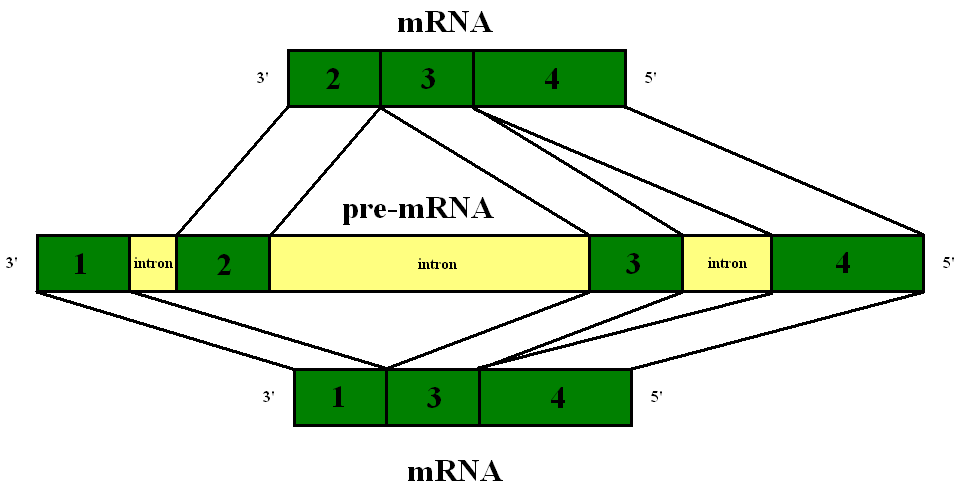
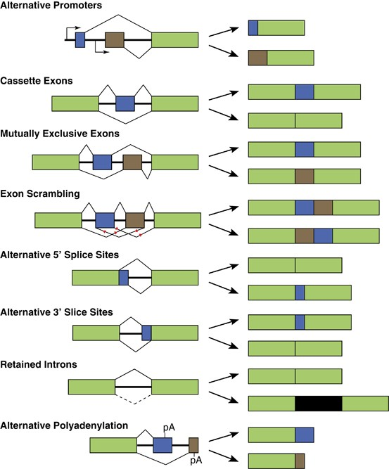

# QTL

## Locus de caractères quantitatifs (QTL, quantitative trait locus)

### Définition

Un locus de caractère quantitatif (LCQ ou QTL) est une région plus ou moins grande d'ADN qui est étroitement associée à un caractère quantitatif, c'est-à-dire une région chromosomique où sont localisés un ou plusieurs gènes à l'origine du caractère quantitatif en question.

L'hérédité de caractères quantitatifs se rapporte à une caractéristique phénotypique qui varie par degrés, et qui peut être attribuée à l'interaction entre deux ou plusieurs gènes et leur environnement (aussi appelée hérédité polygénique). Les QTL peuvent être identifiées au niveau moléculaire (par exemple PCR - polymerase chain reaction : amplification en chaîne par polymérase).

### Puce à ADN (DNA-microarray, biochip, expression profiling)

Une puce à ADN est un ensemble de molécules d'ADN fixées en rangées ordonnées sur une petite surface qui peut être du verre, du silicium ou du plastique. Cette biotechnologie récente permet d'analyser le niveau d'expression des gènes (transcrits) dans une cellule, un tissu, un organe, un organisme ou encore un mélange complexe, à un moment donné et dans un état donné par rapport à un échantillon de référence.

Le principe de la puce à ADN repose sur la propriété que possède l'ADN dénaturé (simple brin) de reformer spontanément sa double hélice lorsqu'il est en présence d'un brin complémentaire (**réaction d'hybridation**). Ainsi les puces à ADN peuvent être utiliser pour mesurer/détecter les transcrits (on parle d'**analyse d'expression** ou de **profil d'expression**) : les séquences (transcrites) sont coupées et placées sur une puce à ADN par un procédé quelconque, puis on teste l'hybridation sur les puces avec des sondes complémentaires. Il est possible de fixer jusqu'à un million de sondes sur une biopuce. Ce faisant, les puces à ADN constituent une approche massive et ont contribué à la révolution de la génomique, puisqu'elles permettent en une seule expérience d'avoir une estimation sur l'expression de plusieurs dizaines de milliers de gènes.

Il existe également un grand nombre d'applications différentes qui font intervenir la technologie des puces à ADN : entre autres, analyse des interactions ADN/protéine. 

### Analyse QTL

L'analyse QTL cherche à caractériser l'architecture génétique d'un type de caractère. Elle permet de tester statistiquement le lien entre variation génétique (comme celle de marqueurs moléculaires) et variation phénotypique. Si le test est conclu significatif, on met en évidence un QTL.

Partant d'une analyes simple marqueur (analyse de variance à un facteur), l'analyse QTL a évolué vers des méthodes de plus en plus complexes : **interval mapping (IM)**, **composite interval mapping (CIM)**, **multiple interval mapping (MIM)**.

Les analyses QTL classiques peuvent aussi être combinées au profilage d'expression (puces à ADN), pour identifier les **expression QTL** (**eQTL**). Les eQTL décrivent les éléments en *trans* et en *cis* qui contrôlent l'expression de gènes ciblés, généralement associés à des maladies. Autrement dit, alors qu'un QTL est une région liée à un caractère quantitatif phénotypique, un eQTL est une région liée au niveau d'expression d'un ARNm, qui est aussi une grandeur quantitative.

## eQTL : expression QTL (expression quantitative trait loci)

Voir aussi "Analyse QTL".

Les eQTL sont des loci génomiques qui expliquent la variation dans le niveaux d'expression d'ARN messagers : comme dans le cas des QTL, il s'agit de déterminer les loci liés à la variation d'une grandeur quantitative ; mais au lieu de l'expression d'un caractère quantitatif, il s'agit du niveau d’expression d'un (ensemble d')ARN(s) messager(s) / d'un micro-trait, ce qui permet de considérer simultanément l'expression de plusieurs millions de microtraits.

L'alignement d'eQTL est réalisé en utilisant les méthodes standard d'alignement de QTL, pour tester le lien entre les variations d'expression et le polymorphisme génétique. La seule différence considérable est que les études d'eQTL peuvent faire intervenir plus d'un million d'expressions de micro-traits. Des logiciels classiques d'alignement peuvent être utilisés, mais il est généralement plus rapide d'utiliser des codes dédiés comme **QTL Reaper** ou **GeneNetwork**.

Voir dans l'ordre [Quantitative trait locus](https://en.wikipedia.org/wiki/Quantitative_trait_locus) puis [Expression quantitative trait loci](https://en.wikipedia.org/wiki/Expression_quantitative_trait_loci).

## Splicing QTL

Abrégé sQTL. Les sQTL sont des QTL qui régulent plus spécifiquement l'épissage alternatif d'ARN pré-messagers.

Ils peuvent être détectés à l'aide des données de séquençage haut débit RNA-Seq (séquençage aléatoire du transcriptome entier).

*Image : lors du processus d'épissage de l'ARN pré-messager, les introns sont systématiquement éliminés (en première approche), mais certains exons peuvent être éliminés également, ce qui conduit à différents ARN messagers.*

*Idem, avec plus de détails. Figure issue de  https://www.nature.com/articles/onc2013570. A droite les ARNm matures. Les rectangles sont des exons et des transcrits finaux ; les lignes sont des introns. En vert : exons toujours exprimés consécutivement. En bleu ou en brun : exons subissant un épissage alternatif. **Est également décrit le phénomène de rétention d'intron (l'intron est retenu et désigné par un rectangle noir sur la figure). Ce phénomène de rétention d'intron ne survient qu'en l'absence d'épissage.***

