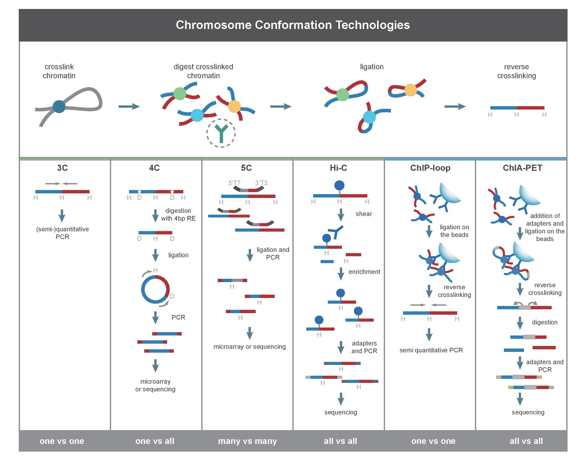

# Méthodes de séquençage / de biologie moléculaire

## RNA-seq

Le RNA-seq (séquençage de l'ARN, *RNA sequencing*), également appelé **séquençage aléatoire du transcriptome entier** (**whole transcriptome shotgun sequencing**), est une technologie qui utilise le séquençage à haut débit (**next-generation sequencing**) pour identifier et quantifier l'ARN issu de la transcription du génôme à un moment et dans des conditions expérimentales données. 

La méthode la plus courante du RNA-Seq est celle visant les ARN polyadénylés car ceux-ci représentent les ARN matures stables et donc non ciblés pour dégradation, qui correspondent donc principalement à des ARNm dont le but est la traduction en protéine. De plus, la sélection des ARN polyadénylés ***permet l'élimination des ARN ribosomaux, qui ne sont pas sujets à la polyadénylation***. A noter qu'il existe d'autres protocoles ayant pour cible d'autres ARN.

## 3C technologies : Chromosome Conformation Capture = Conformérie chromosomique

Traduit en partie de Wikipédia allemand (s'y référer pour plus de détails).

La conformérie chromosomique est un ensemble de techniques / méthodes de biologie moléculaire utilisée pour analyser l’organisation spatiale de la chromatine dans une cellule. Ces méthodes quantifient le nombre d’interactions entre les loci génomiques proches dans l’espace tri-dimensionne, mais potentiellement éloignées linéairement dans le génome.
Ces interactions peuvent résulter de fonctions biologiques, telles que des interactions promoter-enhancer, ou de loopings polymériques aléatoires, où des mouvements physiques aléatoires de la chromatine conduisent les loci à se rencontrer (voir Ay F, Balley TL, Noble WS, Statistical confidence estimation for Hi-C data reveals regulatory chromatin contacts => la loi de puissance suivie par le dataset du papier ABC pour la probabilité de contact en fonction de la distance, semble reproduire de manière très générale les valeurs obtenues expérimentalement avec Hi-C ; et il semble que l’exposant  soit une constance pour un type cellulaire donné, et vaille bien autour de 1 chez l’humain). 
2009 : Lieberman-Aiden & Job Dekker inventent Hi-C, Melissa J. Fullwood & Yijun Ruan inventent ChIA-PET.

## Hi-C = Hi Chromosome Contact Map

Quantifie les interactions entre toutes les paires de fragments simultanément.
Voir éventuellement https://bioinfo-fr.net/hi-c-explication-des-bases (pas encore lu)

## Crosslink (réticulation)

Lorsqu’on fait un crosslink (une réticulation), tout fragment d’ADN physiquement proche d’un autre va être chainé à celui-ci : on fige l’état de l’ADN. Ensuite, l’ADN ainsi figé est soumis à une enzyme de restriction (généralement Hindlll). Les fragments ainsi obtenus sont liés, puis déliés. On obtient ainsi une librairie (banque d’ADN physique) qui contient des fragments d’ADN chacun composés de deux fragments qui étaient, à l’origine, spatialement proches dans le noyau. Jusque là, il s’agit d’un protocole 3C classique. Reste une étape de séquençage haut débit sur les deux sens des fragments en paired-end (reads appairés) pour passer du 3C au Hi-C.

Traitement des reads et visualisation des données : comment manipuler les jeux de données obtenus pour en extraire une information nouvelle : une carte de contact chromosomique ?
Cette carte se présentera sous la forme d’une matrice, dans laquelle est contenue le nombre de fois qu’un read (une ligne) a été retrouvé en contact avec un autre read (une colonne).

Les jeux de données NGS ainsi obtenus contiennent des séquences couplées, paired end, qui correspondent à des régions de l’ADN qui étaient en contact au moment de la réticulation (crosslink chromatin) et sont donc spatialement proches dans la cellule.

1. 1ère étape : Mapping (alignement sur un génome de référence)
   Pour cette étape, l’alignement doit être réalisé en priorité sans mismatches en favorisant le meilleur score d’alignement possible.
   Point technique important : les reads appairés pouvant être séquencés sur des régions très éloignées (voire sur des chromosomes différents), il faudra mapper indépendamment les deux parties des reads appairés (qui sont normalement dans deux fichiers séparés). Le numéro des deux parties d’un read pairé étant commun, on pourra par la suite facilement retrouver la correspondance.
2. 2ème étape : filtrage des séquences lues
   Une fois les séquences alignées sur le génome, il faut filtrer le fichier produit en sortie pour ne garder que les informations pertinentes, à savoir le numéro de chaque read et la coordonnée chromosomique il a été mappé. Ensuite, les deux fichiers sont fusionnés de sorte à obtenir sur chaque ligne les coordonnées chromosomiques des mappages des deux parties d’un read pairé.
3. 3ème étape : constitution de la carte de contact chromosomique
   A partir de cette liste, il faut compter le nombre d’occurrences de chaque paire de reads et stocker le résultat dans une matrice. La matrice en question est appelée matrice de contact ou carte de contact chromosomique.
4. 4ème étape : un peu de normalisation sur la matrice
   Il faut éviter, par exemple, que les valeurs extrêmes sur la diagonale rendent les autres invisibles dans les calculs.

## ChIP

L'immunoprécipitation de chromatine, ou ChIP, pour *Chromatine immunoprecipitation*, est une méthode qui ***permet de déterminer les sites de liaison de l'ADN sur le génome pour une protéine particulière et donne accès à une représentation des interactions protéine-ADN qui ont lieu dans le noyau de la cellule vivante ou dans les tissus***. C'est une méthode *in vivo*. Le principe à la base de ce procédé est que ***les protéines qui se lient à l'ADN (y compris les facteurs de transcription et les histones) peuvent être réticulées (former un réseau tridimensionnel) avec l'ADN auquel ils sont liés***. En employant un anticorps (une protéine complexe sécrétée dans l'organisme par des cellules dérivées des lymphocytes B : les plasmocytes) spécifique d'une protéine présumée liée à l'ADN, on peut faire une **immunoprécipitation** (technique qui permet la précipitation d'un antigène - une protéine - en solution par un anticorps qui agglutine spécifiquement une protéine particulière ; utilisée pour isoler et concentrer une protéine précise parmi des milliers d'autres) du complexe protéine-ADN du lysat cellulaire. Dans un premier temps, la réticulation s'obtient par exemple par l'action de formaldéhyde (aussi appelé méthanal, un aldéhyde) sur les cellules (ou les tissus). Après la réticulation, les cellules sont lysées et l'ADN est scindé en morceaux de 0,2 à 1 kb à l'aide d'un bain à ultrasons. A ce stade, on effectue l'immunoprécipitation pour obtenir des complexes protéine-ADN purifiés. Ces complexes purifiés sont ensuite chauffés pour annuler la réticulation par le formaldéhyde et l'ADN peut être séparé des protéines. L'identification et le dénombrement des fragments d'ADN peut ensuite être obtenu par réaction en chaîne par polymérase (**PCR**, **ACP** en français pour **amplification en chaîne par polymérase** ; c'est une méthode de biologie moléculaire d'amplification génique *in vitro*).

Cette technique permet d'identifier de petites régions de l'ADN où une protéine peut se fixer. En revanche, quand on veut déterminer où la protéine est liée sur un génome à grande échelle, il faut par exemple utiliser une *puce à ADN* (*chip* en anglais) ou le séquençage haut-débit (*Chip-Seq*).

## ChIP-sequencing

### Définition

Aussi appelé Chip-seq, ou séquençage ChIP, c'est une méthode utilisée pour ***analyser les interactions entre les protéines et l'ADN***.

Publiée en 2007, il s'agit d'une approche basée sur une technique de séquençage qui permet de déterminer rapidement la séquence des fragments immunoprécipités par immunoprécipitation de chromatine (ChIP), ce qui n'était pas possible jusqu'alors (pas à l'échelle du génome en tout cas).

Les fragments immunoprécipités sont fixés par l'intermédiaire d'un adaptateur sur une puce, et sont amplifiés en phase solide. Chaque échantillon peut être séquencé suivant quatre méthodes "*Next generation*" : *séquençage par synthèse*, *pyroséquençage*, *séquençage par ligation*, *séquençage simple-molécule*.

1. Séquençage par synthèse

   Celui utilisé par la plateforme *Illumina*.

2. Séquençage par ligature

   L'avantage de cette technique réside en un très faible nombre de *mismatches* du à ma forte spécificité de la ligase lors de l’hybridation.

3. Pyroséquençage

   Un atout majeur de cette technique est la taille des fragments séquencés, de l'ordre de 300 à 500 pb, comparés à 25 à 90 pb dans le cas des séquençages par synthèse et par ligature.

4. Séquençage simple-molécule

   Technique utilisée par les séquenceurs type HeliScope. Le principal avantage de cette technique est la possibilité de séquencer sans amplification préalable, ce qui relève de la prouesse.

### Traitement des données

Chaque *read* est lu tout à tour. Chaque flash de chaque read correspond à une base (un dinucléotide) ; la séquence de chaque read est d'abord matérialisée en un format connu sous le nom de **BCL** ou **Fasta**. Ces reads sont ensuite alignés au génome de référence, en **Colorspace Fasta** pour la plateforme **SOLiD** ou en Fasta standard pour Illumina.

Après une étape de suppression d’artefacts, les reads de chaque réplique technique sont en général combinés, puis fenêtrés par comptage dans n intervalles. Vient ensuite une étape de normalisation. L'étape finale est la détection de pics.

On retrouvera tous les détails [sur Wikipedia](https://fr.wikipedia.org/wiki/ChIP-Seq).

## DNase-seq

Désigne le séquençage haut débit des DHSs.

## ChIA-PET

Publiée en 2009, ChIA-PET est la combinaison d'une technique de conformérie chromosomique (au même titre que Hi-C) et d'une méthode basée sur l'immunoprécipitation de chromatine (ChIP, permet de déterminer si des protéines se fixent sur des régions de l'ADN).

ChIA-PET permet d'identifier les interactions de la chromatine entre les lieux, proximaux ou distaux, de fixation de facteurs de transcription régulateurs et des promoteurs des gènes avec lesquels ces TFs interagissent.

C'est considéré comme une bonne méthode, peu biaisée, pour découvrir de nouvelles interactions chromatiniennes longue-distance à l'échelle du génome (Fullwood & Yijun, 2009).

ChIA-PET est similaire à Hi-C.

ChIA-PET a l'avantage de pouvoir étudier des interactions 3D provoquées par des protéines ou des complexes protéiques spécifiques. Ses inconvénients sont qu'elle nécessite beaucoup de matériel de départ (100 million de cellules), qu'elle est difficile à mettre en œuvre car facilement perturbable, qu'elle peut créer de fausses interactions, et qu'elle a une faible sensibilité (pourrait être de l'ordre de 10% des interactions).

## Capture Hi-C (CHi-C)

CHi-C est une technique de conformérie chromosomique (3C). C'est une amélioration de Hi-C.

Voir le papier de CHi-C qui a l'air très bien (date de février 2015) : https://www.nature.com/articles/ncomms7178

## Ribosome profiling

Le profilage ribosomique, ou **Ribo-Seq**, encore appelé **ribosome footprinting**, est une adaptation d'une technique développée par Joan Steitz et Marilyn Kozak, par Nicholas Ingolia et Jonathan Weissman, pour qu'elle fonctionne avec le séquençage NGS.

Elle utilise des séquence des ARNm spécialisés pour déterminer quels ARNm sont activement *traduits*.

Une technique associée, et qui peut également être utilisée pour déterminer quels ARNm sont activement traduits, est la méthodologie **TRAP** (**Translating Ribosome Affinity Purification**), développée par Nathaniel Heintz at l'Université de Rockerfeller (en collaboration avec Paul Greengard et Myriam Heiman). TRAP n'utilise pas le profilage ribosomique, mais fournit des informaticiens cellule-spécifiques.

