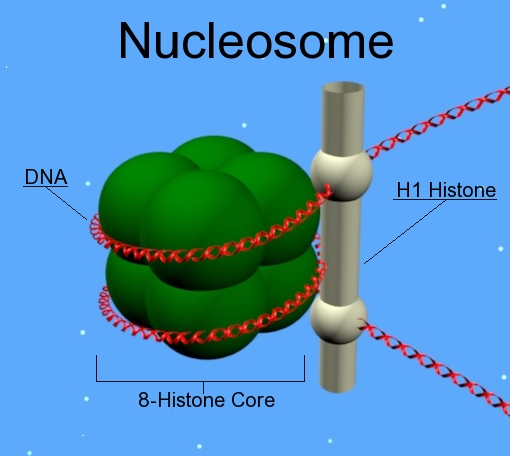
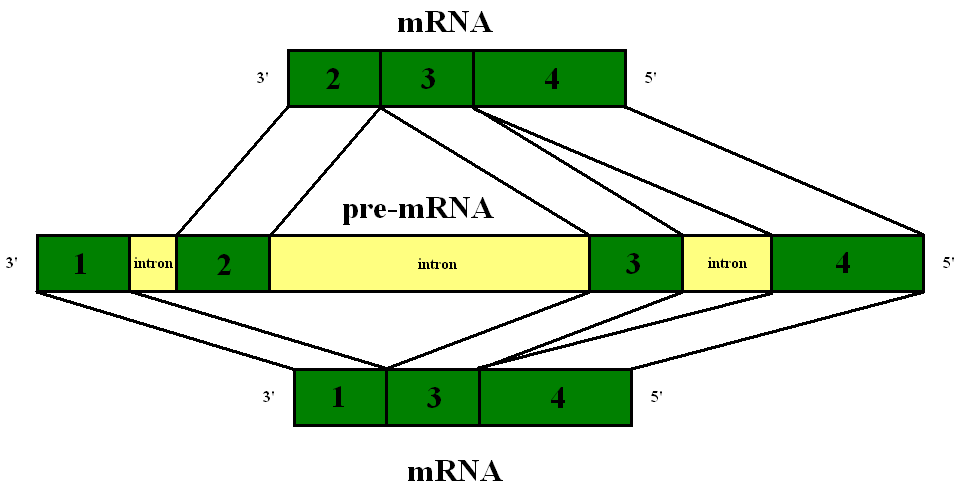

# Vocabulaire de base


## ADN

Les molécules d’ADN sont formées de deux brins qui sont chacun des polynucléotides (cas particulier de **polymères** := ensemble constitué de plusieurs macromolécules ; meros = partie en grec). Un **polynucléotide** est un polymère constitué d’au moins 13 monomères de nucléotides liés par covalence. Un monomère est une molécule qui peut réagir avec d’autres monomères pour former une une chaîne polymérique plus longue, ou un réseau 3D, lors d’un processus appelé polymérisation. Les **monomères**, en biologie (en général, pas seulement les monomères de nucléotides), aussi appelés **sous-unité**, sont les éléments constitutifs de base des protéines multimériques telles l’hémoglobine. La manière dont sont agencées, le cas échéant, les différentes sous-unités, ou chaînes protéiques, est appelée **structure quaternaire**. Ainsi on distingue les monomères (une seule sous-unité), les dimères (deux sous-unité), les trimères, les tétramères, etc.


*Structure quaternaire de l'hémoglobine humaine. Deux sous-unités α et deux sous-unités β forment le tétramère fonctionnel de l'hémoglobine. Elles sont arrangées avec un enchaînement de type αβαβ.*

L’ADN est le support de l’information génétique car il est comme un plan architectural du vivant, qui dicte la construction des principaux constituants et bâtisseurs cellulaires que sont les ARN, qu’ils soient directement fonctionnels (ARN ribosomiques, ARN de transfert, etc) ou qu’ils codent la synthèse des protéines (chaînes polypeptidiques longues, les courtes étant des polypeptides).

## Nucléotide

Un nucléotide est une molécule organique qui est l’élément de base d’un acide nucléique tel que l’ADN ou l’ARN. Il est composé entres autres d’une base azotée (ou base nucléique, A, C, G ou T pour l’ADN, A, C, G ou U pour l’ARN. Ces cinq bases sont les 5 bases principales. Il en existe beaucoup d’autres mais elles n’entrent pas dans la constitution des acides nucléiques et sont dites non canoniques). A cette base azotée s’ajoutent un ose (un des monomères des glucides, qui sont entres autres les deux C3H6O3, les trois C4H8O4, les 7 pentose C5H10O5 -> parmi lesquels on trouve la désoxyribose et la ribose) à cinq atomes de carbone, dit pentose ; ce qui forme un nucléoside, et enfin un à trois groupes phosphate.
Nucléotide = base azotée + ose (monomère des glucides) à cinq carbones + 1 à 3 gr. phosphate

Ainsi, ces différents nucléotides sont des monomères qui s’assemblent pour former deux brins de polynucléotides (polymères constitué d’au moins 13 monomères de nucléotides liés en chaîne par covalence) ; s’enroulant pour former la double hélice d’ADN.

## Génome

Le génome est l’ensemble du matériel génétique d’une espèce, codé dans son ADN (à l’exception de certains virus dont le génome est constitué d’acide ribonucléique - ARN). Il contient, en particulier, tous les gènes codant des protéines ou correspondant à des ARN structurés (ARN structurés = les ARN qui présentent une structure 3D / tertiaire, telles que les ARNt de transfert et les ARNr ribosomiques).

Plus généralement, il se décompose en séquences codantes (transcrites en ARN messagers, notés ARNm, et traduites en protéines) et non codantes (non transcrites, ou transcrites en ARN mais non traduites).

Génome humain = 20 000 à 25 000 gènes.

Le génome est constitué par un ou plusieurs chromosomes dont le nombre total dépend de l’espèce considérée. Chaque chromosome est constitué d’une seule molécule d’ADN, linéaire chez les eucaryotes (organismes chez lesquels les cellules contiennent un vrai noyau avec double membrane - animaux, champignons, plantes) ; et le plus souvent circulaire chez les procaryotes (pas de vrai noyau). Chaque chromosome peut être présent en un ou plusieurs exemplaires : le plus souvent deux chez les espèces sexuées, l’un d’origine maternelle et l’autre paternelle (paires de chromosomes => organisme **diploïde**).

La génomique étudie le fonctionnement d’un organe, d’un cancer, etc, à l’échelle du génome tout entier, plutôt qu'à l’échelle un seul gène. 

Elle se divise en deux branches :

​    • la **génomique structurale** se charge du séquençage du génome entier (par ex. Human Genome Project HGP =>/ 2003)

​    • La **génomique fonctionnelle** vise à déterminer la fonction et l’expression des gènes séquencés en caractérisant le transcriptome et le protéome (ensemble des protéines exprimées) (par ex. ENCODE)

## Annotation des gènes

L’annotation de gènes et plus généralement l’analyse transcriptomique ne consistent pas à déterminer les fonctions des gênes ; mais leurs caractéristiques précises (position exacte, variants / polymorphisme, cellules / organismes où on le trouve, etc).

Le transcriptome est l’ensemble des ARN issus de la transcription du génome (ARN messagers + ARN transcrits mais qui ne seront pas traduits en protéines). On retrouve donc dans le transcriptome à la fois des séquences codantes et des séquences non codantes.

Les ARN messagers sont formés par la transcription d’un gène de l’ADN dont ils sont la copie. Leur rôle est de transporter l’information génétique contenue dans le noyau vers le cytoplasme où elle sera traduite en protéine par les ribosomes.

## Analyse transcriptomique

L’analyse transcriptomique peut caractériser le transcriptome d’un tissu particulier, d’un type de cellule ou comparer les transcriptomes entre différentes conditions expérimentales (les conditions expérimentales n’affectent normalement pas l’ADN mais affectent la manière dont les séquences de l’ADN sont transcrites en ARN).

La caractérisation et la quantification du transcriptome dans un tissu donné et dans des conditions données permet d’identifier les gènes actifs, de déterminer (du moins vise à déterminer) les mécanismes de régulation d’expression des gènes (et de définir les réseaux d’expression des gènes - c’est-à-dire, la cascade de réactions d’amplification, d’inhibitions etc qui conduit finalement un gène à être exprimé ou non). On détermine en fait l’expression différentielle des gènes, selon, par exemple, qu’on inhibe ou non une région suspectée d’être un enhancer pour le gène (une région amplificatrice).

Un gène est une unité de base d’hérédité (cependant suite aux progrès dans notre connaissance des mécanismes de régulations, etc, le statut de gène comme unité de base d’hérédité peut légitimement être remis en question). En principe, tel que défini par ***Wilhelm Johannsen en 1909***, il détermine un trait précis de la forme d’un organisme vivant. D’un point de vue physique, un gène est un fragment d’une séquence d’ADN de locus déterminé.

## Locus

Le locus est une position fixe (d’un gène ou d’un marqueur génétique) sur un chromosome. Une variante d’un gène situé à un locus donné est un allèle - c’est encore une “version” d’un gène qui peut se retrouver à différents endroits sur un même chromosome et même sur un chromosome différent. La coexistence, pour un gène de locus donné et entre individus d’une même espèce, de plusieurs variants, est appelée **polymorphisme**. Le cas de polymorphisme le plus fréquemment observé est le cas de **SNP** (**Single-nucleotide polymorphism**), qui désigne la variation d’une seule paire de base entre deux allèles d’un gène ou d’une région quelconque (<=> autrement dit d’un seul nucléotide sur un brin donné). Ces variations sont très fréquentes (1 paire de base sur 1000 dans le génome humain). Par convention, ne sont considérées comme des SCP que les variations qui concernent au moins 1% des individus. Les SNP représentent 90% des variations génétiques humaines.

Un locus correspond à un fragment séquentiel invariant : par exemple on peut s’intéresser au locus 22q12.2. Le 22 indique la 22ème paire de chromosome de l’espèce considérée, le q indique qu’il se situe sur le bras long (bras court = p) du chromosome et le 12.2 (lu “un, deux point deux”) révèle la position exacte du locus par rapport au centromère (région 1, bande 2, sous-bande 2).

Un gène “paramètre” la synthèse d’un ARN donné : en effet, il prédéfinit le cas échéant la structure de l’ARN synthétisé lors de la transcription, et donc celle de l’éventuelle protéine ou de l’éventuel polypeptide (comme une protéine, en plus petit - moins de 100 acides aminés).

On sait aujourd’hui que la réalité est plus complexe. La connaissance d’un gêne ou même complète du génome ne suffit pas à pouvoir prédire avec certitude et exactitude la nature d’une protéine éventuellement synthétisée, ni même sa structure. Des mécanismes en cascade plus complexes peuvent en effet être à l’œuvre.

## Protéine

Une protéine est une macromolécule (très grande molécule) constituée de l’enchaînement de résidus d’acides aminés liés entre eux par des liaisons peptidiques (liaison covalente plane entre deux parties bien précises de deux acides aminés). En biochimie et en biologie moléculaire, un résidu est la partie d’une molécule, généralement un monomère, qui est restée inchangée après être entré dans la composition d’un polymère ou d’une autre biomolécule complexe.

## Acides aminés

Parmi les acides aminés, il existe en tout 22 acides aminés protéinogènes, dont 20, dits acides aminés standards, sont codés directement par un **codon** (= séquence de trois nucléotides) de l’ADN nucléaire. Les deux autres sont codés indirectement par des codons stop qui sont recodés en codons d’acides aminés en présence de séquences d’insertion particulières, appelées élément **SECIS** pour la **sélénocystéine** et élément **PYLIS** pour la **pyrrolysine**. Cette dernière n’est cependant présente ni chez les eucaryotes ni chez les bactéries : les eucaryotes et les bactéries n’utilisent que 21 acides aminés protéinogènes dont 20 standards.

## Gène


Sur la molécule d’ADN, un gène est caractérisé à la fois par sa position et par l’ordre de ses bases azotées.

Il y a une certaine souplesse dans la constitution exacte d’un gène en terme de ses bases azotées, puisque c’est cette souplesse qui permet la notion de polymorphisme. Ainsi, un gène est une séquence d’ADN susceptible d’être transcrite en ARN (càd transcrite sous certaines conditions) ; et deux séquences sont considérées comme des variantes d’un même gène si elles se ressemblent beaucoup (pas de convention quantifiant exactement la limite) et sont situées aux même loci.

## Ribosomes

Les ribosomes sont des complexes composés de protéines et d’ARN, présents dans les cellules eucaryotes et procaryotes, dont la fonction est de synthétiser les protéines en décodant l’information contenue dans l’ARN messager. Ils sont extrêmement bien conservés au cours de l’évolution. Ils sont constitués de deux sous-unités, une plus petite “lit” l’ARN messager et une plus grosse se charge de la polymérisation des acides aminés (présents où ? Où est la source d’acides aminés ? En tout cas, ils sont apportés aux ribosomes par les ARN de transfert ARNt) pour former la protéine correspondante.

Lors d’un séquençage d’ARN (séquençage haut débit RNA-seq par exemple), on prend bien soin de retirer des données obtenues celles qui correspondent à l’ARN ribosomique, qu’on ne veut pas séquencer et qui prend sinon le lead dans les données.

## ARNt : ARN de transfert

Les ARN de transfert, ou ARNt, apportent les acides aminés au ribosome lors de la synthèse des protéines faite en décodant l’information des ARN messagers (ARNm).

## Génotype / phénotype


Le génotype d’un individu est la somme des gènes qu’il possède. Le phénotype est la somme des caractères morphologiques, physiologiques, cellulaires ou comportementaux de l’individu qui sont identifiables de l’extérieur.


Deux individus peuvent avoir le même génotype sans avoir le même phénotype (et inversement) en fonction des conditions d’expression des gènes. 

AJOUTER LES INFOS CORRESPONDANT A “DEFINITION” ET “EXPRESSION DES GENES” de la page “Genes” de wikipedia fr

## snoRNA - Small nucleolar RNA - petits ARN nucléolaires

Les petits ARN nucléolaires sont des ARN présents dans le nucléole (le plus gros sous-compartiment) du noyau des cellules eucaryotes, et qui aident à la maturation des ARNr (ARN ribosomiques).

## mRNA - microRNA - micro-ARN - miARN

Les micro-ARN (dont l'abréviation en français est *miARN*, pour ne pas la confondre avec celle des ARN messagers, *ARNm*) sont une catégorie de petits acides ribonucléiques, simple brin, non codants, et propres aux cellules eucaryotes.

Les miARN sont des régulateurs post-transcriptionnels capables d'extinction de l'expression d'un gène : leur appariement à un ARN messager cible peut conduire à l'inhibition de sa traduction ou à sa dégradation selon le degré de complémentarité entre la séquence du miARN et celle de son ARNm cible. Parce qu'ils affectent l'expression de nombreux gènes, les miARN interviennent dans la plupart des processus biologiques. Les miARN ont été impliqués dans de nombreux processus, allant du développement, à la formation de tumeurs.

Dans le génome humain, environ 2000 gènes seraient à l'origine de la transcription de miARN, qui cibleraient environ 60% des gènes. Il a été mis en évidence que les miARN peuvent être exprimés différentiellement d'un tissu ou d'un type cellulaire à l'autre.

## ATP Adénosine triphosphate

L’adénosine triphosphate (ATP) est un nucléotide triphosphate. Rappel : un nucléotide est un monomère constitutif des acides nucléiques, et peut être monophosphate, diphosphate ou triphosphate. Dans la biochimie de tous les êtres vivants connus, l’ATP fournit l’énergie nécessaire aux réactions chimiques du métabolisme, à la locomotion, à la division cellulaire, au transport actif d’espèces chimiques à travers les membranes biologiques, etc.

Afin de libérer cette énergie, la molécule d’ATP est clivée par hydrolyse en **adénosine diphosphate** (**ADP**, un autre nucléotide, qui est toujours produit de cette manière par l’organisme) et en phosphate. Ce processus de clivage est *endothermique*. Les cellules peuvent ensuite régénérer l’ATP à partir de l’ADP essentiellement de 3 manières différentes : par **phosphorylation oxydative** dans le cadre de la respiration cellulaire, par **photophosphorylation** dans le cadre de la photosynthèse, ou par **phosphorylation au niveau du substrat**.

La conversion d’ATP en ADP et d’ADP en ATP joue un rôle critique dans l’acheminement d’énergie pour beaucoup de processus vitaux. Le corps humain ne contient à chaque instant que 250 g d’ATP, mais consomme et régénère chaque jour son propre poids en ATP.

L’ATP est aussi utilisée par les ARN polymérases (qui ne sont pas des ARN mais des enzymes contrairement à ce que leur nom laissent entendre). Les **ARN polymérases** catalysent la synthèse d’ARN messager et ribosomique à partir de l’ADN. L’énergie requise pour alimenter cette polymérisation provient de l’hydrolyse du groupe pyrophosphate de l’ATP (certes la réaction est endothermique, mais elle dégage de l’énergie, bien qu’elle en consomme davantage). Question qui reste en suspens : mécanisme précis de la synthèse d’ARN et des échanges d’énergie ?

## Mitochondrie

Une mitochondrie est un organite (= structure spécialisée contenue dans le cytoplasme et délimitée du reste de la cellule par une membrane phospholipidique) possédant entre autres toutes les caractéristiques d’un organisme procaryote, entourée d’une double membrane, et retrouvée chez la plupart des cellules eucaryotes. On en retrouve jusqu’à 2000 par cellules. Elles sont localisées principalement au niveau des zones cellulaires consommatrices d’ATP. Elles permettent la production d’ATP et de divers cofacteurs métaboliques (un cofacteur est un composé chimique non protéique mais nécessaire à l’activité biologique d’une protéine, le plus souvent un cofacteur est une enzyme). En outre, les mitochondries sont impliquées dans différents processus tels que la communication, la différentiation, l’apoptose et la régulation du cycle cellulaire. Les mitochondries sont liées à certaines maladies humaines telles que les retards mentaux, et jouent un rôle important dans les processus de vieillissement.

## Domaine effecteur (effector domain)

Un domaine effecteur est un domaine protéique (= partie d’une protéine capable d’adopter une structure de manière autonome ou partiellement autonome vis-à-vis du reste de la molécule), trouvée dans les protéines régulatrices des bactéries (telles que les facteurs de transcription), et consistant en une duplication d’un motif beta/alpha/beta(2), où les feuillets beta antiparallèles forment une structure de tonneau. Plusieurs protéines régulatrices contiennent ce domaine.

## Doigts de zinc

Les doigts de zinc sont de petits motifs structuraux trouvés dans les protéines et capables d’ordonner en complexe un ou plusieurs ions zinc pour stabiliser leurs plis.

## Histones

Les histones sont des protéines localisées dans le noyau des cellules eucaryotes (entre autres). Elles sont les principaux constituants protéiques des chromosomes. Elles sont en effet étroitement associées à l'ADN dont elles permettent la compaction ; cette action forme des structures appelées **nucléosomes** : l'ADN est enroulé autour des histones comme du fil autour d'une bobine.

Les histones comprennent cinq classes de protéines, regroupées en deux catégories selon leur rôle dans la formation du nucléosome :

- les histones de classes H2A, H2B, H3 et H4 constituent les histones "de cœur", ainsi nommées car elles forment la particule de cœur du nucléosome : deux histones de chaque classe s'associent en un octamère (8 monomères d'histones de ces 4 classes) autour duquel s'enroule le double-brin d'ADN sur environ cent cinquante paires de base (l'ADN s'y enroule en raison de ce que les histones sont très riches en acide aminés basiques, dont la charge positive à pH physiologique permet une interaction forte avec les groupements phosphate de l'ADN, qui portent des charges négatives)
- les histones de la classe H1 sont des histones dit "de liaison" : une histone de cette classe lie l'ADN à l'endroit où celui-ci "entre" et "sort" de la particule de cœur, et "scelle" ainsi le nucléosome


*Structure d'un nucléosome : l'ADN s'enroule autour d'un octamère des quatre dernières classes d'histones, et les deux extrémités de l'enroulement sont liées au nucléosome par un histone de la classe H1.*

## DHS : DNase I hypersensitivity site

### Définition

DNase I = **Deoxyribonuclease I** 

La DNase I est une endonucléase (nucléase qui coupe un acide nucléique en fragments plus courts).

Un DHS est une région de la chromatine qui est caractérisée par un clivage élevé par l'enzyme DNase I. Dans ces régions particulières, la chromatine a perdu sa structure particulière, ce qui expose / rend accessible l'ADN. Pour cette raison, l'ADN peut être plus facilement clivé par des enzymes, en particulier par la DNase I.

Ces régions ouvertes de la chromatine sont liées à l'activité transcriptionnelle : il est nécessaire que la chromatine soit dans cet état pour que puissent s'y fixer des protéines telles que des facteurs de transcription.

Les DHSs sont considérées comme un marqueur (nécessaire) des régions régulatrices de l'ADN.

Le projet ENCODE a fourni une cartographie des profils DHSs de l'ADN humain pour 125 types cellulaires. *Les DHSs marquent des régions transcriptionnellement actives du génome*, et les profils DHSs sont donc spécifiques au type de cellules considéré. ENCODE a identifié 2.9 millions de DHSs à partir des profils obtenus. Parmi eux, 34% sont spécifiques à un unique type cellulaire, et une infime minorité (3692) est ubiquitaire. Environ 5% des DHSs chevauchent les TSS (Transcription Start sites), les 95% restants sont des DHSs distaux, uniformément répartis entre des régions introniques et intergéniques.

### Outils pour l'identification de régions régulatrices

Pour l'analyse des régions régulatrices de l'ADN, on combine l'étude des profils DHS avec d'autres techniques :

- ***Facteurs de transcription (TFs)*** : en utilisant le ChIP-sequencing, on peut déterminer les sites d'ancrage sur l'ADN de certains groupes de facteurs de transcription spécifiques. En les comparant aux profils DHS, on obtient pour certains une très forte corrélation, ce qui montre que ces TFs sont impliqués dans le réagencement et l'ouverture de la chromatine.

- ***Méthylation de l'ADN*** : la méthylation des **site CpG** (régions de l'ADN dans laquelle une cytosine est suivie d'une guanine dans le sens 5' -> 3'. Les cytosines des dinucléotides CpG pour former des 5-methylcytosines. 70% à 80% des cytosines de CpG sont méthylées chez les mammifères) est fortement liée à l'***extinction de gènes*** (*gene silencing*). Cette méthylation conduit à des réarrangements de la chromatine, en la condensant et en l'inactivant transcriptionnellement. En effet, les CpG méthylés qui tombent dans les DHS, en plus d'éventuellement modifier la structure locale de la chromatine, entravent l'association de facteurs de transcription à l'ADN.

- ***Signature de promoteurs dans la chromatine*** : l'histone H3 (une protéine - l'une des cinq principales histones impliquées dans la structure de la chromatine chez les cellules eucaryotes, et l'une de quatre histones "de cœur" du nucléosome) peut subir des modifications épigénétiques. L'une d'elle, **H3K4me3**, correspond à la tri-méthylation du 4ème résidu de lysine de H3. H3K4me3 est souvent associée à l'activation de la transcription des gènes *voisins*. On trouve cette modification dans les nucléosomes adjacents à un TSS, relaxant la structure de la chromatine et la rendant plus accessible aux facteurs de transcription, ce qui autorise la transcription des gènes. Autrement dit, H3K4me3 régule positivement la transcription des gènes voisins : c'est une marque des promoteurs.

  "K" est l'abréviation standard pour la lysine, 4 la position du résidu d'acide aminé, "me" est pour groupe méthyle, et 3 est le nombre de groupes méthyles ajoutés.

- **Connexions enhancer / promoteur** : les éléments cis-régulateurs distaux tels que les enhancers, modulent l'activité des promoteurs. Ce faisant, leur activation est synchronisée avec celles des promoteurs dont ils modulent l'activité, dans les lignées cellulaires pour lesquelles le gène contrôlé est actif. En utilisant les profils DHS, on peut ainsi s'intéresser aux corrélations entre les DHSs pour tenter d'identifier des connexions enhancer / promoteur. 

## Lyse et lysat

La lyse est la destruction de la membrane d'une cellule biologique par un agent physique, chimique ou biologique, provoquant la mort de la cellule. Les **lysines** ou enzymes lytiques sont les molécules capables de la provoquer. Les produits résultant de cette désintégration sont appelés **lysats**.

## CTCF

Le répresseur transcriptionnel CTCF est une protéine également connue sous le nom de **11-zinc finger protein**. C'est un facteur de transcription qui est codé par le gène CTCF chez l'homme. Il est impliqué dans de nombreux processus cellulaires, notamment la régulation de la transcription et la régulation de l'architecture de la chromatine. Son gène est le CTCF, situé sur le Chromosome 16 humain.

La régulation de la structure tridimensionnelle de la chromatine est le rôle principal de CTCF. CTCF lie l'ADN en plusieurs endroits, formant ainsi des ***boucles dans la chromatine***, et ancrant l'ADN à des structures cellulaires telles que la **lamina nucléaire** (le maillage fibrillaire dense qui borde, côté nucléoplasme, l'enveloppe nucléaire d'une cellule).

## Marques d'histones (Histone marks)

Les marques d'histones sont des modifications d'histones bien connues / bien caractérisées. Il peut s'agir de méthylations, d'acétylations, de phosphorylation ou encore d'ubiquitination ; dans tous les cas il s'agit de modifications épigénétiques.

## Exosome

L'exosome est un complexe protéique capable de dégrader les différents types de molécules d'ARN.

On le trouve à la fois dans les cellules eucaryotes et les archées, tandis que les bactéries ont un simple complexe appelé dégradosome qui exécute des fonctions similaires. 

Dans les cellules eucaryotes, l'exosome est présent dans le cytoplasme, le noyau et en particulier le nucléole. Différentes protéines entrent en interaction avec le complexe dans ces différents compartiments afin de réguler l'activité de dégradation de l'exosome sur des substrats spécifiques à ces compartiments cellulaires. Les substrats de l'exosome comprennent l'ARN messager, l'ARN ribosomique, l'ARN non codant, les transcrits en fin de vie, et de nombreuses espèces de petits ARN. L'exosome intervient aussi dans la NMD (*nonsense-mediated decay*, le mécanisme de "contrôle qualité" qui assure la dégradation des ARNm comportant des codons stop prématurés).

La dégradation via l'exosome se fait essentiellement par coupure exonucléolytique, ce qui signifie que l'exosome hydrolyse la chaîne d'ARN à partir d'une extrémité, plutôt que de cliver l'ARN à des sites internes.

Aucune relation de causalité n'existe entre le complexe et une quelconque maladie, mais plusieurs protéines du complexe de l'exosome sont la cible d'anticorps spécifiques chez des patients atteints de maladies auto-immunes, et certains médicaments utilisés dans les chimiothérapies anticancéreuses agissent en bloquant l'activité de ce complexe.

## Polyadénylation

La polyadénylation consiste en l'addition d'une **queue poly(A)**, une succession de nombreux ribonucléotides de type Adénosine (A), à l’extrémité 3' d'ARN messagers. Chez les eucaryotes ; cette étape s'effectue dans le noyau, pendant que l'ARN subit sa maturation, et avant qu'il ne subisse l'épissage. La très grande majorité des ARN messagers est polyadénylée, ainsi que quelques ARN non codants. Il existe quelques exceptions notables : certains ARNm viraux et les ARNm des histones ne sont pas polyadénylés. Chez les bactéries, la polyadénylation est un signal permettant de moduler la stabilité des ARN.

La polyadénylation est réalisée par une enzyme spécifique, la poly(A) polymérase, qui utilise l'ATP comme substrat pour allonger l'extrémité 3' de l'ARN. Cette synthèse est effectuée sans utiliser d'ADN matrice, la séquence poly(A) *n'étant pas* codée dans le génôme. Chez les eucaryotes, ce processus s'effectue à la fin de la transcription par l'ARN polymérase II, au niveau d'un signal spécifique sur l'ARN qui se situe dans la partie non codante, la séquence de polyadénylation AAUAA. Le processus nécessite un certain nombre d'autres facteurs comme le complexe **CPSF** (**cleavage/polyadenylation specificity factor**) qui se fixe au signal AAUAAA et réalise le clivage de l'ARN messager à l'endroit où démarre la polyadénylation.

## Épissage alternatif

L’ADN humain se compose de 1,5% de séquences codant les gènes qui sont activés par des segments cis-régulateurs (càd situés sur le même chromosome) situés à proximité ou non dans les 98,5% d’ADN non codant et aussi, via des mécanismes plus complexes, par des éléments trans-régulateurs (situés sur un autre chromosome). *Attention aux confusions possibles : parfois en anglais, on parle abusivement de régions en cis pour désigner des régions proches,  et en trans pour désigner des régions lointaines, mais sur le même chromosome.*

Le processus par lequel les séquences non-codantes, appelées introns, sont éliminées de l’ARN (pré)messager, est appelé épissage. Les séquences codantes (exons) sont ainsi mises bout-à-bout pour former l’ARNm mature.

Parfois, certains exons peuvent subir l’épissage également et être ainsi absents de l’ARNm mature. Via ce processus, dit d’épissage alternatif, un même gène peut donner naissance à plusieurs protéines.

Un gène = plusieurs protéines en général.

On pense qu’au moins 70% des ~ 25 000 gènes qui composent le génome humain subissent un épissage alternatif, et que, en moyenne, un gène donne naissance à 4 variants issus d’un tel épissage. Ce qui donne jusqu’à 100 000 protéines différentes de par leur séquence, et donc, leur activité.

D’ailleurs, dans certains cas extrêmes, l’épissage alternatif permet à un seul gène de coder plus de protéines que n’en codent tous les autres gènes réunis ! C’est le cas chez la drosophile pour **Dscam** qui peut coder jusqu’à 38016 ARNm matures différents !



*Image : lors du processus d'épissage de l'ARN pré-messager, les introns sont systématiquement éliminés (en première approche), mais certains exons peuvent être éliminés également, ce qui conduit à différents ARN messagers.*


*Idem, avec plus de détails. Figure issue de  https://www.nature.com/articles/onc2013570. A gauche le **transcrit primaire** (= avant épissage), à droite les ARNm matures. Les rectangles sont des exons et des transcrits finaux ; les lignes sont des introns. En vert : exons toujours exprimés consécutivement. En bleu ou en brun : exons subissant un épissage alternatif. Est également décrit le phénomène de rétention d'intron (l'intron est retenu et désigné par un rectangle noir sur la figure). Ce phénomène de rétention d'intron ne survient qu'en l'absence d'épissage.*


Cinq modes d’épissage alternatif sont généralement reconnus :

1. **Exon cassette (Cassette exons)**
   Dans ce cas, les exons peuvent  subir l’épissage du transcrit primaire ou être retenus dans celui-ci.  C’est le mode d’épissage alternatif ***le plus courant dans les cellules de mammifères***

2. **Exons mutuellement exclusifs (mutually exclusive exon)**
   Un des deux exons est retenu ou exclu dans le ARNm après l’épissage, mais jamais les deux à la fois et jamais aucun

3. **Extrémité 5' alternative (Alternative 5' splice site)**
   Généré par les multiples sites de promoteurs (le lieu de début de l'épissage de l'intron varie, embarquant parfois un exon avec). Voir aussi "Alternative promoters", sur la figure.

4. **Extrémité 3' alternative (Alternative 3' splice site) **
   Généré par les multiples sites de polyadénylations (le lieu de fin de l'épissage de l'intron varie, embarquant parfois un exon avec). Voir aussi "Alternative Polyadenylation", sur la figure.

5. **Rétention d’introns (Intron rétention) **
   Une séquence peut être  excisée ou retenue d’un intron. Si l’intron retenu est dans la région codante, ***l’intron pourra encoder des acides aminés dans le cadre de lecture des exons adjacent, ou coder un codon STOP, ou causer un saut dans le cadre de lecture menant à des protéines tronquées.*** *Ce mode est  rarement observé dans les cellules de mammifère.*

En plus des cinq modes énumérés précédemment, les événements suivants permettent de produire une grande variété de protéines alternatives :

1. Le lasso ne comprend pas toujours un intron seul. Pour un gène contenant un grand nombre d'exons, le lasso formé peut comprendre 2 introns et 1 exon au lieu d'un seul intron. On aura alors des exons non-représentés dans l'ARNm mature, et donc dans la protéine ;
2. On peut trouver plusieurs promoteurs au sein d'un même gène. De ce fait, les ARNm matures ne contiennent que les exons en aval du promoteur, ce qui entraîne la traduction de plusieurs protéines différentes selon le promoteur utilisé lors de l'épissage ;
3. On peut trouver des séquences polyA (séquence de résidus adénine qui protège l'ARNm des exonucléases) à l'intérieur de l'ARNm en plus de la  séquence polyA que l'on trouve à l'extrémité 3' de l'ARNm. Selon la séquence polyA qui sera coupée avant traduction, on aura donc des  protéines traduites différentes.

## Rétention d'intron (RI, IR)

*Voir aussi la section entièrement dédiée à la RI.*

Lors du processus d'épissage, une séquence d'ARN pré-messager peut être excisée ou retenue d’un intron. Si l’intron retenu est dans la région codante, ***l’intron pourra encoder des acides aminés dans le cadre de lecture des exons adjacent, ou coder un codon STOP, ou causer un saut dans le cadre de lecture menant à des protéines tronquées.*** *Ce mode est  rarement observé dans les cellules de mammifère.*

Généralement considéré comme un sous-produit d'épissage défectueux, les transcrits avec RI sont rapidement dégradés par un mécanisme de  surveillance appelle **nonsense-mediated decay (NMD)**.

Un épissage alternatif anormal a été trouvé dans une large proportion de cellules cancéreuses. Il a été démontré que c’est une réduction de  l’épissage alternatif dans les cellules cancéreuses, comparé à des cellules normales, qui causerait certains cancers. De plus, les cellules cancéreuses auraient plus de rétention d’introns que les cellules  normales, mais moins d’exon cassette.

## Splicéosome

Le splicéosome, aussi appelé particule d'épissage ou **épissosome**, est un complexe dynamique de particules **ribonucléoprotéiques** (composées d'ARNr et de plus de 200 protéines), localisé dans le noyau des cellules.

L'assemblage de la particule d'épissage à partir de ses sous-unités ribonucléoprotéiques nécessite de l'ATP.

Son rôle est d'assurer l'excision des introns, des régions non codantes de l'ARN prémessager, et la suture des exons ; mais également la détection des sites introniques d'épissage. C'est une étape essentielle du processus de maturation des ARN messagers, un mécanisme conservé chez *tous les organismes eucaryotes*. La catalyse de l'épissage par le splicéosome est essentiellement assurée par la partie ribonucléique (les ARNr).

La structure du splicéosome est remarquablement conservée chez les eucaryotes, de la levure à l'humain.

Le splicéosome est assisté par plus de 200 facteurs agissant en *trans*, qui reconnaissent les séquences *cis*-régulatrices dans l'ARN pré-messager, et guident le splicéosome en conséquence, pour qu'il exclue ou inclue certains exons spécifiques.

## Splicing factor

Un **facteur d'épissage** est une protéine impliquée dans l'excision d'introns des ARN messagers au sein du splicéosome.

## Clivage

Le clivage d’une liaison chimique, sa scission, sa dissociation, ou encore sa rupture, est l’ouverture de cette liaison. C’est une réaction *endothermique*. En biochimie, le clivage désigne un processus de décomposition de grosses molécules en scindant leurs liaisons intramoléculaires. Les enzymes qui catalysent ce clivage de liaisons sont appelés **lyases**, sauf si elles opèrent par hydrolyse ou oxydo/réduction, auquel cas elles sont respectivement appelées **hydrolases** ou **oxydoréductases**, respectivement. Une **hydrolyse** est une réaction chimique et enzymatique dans laquelle une liaison covalente est rompue par l’action d’une molécule d’eau. Par exemple hydrolyse du saccharose : ```saccharose + eau —> glucose + fructose```. Ainsi, les hydrolases sont une classe d’enzymes qui catalysent les réactions d’hydrolyse. On y trouve par exemple les **peptidases** qui hydrolysent les liaisons peptidiques (les liaisons entre les résidus d’acides aminés constitutifs des polypeptides et des protéines).

#### Polypeptides

## Nucléase

Une nucléase est une hydrolase (enzyme catalysant des réactions d’hydrolyse) qui clive les liaisons phosphodiester (= liaison entre un phosphore d’un groupe phosphate et deux autres molécules via deux liens ester) de brins d’acides nucléique entre deux nucléotides.

## Endonucléase

Nucléase qui coupe un acide nucléique en fragments plus courts. Les endonucléases sont capables de couper au milieu de la chaîne, par opposition aux exonucléases qui n’attaquent que les nucléotides situés aux extrémités des fragments.

## EP300

EP300 est une enzyme codée par le gène EP300 sur le chromosome 22. Elle régule l'expression des gènes par remodelage de la chromatine en permettant aux histones de moins enrouler l'ADN.

Le **remodelage de la chromatine** est l'un des trois mécanismes de modification de la structure de la chromatine. Les facteurs de remodelages sont incapables de se fixer directement sur l'ADN, c'est pourquoi leur rapprochement avec la chromatine est permis par leur affinité avec des facteurs de transcription. Le complexe de remodelage intervient pour désorganiser les histones, relâcher la structure, et, enfin, permettre la fixation de facteurs généraux de la transcription sur l'ADN et son expression via les processus de transcription et de traduction.

Habituellement associés à un relâchement de la chromatine, et donc, à une activation de la transcription, certains de ces complexes protéiques agissent à titre de facteur de remodelage de la chromatine et utilisent l'énergie de l'ATP pour plutôt réprimer cette transcription. C'est notamment le cas de **NuRD**, un complexe de remodelage associé à une histone désacétylase dont l'activité transcriptionnelle est plutôt répressive. Ainsi, il est justifié de définir les complexes de remodelage comme des enzymes capables d'altérer les liens histones-ADN dans le but de relâcher ou de fermer un locus chromatinien pour un contrôle de la transcription de gènes ; plutôt que dans le seul but de relâcher un locus chromatinien.

## Antigène

Un antigène est une macromolécule naturelle ou synthétique qui, reconnue par des anticorps ou des cellules du système immunitaire d'un organisme, est capable de déclencher chez celui-ci une réponse immunitaire. Les antigènes sont généralement des protéines, des polysaccharides et leurs dérivés lipidiques.

Les antigènes (de l'acronyme anglais *antigen* pour *antibody generator*) et les anticorps, dont la combinaison est à la base de la réaction immunologique d'un organisme contre un agent extérieur, n'ont pas de définition intrinsèque, mais se définissent l'un par rapport à l'autre :

* est *antigène* toute substance que le système immunologique d'un individu reconnaît comme étant étrangère, et qui provoque une réponse par la production d'anticorps ;
* est *anticorps* une protéine (**globuline**) produite par le système immunologique de l'organisme capable de réagir en présence d'un antigène.

Ainsi toute substance étrangère, tout microbe, introduit dans le corps, peut se comporter en antigène, c'est-à-dure y provoquer la fabrication de protéines spéciales, les anticorps, qui ont la propriété de neutraliser les effets nocifs de la substance étrangère ou du microbe et des toxines qu'ils produisent.

## Globule blanc, leucocyte

Les leucocytes (du grec *leukos* : blanc et *kutos* : cellule) ou globules blancs sont des cellules produites dans la moelle osseuse et présentes dans le sang, la lymphe, les organes lymphoïdes (ganglions, rate, amygdale, ...) et de nombreux tissus conjonctifs de l’organisme (= 1 des 4 types de tissus de l'organisme, représente 80% de l'organisme). Il en existe plusieurs types, les *granulocytes*, les **lymphocytes** et les **monocytes**. Chaque type joue un rôle important au sein du système immunitaire en participant à la protection contre les agressions d'organismes extérieurs de manière coordonnée.

## Granulocytes

Les granulocytes, autrefois qualifiés de polynucléaires (parce que certains d'entre eux semblent posséder plusieurs noyaux), sont des globules blancs qualifiés de "non spécifiques" dans la mesure où ils ne sont pas dirigés contre un seul antigène.

## Granulopoïèse / *Granulopoiesis*

La granulopoïèse, qui a lieu dans la moelle osseuse, fait partie de l'**hématopoïèse** (= processus de fabrication des cellules sanguines), qui conduit à la production de granulocytes.

## Cellules progénétrices

Les cellules progénitrices sont les cellules issues d'une souche multipotente, qui ne présente pas encore de signe de différentiation mais qui, après trois ou quatre divisions, donne naissance à une ou plusieurs lignées cellulaires.

## GO terms

https://en.wikipedia.org/wiki/Gene_Ontology_Term_Enrichment

https://fr.wikipedia.org/wiki/Gene_Ontology

L'enrichissement en termes GO  (**Gene Ontology**), est une technique pour interpréter des ensembles de gènes en utilisant le système de classification de Gene Ontology (http://geneontology.org/), qui assigne à chaque gène un ensemble d'étiquettes prédéfinies en fonction de ses caractéristiques fonctionnelles. Par exemple, le gène **FasR** est catégorisé comme étant un *récepteur* impliqué dans l'*apoptose* et localisé dans la *membrane plasmique*.

En toute généralité : Gene Ontology est un projet bio-informatique destiné à structurer la description des gènes et des produits géniques dans le cadre d'une ontologie commune à toutes les espèces.

La base GO est conçue comme un graphe orienté acyclique, chaque terme étant en relation avec un ou plusieurs termes du même domaine, et parfois d'autres domaines. Le vocabulaire GO est construit pour n'être pas dépendant des espèces considérées, avec des termes applicables à la fois aux organismes multicellulaires et unicellulaires, aux eucaryotes et aux procaryotes.

## Oncogène

Les oncogènes (du grec *onkos*, signifiant vrac, masse ou tumeur et *génos* signifiant génération, naissance, origine), ou encore **proto-oncogène**, sont une catégorie de gènes dont l'expression favorise la survenue de cancers. Ce sont des gènes qui commandent la synthèse d'**oncoprotéines**, protéines stimulant la division cellulaire ou inhibant la mort cellulaire programmée (apoptose), ce qu déclenche une prolifération désordonnée dans les cellules.

Le terme oncogène peut aussi, par extension, désigner des virus qui provoquent l'apparition de cancers. On parle plus exactement d'oncovirus.

## Suppresseurs de tumeur (*tumor suppressors*)

Un **gène suppresseur de tumeurs** ou encore **anti-oncogène** est un régulateur négatif de la prolifération cellulaire. 

Contrairement aux oncogènes qui deviennent hyperactifs dans les cellules cancéreuses, les gènes suppresseurs de tumeurs perdent leurs fonctions dans les cancers. Ceci peut être dû à une délétion d'une région du chromosome contenant le gène, ou à des mutations ponctuelles qui détruisent ou altèrent sa fonction. Cependant, comme le génome humain est diploïde (= les gènes sont présents à l'état de deux copies par cellule, issues du chromosome paternel et du chromosome paternel, si on fait abstraction des chromosomes sexuels X et Y), pour que la fonction d'un gène suppresseur soit perdue, il est nécessaire que les deux copies du gène soient inactivées.

Certains gènes suppresseurs de tumeurs sont inactivés dans des cancers très spécifiques, à l'instar de **BRCA1** et **BRCA2** dans les cancers du sein ou d'**APC** dans les cancers du colon. D'autres gènes suppresseurs de tumeurs, comme **P53** et **P19**, ont un spectre d'inactivation plus large.

## Séquences homologues

En biologie moléculaire, les séquences homologues sont deux ou plusieurs séquences nucléotidiques partageant une origine évolutive commune, c'est-à-dire présentant une homologie au sens de l'évolution moléculaire. Deux segments d'ADN distincts sont suceptibles d'avoir une origine commune à la suite d'une spéciation (orthologie), d'une duplication (paralogie) ou d'un transfert horizontal de gènes. L'homologie de l'ADN, de l'ARN et des protéines est généralement déduite de similitudes de la séquence des acides nucléiques ou des peptides traduits : de fortes similitudes entre séquences sont l'indication d'une origine commune.

## TP53, P53

La protéine suppresseuse de tumeur P53 / p53, **Gardien du génôme** (voir plus bas) ou encore **TRP53** (**transformation-related protein 53**), désigne n'importe quel isoforme de la protéine codée par les gènes homologues *TP53* (chez l'humain) ou *TRP53* (chez la souris).

Cette protéine homologue (souvent désignée comme une seule et même protéine, disons par abus de langage) est cruciale chez les vertébrés, chez lesquels elle prévient la formation de cancers.

C'est un suppresseur de tumeur d'une importance tel que cette protéine est souvent appelé "la gardienne du génome".

En plus de la protéine p53 de taille complète, le gène humain TP53 code pour au moins 15 protéines isoformes, dont les tailles varient de 3,5 à 43,7 kDa (kilodalton). Toutes ces protéines sont appelées les isoformes de p53.

Le gène TP53 est le gène dont la mutation est la plus fréquente (> 50%) dans les cancers humains, ce qui indique que le gène TP53 joue un rôle crucial dans la prévention de la formation de cancers.