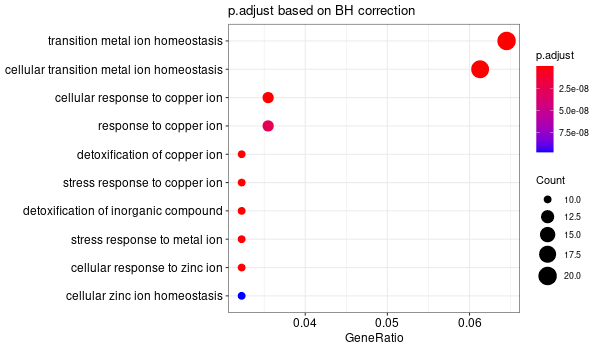
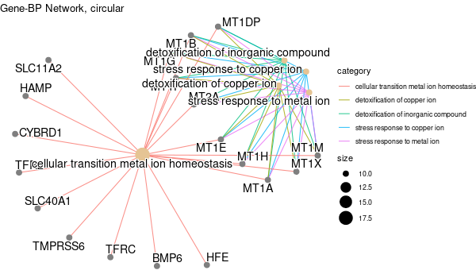
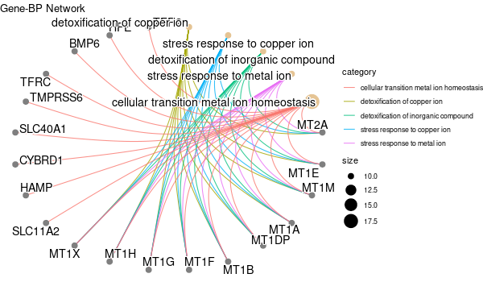
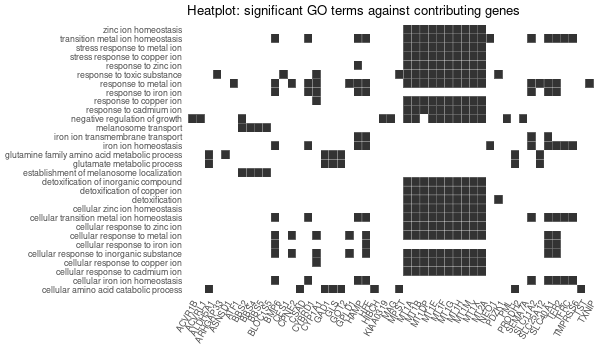
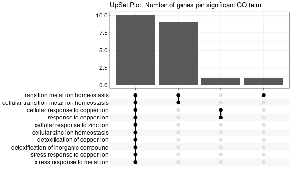
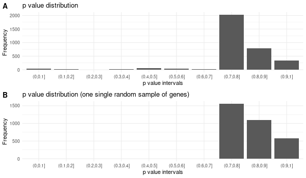

# New custom script to compute GO enrichment: `GO_enrichment_FDR.R`

We adapt `GO_enrichment.R` so that the multiple testing correction is less stringent: we want to control the FDR, rather than the FWER with the Šidák procedure.

We name our script `GO_enrichment_FDR.R`.

We should look at the `enrichGO` function from the `clusterProfiler` library: 

[https://rdrr.io/bioc/clusterProfiler/man/enrichGO.html](https://rdrr.io/bioc/clusterProfiler/man/enrichGO.html)

[https://www.rdocumentation.org/packages/clusterProfiler/versions/3.0.4/topics/enrichGO](https://www.rdocumentation.org/packages/clusterProfiler/versions/3.0.4/topics/enrichGO)

[https://yulab-smu.top/biomedical-knowledge-mining-book/clusterprofiler-go.html](https://yulab-smu.top/biomedical-knowledge-mining-book/clusterprofiler-go.html)

## Dependencies

We use R 4.0. We need the `clusterProfiler` package.

> The following does not work, so all this quotation is just to keep a record in case we encounter similar problems:
>
> ```R
> BiocManager::install("clusterProfiler")
> ```
>
> > ```R
> > Installation paths not writeable, unable to update packages
> >   path: /usr/lib/R/library
> >   packages:
> >     boot, class, cluster, foreign, KernSmooth, lattice, MASS, Matrix, mgcv,
> >     nlme, nnet, spatial, survival
> > ```
>
> > ```R
> > .libPaths()
> > ```
> >
> > ```R
> > [1] "/home/thoellinger/R/x86_64-pc-linux-gnu-library/4.0"
> > [2] "/usr/local/lib/R/site-library"                      
> > [3] "/usr/lib/R/site-library"                            
> > [4] "/usr/lib/R/library"
> > ```
>
> ```bash
> BiocManager::install(c("boot", "class", "cluster", "foreign", "KernSmooth", "lattice", "MASS", "Matrix", "mgcv", "nlme", "nnet", "spatial", "survival"), lib = "/home/thoellinger/R/x86_64-pc-linux-gnu-library/4.0")
> ```
>
> ```R
> BiocManager::install("clusterProfiler", lib = "/home/thoellinger/R/x86_64-pc-linux-gnu-library/4.0")
> ```
>
> > ```R
> > Error in get(name, envir = asNamespace(pkg), inherits = FALSE) : 
> >   object 'get_fun_from_pkg' not found
> > Error: unable to load R code in package ‘clusterProfiler’
> > Execution halted
> > ERROR: lazy loading failed for package ‘clusterProfiler’
> > * removing ‘/home/thoellinger/R/x86_64-pc-linux-gnu-library/4.0/clusterProfiler’
> > 
> > The downloaded source packages are in
> > 	‘/tmp/Rtmp3Xmv24/downloaded_packages’
> > Warning message:
> > In .inet_warning(msg) :
> >   installation of package ‘clusterProfiler’ had non-zero exit status
> > ```
>
> Still does not work. It appears that the problem is the dependency in the `rvcheck` library, that contained the `get_fun_from_pkg` up to version 1.8 but does not contain it anymore ; and the authors of `clusterProfiler` have not updated their dependencies: https://www.biostars.org/p/9491480/

We need to install an older version of `rvcheck`, namely, the version 1.8. See [details here](https://cran.microsoft.com/snapshot/2020-04-20/web/packages/rvcheck/index.html). We download it and install it from source.

```bash
cd Documents/shared/sources
wget https://cran.microsoft.com/snapshot/2020-04-20/src/contrib/rvcheck_0.1.8.tar.gz .
```

```r
install.packages("/home/thoellinger/Documents/shared/sources/rvcheck_0.1.8.tar.gz", repos = NULL, type="source")
```

So now:

```R
BiocManager::install("clusterProfiler", lib = "/home/thoellinger/R/x86_64-pc-linux-gnu-library/4.0")
```

should work **BUT** one have to select "no" when the prompt asks whether to update the `rvcheck` package (even if it asks whether to update or not a lot of packages including `rvcheck`)!

Note that one might also need to install `org.Hs.eg.db` separately.

```R
BiocManager::install("org.Hs.eg.db", lib = "/home/thoellinger/R/x86_64-pc-linux-gnu-library/4.0")
```

Again, it is **necessary** to select "no" when the prompt asks whether to update the `rvcheck` package (even if it asks whether to update or not a lot of packages including `rvcheck`)!

For graphics, we need a few more packages:

```R
BiocManager::install("ggupset", lib = "/home/thoellinger/R/x86_64-pc-linux-gnu-library/4.0")
BiocManager::install("ggnewscale", lib = "/home/thoellinger/R/x86_64-pc-linux-gnu-library/4.0")
```

Again, it is **necessary** to select "no" when the prompt asks whether to update the `rvcheck` package.

We followed this guide for visual outputs: https://yulab-smu.top/biomedical-knowledge-mining-book/enrichplot.html

## Script

The main part of the script will use the `groupGO` function that basically does everything:

```R
res = groupGO(gene = U, # vector of entrez gene id
              OrgDb = org.Hs.eg.db, # human organism
              ont = "BP", # ontology, "BP", "MF" or "CC"
              universe = universe, # background genes (entrez)
              pvalueCutoff = 0.05,
              pAdjustMethod = "BH", # one of "holm", "hochberg", "hommel", "bonferroni",
              						# "BH", "BY", "fdr", "none"
              readable = TRUE) # whether mapping gene ID to gene Name
```

The `OrgDb` parameter is an object specifying the organism of interest. For human, one must use `OrgDb = org.Hs.eg.db`. Note that `OrgDb` object are available in Bioconductor for 20 organisms: http://bioconductor.org/packages/release/BiocViews.html#___OrgDb

One can find the list of types of sequence id available (for instance "ENTREZID", "ENSEMBL", "REFSEQ") using `columns(org.Hs.eg.db)`:

> ```R
> > columns(org.Hs.eg.db)
> [1] "ACCNUM"       "ALIAS"        "ENSEMBL"      "ENSEMBLPROT"  "ENSEMBLTRANS" "ENTREZID"     "ENZYME"       "EVIDENCE"     "EVIDENCEALL"  "GENENAME"     "GO"           "GOALL"       
> [13] "IPI"          "MAP"          "OMIM"         "ONTOLOGY"     "ONTOLOGYALL"  "PATH"         "PFAM"         "PMID"         "PROSITE"      "REFSEQ"       "SYMBOL"       "UCSCKG"      
> [25] "UNIGENE"      "UNIPROT"
> ```

Here is the full content of `GO_enrichment_FDR.R`:

> ```R
> 
> ##################
> # OPTION PARSING #
> ##################
> 
> suppressPackageStartupMessages(library("optparse"))
> 
> option_list <- list(
>     make_option(c("-k", "--key"), default="ENTREZID", help="type of gene identifiers used in other arguments (one of \"ENTREZID\", \"ENSEMBL\", \"REFSEQ\", \"GENENAME\", \"SYMBOL\") [default=%default]"),
>     make_option(c("-u", "--universe"), default="None", help="list of background gene identifiers (of same type as --key), WITHOUT header.
>                  Use \"None\" for default background (given by the clusterProfiler package) [default=%default]"),
>     make_option(c("-G", "--genes"), default="stdin",
>                  help="list of foreground gene identifiers (of same type as --key), WITHOUT header [default=%default]"),
>     make_option(c("-c", "--ontology"), help="choose the GO category < BP | MF | CC > [default=%default]", default="BP"),
>     make_option(c("-p", "--pval"), help="p-value threshold. All GO terms found to be enriched up to this threshold will be saved as output. [default=%default]", default=0.1),
>     make_option(c("-q", "--qval"), help="q-value threshold. All GO terms found to be enriched up to this threshold will be saved as output. [default=%default]", default=0.2),
>     make_option(c("-a", "--padjMethod"), help="p-value adjustement method threshold. One of \"holm\", \"hochberg\", \"hommel\", \"bonferroni\", \"BH\", \"BY\", \"fdr\", \"none\" [default=%default]", default="fdr"),
>     make_option(c("-f", "--fdr"), help="FDR (or adjusted p-value in general) threshold. All GO terms found to be enriched up to this threshold will be saved as output in a separate table. [default=%default]", default=0.1),
>     make_option(c("-v", "--verbose"), default=TRUE, help="Verbosity (TRUE/FALSE) [default=%default]"),
>     make_option(c("-o", "--output"), default="out", help="additional tags for otuput [default=%default]"),
>     make_option(c("-d", "--output_dir"), default="./GO_output/", help="directory for the output [default=%default]")
> )
> 
> parser <- OptionParser(usage = "%prog [options] file", option_list=option_list)
> arguments <- parse_args(parser, positional_arguments = TRUE)
> opt <- arguments$options
> verbose = opt$verbose
> 
> #################################
> # Load libraries & Import data #
> #################################
> 
> if(verbose){
>     library("clusterProfiler")
>     library("org.Hs.eg.db")
>     library(enrichplot)
>     library(ggplot2)
> } else{
>     suppressPackageStartupMessages(library("clusterProfiler"))
>     suppressPackageStartupMessages(library("org.Hs.eg.db"))
>     suppressPackageStartupMessages(library(enrichplot))
>     suppressPackageStartupMessages(library(ggplot2))
> }
> 
> if (verbose) print("Loading input data...")
> key = opt$key
> if(opt$universe=="None"){
>     universe = NA
>     print("Warning: using defaut universe automatically provided by the clusterProfiler package")
> } else{
>     U = read.table(opt$universe, h=F, col.names='hs')
>     universe = as.character(unique(U$hs))
> }
> 
> G = read.table(opt$genes, h=F, col.names='hs')
> genes = unique(G$hs)
> ontology = opt$ontology
> pval = opt$pval
> qval = opt$qval
> pAdjMethod = opt$padjMethod
> fdr_threshold = opt$fdr
> 
> if (verbose) print("Done.")
> 
> ######################
> # Compute enrichment #
> ######################
> 
> to_readable = TRUE
> if (key=="SYMBOL") to_readable = FALSE
> 
> if (verbose) print("Computing GO enrichment...")
> 
> res = enrichGO(gene = genes,
>                   OrgDb = org.Hs.eg.db,
>                   keyType = key,
>                   ont = ontology,
>                   universe = universe,
>                   pvalueCutoff = pval,
>                   qvalueCutoff  = qval,
>                   pAdjustMethod = pAdjMethod,
>                   readable = to_readable)
> 
> if (verbose) print("Done.")
> 
> universe_found = res@universe
> 
> ###################
> # Compute results #
> ###################
> 
> if(opt$universe=="None"){
>     sprintf("%s (default) background genes", length(res@universe))
> } else{
>     sprintf("%s provided background genes; %s with a corresponding %s id", nrow(U), length(universe), key)
> }
> n_genes_found = strsplit(res@result$GeneRatio[[1]],'/')[[1]][2]
> sprintf("%s provided genes; %s found by `enrichGO`", nrow(G), n_genes_found)
> sprintf("Computed GO enrichment (whether significant or not) for %s distinct GO terms", nrow(res@result))
> sprintf("Of those %s GO terms, %s have a %s-adjusted p-val < %s", nrow(res@result), nrow(res@result[res@result$p.adjust<=fdr_threshold,]), pAdjMethod, fdr_threshold)
> 
> ################
> # Write output #
> ################
> 
> dir.create(opt$output_dir, showWarnings = FALSE, recursive = TRUE)
> output = sprintf("%s/%s.%s.%s%s", opt$output_dir, opt$output, opt$ontology, opt$fdr, opt$padjMethod)
> 
> if (verbose) print("Writing outputs tables...")
> 
> # Full table
> write.table(res@result, file=sprintf("%s.tsv", output), quote=F, sep="\t", row.names=F)
> 
> # Most significant GO terms
> write.table(res@result[res@result$p.adjust<=fdr_threshold,], file=sprintf("%s.significant.tsv", output), quote=F, sep="\t", row.names=F)
> 
> if (verbose) print("Done. Writing output images...")
> 
> png(file=sprintf("%s.upset.png", output),
>        width=600, height=350)
> upsetplot(res) + ggtitle("UpSet Plot. Number of genes per significant GO term")
> graphics.off()
> 
> png(file=sprintf("%s.dotplot.png", output),
>        width=600, height=350)
> dotplot(res) + ggtitle(sprintf("p.adjust based on %s correction", pAdjMethod))
> graphics.off()
> 
> png(file=sprintf("%s.gene-concept.png", output),
>        width=600, height=350)
> cnetplot(res, categorySize="pvalue", foldChange=genes, colorEdge = TRUE) + ggtitle(sprintf("Gene-%s Network, circular", ontology))
> graphics.off()
> 
> png(file=sprintf("%s.gene-concept.circular.png", output),
>        width=600, height=350)
> cnetplot(res, categorySize="pvalue", foldChange=genes, circular = TRUE, colorEdge = TRUE) + ggtitle(sprintf("Gene-%s Network", ontology))
> graphics.off()
> 
> png(file=sprintf("%s.heatplot.png", output),
>        width=600, height=350)
> heatplot(res) + ggtitle("Heatplot: significant GO terms against contributing genes")
> graphics.off()
> 
> pbar <- function(x) {
>     pi=seq(0, 1, length.out=11)
>     
>     mutate(x, pp = cut(p.adjust, pi)) %>%
>        group_by(pp) %>% 
>        summarise(cnt = n()) %>% 
>        ggplot(aes(pp, cnt)) + geom_col() + 
>        theme_minimal() +
>        xlab("p value intervals") +
>        ylab("Frequency")
> }   
> 
> if (verbose) print("Writing last output image (this one might take some time)...")
> 
> random_genes = sample(universe_found, as.integer(n_genes_found))
> enrich_ref = enrichGO(gene = random_genes,
>                          OrgDb = org.Hs.eg.db,
>                          keyType = key,
>                          ont = ontology,
>                          universe = universe,
>                          pvalueCutoff = pval,
>                          qvalueCutoff  = qval,
>                          pAdjustMethod = pAdjMethod,
>                          readable = to_readable)
> 
> p1 <- pbar(res) + ggtitle("p value distribution")
> p2 <- pbar(enrich_ref) + ggtitle("p value distribution (one single random sample of genes)")
> png(file=sprintf("%s.pvalues.png", output),
>        width=600, height=350)
> cowplot::plot_grid(p1, p2, ncol=1, labels = LETTERS[1:2])
> graphics.off()
> 
> if (verbose) print("Done.")
> 
> q(save='no')
> 
> ```

## Example of use

```bash
module load system/R-4.0.4_gcc-9.3.0
```

> ```R
> > .libPaths()
> [1] "/home/thoellinger/R/x86_64-pc-linux-gnu-library/4.0"
> [2] "/tools/R/R-4.0.4_gcc-9.3.0/lib64/R/library"
> ```

```R
install.packages("/work2/project/regenet/workspace/thoellinger/shared/sources/rvcheck_0.1.8.tar.gz", repos = NULL, type="source", lib="/home/thoellinger/R/x86_64-pc-linux-gnu-library/4.0")
```

```R
BiocManager::install("clusterProfiler", lib = "/home/thoellinger/R/x86_64-pc-linux-gnu-library/4.0")
```

It is **necessary** to select "no" when the prompt asks whether to update the `rvcheck` package (even if it asks whether to update or not a lot of packages including `rvcheck`)!

> We might also have to install `org.Hs.eg.db` separately:
>
> ```R
> BiocManager::install("org.Hs.eg.db", lib = "/home/thoellinger/R/x86_64-pc-linux-gnu-library/4.0")
> ```
>
> Again, it is **necessary** to select "no" when the prompt asks whether to update the `rvcheck` package (even if it asks whether to update or not a lot of packages including `rvcheck`)!

Finally:

```bash
mkdir -p GO_FDR/all_genes/symbol
```

```bash
Rscript GO_enrichment_FDR.R -k "SYMBOL" -G results/new_genes_v7.list -f 0.05 -c "BP" -a "BH" -o "default_universe" -d "GO_FDR/all_genes/symbol"
```

> ```R
> ...
> [1] "Loading input data..."
> [1] "Warning: using defaut universe automatically provided by the clusterProfiler package"
> [1] "Done."
> [1] "Computing GO enrichment..."
> `universe` is not in character and will be ignored...
> [1] "Done."
> [1] "18866 (default) background genes"
> [1] "422 provided genes; 310 found by `enrichGO`"
> [1] "Computed GO enrichment (whether significant or not) for 3344 distinct GO terms"
> [1] "Of those 3344 GO terms, 29 have a BH-adjusted p-val < 0.05"
> [1] "Writing outputs tables..."
> [1] "Done. Writing output images..."
> ...
> [1] "Done."
> ```
>












