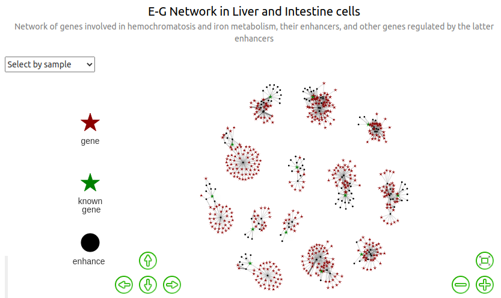
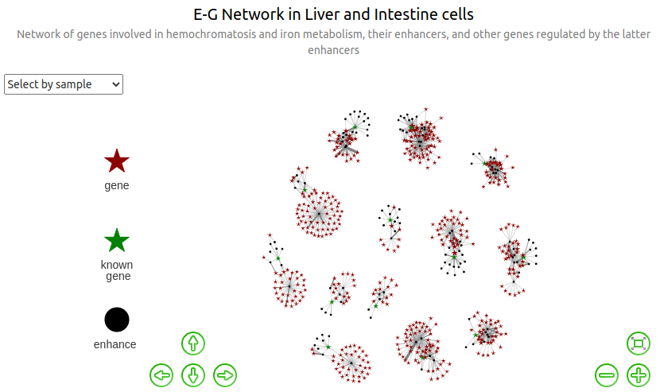
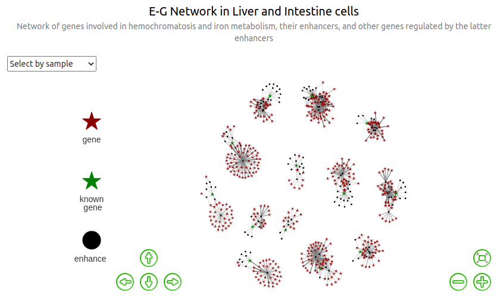
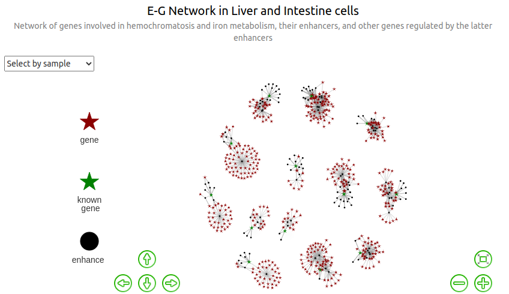

<style type="text/css">
.badCode {
background-color: #C9DDE4;
}
</style>


# Notice

The current page essentially corresponds to a markdown knitted from a Rmd document. It does not render very well because of html widgets not handled, so one should better refer to the correct rendering available here: [https://genoweb.toulouse.inra.fr/~thoellinger/2022/ABC_inferred_genes/preliminary_analysis_v9.html](https://genoweb.toulouse.inra.fr/~thoellinger/2022/ABC_inferred_genes/preliminary_analysis_v9.html)


# Libraries & Version


```{.r .badCode}
library(tidyverse)
library(visNetwork)
library(data.table)
```


```
R version 4.0.3 (2020-10-10)
Platform: x86_64-pc-linux-gnu (64-bit)
Running under: Ubuntu 20.04.1 LTS

Matrix products: default
BLAS:   /usr/lib/x86_64-linux-gnu/blas/libblas.so.3.9.0
LAPACK: /usr/lib/x86_64-linux-gnu/lapack/liblapack.so.3.9.0

locale:
 [1] LC_CTYPE=en_GB.UTF-8       LC_NUMERIC=C              
 [3] LC_TIME=en_GB.UTF-8        LC_COLLATE=en_GB.UTF-8    
 [5] LC_MONETARY=en_GB.UTF-8    LC_MESSAGES=en_GB.UTF-8   
 [7] LC_PAPER=en_GB.UTF-8       LC_NAME=C                 
 [9] LC_ADDRESS=C               LC_TELEPHONE=C            
[11] LC_MEASUREMENT=en_GB.UTF-8 LC_IDENTIFICATION=C       

attached base packages:
[1] stats     graphics  grDevices utils     datasets  methods   base     

other attached packages:
 [1] data.table_1.14.2 visNetwork_2.1.0  forcats_0.5.1     stringr_1.4.0    
 [5] dplyr_1.0.7       purrr_0.3.4       readr_2.0.2       tidyr_1.1.4      
 [9] tibble_3.1.6      ggplot2_3.3.5     tidyverse_1.3.1   knitr_1.36       

loaded via a namespace (and not attached):
 [1] tidyselect_1.1.1  xfun_0.28         bslib_0.3.1       haven_2.4.3      
 [5] colorspace_2.0-2  vctrs_0.3.8       generics_0.1.1    htmltools_0.5.2  
 [9] yaml_2.2.1        utf8_1.2.2        rlang_0.4.12      jquerylib_0.1.4  
[13] pillar_1.6.4      withr_2.4.2       glue_1.5.0        DBI_1.1.1        
[17] dbplyr_2.1.1      modelr_0.1.8      readxl_1.3.1      lifecycle_1.0.1  
[21] munsell_0.5.0     gtable_0.3.0      cellranger_1.1.0  rvest_1.0.2      
[25] htmlwidgets_1.5.4 evaluate_0.14     tzdb_0.2.0        fastmap_1.1.0    
[29] fansi_0.5.0       broom_0.7.10      Rcpp_1.0.7        backports_1.3.0  
[33] scales_1.1.1      formatR_1.11      jsonlite_1.7.2    fs_1.5.0         
[37] hms_1.1.1         digest_0.6.28     stringi_1.7.5     grid_4.0.3       
[41] cli_3.1.0         tools_4.0.3       magrittr_2.0.1    sass_0.4.0       
[45] crayon_1.4.2      pkgconfig_2.0.3   ellipsis_0.3.2    xml2_1.3.2       
[49] reprex_2.0.1      lubridate_1.8.0   rstudioapi_0.13   assertthat_0.2.1 
[53] rmarkdown_2.11    httr_1.4.2        R6_2.5.1          compiler_4.0.3   
```

# Preliminary work

Have a look https://datastorm-open.github.io/visNetwork/nodes.html for documentation on `visNetwork`.

## Data importation

All the files imported here can be found on Genotoul, in `/work2/project/regenet/results/multi/abc.model/Nasser2021`.

The full code itself is available here: `/work2/project/regenet/workspace/thoellinger/shared/automne_2021/networks_hemochromatosis/` (as `preliminary_analysis_v6.Rmd`), which is also the working directory we used. Please do not modify directly this repository as it is backed up between multiple computers on a regular basis.


```{.r .badCode}
rm(list = ls())

# wd = 'data/' wd =
# '/home/hoellinger/Documents/INSERM/shared/automne_2021/networks_hemochromatosis/data/'
wd = "/home/thoellinger/Documents/shared/automne_2021/networks_hemochromatosis/data/"
egfile = paste(wd, "Nasser2021ABCPredictions.liver_and_intestine.all_putative_enhancers.merged_enhancers.sorted.uniques_eg.bedpe",
    sep = "")
unmerged_efile = paste(wd, "list_all_enhancers.bed", sep = "")
merged_efile = paste(wd, "list_all_enhancers.merged.bed", sep = "")

############# Enhancers # The only reasons all enhancers are loaded is to
############# compute a few summary statistics.
e = as.data.frame(read.table(unmerged_efile, sep = "\t"))
me = as.data.frame(read.table(merged_efile, sep = "\t"))

############ E-G list #

eg = as.data.frame(read.table(egfile, header = T, sep = "\t"))

############### known genes #
gene_list = c("HFE", "TFR2", "HFE2", "HAMP", "SLC40A1", "BMP6", "TMPRSS6", "TFRC",
    "SLC11A2", "CYBRD1", "NEO1", "CIAPIN1", "SLC39A14")

# genes known to be causally involved in hemochromatosis: 'HFE', 'TFR2',
# 'HFE2', 'HAMP', 'SLC40A1', 'BMP6' (the other genes are involved in iron
# metabolism regulation) genes expressed in the liver: 'HFE', 'TFR2', 'HFE2',
# 'HAMP', 'SLC40A1', 'BMP6', 'TMPRSS6', 'TFRC' genes expressed in intestine:
# 'SLC40A1', 'SLC11A2', 'CYBRD1', 'NEO1', 'CIAPIN1'
```

## Data preprocessing

### New columns

We will need two more columns containing the following:


```{.r .badCode}
eg$biosamples.uniq = unlist(lapply(eg$biosamples, function(x) paste(unlist(sort(unique(strsplit(x,
    ",")[[1]]))), collapse = ",")))
eg$tissues.uniq = unlist(lapply(eg$tissues, function(x) paste(unlist(sort(unique(strsplit(x,
    ",")[[1]]))), collapse = ",")))
```

### Conversion to factors

This has to be done AFTER the creation of new columns done above:


```{.r .badCode}
to_factor_cols = c("chrom1", "chrom2", "name", "strand1", "strand2", "gene", "biosamples",
    "tissues", "biosamples.uniq", "tissues.uniq")
eg[to_factor_cols] = lapply(eg[to_factor_cols], factor)
```

## Exploration

### Summary statistics on enhancer lists


```{.r .badCode}
length(e[, 1])  # list of all enhancers
```

```
[1] 2463310
```

```{.r .badCode}
length(me[, 1])  # list of all merged enhancers (such that none of those merged enhancers are overlapping)
```

```
[1] 269254
```


Warning: we shall pay attention to the fact that among those 269,254 merged putative enhancers, 85,937 (32%)  **do not overlap any ccRE-ELS**, and only 112,356 enhancers (42%) overlap exactly one ccRE-ELS (but the latter behavior is expected because of the merging process). Contrariwise, only 25,709 of those enhancers (9%) do not overlap any ccRE (ie candidate regulatory element not necessarily with Enhancer-Like-Signature), suggesting that many of those 269,254 merged putative enhancers might not be real enhancers (ie with both high DNase and high H3K27ac signal in one or more of the ENCODE biosamples used to defined ccRE), but CTCT-only, promoters or DNase-H3K4me2 regions.

Nevertheless, we chose to use the list of 269,254 putative enhancers for consistency in our analysis when it comes to compare results when removing or adding a new biosamples / tissues (so that the list of enhancers does not change in the process). In the future, we might take some time to compare what we would have obtained otherwise.


```{.r .badCode}
e$length = abs(e$V3 - e$V2)
me$length = abs(me$V3 - me$V2)

summary(e$length)
```

```
   Min. 1st Qu.  Median    Mean 3rd Qu.    Max. 
  200.0   200.0   308.0   481.7   637.0  6991.0 
```

```{.r .badCode}
summary(me$length)
```

```
   Min. 1st Qu.  Median    Mean 3rd Qu.    Max. 
  200.0   288.0   631.0   807.8  1078.0 11616.0 
```

### E-G pairs

We extract the subsample of the E-G bedpe input list, where genes are contained in our list of genes involved either directly in hemochromatosis or in iron metabolism. In the variable name, "dist0" stands for "distance is 0 between the genes in `eg_dist0` and the list of initial genes".


```{.r .badCode}
eg_dist0 = eg[eg$gene %in% gene_list, ]
```


```{.r .badCode}
length(eg_dist0$name)
```

```
[1] 137
```

```{.r .badCode}
length(unique(eg_dist0$gene))
```

```
[1] 13
```

```{.r .badCode}
table(eg_dist0$tissues.uniq)
```

```

      intestine intestine,liver           liver 
             36              21              80 
```

### Genes

Chromosomes where the genes are located:


```
     HFE     TFR2     HFE2     HAMP  SLC40A1     BMP6  TMPRSS6     TFRC 
  "chr6"   "chr7"   "chr1"  "chr19"   "chr2"   "chr6"  "chr22"   "chr3" 
 SLC11A2   CYBRD1     NEO1  CIAPIN1 SLC39A14 
 "chr12"   "chr2"  "chr15"  "chr16"   "chr8" 
```

# Networks

Note: in all subsequent graphs, size of nodes of type "gene" (and not "known_gene", for which the size is fixed) is proportional to the number of distinct enhancers regulating them.

## Find all genes regulated by the initial enhancers

The "initial enhancers" are the enhancers involved in eg_dist0, ie all the enhancers regulating the initial genes in `gene_list`.

`genes` is the same as `gene_list` (strictly speaking, `genes` is the subset of `gene_list` for which we have data), and `enhancers` is the list of enhancers regulating those initial known genes.


```{.r .badCode}
enhancers = unique(paste(eg_dist0$chrom1, ":", eg_dist0$start1, "-", eg_dist0$end1,
    sep = ""))
genes = unique(eg_dist0$gene)
```


Now we compute the list of all genes regulated by enhancers in `eg_dist0`. Specifically, we extract, from the full E-G list `eg`, the list `eg_dist1` containing only the enhancers-genes pairs for which the gene G is regulated by any of the enhancers regulating a gene in `gene_list` ("dist1" stands for "distance is at most 1 between the genes in `eg_dist1` and the list of initial genes").


```{.r .badCode}
eg_enhancers_id = data.frame(source = paste(eg$chrom1, ":", eg$start1, "-", eg$end1,
    sep = ""), eg[, 4:22])  # same as eg but columns 1-3 have been concatenated to make unique enhancers id
eg_dist1 = eg_enhancers_id[eg_enhancers_id$source %in% paste(eg_dist0$chrom1, ":",
    eg_dist0$start1, "-", eg_dist0$end1, sep = ""), ]
eg_dist1$from = lapply(eg_dist1$source, function(x) unique(as.character(eg_dist0[paste(eg_dist0$chrom1,
    ":", eg_dist0$start1, "-", eg_dist0$end1, sep = "") == x, "gene"])))
eg_dist1$ABC.IE = left_join(data.frame(name = paste(eg_dist1$source, eg_dist1$from,
    sep = "::")), eg_enhancers_id, by = "name")$ABC.max  # max ABC score of the I-E pair (initialGene-Enhancer) corresponding to the E-G pair
genes_dist1 = unique(eg_dist1$gene)
```


`genes_dist1` is the list of genes regulated by `enhancers`.

Compute "ABC product", ie the product of the ABC scores of:
- the initial gene - enhancer pair (I-E)
- the enhancer - gene pair (E-G)


```{.r .badCode}
eg_dist1$ABC.product = eg_dist1$ABC.max * eg_dist1$ABC.IE
eg_dist1$ABC.product = eg_dist1$ABC.product/max(eg_dist1$ABC.product)
```


```{.r .badCode}
print(min(eg_dist1$ABC.product))
```

```
[1] 0.003458878
```

```{.r .badCode}
print(median(eg_dist1$ABC.product))
```

```
[1] 0.01070413
```

```{.r .badCode}
print(mean(eg_dist1$ABC.product))
```

```
[1] 0.02172209
```

```{.r .badCode}
print(quantile(eg_dist1$ABC.product, c(0.1, 0.6, 0.8, 0.9)))
```

```
        10%         60%         80%         90% 
0.004902703 0.013383311 0.027607616 0.044685971 
```

```{.r .badCode}
print(max(eg_dist1$ABC.product))
```

```
[1] 1
```


```{.r .badCode}
eg_dist1$ABC.product.label = 1
eg_dist1[eg_dist1$ABC.product >= median(eg_dist1$ABC.product), ]$ABC.product.label = 2
eg_dist1[eg_dist1$ABC.product >= quantile(eg_dist1$ABC.product, 0.9)[[1]], ]$ABC.product.label = 3
```


```{.r .badCode}
table(eg_dist1$ABC.product.label)
```

```

  1   2   3 
673 539 135 
```


In the following cell we create `genes_dist1.more` which is in a well-suited format for further "concatenation" with inferences made with other type of data (CHiC or QTL -based).


```{.r .badCode}
genes_dist1.more = eg_dist1 %>%
    group_by(gene) %>%
    mutate(ABC.sources = paste0(source, collapse = ",")) %>%
    mutate(ABC.count = length(str_split(ABC.sources, ",")[[1]])) %>%
    group_by(gene) %>%
    slice(which.max(ABC.product.label)) %>%
    # slice_max(ABC.product.label) %>%
select(gene, ABC.sources, ABC.product.label, ABC.count, from)
genes_dist1.more = subset(genes_dist1.more, !(genes_dist1.more$gene %in% genes))
genes_dist1.more$from = as.character(genes_dist1.more$from)
genes_dist1.more
```

```
# A tibble: 444 × 5
# Groups:   gene [444]
   gene     ABC.sources                        ABC.product.lab… ABC.count from  
   <fct>    <chr>                                         <dbl>     <int> <chr> 
 1 AAAS     chr12:53318068-53321694                           1         1 SLC11…
 2 ABT1     chr6:24719303-24722493                            1         1 HFE   
 3 ACOT13   chr6:24719303-24722493,chr6:25991…                3         2 HFE   
 4 ACTL6B   chr7:100166895-100168233,chr7:100…                2         2 TFR2  
 5 ACVR1B   chr12:53318068-53321694                           2         1 SLC11…
 6 ACVRL1   chr12:53318068-53321694                           2         1 SLC11…
 7 ADAM28   chr8:22417293-22420339                            2         1 SLC39…
 8 ADAMDEC1 chr8:22417293-22420339                            2         1 SLC39…
 9 ADGRG1   chr16:56639960-56645831,chr16:573…                3         7 CIAPI…
10 ADGRG3   chr16:56639960-56645831,chr16:573…                2         4 CIAPI…
# … with 434 more rows
```


We re-arrange `eg_dist1` as an edge list `edges_list_dist1`, which will be more suitable to later construct the edges list for visualization as a graph.


```{.r .badCode}
edges_list_dist1 = data.frame(source = eg_dist1$source, target = eg_dist1$gene, ABC.mean.x100 = floor(100 *
    eg_dist1$ABC.mean), ABC.max.x100 = floor(100 * eg_dist1$ABC.max), tissues = eg_dist1$tissues.uniq,
    distance_kb = floor(eg_dist1$original_distance.mean/1000), inv_dist = 1/(eg_dist1$original_distance.mean +
        1), rescaled_log_inv_dist = 1 - min(log(1/(eg_dist1$original_distance.mean +
        1))) + log(1/(eg_dist1$original_distance.mean + 1)))
edges_list_dist1
```


Below we compute the list of (colored) nodes required to compute our graphs, a node corresponding either to an enhancer or a gene. To that purpose, we need first to construct 2 tables:
- `gname.tissue` contains, for each unique gene involved in `eg_dist1`, the comma-separated list of tissues in which it appears in `eg_dist1`
- `enhancer.tissue` contains, for each unique enhancer involved in `eg_dist1`, the comma-separated list of tissues in which it appears in `eg_dist1`

For more details on the `Reduce` function and its application to our case, see for instance: https://stackoverflow.com/questions/60592775/how-to-apply-reduce-to-groups-based-on-columns-of-a-data-frame


```{.r .badCode}
gname.tissue = unique(eg_dist1[c("gene", "tissues.uniq")])
gname.tissue$tissues.uniq = as.character(gname.tissue$tissues.uniq)
gname.tissue = gname.tissue %>%
    group_by(gene) %>%
    mutate(tissues = Reduce(function(x, y) {
        paste(unlist(sort(unique(c(strsplit(x, ",")[[1]], strsplit(y, ",")[[1]])))),
            collapse = ",")
    }, tissues.uniq))
gname.tissue = unique(gname.tissue[c(1, 3)])

enhancer.tissue = unique(eg_dist1[c("source", "tissues.uniq")])
enhancer.tissue$tissues.uniq = as.character(enhancer.tissue$tissues.uniq)
enhancer.tissue = enhancer.tissue %>%
    group_by(source) %>%
    mutate(tissues = Reduce(function(x, y) {
        paste(unlist(sort(unique(c(strsplit(x, ",")[[1]], strsplit(y, ",")[[1]])))),
            collapse = ",")
    }, tissues.uniq))
enhancer.tissue = unique(enhancer.tissue[c(1, 3)])

gname.tissue
```

```
# A tibble: 457 × 2
# Groups:   gene [457]
   gene         tissues        
   <fct>        <chr>          
 1 PDE4DIP      intestine,liver
 2 LOC100996724 intestine,liver
 3 SEC22B       intestine,liver
 4 NOTCH2NL     intestine,liver
 5 NBPF10       intestine,liver
 6 LINC01719    intestine,liver
 7 HFE2         liver          
 8 TXNIP        intestine,liver
 9 POLR3GL      intestine,liver
10 ANKRD34A     intestine,liver
# … with 447 more rows
```

```{.r .badCode}
enhancer.tissue
```

```
# A tibble: 137 × 2
# Groups:   source [137]
   source                   tissues        
   <chr>                    <chr>          
 1 chr1:144930398-144933456 intestine,liver
 2 chr1:145394876-145400153 intestine,liver
 3 chr1:145413923-145415673 liver          
 4 chr1:145421224-145422239 liver          
 5 chr1:145426950-145428636 intestine,liver
 6 chr1:145434950-145435719 intestine,liver
 7 chr1:145442141-145445254 intestine,liver
 8 chr1:145451402-145451862 liver          
 9 chr1:145454003-145457954 intestine,liver
10 chr1:145473958-145474912 intestine,liver
# … with 127 more rows
```

So now we can compute the list `nodes_dist1` of (colored) nodes required for our graphs. There are 3 types of nodes: `enhancer`, `known_gene` and (unknown) `gene`.


```{.r .badCode}
nodes_dist1 = full_join(data.frame(label = enhancer.tissue$source, sample = enhancer.tissue$tissues,
    group = "enhancer"), data.frame(label = gname.tissue$gene, sample = gname.tissue$tissues,
    group = "gene")) %>%
    rowid_to_column("id")
nodes_dist1[nodes_dist1$label %in% genes, ]$group = "known_gene"
```


```{.r .badCode}
table(nodes_dist1$sample)
```

```

      intestine intestine,liver           liver 
            135             290             169 
```

```{.r .badCode}
table(nodes_dist1$group)
```

```

  enhancer       gene known_gene 
       137        444         13 
```

In the list of edges of the graph, `edges_dist1`, the `sample` column indicates in which family of tissues (liver, intestine or both) each E-G pair has been found.


```{.r .badCode}
table(edges_dist1$sample)
```

```

      intestine intestine,liver           liver 
            420             321             606 
```

We see that 1221 unique E-G pairs found, 46% are specific to liver, 29% are specific to intestine and 24% are shared between intestine and liver.

We add to `nodes_dist1` a column `d_in` for plotting purpose: it contains 1 for each node of type `enhancer`, the number of incoming enhancers for each node of type `gene`, and the max of the latter for each node of type `known_gene`.


## Edge weight based on ABC score

### ABC.mean

In this graph, the weights of the edges are proportional to the corresponding mean ABC scores (averaged over all the instances of the E-G pairs found in the different biosamples. Not that, for a given biosample, the "ABC.score" column contains ABC scores that have already been averaged once when merging the enhancers).

[](https://genoweb.toulouse.inra.fr/~thoellinger/2022/ABC_inferred_genes/preliminary_analysis_v9.html#321_ABCmean)


> We see that none of the genes connected through enhancers to different genes among the initial list of 13 genes ; are connected to more than 1 of them ; ie we still have 13 connected compounds. Yet, most of the initial genes are on different chromosomes, so this is a completely expected behavior.
> 
> Also note that one may observe that when selecting a sample, all edges connected to enhancers included in the selected groups are colored (ie are in darker grey than the others), and not all edges connected to genes included in the selected group. The actual reason is that the graph is considered as an oriented graph, resulting in a distinction between entering and outgoing edges. Namely, for each selected nodes, all outgoing edges are colored ; whereas regarding entering edges, only those coming from another selected nodes are colored. In our case, all edges connected to any enhancer are considered as outgoing edges, and all edges connected to any gene are considered as entering edges ; which explains what we observe. Unfortunately there is nothing we can do with the `visNetwork` package to change this behavior.

### ABC.max

In this graph, the weights of the edges are proportional to the corresponding max ABC scores (over all the instances of the E-G pairs found in the different biosamples. Not that, for a given biosample, the "ABC.score" column contains ABC scores that have already been averaged once when merging the enhancers).

[](https://genoweb.toulouse.inra.fr/~thoellinger/2022/ABC_inferred_genes/preliminary_analysis_v9.html#322_ABCmax)


## Edge weight based on distance

Width proportional to mean distanc. For each enhancer-gene pair $E$-$G$, the distance indicated in the `eg` dataframe as `original_distance.mean` is the average distance $E_b$-$G$ over the biosamples $b$ (in base pairs), where $E_b$ is the original enhancer in biosample $b$ which has been replaced by its overlapping merged enhancer $E$. Here, `distance_kb` is the very same quantity but expressed in `kb`.


[](https://genoweb.toulouse.inra.fr/~thoellinger/2022/ABC_inferred_genes/preliminary_analysis_v9.html#33_Edge_weight_based_on_distance)

Width proportional to inverse distance:


[](https://genoweb.toulouse.inra.fr/~thoellinger/2022/ABC_inferred_genes/preliminary_analysis_v9.html#33_Edge_weight_based_on_distance)


Width proportional to rescaled and translated log inverse distance:


[](https://genoweb.toulouse.inra.fr/~thoellinger/2022/ABC_inferred_genes/preliminary_analysis_v9.html#33_Edge_weight_based_on_distance)

# Results

The list of the initial genes + all genes regulated by enhancers regulating the 13 initial genes, can be found here: `/work2/project/regenet/workspace/thoellinger/shared/2022/networks_hemochromatosis/results/new_genes_v7.list`.


```{.r .badCode}
write.table(genes_dist1, file = "results/new_genes_v7.list", quote = FALSE, sep = "\t",
    row.names = F, col.names = F)
```

The list all genes regulated by enhancers regulating the 13 initial genes, with useful info, can be found here: `/work2/project/regenet/workspace/thoellinger/shared/2022/networks_hemochromatosis/results/new_genes_abc_v9_more_info.list`.


```{.r .badCode}
write.table(genes_dist1.more, file = "results/new_genes_abc_v9_more_info.list", quote = FALSE,
    sep = "\t", row.names = F, col.names = T)
```


For each one of the 13 initial genes, the list of genes regulated by enhancers regulating that initial gene, can be found here:


```{.r .badCode}
for (gene in genes) {
    current_gene_dist1 = unique(eg_dist1[eg_dist1$from == gene, "gene"])
    write.table(current_gene_dist1, file = paste("results/separate/", gene, ".list",
        sep = ""), quote = FALSE, sep = "\t", row.names = F, col.names = F)
}
```


The list of the enhancers regulating the 13 initial genes, can be found here: `/work2/project/regenet/workspace/thoellinger/shared/2022/networks_hemochromatosis/results/enhancers.list`


```{.r .badCode}
write.table(enhancers, file = "results/enhancers.list", quote = FALSE, sep = "\t",
    row.names = F, col.names = F)
```

The list of E-G pairs involving the 13 initial genes, can be found here: `/work2/project/regenet/workspace/thoellinger/shared/2022/networks_hemochromatosis/results/eg_dist0.bedpe`


```{.r .badCode}
write.table(eg_dist0, file = "results/eg_dist0.bedpe", quote = FALSE, sep = "\t",
    row.names = F, col.names = F)
```

The list of the enhancers regulating the 457 initial+new genes, can be found here: `/work2/project/regenet/workspace/thoellinger/shared/2022/networks_hemochromatosis/results/enhancers.new_genes.list`


```{.r .badCode}
eg_dist2 = eg[eg$gene %in% genes_dist1, ]
enhancers.new_genes = unique(paste(eg_dist2$chrom1, ":", eg_dist2$start1, "-", eg_dist2$end1,
    sep = ""))
write.table(enhancers.new_genes, file = "results/enhancers.new_genes.list", quote = FALSE,
    sep = "\t", row.names = F, col.names = F)
```

The list of E-G pairs involving the 457 initial+new genes, can be found here: `/work2/project/regenet/workspace/thoellinger/shared/2022/networks_hemochromatosis/results/eg_dist2.bedpe`


```{.r .badCode}
write.table(eg_dist2, file = "results/eg_dist2.bedpe", quote = FALSE, sep = "\t",
    row.names = F, col.names = F)
```

# Appendix

## Tables

### Table of the initial ABC-predicted E-G pairs involving the initial genes


```{.r .badCode}
options(max.print = 1000)
eg_dist0
```

```
      chrom1    start1      end1 chrom2    start2      end2
7686    chr1 144930398 144933456   chr1 145413190 145413190
7781    chr1 145394876 145400153   chr1 145413190 145413190
7797    chr1 145413923 145415673   chr1 145413190 145413190
7798    chr1 145421224 145422239   chr1 145413190 145413190
7799    chr1 145426950 145428636   chr1 145413190 145413190
7801    chr1 145434950 145435719   chr1 145413190 145413190
7815    chr1 145442141 145445254   chr1 145413190 145413190
7831    chr1 145451402 145451862   chr1 145413190 145413190
7846    chr1 145454003 145457954   chr1 145413190 145413190
7867    chr1 145473958 145474912   chr1 145413190 145413190
7894    chr1 145541765 145543880   chr1 145413190 145413190
30929  chr12  51158462  51159633  chr12  51420199  51420199
30935  chr12  51326262  51329574  chr12  51420199  51420199
30939  chr12  51417885  51419543  chr12  51420199  51420199
30946  chr12  51421716  51423284  chr12  51420199  51420199
31061  chr12  53318068  53321694  chr12  51420199  51420199
46386  chr15  73074997  73077510  chr15  73344824  73344824
46391  chr15  73320830  73321661  chr15  73344824  73344824
46392  chr15  73326079  73327042  chr15  73344824  73344824
46393  chr15  73345478  73345779  chr15  73344824  73344824
46394  chr15  73346002  73346202  chr15  73344824  73344824
46395  chr15  73346837  73347246  chr15  73344824  73344824
46398  chr15  73401919  73403010  chr15  73344824  73344824
46488  chr15  74906565  74909246  chr15  73344824  73344824
51946  chr16  56639960  56645831  chr16  57481440  57481440
52046  chr16  57298869  57301500  chr16  57481440  57481440
52075  chr16  57302558  57303592  chr16  57481440  57481440
52123  chr16  57333210  57335328  chr16  57481440  57481440
52149  chr16  57337937  57338465  chr16  57481440  57481440
52156  chr16  57417430  57418771  chr16  57481440  57481440
52160  chr16  57451676  57452165  chr16  57481440  57481440
52164  chr16  57452493  57453437  chr16  57481440  57481440
52166  chr16  57466172  57466712  chr16  57481440  57481440
52168  chr16  57477983  57478427  chr16  57481440  57481440
52171  chr16  57504477  57506928  chr16  57481440  57481440
52177  chr16  57512427  57514785  chr16  57481440  57481440
52193  chr16  57553700  57554263  chr16  57481440  57481440
52215  chr16  57653300  57655255  chr16  57481440  57481440
52238  chr16  57669027  57670023  chr16  57481440  57481440
52283  chr16  57830970  57833098  chr16  57481440  57481440
52345  chr16  57925806  57928939  chr16  57481440  57481440
68172  chr19  35757791  35760841  chr19  35773248  35773248
68173  chr19  35768288  35769137  chr19  35773248  35773248
68174  chr19  35769477  35770158  chr19  35773248  35773248
68175  chr19  35770384  35772541  chr19  35773248  35773248
                                  name strand1 strand2    gene
7686    chr1:144930398-144933456::HFE2       .       .    HFE2
7781    chr1:145394876-145400153::HFE2       .       .    HFE2
7797    chr1:145413923-145415673::HFE2       .       .    HFE2
7798    chr1:145421224-145422239::HFE2       .       .    HFE2
7799    chr1:145426950-145428636::HFE2       .       .    HFE2
7801    chr1:145434950-145435719::HFE2       .       .    HFE2
7815    chr1:145442141-145445254::HFE2       .       .    HFE2
7831    chr1:145451402-145451862::HFE2       .       .    HFE2
7846    chr1:145454003-145457954::HFE2       .       .    HFE2
7867    chr1:145473958-145474912::HFE2       .       .    HFE2
7894    chr1:145541765-145543880::HFE2       .       .    HFE2
30929 chr12:51158462-51159633::SLC11A2       .       . SLC11A2
30935 chr12:51326262-51329574::SLC11A2       .       . SLC11A2
30939 chr12:51417885-51419543::SLC11A2       .       . SLC11A2
30946 chr12:51421716-51423284::SLC11A2       .       . SLC11A2
31061 chr12:53318068-53321694::SLC11A2       .       . SLC11A2
46386    chr15:73074997-73077510::NEO1       .       .    NEO1
46391    chr15:73320830-73321661::NEO1       .       .    NEO1
46392    chr15:73326079-73327042::NEO1       .       .    NEO1
46393    chr15:73345478-73345779::NEO1       .       .    NEO1
46394    chr15:73346002-73346202::NEO1       .       .    NEO1
46395    chr15:73346837-73347246::NEO1       .       .    NEO1
46398    chr15:73401919-73403010::NEO1       .       .    NEO1
46488    chr15:74906565-74909246::NEO1       .       .    NEO1
51946 chr16:56639960-56645831::CIAPIN1       .       . CIAPIN1
52046 chr16:57298869-57301500::CIAPIN1       .       . CIAPIN1
52075 chr16:57302558-57303592::CIAPIN1       .       . CIAPIN1
52123 chr16:57333210-57335328::CIAPIN1       .       . CIAPIN1
52149 chr16:57337937-57338465::CIAPIN1       .       . CIAPIN1
52156 chr16:57417430-57418771::CIAPIN1       .       . CIAPIN1
52160 chr16:57451676-57452165::CIAPIN1       .       . CIAPIN1
52164 chr16:57452493-57453437::CIAPIN1       .       . CIAPIN1
52166 chr16:57466172-57466712::CIAPIN1       .       . CIAPIN1
52168 chr16:57477983-57478427::CIAPIN1       .       . CIAPIN1
52171 chr16:57504477-57506928::CIAPIN1       .       . CIAPIN1
52177 chr16:57512427-57514785::CIAPIN1       .       . CIAPIN1
52193 chr16:57553700-57554263::CIAPIN1       .       . CIAPIN1
52215 chr16:57653300-57655255::CIAPIN1       .       . CIAPIN1
52238 chr16:57669027-57670023::CIAPIN1       .       . CIAPIN1
52283 chr16:57830970-57833098::CIAPIN1       .       . CIAPIN1
52345 chr16:57925806-57928939::CIAPIN1       .       . CIAPIN1
68172    chr19:35757791-35760841::HAMP       .       .    HAMP
68173    chr19:35768288-35769137::HAMP       .       .    HAMP
68174    chr19:35769477-35770158::HAMP       .       .    HAMP
68175    chr19:35770384-35772541::HAMP       .       .    HAMP
                                                       ABC.scores
7686                                 0.028761000000000002,0.02026
7781                                                     0.044185
7797                                                     0.062645
7798                                                     0.015668
7799                                                      0.02574
7801                    0.028239999999999998,0.015686000000000002
7815                                                     0.062419
7831                                         0.021353999999999998
7846                               0.028807999999999997,0.0489073
7867                                            0.039256,0.021347
7894                                             0.045182,0.01541
30929                                                    0.018211
30935                               0.015196000000000001,0.022472
30939  0.05407000000000001,0.055278999999999995,0.065178,0.062988
30946                                           0.138303,0.145403
31061                                        0.018961000000000002
46386                                                    0.024743
46391                                         0.05282100000000001
46392                                                    0.042369
46393                                        0.022713999999999998
46394                                        0.015252000000000002
46395                                            0.02547,0.029026
46398                                           0.020356,0.027807
46488                                                     0.01845
51946                                                    0.018703
52046                                                   0.0205155
52075                                0.030206999999999998,0.03244
52123  0.052578,0.088226,0.024952000000000002,0.06717999999999999
52149                                                    0.018795
52156                                                      0.0161
52160                                        0.020324000000000002
52164                                        0.015609999999999999
52166                                           0.016451,0.015881
52168                                                    0.034379
52171   0.016694,0.0385055,0.021072999999999998,0.022296,0.024221
52177 0.025434000000000002,0.031333,0.024978999999999998,0.022293
52193                                                    0.016816
52215                                           0.017281,0.024939
52238                               0.017934000000000002,0.017163
52283                                                    0.017979
52345                   0.017008000000000002,0.015305000000000001
68172                                        0.020316999999999998
68173                                                    0.017357
68174                                        0.015806999999999998
68175                                   0.06381,0.023445,0.065302
                                                                                                    biosamples
7686                                                                            liver-ENCODE,hepatocyte-ENCODE
7781                                                                                              liver-ENCODE
7797                                                                                         hepatocyte-ENCODE
7798                                                                                         hepatocyte-ENCODE
7799                                                                                              liver-ENCODE
7801                                                                            liver-ENCODE,hepatocyte-ENCODE
7815                                                                                              liver-ENCODE
7831                                                                                              liver-ENCODE
7846                                                                            hepatocyte-ENCODE,liver-ENCODE
7867                                                                            hepatocyte-ENCODE,liver-ENCODE
7894                                                                            hepatocyte-ENCODE,liver-ENCODE
30929                                                                                        hepatocyte-ENCODE
30935                                                                               liver-ENCODE,HepG2-Roadmap
30939                               small_intestine_fetal-Roadmap,HepG2-Roadmap,hepatocyte-ENCODE,liver-ENCODE
30946                                              small_intestine_fetal-Roadmap,large_intestine_fetal-Roadmap
31061                                                                            large_intestine_fetal-Roadmap
46386                                                                                        hepatocyte-ENCODE
46391                                                                            large_intestine_fetal-Roadmap
46392                                                                            large_intestine_fetal-Roadmap
46393                                                                                            HepG2-Roadmap
46394                                                                            small_intestine_fetal-Roadmap
46395                                              large_intestine_fetal-Roadmap,small_intestine_fetal-Roadmap
46398                                              small_intestine_fetal-Roadmap,large_intestine_fetal-Roadmap
46488                                                                                        hepatocyte-ENCODE
51946                                                                                             liver-ENCODE
52046                                                                            small_intestine_fetal-Roadmap
52075                                              large_intestine_fetal-Roadmap,small_intestine_fetal-Roadmap
52123                   liver-ENCODE,large_intestine_fetal-Roadmap,HepG2-Roadmap,small_intestine_fetal-Roadmap
52149                                                                                             liver-ENCODE
52156                                                                            large_intestine_fetal-Roadmap
52160                                                                                             liver-ENCODE
52164                                                                                             liver-ENCODE
52166                                              large_intestine_fetal-Roadmap,small_intestine_fetal-Roadmap
52168                                                                                        hepatocyte-ENCODE
52171 small_intestine_fetal-Roadmap,hepatocyte-ENCODE,large_intestine_fetal-Roadmap,liver-ENCODE,HepG2-Roadmap
52177              small_intestine_fetal-Roadmap,hepatocyte-ENCODE,HepG2-Roadmap,large_intestine_fetal-Roadmap
52193                                                                                        hepatocyte-ENCODE
52215                                              small_intestine_fetal-Roadmap,large_intestine_fetal-Roadmap
52238                                              large_intestine_fetal-Roadmap,small_intestine_fetal-Roadmap
52283                                                                                             liver-ENCODE
52345                                                                               HepG2-Roadmap,liver-ENCODE
68172                                                                                             liver-ENCODE
68173                                                                                        hepatocyte-ENCODE
68174                                                                                            HepG2-Roadmap
68175                                                             HepG2-Roadmap,liver-ENCODE,hepatocyte-ENCODE
                           original_distances
7686                        481207.0,480853.0
7781                                  15386.0
7797                                   1252.0
7798                                   8577.0
7799                                  14427.0
7801                          22160.0,22318.0
7815                                  30687.0
7831                                  38465.5
7846                          44235.5,44088.0
7867                          61135.0,61186.0
7894                        129732.5,129661.0
30929                                261301.5
30935                         91637.0,92887.0
30939             1340.5,1461.0,1895.5,1741.0
30946                           2216.0,2198.0
31061                               1900020.0
46386                                267544.0
46391                                 23578.5
46392                                 18400.5
46393                                   855.0
46394                                  1278.0
46395                           2205.0,2198.0
46398                         57556.0,57790.0
46488                               1563131.0
51946                                840504.5
52046                                181096.0
52075                       178475.5,178416.5
52123     147262.0,147349.0,147375.0,147212.0
52149                                143184.5
52156                                 63738.0
52160                                 29562.0
52164                                 28344.5
52166                         14998.0,14968.0
52168                                  3235.0
52171 24545.0,24996.5,24548.0,23673.5,24795.5
52177         32869.0,32909.0,32686.5,32869.0
52193                                 72489.5
52215                       172594.5,172494.0
52238                       188158.5,188051.0
52283                                350469.5
52345                       446763.0,446265.0
68172                                 14913.0
68173                                  4328.0
68174                                  3303.0
68175                    2157.0,1050.0,1856.5
                                    tissues   ABC.mean   ABC.min   ABC.max
7686                            liver,liver 0.02451050 0.0202600 0.0287610
7781                                  liver 0.04418500 0.0441850 0.0441850
7797                                  liver 0.06264500 0.0626450 0.0626450
7798                                  liver 0.01566800 0.0156680 0.0156680
7799                                  liver 0.02574000 0.0257400 0.0257400
7801                            liver,liver 0.02196300 0.0156860 0.0282400
7815                                  liver 0.06241900 0.0624190 0.0624190
7831                                  liver 0.02135400 0.0213540 0.0213540
7846                            liver,liver 0.03885765 0.0288080 0.0489073
7867                            liver,liver 0.03030150 0.0213470 0.0392560
7894                            liver,liver 0.03029600 0.0154100 0.0451820
30929                                 liver 0.01821100 0.0182110 0.0182110
30935                           liver,liver 0.01883400 0.0151960 0.0224720
30939           intestine,liver,liver,liver 0.05937875 0.0540700 0.0651780
30946                   intestine,intestine 0.14185300 0.1383030 0.1454030
31061                             intestine 0.01896100 0.0189610 0.0189610
46386                                 liver 0.02474300 0.0247430 0.0247430
46391                             intestine 0.05282100 0.0528210 0.0528210
46392                             intestine 0.04236900 0.0423690 0.0423690
46393                                 liver 0.02271400 0.0227140 0.0227140
46394                             intestine 0.01525200 0.0152520 0.0152520
46395                   intestine,intestine 0.02724800 0.0254700 0.0290260
46398                   intestine,intestine 0.02408150 0.0203560 0.0278070
46488                                 liver 0.01845000 0.0184500 0.0184500
51946                                 liver 0.01870300 0.0187030 0.0187030
52046                             intestine 0.02051550 0.0205155 0.0205155
52075                   intestine,intestine 0.03132350 0.0302070 0.0324400
52123       liver,intestine,liver,intestine 0.05823400 0.0249520 0.0882260
52149                                 liver 0.01879500 0.0187950 0.0187950
52156                             intestine 0.01610000 0.0161000 0.0161000
52160                                 liver 0.02032400 0.0203240 0.0203240
52164                                 liver 0.01561000 0.0156100 0.0156100
52166                   intestine,intestine 0.01616600 0.0158810 0.0164510
52168                                 liver 0.03437900 0.0343790 0.0343790
52171 intestine,liver,intestine,liver,liver 0.02455790 0.0166940 0.0385055
52177       intestine,liver,liver,intestine 0.02600975 0.0222930 0.0313330
52193                                 liver 0.01681600 0.0168160 0.0168160
52215                   intestine,intestine 0.02111000 0.0172810 0.0249390
52238                   intestine,intestine 0.01754850 0.0171630 0.0179340
52283                                 liver 0.01797900 0.0179790 0.0179790
52345                           liver,liver 0.01615650 0.0153050 0.0170080
68172                                 liver 0.02031700 0.0203170 0.0203170
68173                                 liver 0.01735700 0.0173570 0.0173570
68174                                 liver 0.01580700 0.0158070 0.0158070
68175                     liver,liver,liver 0.05085233 0.0234450 0.0653020
      original_distance.mean original_distance.min original_distance.max
7686              481030.000              480853.0              481207.0
7781               15386.000               15386.0               15386.0
7797                1252.000                1252.0                1252.0
7798                8577.000                8577.0                8577.0
7799               14427.000               14427.0               14427.0
7801               22239.000               22160.0               22318.0
7815               30687.000               30687.0               30687.0
7831               38465.500               38465.5               38465.5
7846               44161.750               44088.0               44235.5
7867               61160.500               61135.0               61186.0
7894              129696.750              129661.0              129732.5
30929             261301.500              261301.5              261301.5
30935              92262.000               91637.0               92887.0
30939               1609.500                1340.5                1895.5
30946               2207.000                2198.0                2216.0
31061            1900020.000             1900020.0             1900020.0
46386             267544.000              267544.0              267544.0
46391              23578.500               23578.5               23578.5
46392              18400.500               18400.5               18400.5
46393                855.000                 855.0                 855.0
46394               1278.000                1278.0                1278.0
46395               2201.500                2198.0                2205.0
46398              57673.000               57556.0               57790.0
46488            1563131.000             1563131.0             1563131.0
51946             840504.500              840504.5              840504.5
52046             181096.000              181096.0              181096.0
52075             178446.000              178416.5              178475.5
52123             147299.500              147212.0              147375.0
52149             143184.500              143184.5              143184.5
52156              63738.000               63738.0               63738.0
52160              29562.000               29562.0               29562.0
52164              28344.500               28344.5               28344.5
52166              14983.000               14968.0               14998.0
52168               3235.000                3235.0                3235.0
52171              24511.700               23673.5               24996.5
52177              32833.375               32686.5               32909.0
52193              72489.500               72489.5               72489.5
52215             172544.250              172494.0              172594.5
52238             188104.750              188051.0              188158.5
52283             350469.500              350469.5              350469.5
52345             446514.000              446265.0              446763.0
68172              14913.000               14913.0               14913.0
68173               4328.000                4328.0                4328.0
68174               3303.000                3303.0                3303.0
68175               1687.833                1050.0                2157.0
                                                                                               biosamples.uniq
7686                                                                            hepatocyte-ENCODE,liver-ENCODE
7781                                                                                              liver-ENCODE
7797                                                                                         hepatocyte-ENCODE
7798                                                                                         hepatocyte-ENCODE
7799                                                                                              liver-ENCODE
7801                                                                            hepatocyte-ENCODE,liver-ENCODE
7815                                                                                              liver-ENCODE
7831                                                                                              liver-ENCODE
7846                                                                            hepatocyte-ENCODE,liver-ENCODE
7867                                                                            hepatocyte-ENCODE,liver-ENCODE
7894                                                                            hepatocyte-ENCODE,liver-ENCODE
30929                                                                                        hepatocyte-ENCODE
30935                                                                               HepG2-Roadmap,liver-ENCODE
30939                               hepatocyte-ENCODE,HepG2-Roadmap,liver-ENCODE,small_intestine_fetal-Roadmap
30946                                              large_intestine_fetal-Roadmap,small_intestine_fetal-Roadmap
31061                                                                            large_intestine_fetal-Roadmap
46386                                                                                        hepatocyte-ENCODE
46391                                                                            large_intestine_fetal-Roadmap
46392                                                                            large_intestine_fetal-Roadmap
46393                                                                                            HepG2-Roadmap
46394                                                                            small_intestine_fetal-Roadmap
46395                                              large_intestine_fetal-Roadmap,small_intestine_fetal-Roadmap
46398                                              large_intestine_fetal-Roadmap,small_intestine_fetal-Roadmap
46488                                                                                        hepatocyte-ENCODE
51946                                                                                             liver-ENCODE
52046                                                                            small_intestine_fetal-Roadmap
52075                                              large_intestine_fetal-Roadmap,small_intestine_fetal-Roadmap
52123                   HepG2-Roadmap,large_intestine_fetal-Roadmap,liver-ENCODE,small_intestine_fetal-Roadmap
52149                                                                                             liver-ENCODE
52156                                                                            large_intestine_fetal-Roadmap
52160                                                                                             liver-ENCODE
52164                                                                                             liver-ENCODE
52166                                              large_intestine_fetal-Roadmap,small_intestine_fetal-Roadmap
52168                                                                                        hepatocyte-ENCODE
52171 hepatocyte-ENCODE,HepG2-Roadmap,large_intestine_fetal-Roadmap,liver-ENCODE,small_intestine_fetal-Roadmap
52177              hepatocyte-ENCODE,HepG2-Roadmap,large_intestine_fetal-Roadmap,small_intestine_fetal-Roadmap
52193                                                                                        hepatocyte-ENCODE
52215                                              large_intestine_fetal-Roadmap,small_intestine_fetal-Roadmap
52238                                              large_intestine_fetal-Roadmap,small_intestine_fetal-Roadmap
52283                                                                                             liver-ENCODE
52345                                                                               HepG2-Roadmap,liver-ENCODE
68172                                                                                             liver-ENCODE
68173                                                                                        hepatocyte-ENCODE
68174                                                                                            HepG2-Roadmap
68175                                                             hepatocyte-ENCODE,HepG2-Roadmap,liver-ENCODE
         tissues.uniq
7686            liver
7781            liver
7797            liver
7798            liver
7799            liver
7801            liver
7815            liver
7831            liver
7846            liver
7867            liver
7894            liver
30929           liver
30935           liver
30939 intestine,liver
30946       intestine
31061       intestine
46386           liver
46391       intestine
46392       intestine
46393           liver
46394       intestine
46395       intestine
46398       intestine
46488           liver
51946           liver
52046       intestine
52075       intestine
52123 intestine,liver
52149           liver
52156       intestine
52160           liver
52164           liver
52166       intestine
52168           liver
52171 intestine,liver
52177 intestine,liver
52193           liver
52215       intestine
52238       intestine
52283           liver
52345           liver
68172           liver
68173           liver
68174           liver
68175           liver
 [ reached 'max' / getOption("max.print") -- omitted 92 rows ]
```

```{.r .badCode}
options(max.print = 75)
```


### List of the infered new genes


```{.r .badCode}
options(max.print = 1000)
genes_dist1
```

```
  [1] PDE4DIP         LOC100996724    SEC22B          NOTCH2NL       
  [5] NBPF10          LINC01719       HFE2            TXNIP          
  [9] POLR3GL         ANKRD34A        LIX1L           RBM8A          
 [13] GNRHR2          PEX11B          ANKRD35         PIAS3          
 [17] NUDT17          RNF115          POLR3C          PDZK1          
 [21] GPR89A          PRKAB2          PDIA3P1         FMO5           
 [25] CHD1L           ITGA10          BCL9            DIP2B          
 [29] ATF1            METTL7A         SLC11A2         TMPRSS12       
 [33] LETMD1          CSRNP2          TFCP2           POU6F1         
 [37] DAZAP2          SMAGP           BIN2            GALNT6         
 [41] SLC4A8          ANKRD33         ACVRL1          ACVR1B         
 [45] GRASP           NR4A1           ATG101          KRT80          
 [49] KRT7            KRT18           KRT8            EIF4B          
 [53] TNS2            LOC283335       SPRYD3          IGFBP6         
 [57] SOAT2           CSAD            ZNF740          ITGB7          
 [61] RARG            MFSD5           ESPL1           PFDN5          
 [65] C12orf10        AAAS            AMHR2           PRR13          
 [69] PCBP2           MAP3K12         TARBP2          ATF7           
 [73] ATP5G2          CALCOCO1        CISTR           HOXC10         
 [77] HOXC-AS3        HOXC-AS1        HOXC9           HOXC8          
 [81] HOXC4           HOXC6           HOXC5           LOC100240735   
 [85] SMUG1           CBX5            HNRNPA1         HNRNPA1P10     
 [89] NFE2            COPZ1           LOC102724050    ITGA5          
 [93] NCKAP1L         PDE1B           PPP1R1A         HIGD2B         
 [97] BBS4            ADPGK-AS1       ADPGK           NEO1           
[101] NPTN            CD276           LOXL1           LOXL1-AS1      
[105] STOML1          PML             ISLR            STRA6          
[109] CCDC33          SEMA7A          UBL7            UBL7-AS1       
[113] ARID3B          EDC3            CYP1A1          CSK            
[117] ULK3            SCAMP2          MPI             FAM219B        
[121] COX5A           RPP25           SCAMP5          PPCDC          
[125] C15orf39        COMMD4          NEIL1           MAN2C1         
[129] PTPN9           CSPG4           ODF3L1          UBE2Q2         
[133] FBXO22          TMEM266         CRNDE           IRX5           
[137] MMP2            LPCAT2          CES1            LOC283856      
[141] GNAO1           DKFZP434H168    AMFR            NUDT21         
[145] OGFOD1          BBS2            MT2A            MT1L           
[149] MT1E            MT1M            MT1A            MT1DP          
[153] MT1B            MT1F            MT1G            MT1H           
[157] MT1X            NUP93           HERPUD1         CPNE2          
[161] FAM192A         RSPRY1          ARL2BP          PLLP           
[165] CX3CL1          COQ9            CIAPIN1         POLR2C         
[169] DOK4            CCDC102A        ADGRG1          ADGRG3         
[173] DRC7            KATNB1          CSNK2A2         CCDC113        
[177] GINS3           SETD6           CES1P1          KIFC3          
[181] ZNF319          USB1            SLC38A7         GOT2           
[185] LOC388282       MMP15           CFAP20          NDRG4          
[189] ADGRG5          CNOT1           FXYD5           LSR            
[193] USF2            HAMP            MAG             LINC01531      
[197] FFAR2           WTIP            ZNF792          HPN            
[201] LGI4            FXYD1           TMEM147         TMEM147-AS1    
[205] HAUS5           RBM42           ETV2            COX6B1         
[209] UPK1A-AS1       KMT2B           IGFLR1          U2AF1L4        
[213] PSENEN          LIN37           HSPB6           PROSER3        
[217] ARHGAP33        PRODH2          APLP1           NFKBID         
[221] HCST            LRFN3           SDHAF1          ALKBH6         
[225] LOC101927572    BBS5            KLHL41          FASTKD1        
[229] CCDC173         PHOSPHO2-KLHL23 PHOSPHO2        LINC01124      
[233] SP5             ERICH2          LOC101926913    GAD1           
[237] CYBRD1          GORASP2         TLK1            METTL8         
[241] DCAF17          DYNC1I2         SLC25A12        HAT1           
[245] METAP1D         DLX1            DLX2            DLX2-AS1       
[249] ITGA6           PDK1            CDCA7           RAPGEF4-AS1    
[253] RAPGEF4         ZAK             LINC01960       OLA1           
[257] CIR1            SCRN3           GPR155          CHN1           
[261] GULP1           COL3A1          COL5A2          WDR75          
[265] SLC40A1         ASNSD1          ANKAR           OSGEPL1-AS1    
[269] OSGEPL1         PMS1            ORMDL1          C2orf88        
[273] HIBCH           MFSD6           NEMP2           INPP1          
[277] NAB1            STAT4           MYO1B           GLS            
[281] STAT1           LOC105373805    NABP1           LOC105747689   
[285] SDPR            TMEFF2          FOXRED2         EIF3D          
[289] IFT27           NCF4            CSF2RB          TST            
[293] MPST            KCTD17          TMPRSS6         IL2RB          
[297] C1QTNF6         SSTR3           RAC2            CYTH4          
[301] SDHAP1          TFRC            SLC51A          LINC00885      
[305] ZDHHC19         TCTEX1D2        TM4SF19-AS1     UBXN7-AS1      
[309] UBXN7           RNF168          LY86            RREB1          
[313] SSR1            CAGE1           RIOK1           SNRNP48        
[317] BMP6            BLOC1S5         BLOC1S5-TXNDC5  EEF1E1         
[321] EEF1E1-BLOC1S5  LOC101927972    DSP             TXNDC5         
[325] SLC35B3         LOC100506207    HULC            NRSN1          
[329] KAAG1           DCDC2           MRS2            GPLD1          
[333] ALDH5A1         KIAA0319        TDP2            ACOT13         
[337] C6orf62         GMNN            C6orf229        RIPOR2         
[341] CMAHP           CARMIL1         SCGN            HIST1H2AA      
[345] HIST1H2APS1     SLC17A4         SLC17A1         TRIM38         
[349] HIST1H3A        HIST1H4A        HIST1H4B        HIST1H3B       
[353] HIST1H2AB       HIST1H1C        HFE             HIST1H4C       
[357] HIST1H2BC       HIST1H2AC       HIST1H1D        HIST1H4F       
[361] HIST1H3F        HIST1H2BH       HIST1H3G        HIST1H2BI      
[365] HIST1H4H        BTN3A2          BTN2A2          BTN3A1         
[369] BTN2A3P         BTN3A3          BTN2A1          ABT1           
[373] ZNF322          HIST1H1A        HIST1H2BB       HIST1H3C       
[377] LOC105374988    LOC100270746    LOC108783645    HIST1H1T       
[381] HIST1H1E        HIST1H2BD       HIST1H2BE       HIST1H4D       
[385] HIST1H2AD       HIST1H3D        HIST1H2BF       HIST1H4E       
[389] ZSCAN25         LAMTOR4         C7orf43         GPC2           
[393] STAG3           GATS            PILRA           PPP1R35        
[397] TSC22D4         NYAP1           AGFG2           SAP25          
[401] ZASP            LRCH4           FBXO24          PCOLCE         
[405] PCOLCE-AS1      MOSPD3          TFR2            GNB2           
[409] POP7            EPO             EPHB4           SLC12A9        
[413] TRIP6           SRRT            MUC3A           LOC102724094   
[417] VGF             LOC101927746    GIGYF1          ACTL6B         
[421] LOC105375429    UFSP1           DOK2            XPO7           
[425] NPM2            DMTN            FAM160B2        NUDT18         
[429] HR              REEP4           BMP1            PHYHIP         
[433] POLR3D          SLC39A14        PPP3CC          SORBS3         
[437] PDLIM2          C8orf58         CCAR2           BIN3-IT1       
[441] BIN3            RHOBTB2         LOC286059       TNFRSF10B      
[445] TNFRSF10D       TNFRSF10A       LOC389641       R3HCC1         
[449] LOC100507156    LOXL2           ENTPD4          SLC25A37       
[453] EGR3            LOC254896       ADAM28          ADAMDEC1       
[457] PEBP4          
17527 Levels: A1BG A1BG-AS1 A1CF A2M A2M-AS1 A3GALT2 A4GALT AAAS AACS ... ZZZ3
```

```{.r .badCode}
length(genes_dist1)
```

```
[1] 457
```

```{.r .badCode}
options(max.print = 75)
```

