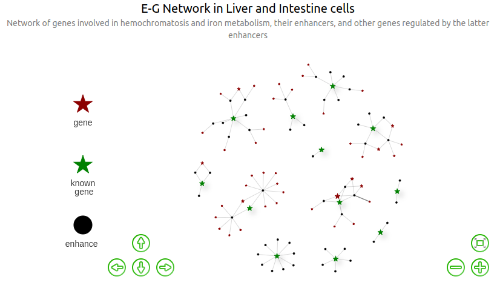
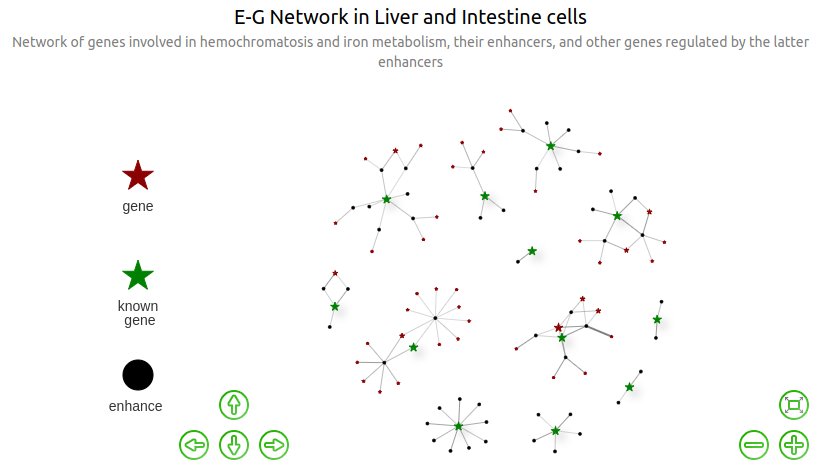

<style type="text/css">
.badCode {
background-color: #C9DDE4;
}
</style>


# Notice

The current page essentially corresponds to a markdown knitted from a Rmd document. It does not render very well because of html widgets not handled, but one should better refer to the correct rendering available [here](../../../data_and_results/haemochromatosis/promoter_capture_hic/preliminary_analysis_chic_v2.html).


# Libraries & Version


```{.r .badCode}
library(tidyverse)
library(visNetwork)
```


```
R version 4.0.3 (2020-10-10)
Platform: x86_64-pc-linux-gnu (64-bit)
Running under: Ubuntu 20.04.1 LTS

Matrix products: default
BLAS:   /usr/lib/x86_64-linux-gnu/blas/libblas.so.3.9.0
LAPACK: /usr/lib/x86_64-linux-gnu/lapack/liblapack.so.3.9.0

locale:
 [1] LC_CTYPE=en_GB.UTF-8       LC_NUMERIC=C              
 [3] LC_TIME=en_GB.UTF-8        LC_COLLATE=en_GB.UTF-8    
 [5] LC_MONETARY=en_GB.UTF-8    LC_MESSAGES=en_GB.UTF-8   
 [7] LC_PAPER=en_GB.UTF-8       LC_NAME=C                 
 [9] LC_ADDRESS=C               LC_TELEPHONE=C            
[11] LC_MEASUREMENT=en_GB.UTF-8 LC_IDENTIFICATION=C       

attached base packages:
[1] stats     graphics  grDevices utils     datasets  methods   base     

other attached packages:
 [1] visNetwork_2.1.0 forcats_0.5.1    stringr_1.4.0    dplyr_1.0.7     
 [5] purrr_0.3.4      readr_2.0.2      tidyr_1.1.4      tibble_3.1.6    
 [9] ggplot2_3.3.5    tidyverse_1.3.1  knitr_1.36      

loaded via a namespace (and not attached):
 [1] tidyselect_1.1.1  xfun_0.28         bslib_0.3.1       haven_2.4.3      
 [5] colorspace_2.0-2  vctrs_0.3.8       generics_0.1.1    htmltools_0.5.2  
 [9] yaml_2.2.1        utf8_1.2.2        rlang_0.4.12      jquerylib_0.1.4  
[13] pillar_1.6.4      withr_2.4.2       glue_1.5.0        DBI_1.1.1        
[17] dbplyr_2.1.1      modelr_0.1.8      readxl_1.3.1      lifecycle_1.0.1  
[21] munsell_0.5.0     gtable_0.3.0      cellranger_1.1.0  rvest_1.0.2      
[25] htmlwidgets_1.5.4 evaluate_0.14     tzdb_0.2.0        fastmap_1.1.0    
[29] fansi_0.5.0       broom_0.7.10      Rcpp_1.0.7        backports_1.3.0  
[33] scales_1.1.1      formatR_1.11      jsonlite_1.7.2    fs_1.5.0         
[37] hms_1.1.1         digest_0.6.28     stringi_1.7.5     grid_4.0.3       
[41] cli_3.1.0         tools_4.0.3       magrittr_2.0.1    sass_0.4.0       
[45] crayon_1.4.2      pkgconfig_2.0.3   ellipsis_0.3.2    xml2_1.3.2       
[49] reprex_2.0.1      lubridate_1.8.0   rstudioapi_0.13   assertthat_0.2.1 
[53] rmarkdown_2.11    httr_1.4.2        R6_2.5.1          compiler_4.0.3   
```

# Preliminary work

The documentation on `visNetwork` is available [here](https://datastorm-open.github.io/visNetwork/nodes.html).

## Data importation

All the files imported here can be found on Genotoul, in (private access) `/work2/project/regenet/workspace/thoellinger/shared/2022/promoter_capture_hic/` and (private access) `/work2/project/regenet/results/phic/homo_sapiens/hg19/jung.ren.2019/LI11/nofilter/pp`, or for some [here (public access)](../../../data_and_results/haemochromatosis/promoter_capture_hic/).

The full code itself is available here: `/work2/project/regenet/workspace/thoellinger/shared/2022/promoter_capture_hic/` (as `preliminary_analysis_v1.Rmd`). Please do not modify directly this repository as it is backed up between multiple computers on a regular basis.

 
```{.r .badCode}
rm(list = ls())

# wd = 'data/'
wd = "/home/thoellinger/Documents/shared/2022/promoter_capture_hic/data/"
# wd =
# '/home/hoellinger/Documents/INSERM/shared/2022/promoter_capture_hic/data/'
egfile = paste(wd, "liver.all_putative_enhancers.overlapping_ccRE-ELS.sorted.bedpe",
    sep = "")
merged_efile = paste(wd, "list_all_enhancers.overlapping_ccRE-ELS.bed", sep = "")

############# Enhancers #
me = as.data.frame(read.table(merged_efile, sep = "\t"))

############ E-G list #

eg = as.data.frame(read.table(egfile, header = F, col.names = c("chrom1", "start1",
    "end1", "chrom2", "start2", "end2", "name", "score.contact", "strand1", "strand2",
    "tissue", "gene.symbol", "original.distance", "gene.id"), sep = "\t"))

############### known genes #
gene_list = c("HFE", "TFR2", "HFE2", "HAMP", "SLC40A1", "BMP6", "TMPRSS6", "TFRC",
    "SLC11A2", "CYBRD1", "NEO1", "CIAPIN1", "SLC39A14")

# genes known to be causally involved in hemochromatosis: 'HFE', 'TFR2',
# 'HFE2', 'HAMP', 'SLC40A1', 'BMP6' (the other genes are involved in iron
# metabolism regulation) genes co-expressed in the liver: HFE + TFR2 + HJV +
# HAMP + TMPRSS6 genes co-expressed in intestine: DCYTB + DMT1 + SLC40A1
```

## Data preprocessing

### Conversion to factors


```{.r .badCode}
# to_factor_cols = c('chrom1', 'chrom2', 'name', 'strand1', 'strand2',
# 'tissue', 'gene.symbol', 'gene.id')
to_factor_cols = c("chrom1", "chrom2", "name", "strand1", "strand2", "tissue")
eg[to_factor_cols] = lapply(eg[to_factor_cols], factor)
```

## Exploration

### Summary statistics on enhancer lists


```{.r .badCode}
length(me[, 1])
```

```
[1] 25600
```

Warning: we shall pay attention to the fact that those 25,600 putative enhancers correspond to those, among the 31,749 initial putative regulatory elements in the CHiC data, that intersect at least one ccRE-ELS. We filtered out the other elements / the E-G pairs involving such elements. We did so because they are pretty large (see next cell), so it is very unlikely for such large element to be an enhancer but not to intersect any ccRE-ELS.


```{.r .badCode}
me$length = abs(me$V3 - me$V2)

summary(me$length)
```

```
   Min. 1st Qu.  Median    Mean 3rd Qu.    Max. 
   1571    4386    5843    7324    8198  122914 
```

### E-G pairs

We extract the subsample of the E-G bedpe input list, where genes are contained in our list of genes involved either directly in hemochromatosis or in iron metabolism. In the variable name, "dist0" stands for "distance is 0 between the genes in `eg_dist0` and the list of initial genes".


```{.r .badCode}
eg_dist0 = eg[eg$gene.symbol %in% gene_list, ]
```


```{.r .badCode}
length(eg_dist0$name)
```

```
[1] 49
```

```{.r .badCode}
length(unique(eg_dist0$gene.symbol))
```

```
[1] 12
```


```{.r .badCode}
print(as.character(unique(eg_dist0$gene.symbol)))
```

```
 [1] "HFE2"     "CYBRD1"   "SLC40A1"  "TFRC"     "BMP6"     "HFE"     
 [7] "TFR2"     "SLC39A14" "SLC11A2"  "NEO1"     "CIAPIN1"  "TMPRSS6" 
```

```{.r .badCode}
print(gene_list)
```

```
 [1] "HFE"      "TFR2"     "HFE2"     "HAMP"     "SLC40A1"  "BMP6"    
 [7] "TMPRSS6"  "TFRC"     "SLC11A2"  "CYBRD1"   "NEO1"     "CIAPIN1" 
[13] "SLC39A14"
```

We have element-gene pairs in our data for 12 out of 13 initial genes.

### Genes

Chromosomes where the genes are located:


```
     HFE     TFR2     HFE2     HAMP  SLC40A1     BMP6  TMPRSS6     TFRC 
  "chr6"   "chr7"   "chr1"   "HAMP"   "chr2"   "chr6"  "chr22"   "chr3" 
 SLC11A2   CYBRD1     NEO1  CIAPIN1 SLC39A14 
 "chr12"   "chr2"  "chr15"  "chr16"   "chr8" 
```

# Networks

Note: in all subsequent graphs, size of nodes of type "gene" (and not "known_gene", for which the size is fixed) is proportional to the number of distinct enhancers regulating them.

## Find all genes regulated by the initial enhancers

The "initial enhancers" are the enhancers involved in eg_dist0, ie all the enhancers regulating the initial genes in `gene_list`.

`genes` is the subset of `gene_list` for which we have data (12 out of 13 genes here), and `enhancers` is the list of enhancers regulating those initial known genes.


```{.r .badCode}
enhancers = unique(paste(eg_dist0$chrom1, ":", eg_dist0$start1, "-", eg_dist0$end1,
    sep = ""))
genes = unique(eg_dist0$gene.symbol)
```


Now we compute the list of all genes regulated by enhancers in `eg_dist0`. Specifically, we extract, from the full E-G list `eg`, the list `eg_dist1` containing only the enhancers-genes pairs for which the gene G is regulated by any of the enhancers regulating a gene in `gene_list` ("dist1" stands for "distance is at most 1 between the genes in `eg_dist1` and the list of initial genes").


```{.r .badCode}
eg_enhancers_id = data.frame(source = paste(eg$chrom1, ":", eg$start1, "-", eg$end1,
    sep = ""), eg[, -c(1, 2, 3)])  # same as eg but columns 1-3 have been concatenated to make unique enhancers id
eg_dist1 = eg_enhancers_id[eg_enhancers_id$source %in% paste(eg_dist0$chrom1, ":",
    eg_dist0$start1, "-", eg_dist0$end1, sep = ""), ]
eg_dist1$from = lapply(eg_dist1$source, function(x) unique(as.character(eg_dist0[paste(eg_dist0$chrom1,
    ":", eg_dist0$start1, "-", eg_dist0$end1, sep = "") == x, "gene.symbol"])))
eg_dist1$from.id = lapply(eg_dist1$source, function(x) unique(as.character(eg_dist0[paste(eg_dist0$chrom1,
    ":", eg_dist0$start1, "-", eg_dist0$end1, sep = "") == x, "gene.id"])))
eg_dist1$score.contact.IE = left_join(data.frame(name = paste(eg_dist1$source, eg_dist1$from.id,
    eg_dist1$from, sep = "::")), eg_enhancers_id, by = "name")$score.contact  # max ABC score of the I-E pair (initialGene-Enhancer) corresponding to the E-G pair
genes_dist1 = unique(eg_dist1$gene.symbol)
```

`genes_dist1` is the list of genes regulated by `enhancers`.


Compute "contact product", ie the product of the contact scores of:
- the initial gene - enhancer pair (I-E)
- the enhancer - gene pair (E-G)


```{.r .badCode}
eg_dist1$contact.product = eg_dist1$score.contact * eg_dist1$score.contact.IE
eg_dist1$contact.product = eg_dist1$contact.product/max(eg_dist1$contact.product)
```


```{.r .badCode}
print(min(eg_dist1$contact.product))
```

```
[1] 0.1613721
```

```{.r .badCode}
print(mean(eg_dist1$contact.product))
```

```
[1] 0.3154293
```

```{.r .badCode}
print(max(eg_dist1$contact.product))
```

```
[1] 1
```

```{.r .badCode}
print(quantile(eg_dist1$contact.product, c(0.1, 0.4, 0.5, 0.6, 0.8, 0.9)))
```

```
      10%       40%       50%       60%       80%       90% 
0.1853717 0.2340752 0.2457107 0.2883543 0.4243637 0.5197058 
```


```{.r .badCode}
eg_dist1$contact.product.label = 1
eg_dist1[eg_dist1$contact.product >= median(eg_dist1$contact.product), ]$contact.product.label = 2
eg_dist1[eg_dist1$contact.product >= quantile(eg_dist1$contact.product, 0.9)[[1]],
    ]$contact.product.label = 3
```


```{.r .badCode}
table(eg_dist1$contact.product.label)
```

```

 1  2  3 
50 39 12 
```


In the following cell we re-organize `genes_dist1` into `genes_dist1.more` which is in a well-suited format for further "concatenation" with inferences made with other type of data (ABC or QTL -based).


```{.r .badCode}
genes_dist1.more = eg_dist1 %>%
    group_by(gene.symbol) %>%
    mutate(CHiC.sources = paste0(source, collapse = ",")) %>%
    mutate(CHiC.count = length(str_split(CHiC.sources, ",")[[1]])) %>%
    slice(which.max(contact.product.label)) %>%
    ungroup() %>%
    select(gene.symbol, gene.id, CHiC.sources, contact.product.label, CHiC.count,
        from)

genes_dist1.more = subset(genes_dist1.more, !(genes_dist1.more$gene.symbol %in% genes))
genes_dist1.more$from = as.character(genes_dist1.more$from)
genes_dist1.more
```

```
# A tibble: 42 × 6
   gene.symbol gene.id            CHiC.sources contact.product… CHiC.count from 
   <chr>       <chr>              <chr>                   <dbl>      <int> <chr>
 1 ACTL6B      ENSG00000077080.5  chr7:100151…                1          2 TFR2 
 2 ADPGK       ENSG00000159322.13 chr15:73089…                3          2 NEO1 
 3 AGFG2       ENSG00000106351.8  chr7:100151…                1          1 TFR2 
 4 ANKRD34A    ENSG00000181039.7  chr1:145508…                2          1 HFE2 
 5 ARL2BP      ENSG00000102931.3  chr16:57256…                2          1 CIAP…
 6 ATF1        ENSG00000123268.4  chr12:51316…                2          1 SLC1…
 7 C1QTNF6     ENSG00000133466.9  chr22:37461…                2          2 TMPR…
 8 C7orf61     ENSG00000185955.4  chr7:100151…                1          1 TFR2 
 9 CCDC135     ENSG00000159625.10 chr16:57491…                3          2 CIAP…
10 CCL22       ENSG00000102962.4  chr16:57428…                2          1 CIAP…
# … with 32 more rows
```

We re-arrange `eg_dist1` as an edge list `edges_list_dist1`, which will be more suitable to later construct the edges list for visualization as a graph.


```{.r .badCode}
edges_list_dist1 = data.frame(source = eg_dist1$source, target = eg_dist1$gene.symbol,
    distance_kb = floor(eg_dist1$original.distance/1000), inv_dist = 1/(eg_dist1$original.distance +
        1), rescaled_log_inv_dist = 1 - min(log(1/(eg_dist1$original.distance + 1))) +
        log(1/(eg_dist1$original.distance + 1)))
edges_list_dist1
```


Now we can compute the list `nodes_dist1` of (colored) nodes required for our graphs. There are 3 types of nodes: `enhancer`, `known_gene` and (unknown) `gene`.


```{.r .badCode}
nodes_dist1 = full_join(data.frame(label = unique(eg_dist1$source), group = "enhancer"),
    data.frame(label = unique(eg_dist1$gene.symbol), group = "gene")) %>%
    rowid_to_column("id")
nodes_dist1[nodes_dist1$label %in% genes, ]$group = "known_gene"
nodes_dist1 = unique(nodes_dist1)
```


```{.r .badCode}
table(nodes_dist1$group)
```

```

  enhancer       gene known_gene 
        49         42         12 
```

In the list of edges of the graph, `edges_dist1`, the `sample` column indicates in which family of tissues (liver, intestine or both) each E-G pair has been found.


We add to `nodes_dist1` a column `d_in` for plotting purpose: it contains 1 for each node of type `enhancer`, the number of incoming enhancers for each node of type `gene`, and the max of the latter for each node of type `known_gene`.


## Edge weight based on distance

Width proportional to distance. For each enhancer-gene pair $E$-$G$, the distance indicated in the `eg` dataframe as `original_distance.mean` is given in in base pairs. Here, `distance_kb` is the very same quantity but expressed in `kb`.


[](https://genoweb.toulouse.inra.fr/~thoellinger/2022/CHiC_inferred_genes/preliminary_analysis_chic_v2.html#32_Edge_weight_based_on_distance)

Width proportional to inverse distance:


[](https://genoweb.toulouse.inra.fr/~thoellinger/2022/CHiC_inferred_genes/preliminary_analysis_chic_v2.html#32_Edge_weight_based_on_distance)

Width proportional to rescaled and translated log inverse distance:


[](https://genoweb.toulouse.inra.fr/~thoellinger/2022/CHiC_inferred_genes/preliminary_analysis_chic_v2.html#32_Edge_weight_based_on_distance)

# Results

The list of the initial genes + all genes regulated by enhancers regulating the 12 initial genes (12 found among 13), can be found here: `/work2/project/regenet/workspace/thoellinger/shared/automne_2021/promoter_capture_hic/results/new_genes_v1.list`.


```{.r .badCode}
# write.table(genes_dist1, file='results/new_genes_v1.list', quote=FALSE,
# sep='\t', row.names=F, col.names=F)
```

The list all genes regulated by enhancers regulating the 12 initial genes, with useful info, can be found here: `/work2/project/regenet/workspace/thoellinger/shared/2022/promoter_capture_hic/results/new_genes_chic_v2_more_info.list`.


```{.r .badCode}
# write.table(genes_dist1.more,
# file='results/new_genes_chic_v2_more_info.list', quote=FALSE, sep='\t',
# row.names=F, col.names=T)
```


For each one of the 12 initial genes, the list of genes regulated by enhancers regulating that initial gene, can be found here:


```{.r .badCode}
# for (gene in genes){ current_gene_dist1 =
# unique(eg_dist1[eg_dist1$from==gene,'gene.symbol'])
# write.table(current_gene_dist1, file=paste('results/separate/',gene,'.list',
# sep=''), quote=FALSE, sep='\t', row.names=F, col.names=F) }
```


The list of the enhancers regulating the 12 initial genes, can be found here: `/work2/project/regenet/workspace/thoellinger/shared/2022/promoter_capture_hic/results/enhancers.list`


```{.r .badCode}
# write.table(enhancers, file='results/enhancers.list', quote=FALSE, sep='\t',
# row.names=F, col.names=F)
```

The list of E-G pairs involving the 12 initial genes, can be found here: `/work2/project/regenet/workspace/thoellinger/shared/2022/promoter_capture_hic/results/eg_dist0.bedpe`


```{.r .badCode}
# write.table(eg_dist0, file='results/eg_dist0.bedpe', quote=FALSE, sep='\t',
# row.names=F, col.names=F)
```

The list of the enhancers regulating the 54 initial+new genes, can be found here: `/work2/project/regenet/workspace/thoellinger/shared/2022/promoter_capture_hic/results/enhancers.new_genes.list`


```{.r .badCode}
# eg_dist2 = eg[eg$gene.symbol %in% genes_dist1,] enhancers.new_genes =
# unique(paste(eg_dist2$chrom1, ':', eg_dist2$start1, '-', eg_dist2$end1,
# sep='')) write.table(enhancers.new_genes,
# file='results/enhancers.new_genes.list', quote=FALSE, sep='\t', row.names=F,
# col.names=F)
```

The list of E-G pairs involving the 54 initial+new genes, can be found here: `/work2/project/regenet/workspace/thoellinger/shared/2022/promoter_capture_hic/results/eg_dist2.bedpe`


```{.r .badCode}
# write.table(eg_dist2, file='results/eg_dist2.bedpe', quote=FALSE, sep='\t',
# row.names=F, col.names=F)
```


# Appendix

## Tables

### Table of the initial ABC-predicted E-G pairs involving the initial genes


```{.r .badCode}
options(max.print = 1000)
eg_dist0
```

```
      chrom1    start1      end1 chrom2    start2      end2
1602    chr1 144995955 144999800   chr1 145413094 145417545
1613    chr1 145382770 145387982   chr1 145413094 145417545
1620    chr1 145445045 145450003   chr1 145413094 145417545
1622    chr1 145471844 145478745   chr1 145413094 145417545
1626    chr1 145508505 145515028   chr1 145413094 145417545
1627    chr1 145519579 145527792   chr1 145413094 145417545
3982    chr2 171868841 171871980   chr2 172378756 172414643
3983    chr2 172052913 172056719   chr2 172378756 172414643
3985    chr2 172244003 172248890   chr2 172378756 172414643
3986    chr2 172359194 172365051   chr2 172378756 172414643
3987    chr2 172396460 172401984   chr2 172378756 172414643
4074    chr2 190325771 190329372   chr2 190425304 190448484
4075    chr2 190329373 190334233   chr2 190425304 190448484
4076    chr2 190360995 190365156   chr2 190425304 190448484
4077    chr2 190390528 190393955   chr2 190425304 190448484
4078    chr2 190410593 190416234   chr2 190425304 190448484
4079    chr2 190416235 190421209   chr2 190425304 190448484
4080    chr2 190421210 190425029   chr2 190425304 190448484
4081    chr2 190475143 190478818   chr2 190425304 190448484
4085    chr2 190496245 190499388   chr2 190425304 190448484
6360    chr3 195829327 195839503   chr3 195754053 195809060
6361    chr3 195904445 195910895   chr3 195754053 195809060
9222    chr6   7757920   7762092   chr6   7727029   7881655
9223    chr6   8000333   8004738   chr6   7727029   7881655
9356    chr6  26065333  26073782   chr6  26087508  26098571
12009   chr7 100151130 100158146   chr7 100218038 100240402
12040   chr7 100479857 100484394   chr7 100218038 100240402
12830   chr8  22136614  22143599   chr8  22224761  22291642
12831   chr8  22143600  22148473   chr8  22224761  22291642
12835   chr8  22148474  22155405   chr8  22224761  22291642
20296  chr12  50495719  50503727  chr12  51373183  51422349
20338  chr12  51184932  51188867  chr12  51373183  51422349
20341  chr12  51316042  51321932  chr12  51373183  51422349
20362  chr12  51540821  51574422  chr12  51373183  51422349
20367  chr12  51637790  51642516  chr12  51373183  51422349
20369  chr12  51652001  51656616  chr12  51373183  51422349
20373  chr12  51670781  51676690  chr12  51373183  51422349
25072  chr15  73089434  73099467  chr15  73344050  73597547
25074  chr15  73177101  73180543  chr15  73344050  73597547
25078  chr15  73372310  73380150  chr15  73344050  73597547
26940  chr16  57256998  57262124  chr16  57462080  57481440
26952  chr16  57428584  57434799  chr16  57462080  57481440
26967  chr16  57491859  57510132  chr16  57462080  57481440
26985  chr16  57662892  57669586  chr16  57462080  57481440
38401  chr22  36318565  36323139  chr22  37461475  37505603
38476  chr22  37451969  37461031  chr22  37461475  37505603
38481  chr22  37461032  37471647  chr22  37461475  37505603
38484  chr22  37533344  37544456  chr22  37461475  37505603
38485  chr22  37550713  37556000  chr22  37461475  37505603
                                                      name score.contact
1602    chr1:144995955-144999800::ENSG00000168509.13::HFE2      2.691613
1613    chr1:145382770-145387982::ENSG00000168509.13::HFE2      3.500083
1620    chr1:145445045-145450003::ENSG00000168509.13::HFE2      2.747677
1622    chr1:145471844-145478745::ENSG00000168509.13::HFE2      2.173732
1626    chr1:145508505-145515028::ENSG00000168509.13::HFE2      3.404033
1627    chr1:145519579-145527792::ENSG00000168509.13::HFE2      3.329819
3982   chr2:171868841-171871980::ENSG00000071967.7::CYBRD1      3.161168
3983   chr2:172052913-172056719::ENSG00000071967.7::CYBRD1      2.180688
3985   chr2:172244003-172248890::ENSG00000071967.7::CYBRD1      2.113738
3986   chr2:172359194-172365051::ENSG00000071967.7::CYBRD1      2.961889
3987   chr2:172396460-172401984::ENSG00000071967.7::CYBRD1      2.013556
4074  chr2:190325771-190329372::ENSG00000138449.6::SLC40A1      4.556188
4075  chr2:190329373-190334233::ENSG00000138449.6::SLC40A1      2.672282
4076  chr2:190360995-190365156::ENSG00000138449.6::SLC40A1      3.338258
4077  chr2:190390528-190393955::ENSG00000138449.6::SLC40A1      2.310444
4078  chr2:190410593-190416234::ENSG00000138449.6::SLC40A1      2.833319
4079  chr2:190416235-190421209::ENSG00000138449.6::SLC40A1      2.538705
4080  chr2:190421210-190425029::ENSG00000138449.6::SLC40A1      2.206945
4081  chr2:190475143-190478818::ENSG00000138449.6::SLC40A1      2.561220
4085  chr2:190496245-190499388::ENSG00000138449.6::SLC40A1      2.306987
6360     chr3:195829327-195839503::ENSG00000072274.8::TFRC      2.880979
6361     chr3:195904445-195910895::ENSG00000072274.8::TFRC      2.461830
9222         chr6:7757920-7762092::ENSG00000153162.8::BMP6      3.182610
9223         chr6:8000333-8004738::ENSG00000153162.8::BMP6      2.373608
9356       chr6:26065333-26073782::ENSG00000010704.14::HFE      2.104796
12009    chr7:100151130-100158146::ENSG00000106327.8::TFR2      2.202777
12040    chr7:100479857-100484394::ENSG00000106327.8::TFR2      2.085438
12830  chr8:22136614-22143599::ENSG00000104635.9::SLC39A14      2.941420
12831  chr8:22143600-22148473::ENSG00000104635.9::SLC39A14      2.234129
12835  chr8:22148474-22155405::ENSG00000104635.9::SLC39A14      2.240686
20296 chr12:50495719-50503727::ENSG00000110911.10::SLC11A2      2.207329
20338 chr12:51184932-51188867::ENSG00000110911.10::SLC11A2      2.739063
20341 chr12:51316042-51321932::ENSG00000110911.10::SLC11A2      2.933383
20362 chr12:51540821-51574422::ENSG00000110911.10::SLC11A2      2.623970
20367 chr12:51637790-51642516::ENSG00000110911.10::SLC11A2      2.607919
20369 chr12:51652001-51656616::ENSG00000110911.10::SLC11A2      2.923081
20373 chr12:51670781-51676690::ENSG00000110911.10::SLC11A2      2.106838
25072    chr15:73089434-73099467::ENSG00000067141.12::NEO1      3.560153
25074    chr15:73177101-73180543::ENSG00000067141.12::NEO1      2.328833
25078    chr15:73372310-73380150::ENSG00000067141.12::NEO1      3.416054
26940 chr16:57256998-57262124::ENSG00000005194.10::CIAPIN1      2.036134
26952 chr16:57428584-57434799::ENSG00000005194.10::CIAPIN1      5.012442
26967 chr16:57491859-57510132::ENSG00000005194.10::CIAPIN1      2.158098
26985 chr16:57662892-57669586::ENSG00000005194.10::CIAPIN1      3.803306
38401 chr22:36318565-36323139::ENSG00000187045.12::TMPRSS6      2.429089
38476 chr22:37451969-37461031::ENSG00000187045.12::TMPRSS6      2.256193
38481 chr22:37461032-37471647::ENSG00000187045.12::TMPRSS6      3.763882
38484 chr22:37533344-37544456::ENSG00000187045.12::TMPRSS6      2.021822
38485 chr22:37550713-37556000::ENSG00000187045.12::TMPRSS6      2.426097
      strand1 strand2 tissue gene.symbol original.distance            gene.id
1602        .       .  liver        HFE2            411368 ENSG00000168509.13
1613        .       .  liver        HFE2             23186 ENSG00000168509.13
1620        .       .  liver        HFE2             25241 ENSG00000168509.13
1622        .       .  liver        HFE2             52040 ENSG00000168509.13
1626        .       .  liver        HFE2             88701 ENSG00000168509.13
1627        .       .  liver        HFE2             99775 ENSG00000168509.13
3982        .       .  liver      CYBRD1            501217  ENSG00000071967.7
3983        .       .  liver      CYBRD1            316478  ENSG00000071967.7
3985        .       .  liver      CYBRD1            124307  ENSG00000071967.7
3986        .       .  liver      CYBRD1              8146  ENSG00000071967.7
3987        .       .  liver      CYBRD1             14161  ENSG00000071967.7
4074        .       .  liver     SLC40A1            104295  ENSG00000138449.6
4075        .       .  liver     SLC40A1             99434  ENSG00000138449.6
4076        .       .  liver     SLC40A1             68511  ENSG00000138449.6
4077        .       .  liver     SLC40A1             39712  ENSG00000138449.6
4078        .       .  liver     SLC40A1             17433  ENSG00000138449.6
4079        .       .  liver     SLC40A1             12458  ENSG00000138449.6
4080        .       .  liver     SLC40A1              8638  ENSG00000138449.6
4081        .       .  liver     SLC40A1             24286  ENSG00000138449.6
4085        .       .  liver     SLC40A1             45388  ENSG00000138449.6
6360        .       .  liver        TFRC             10918  ENSG00000072274.8
6361        .       .  liver        TFRC             86036  ENSG00000072274.8
9222        .       .  liver        BMP6             23130  ENSG00000153162.8
9223        .       .  liver        BMP6            265543  ENSG00000153162.8
9356        .       .  liver         HFE             13117 ENSG00000010704.14
12009       .       .  liver        TFR2             71635  ENSG00000106327.8
12040       .       .  liver        TFR2            224731  ENSG00000106327.8
12830       .       .  liver    SLC39A14             79896  ENSG00000104635.9
12831       .       .  liver    SLC39A14             75022  ENSG00000104635.9
12835       .       .  liver    SLC39A14             68090  ENSG00000104635.9
20296       .       .  liver     SLC11A2            913646 ENSG00000110911.10
20338       .       .  liver     SLC11A2            228506 ENSG00000110911.10
20341       .       .  liver     SLC11A2             95441 ENSG00000110911.10
20362       .       .  liver     SLC11A2            106378 ENSG00000110911.10
20367       .       .  liver     SLC11A2            203347 ENSG00000110911.10
20369       .       .  liver     SLC11A2            217558 ENSG00000110911.10
20373       .       .  liver     SLC11A2            236338 ENSG00000110911.10
25072       .       .  liver        NEO1            242730 ENSG00000067141.12
25074       .       .  liver        NEO1            161654 ENSG00000067141.12
25078       .       .  liver        NEO1             20925 ENSG00000067141.12
26940       .       .  liver     CIAPIN1            214245 ENSG00000005194.10
26952       .       .  liver     CIAPIN1             41570 ENSG00000005194.10
26967       .       .  liver     CIAPIN1              7286 ENSG00000005194.10
26985       .       .  liver     CIAPIN1            178319 ENSG00000005194.10
38401       .       .  liver     TMPRSS6           1156734 ENSG00000187045.12
38476       .       .  liver     TMPRSS6             18842 ENSG00000187045.12
38481       .       .  liver     TMPRSS6              8226 ENSG00000187045.12
38484       .       .  liver     TMPRSS6             17904 ENSG00000187045.12
38485       .       .  liver     TMPRSS6             35273 ENSG00000187045.12
```

```{.r .badCode}
options(max.print = 75)
```


### List of the infered new genes


```{.r .badCode}
options(max.print = 1000)
genes_dist1
```

```
 [1] "HFE2"     "PDE4DIP"  "NUDT17"   "POLR3GL"  "ANKRD34A" "CYBRD1"  
 [7] "SLC40A1"  "TFRC"     "BMP6"     "HFE"      "C7orf61"  "TSC22D4" 
[13] "ACTL6B"   "AGFG2"    "TFR2"     "NYAP1"    "PCOLCE"   "FBXO24"  
[19] "CLDN15"   "SAP25"    "TRIM56"   "FIS1"     "EPO"      "LRCH4"   
[25] "ZNHIT1"   "SLC39A14" "POLR3D"   "PHYHIP"   "XPO7"     "SLC11A2" 
[31] "DAZAP2"   "CERS5"    "METTL7A"  "CSRNP2"   "ATF1"     "NR4A1"   
[37] "CELA1"    "NEO1"     "ADPGK"    "ARL2BP"   "CIAPIN1"  "COQ9"    
[43] "CCL22"    "CX3CL1"   "KATNB1"   "CCDC135"  "DOK4"     "TMPRSS6" 
[49] "KCTD17"   "C1QTNF6"  "RAC2"     "IL2RB"    "MPST"     "TST"     
```

```{.r .badCode}
length(genes_dist1)
```

```
[1] 54
```

```{.r .badCode}
options(max.print = 75)
```

