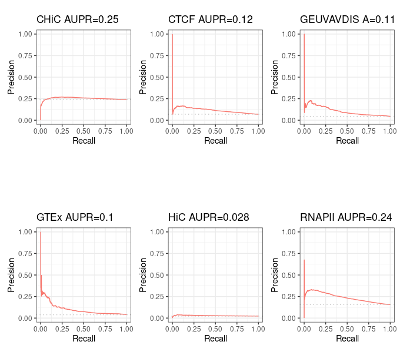

# Evaluation of ABC predictions for GM12878 on BENGI datasets: main results

We investigated the performance of the ABC model over the 6 BENGI benchmarks for GM12878 cell type. 

Here we summarize the main results of our investigations.

### Intersection between ABC prediction / BENGI

To compare the performance of the ABC model to other methods, the predictions (predicted positives + predicted negatives) made by ABC and the reference BENGI datasets must have a good overlap coefficient. Without a good overlap coefficient, it would not make much sense to compare Precision - Recall curves and AUPR, to the ones obtained for other methods. For instance, if the overlap is 10%, and most ground positives are contained in the remaining 90%, it would be unfair to other methods not to take them into account in recall - but it would be misleading to take them into account as false negatives.

Below we see that, naively running the ABC model over GM12878 would result in very small overlap coefficients. Even with numerous (up to 500,000) and lenient (p=0.2) DNase peaks, we obtained a maximum of 37% overlap.

To face this problem, we decided to impose candidate regions to the ABC model, instead of letting the model defining its own candidates from DNase peaks. To this aim, we provided the ABC model with the 25,095 ccRE with Enhancer-Like signature for GM12878 that are distal (> 2kb) from an annotated TSS (ccRE-dELS). As expected, this resulted in 100% overlap with all BENGI benchmarks.

#### Standard ABC

#### Standard ABC with more peaks

Here is what we find being more lenient when calling peaks (p=0.2) and taking up to 500,000 peaks.

#### ABC starting from ccRE-dELSs as candidate enhancers

Starting from distal (>= 2kb) ENCODE ccRE with Enhancer-Like Signature as candidate regions (instead of performing ABC step 1), we obtain, as expected, 100% intersection with BENGI datasets for GM12878. This enables us to compute true Precision - Recall curves and AUPR.

### Precision / recall curve

#### ABC starting from ccRE-dELS as candidate enhancers

Note that even though these curves are computed over the full BENGI datasets, they still grossly overestimate the Precision, as false positives that fall outside of the BENGI datasets are not taken into account.

Even with such an overestimate of the Precision of ABC predictions, they are only slightly better than random, and largely outperformed by a baseline distance method.

#### Distance method

For information purpose, we also computed pseudo Precision - Recall curves for ABC predictions that made only partial intersect with BENGI - that is, the ones from standard ABC method. Note that the interpretation is limited.

#### "Standard" ABC

#### "Standard" ABC with more peaks

