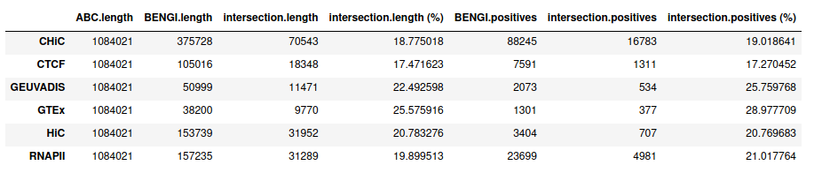

# ABC over GM12878 with same accessions as for BENGI GM12878 benchmarks

## Requirements

### Chromatin accessibility (DNase-seq)

We use the same DNase-seq data as Moore et al. 2020 for DNase-DNase correlation method - that is, the data used by [Thurman et al. 2012](https://www.nature.com/articles/nature11232).

Experiment: `ENCSR000COQ` https://www.encodeproject.org/experiments/ENCSR000COQ/

Replicate 1: `ENCFF664VNB.bam` ; Replicate 2: `ENCFF790WER.bam`

```bash
wget https://www.encodeproject.org/files/ENCFF664VNB/@@download/ENCFF664VNB.bam https://www.encodeproject.org/files/ENCFF790WER/@@download/ENCFF790WER.bam -P /work2/project/regenet/results/dnaseseq/homo_sapiens/hg19/gm12878/
```

### Blacklist

We use [the ENCODE Blacklist](https://github.com/Boyle-Lab/Blacklist) for Human GRCh19 available [here](https://github.com/Boyle-Lab/Blacklist/blob/master/lists/hg19-blacklist.v2.bed.gz).

```bash
wget https://github.com/Boyle-Lab/Blacklist/raw/master/lists/hg19-blacklist.v2.bed.gz -P /work2/project/regenet/data/species/homo_sapiens/hg19/
```

### Histone mark H3K27ac ChIP-seq

In Moore et al. 2020, these histone marks data are used:
* to build the ccREs
* for the training of Target Finder

For the sake of comparability between methods evaluation, if ever it appears that H3K27ac ChIP-seq accessions are not the same for ccREs and Target Finder training, we should use here the same as the ones used for Target Finder training. We shall verify later whether the accessions are the same or not.

Quotation from Moore et al. 2020:

> ***TargetFinder***
> We reimplemented TargetFinder to run on our cCRE-gene pairs with chromCV. For features, we used the identical datasets described by Whalen et al. for each cell type.

The accessions of H3k27ac ChIP-seq files used are available in supplementary Table S2 of [Whalen et al.](https://www.ncbi.nlm.nih.gov/pmc/articles/PMC4910881/):

|     Cell line      |   K562   | GM12878  | HeLa-S3  |  HUVEC   |  IMR90   |   NHEK   |
| :----------------: | :------: | -------- | -------- | :------: | :------: | :------: |
| ChIP-seq (H3K27ac) | GSE29611 | GSE29611 | GSE29611 | GSE29611 | GSE16256 | GSE29611 |

So either we download the big file (> 330 gb) for the `GSE29611` accession on GEO, or only the info file:

```bash
wget ftp://ftp.ncbi.nlm.nih.gov/geo/series/GSE29nnn/GSE29611/suppl/GSE29611_run_info.txt.gz -P /work2/project/regenet/results/chipseq/h3k27ac/homo_sapiens/hg19/gm12878/
```

in which we find the precise accession for H3K27ac ChIP-seq, which is: `GSM733771`: https://www.ncbi.nlm.nih.gov/geo/query/acc.cgi?acc=GSM733771

So now:

```bash
wget ftp://ftp.ncbi.nlm.nih.gov/geo/samples/GSM733nnn/GSM733771/suppl/GSM733771_hg19_wgEncodeBroadHistoneGm12878H3k27acStdAlnRep1.bam ftp://ftp.ncbi.nlm.nih.gov/geo/samples/GSM733nnn/GSM733771/suppl/GSM733771_hg19_wgEncodeBroadHistoneGm12878H3k27acStdAlnRep2.bam -P /work2/project/regenet/results/chipseq/h3k27ac/homo_sapiens/hg19/gm12878/
```

> ```bash
> /work2/project/regenet/results/chipseq/h3k27ac/homo_sapiens/hg19/gm12878/
> ├── GSE29611_run_info.txt.gz
> ├── GSM733771_hg19_wgEncodeBroadHistoneGm12878H3k27acStdAlnRep1.bam
> └── GSM733771_hg19_wgEncodeBroadHistoneGm12878H3k27acStdAlnRep2.bam
> ```

Note that we could have download the corresponding accessions from [encodeproject.org](https://www.encodeproject.org). That is NOT what we have done for this first run, but that is what we have done in the second run from the Jupyter notebook - which by the way is the only difference and should not have much impact on the results.

Experiment: `ENCSR000AKC` https://www.encodeproject.org/experiments/ENCSR000AKC/

Replicate 1: `ENCFF197QHX.bam` ; Replicate 2: `ENCFF882PRP.bam`

```bash
# This IS NOT what we have done for this run (of which results are in `GEO_BENGI_GM12878`).
# These are the accessions used to obtain the results in `BENGI_GM12878`.
wget https://www.encodeproject.org/files/ENCFF197QHX/@@download/ENCFF197QHX.bam https://www.encodeproject.org/files/ENCFF882PRP/@@download/ENCFF882PRP.bam -P /work2/project/regenet/results/dnaseseq/homo_sapiens/hg19/gm12878/
```

### Gene expression (polyA+ RNA-seq)

We use the two replicates provided by BENGI Moore et al. 2020 in Additional File 1 Table S1b.

Experiment: `ENCSR000COQ` Thomas Gingeras, CSHL https://www.encodeproject.org/experiments/ENCSR000COQ/

Replicate 1: `ENCFF587ALK` ; Replicate 2: `ENCFF766CPS`

```bash
wget https://www.encodeproject.org/files/ENCFF587ALK/@@download/ENCFF587ALK.tsv https://www.encodeproject.org/files/ENCFF766CPS/@@download/ENCFF766CPS.tsv -P /work2/project/regenet/results/rnaseq/homo_sapiens/hg19/gm12878/
```

### Gene annotation

We use the encode version 19 of hg19: `/work2/project/fragencode/data/species/homo_sapiens/hg19.gencv19/homo_sapiens.gtf`

We also need a files with 2 columns making the association between gene names / gene ids. We use the following: `/work2/project/fragencode/data/species/homo_sapiens/hg19.gencv19/homo_sapiens.gnid.gnname.tsv`

### Hi-C

First we try without Hi-C data, but later on we may retry with the Hi-C data used to build BENGI datasets.

### Ubiquitously expressed genes

We use the `UbiquitouslyExpressedGenesHG19.txt` list of 847 ubiquitously expressed genes used by ABC authors.

### Genome file

We extract chromosomes sizes from the header of `ENCFF664VNB.bam` (DNase-seq).

```bash
cd /work2/project/regenet/workspace/thoellinger/ABC-Enhancer-Gene-Prediction/BENGI_GM12878
conda activate base && module load bioinfo/samtools-1.9
samtools view -H /work2/project/regenet/results/dnaseseq/homo_sapiens/hg19/gm12878/ENCFF664VNB.bam | grep SQ | cut -f 2,3 |cut -c 4- |awk 'BEGIN{FS="\t"} {split($2,locus,":"); if($1 ~ /^(chr)([0-9]{1,2}$)|(M$)|(X$)|(Y$)/){print($1"\t"locus[2])}}' > reference/chr_sizes
```

```bash
awk '{print $1"\t"0"\t"$2}' reference/chr_sizes > reference/chr_sizes.bed
```

## Data processing

### Create expression table

We use `ABC-Enhancer-Gene-Prediction/compute_mean_expression.awk` to take as the reference TPM value, the mean value for the 2 replicates. If needed, see content of the script in [`ABC_on_GM12818.md`](http://genoweb.toulouse.inra.fr/~thoellinger/notes_perso/ABC_model/OK/ABC_on_GM12878.html).

```bash
mkdir reference/expression/
```

```bash
awk -f ../compute_mean_expression.awk /work2/project/fragencode/data/species/homo_sapiens/hg19.gencv19/homo_sapiens.gnid.gnname.tsv /work2/project/regenet/results/rnaseq/homo_sapiens/hg19/gm12878/ENCFF587ALK.tsv /work2/project/regenet/results/rnaseq/homo_sapiens/hg19/gm12878/ENCFF766CPS.tsv > reference/expression/GM12878.ENCFF587ALK_ENCFF766CPS.mean.TPM.txt
```

WARNING: for this run, we first computed mean expression for gene names (as it what was done initially on ABC examples), but to later convert it to expression for gene ids at the beginning of step 2. That was a mistake, as we lost a lot of gene doing so. We shall not reproduce this later! (Note that `compute_mean_expression.awk ` now directly computes mean expression for gene ids so these guidelines are correct).

### Filter gene annotation

We keep genes only, and select appropriate columns to fit the format of `reference/RefSeqCurated.170308.bed.CollapsedGeneBounds.bed` available on [ABC repository on Github](https://github.com/broadinstitute/ABC-Enhancer-Gene-Prediction), that is as follows:
> ```bash
> chrX	99883667	99894988	ENSG00000000003.10	0	-
> chrX	99839799	99854882	ENSG00000000005.5	0	+
> chr20	49551404	49575092	ENSG00000000419.8	0	-
> ```

WARNING: ABC assumes gene annotation is sorted at step 2, so we NEED to sort it, otherwise step 2 won't work.

Moreover, we must keep only genes that lie on a chromosome listed in our curated `genome_file`.

```bash
mkdir reference/genes_annotation
```

```bash
awk '$3 ~ /(^gene$)/ {print $1"\t"$4"\t"$5"\t"substr($10,2,length($10)-3)"\t"0"\t"$7}' /work2/project/fragencode/data/species/homo_sapiens/hg19.gencv19/homo_sapiens.gtf | bedtools sort -g /work2/project/regenet/workspace/thoellinger/ABC-Enhancer-Gene-Prediction/bisBENGI_GM12878/reference/chr_sizes -i stdin > reference/genes_annotation/gene_ids.bed
```

### Ubiquitously expressed genes

```bash
awk 'BEGIN{sep="\t"} NR==FNR {id[$2]=$1; next} id[$1] {print id[$1]}' /work2/project/fragencode/data/species/homo_sapiens/hg19.gencv19/homo_sapiens.gnid.gnname.tsv ../reference/UbiquitouslyExpressedGenesHG19.txt > reference/UbiquitouslyExpressedGenes_ids.txt
```

> ```bash
> $ wc -l reference/UbiquitouslyExpressedGenes_ids.txt 
> 843
> $wc -l ../reference/UbiquitouslyExpressedGenesHG19.txt 
> 847
> ```

We lost 4 ubiquitously expressed genes along the way.

## Running the ABC model

### Step 1: define candidate elements

#### Call peaks with `macs2`

Write the following in `BENGI_GM12878/hi_slurm/step1.1.sh`:

```bash
#!/bin/sh
# dependencies: python2
macs2 callpeak \
-t /work2/project/regenet/results/dnaseseq/homo_sapiens/hg19/gm12878/ENCFF664VNB.bam /work2/project/regenet/results/dnaseseq/homo_sapiens/hg19/gm12878/ENCFF790WER.bam \
-n ENCFF664VNB_ENCFF790WER.macs2 \
-f BAM \
-g hs \
-p .1 \
--call-summits \
--outdir /work2/project/regenet/workspace/thoellinger/ABC-Enhancer-Gene-Prediction/BENGI_GM12878/ABC_output/Peaks/
```

Now:

```bash
conda activate py2 && module load system/Python-2.7.2
```

```bash
sbatch --mem=2G --cpus-per-task=1 -J step1.1 --mail-user=tristan.hoellinger@inserm.fr --mail-type=END,FAIL --workdir=$PWD --export=ALL -p workq /work2/project/regenet/workspace/thoellinger/ABC-Enhancer-Gene-Prediction/BENGI_GM12878/hi_slurm/step1.1.sh
```


We stopped here.

```bash
conda deactivate && module unload system/Python-2.7.2
```

#### Use ABC `makeCandidateRegions.py` to define candidate regions

Once and for all:

```bash
conda activate base && conda activate abcmodel && module load bioinfo/samtools-1.9 bioinfo/bedtools-2.27.1 bioinfo/tabix-0.2.5 bioinfo/juicer-1.5.6
```

As there are peaks over 92 scaffolds listed in `ENCFF664VNB_ENCFF790WER.macs2_peaks.narrowPeak`, we modified it and `ENCFF587ALK_ENCFF766CPS.macs2_peaks.xls` to keep chromosomes only (otherwise `bedtools sort` below would not work). **But we have to keep in mind that `ENCFF587ALK_ENCFF766CPS.macs2_model.r` will still corresponds to DNase peaks over the 92 scaffolds**.

```bash
awk '$1 ~ /^(chr)([0-9]{1,2}$)|(M$)|(X$)|(Y$)/ {print $0}' ABC_output/Peaks/ENCFF664VNB_ENCFF790WER.macs2_peaks.narrowPeak > ABC_output/Peaks/ENCFF664VNB_ENCFF790WER.chromosomes_only.macs2_peaks.narrowPeak
```

```bash
awk 'NR <= 28 || $1 ~ /^(chr)([0-9]{1,2}$)|(M$)|(X$)|(Y$)/ {print $0}' ABC_output/Peaks/ENCFF664VNB_ENCFF790WER.macs2_peaks.xls > ABC_output/Peaks/ENCFF664VNB_ENCFF790WER.chromosomes_only.macs2_peaks.xls
```

We sort the results:

```bash
srun --pty bash
```

```bash
bedtools sort -faidx reference/chr_sizes -i ABC_output/Peaks/ENCFF664VNB_ENCFF790WER.chromosomes_only.macs2_peaks.narrowPeak > ABC_output/Peaks/ENCFF664VNB_ENCFF790WER.macs2_peaks.narrowPeak.sorted
```

Now as `../src/makeCandidateRegions.py` does not support multiple `bam` inputs, we first need to concatenate the bam of the 2 replicates.  Indeed, `makeCandidateRegions.py` will use the bam input to count DNase reads on each peak of `ENCFF664VNB_ENCFF790WER.macs2_peaks.narrowPeak.sorted` found with `macs2`.

To that purpose, write the following in `hi_slurm/step1.2.sh`:

(WARNING: depending on the size of the input bam, which may be much variable, the execution on 1 thread only can take from a few minutes to several hours, so better use at least 8 threads)

```bash
#!/bin/sh
# dependencies: bioinfo/samtools-1.9 bioinfo/bedtools-2.27.1
if [[ ! -f /work2/project/regenet/results/dnaseseq/homo_sapiens/hg19/gm12878/ENCFF664VNB_ENCFF790WER.bam ]]
then
    if [[ ! -f /work2/project/regenet/results/dnaseseq/homo_sapiens/hg19/gm12878/ENCFF664VNB_ENCFF790WER.sam ]]
    then
        samtools view -@ 8 -h /work2/project/regenet/results/dnaseseq/homo_sapiens/hg19/gm12878/ENCFF664VNB.bam > /work2/project/regenet/results/dnaseseq/homo_sapiens/hg19/gm12878/ENCFF664VNB_ENCFF790WER.sam
		samtools view -@ 8 /work2/project/regenet/results/dnaseseq/homo_sapiens/hg19/gm12878/ENCFF790WER.bam >> /work2/project/regenet/results/dnaseseq/homo_sapiens/hg19/gm12878/ENCFF664VNB_ENCFF790WER.sam
		samtools view -@ 8 -S -b /work2/project/regenet/results/dnaseseq/homo_sapiens/hg19/gm12878/ENCFF664VNB_ENCFF790WER.sam > /work2/project/regenet/results/dnaseseq/homo_sapiens/hg19/gm12878/ENCFF664VNB_ENCFF790WER.bam
        rm /work2/project/regenet/results/dnaseseq/homo_sapiens/hg19/gm12878/ENCFF664VNB_ENCFF790WER.sam
    else
        samtools view -@ 8 -S -b /work2/project/regenet/results/dnaseseq/homo_sapiens/hg19/gm12878/ENCFF664VNB_ENCFF790WER.sam > /work2/project/regenet/results/dnaseseq/homo_sapiens/hg19/gm12878/ENCFF664VNB_ENCFF790WER.bam
    fi
fi
```

```bash
sbatch --mem=2G --cpus-per-task=8 -J step1.2 --mail-user=tristan.hoellinger@inserm.fr --mail-type=END,FAIL --workdir=$PWD --export=ALL -p workq /work2/project/regenet/workspace/thoellinger/ABC-Enhancer-Gene-Prediction/BENGI_GM12878/hi_slurm/step1.2.sh
```

> ```bash
> $ seff 21980507
> CPU Efficiency: 60.91% of 03:50:08 core-walltime
> Job Wall-clock time: 00:28:46
> Memory Utilized: 8.98 MB
> ```

Now write the following in `GM12878/hi_slurm/step1.3.sh`

```bash
#!/bin/sh
# dependencies: python3 bioinfo/samtools-1.9 bioinfo/bedtools-2.27.1 bioinfo/tabix-0.2.5 bioinfo/juicer-1.5.6
python ../src/makeCandidateRegions.py \
--narrowPeak /work2/project/regenet/workspace/thoellinger/ABC-Enhancer-Gene-Prediction/BENGI_GM12878/ABC_output/Peaks/ENCFF664VNB_ENCFF790WER.macs2_peaks.narrowPeak.sorted \
--bam /work2/project/regenet/results/dnaseseq/homo_sapiens/hg19/gm12878/ENCFF664VNB_ENCFF790WER.bam \
--outDir /work2/project/regenet/workspace/thoellinger/ABC-Enhancer-Gene-Prediction/BENGI_GM12878/ABC_output/Peaks/ \
--chrom_sizes /work2/project/regenet/workspace/thoellinger/ABC-Enhancer-Gene-Prediction/BENGI_GM12878/reference/chr_sizes \
--regions_blacklist /work2/project/regenet/data/species/homo_sapiens/hg19/hg19-blacklist.v2.bed.gz \
--peakExtendFromSummit 250 \
--nStrongestPeaks 150000
#Expected output: params.txt, foo.macs2_peaks.narrowPeak.sorted.candidateRegions.bed, foo.macs2_peaks.narrowPeak.sorted.foo.bam.Counts.bed
```

WARNING: depending on the length of the inputs, this script may be very RAM-demanding. So we recommend to allocate at least 16 GB RAM to avoid "out of memory" errors.

```bash
sbatch --mem=16G --cpus-per-task=1 -J step1.3 --mail-user=tristan.hoellinger@inserm.fr --mail-type=END,FAIL --workdir=$PWD --export=ALL -p workq /work2/project/regenet/workspace/thoellinger/ABC-Enhancer-Gene-Prediction/BENGI_GM12878/hi_slurm/step1.3.sh
```

### Step 2: quantifying enhancer activity

#### Use ABC `run.neighborhoods.py`

Write the following in `BENGI_GM12878/hi_slurm/step2.sh`.

```bash
#!/bin/sh
python ../src/run.neighborhoods.py \
--candidate_enhancer_regions /work2/project/regenet/workspace/thoellinger/ABC-Enhancer-Gene-Prediction/BENGI_GM12878/ABC_output/Peaks/ENCFF664VNB_ENCFF790WER.macs2_peaks.narrowPeak.sorted.candidateRegions.bed \
--genes /work2/project/regenet/workspace/thoellinger/ABC-Enhancer-Gene-Prediction/BENGI_GM12878/reference/genes_annotation/gene_ids.bed \
--H3K27ac /work2/project/regenet/results/chipseq/h3k27ac/homo_sapiens/hg19/gm12878/GSM733771_hg19_wgEncodeBroadHistoneGm12878H3k27acStdAlnRep1.bam,/work2/project/regenet/results/chipseq/h3k27ac/homo_sapiens/hg19/gm12878/GSM733771_hg19_wgEncodeBroadHistoneGm12878H3k27acStdAlnRep2.bam \
--DHS /work2/project/regenet/results/dnaseseq/homo_sapiens/hg19/gm12878/ENCFF664VNB.bam,/work2/project/regenet/results/dnaseseq/homo_sapiens/hg19/gm12878/ENCFF790WER.bam \
--expression_table /work2/project/regenet/workspace/thoellinger/ABC-Enhancer-Gene-Prediction/BENGI_GM12878/reference/expression/GM12878.ids.ENCFF587ALK_ENCFF766CPS.mean.TPM.txt  \
--chrom_sizes /work2/project/regenet/workspace/thoellinger/ABC-Enhancer-Gene-Prediction/BENGI_GM12878/reference/chr_sizes \
--ubiquitously_expressed_genes /work2/project/regenet/workspace/thoellinger/ABC-Enhancer-Gene-Prediction/BENGI_GM12878/reference/UbiquitouslyExpressedGenes_ids.txt \
--cellType GM12878 \
--outdir /work2/project/regenet/workspace/thoellinger/ABC-Enhancer-Gene-Prediction/BENGI_GM12878/ABC_output/Neighborhoods/
```

WARNING: depending on the length of the inputs, this script may be very RAM-demanding. So we recommend to allocate 32 GB RAM in general to avoid "out of memory" errors.

```bash
sbatch --mem=16G --cpus-per-task=1 -J step2 --mail-user=tristan.hoellinger@inserm.fr --mail-type=END,FAIL --workdir=$PWD --export=ALL -p workq hi_slurm/step2.sh
```

We should find a way to parallelize `run.neighborhoods.py` as it took almost 3 hours, with 99,9% cpu efficiency. 

### Step 3: computing the ABC score

> If experimentally derived contact data is not available, one can run the ABC model using the powerlaw estimate only. In this case the ```--HiCdir``` argument should be excluded from ```predict.py``` and the ```--score_column powerlaw.Score``` argument should be included in ```predict.py```. In this case the ```ABC.Score``` column of the predictions file will be set to ```NaN```. The ```powerlaw.Score``` column of the output prediction files will be the relevant Score column to use.
>

Write the following in `BENGI_GM12878/hi_slurm/step3.sh`.

```bash
#!/bin/sh
python ../src/predict.py \
--enhancers /work2/project/regenet/workspace/thoellinger/ABC-Enhancer-Gene-Prediction/BENGI_GM12878/ABC_output/Neighborhoods/EnhancerList.txt \
--genes /work2/project/regenet/workspace/thoellinger/ABC-Enhancer-Gene-Prediction/BENGI_GM12878/ABC_output/Neighborhoods/GeneList.txt \
--score_column powerlaw.Score \
--hic_resolution 5000 \
--scale_hic_using_powerlaw \
--threshold .02 \
--cellType GM12878 \
--outdir /work2/project/regenet/workspace/thoellinger/ABC-Enhancer-Gene-Prediction/BENGI_GM12878/ABC_output/Predictions/ \
--make_all_putative
```

```bash
sbatch --mem=32G --cpus-per-task=1 -J step3 --mail-user=tristan.hoellinger@inserm.fr --mail-type=END,FAIL --workdir=$PWD --export=ALL -p workq hi_slurm/step3.sh
```

## Results

### Summary statistics

We create a `sumstats` sub-directory in `ABC_output/Predictions` then compute summary statistics using `bedpe.sumstats.sh` script.

```bash
module load compiler/gcc-7.2.0 system/R-4.0.2_gcc-7.2.0
```

R packages `optparse` and `reshape2` are required. Moreover, when executing `bedpe.sumstats.sh`, one must have to `chmod u+x` some dependencies if there are `Permission denied` errors.

```bash
cd ABC_output/Predictions/
gzip -c EnhancerPredictions.bedpe > EnhancerPredictions.bedpe.gz
cd sumstats/
sh ../../../../../scripts/bedpe.sumstats.sh ../EnhancerPredictions.bedpe.gz "0.02-1" "500-500"
```

Or replace `0.02-1` with `<choose a min>-<choose a max>` where `min` and `max` can be found with

```bash
awk 'BEGIN{FS="\t"; max=0;} {if($8>max){max=$8}} END{print(max);}' ../EnhancerPredictions.bedpe

awk 'BEGIN{FS="\t"; min=1;} {if($8<min){min=$8}} END{print(min);}' ../EnhancerPredictions.bedpe
```


## Evaluation of ABC predictions for GM12878 on BENGI datasets

### Intersection between ABC prediction / BENGI

#### Standard ABC



Note that we obtain these values with the notebook, for which we use other histone mark H3K27ac ChIP-seq (same accessions but downloaded from ENCODE instead of GEO -> processed another way). They are very slightly different from what we would have found here.

#### Standard ABC with more peaks

Here is what we find being more lenient when calling peaks (p=0.2) and taking up to 500,000 peaks (again, using ENCODE accessions for histone marks)


#### ABC starting from ccRE-dELSs as candidate enhancers

Starting from distal (>= 2kb) ENCODE ccREs with Enhancer-Like Signature as candidate regions (instead of performing ABC step 1), we obtain, as expected, 100% intersection with BENGI datasets for GM12878. This enables us to compute true Precision - Recall curves and AUPR.


### Precision / recall curve

#### ABC starting from ccRE-dELSs as candidate enhancers

Note that even though these curves are computed over the full BENGI datasets, they still grossly overestimate the Precision, as false positives that fall outside of the BENGI datasets are not taken into account.


Even with such an overestimate of the Precision of ABC predictions, they are only slightly better than random, and largely outperformed by a baseline distance method.

#### Distance method


For information purpose, we also computed pseudo Precision - Recall curves for ABC predictions that made only partial intersect with BENGI - that is, the ones from standard ABC method. Note that the interpretation is limited.

#### Standard ABC


#### Standard ABC with more peaks


