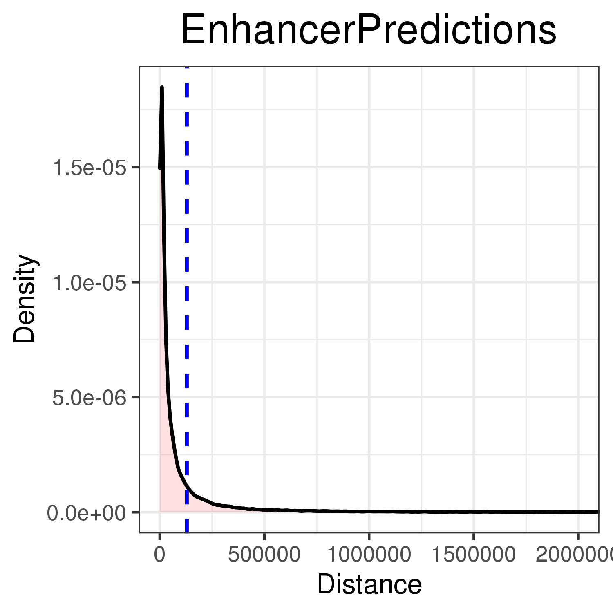
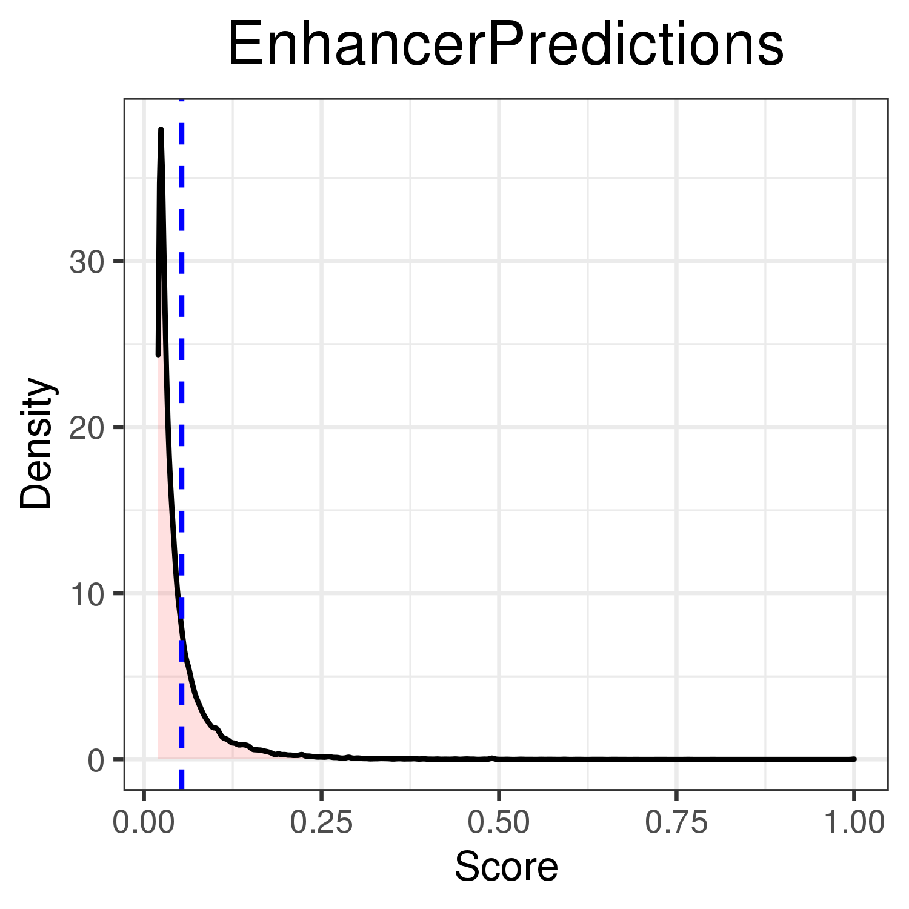
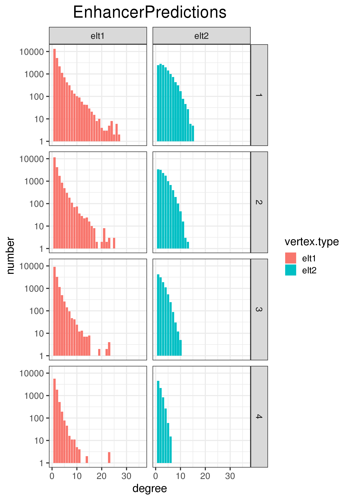

# ABC model on GM12878

Adapted from [ABC model's README on github](https://github.com/broadinstitute/ABC-Enhancer-Gene-Prediction).

The Activity-by-contact model predicts which enhancers regulate which genes on a cell type specific basis.

## Characteristics for this run

* No whitelist whenever possible (although `genes` argument was required for step 2 : quantifying enhancer activity ; and the input in the original example for this argument was the whitelist. So we used the whitelist `RefSeqCurated.170308.bed.CollapsedGeneBounds.TSS500bp.bed` here).
* Always used the 2 replicates, but had to concatenate them by hand at the end of step 1 (`makeCandidateRegions.py`). 

## Requirements

For each cell-type, the inputs to the ABC model are:

* Required Inputs

   * bam file for DNase-Seq or ATAC-Seq (indexed and sorted)

     The DNase-Seq file will contain the alignment of the genome-wide sequencing of regions sensitive to cleavage by DNase I, over the GRCh38 human's genome assembly.

   * bam file for H3K27ac ChIP-Seq (indexed and sorted)

     (Wiki) H3K27ac is an epigenetic modification to the DNA packaging protein Histone H3 (one of the five main histones involved in the structure of chromatin in eukaryotic cells). It is a mark that indicates the acetylation at the 27th lysine residue of the histone H3 protein. H3K27ac is associated with the higher activation of transcription and therefore defined as an *active* enhancer mark. H3K27ac is found at both proximal and distal regions of transcription start site (TSS).

* Optional Inputs

   * Hi-C data

     These Hi-C data serve to compute the contact frequency between regions. If not available, they can be estimated as it has been proven that the contact frequency approximately follows a power law of the distance.

   * A measure of gene expression

In addition the following (non-cell-type specific) genome annotation files are required

* bed file containing gene annotations (may change across cell types if using cell-type specific TSS's)
* bed file containing chromosome annotations

## Data acquisition

### Chromatin accessibility (DNase-seq)

> <span style="color:red">How to find the DNase-seq data on GM12878 used by ENCODE 3 for the Registry of Candidate Cis-Regulatory Elements (CCREs)? for consistency with Moore et al. 2020 paper where they directly use ENCODE CCREs</span>

[CCREs paper](https://www.nature.com/articles/s41586-020-2493-4#additional-information).

Experiment: `ENCSR000EMT` https://www.encodeproject.org/experiments/ENCSR000EMT/

Replicate 1: `ENCFF593WBR` ; Replicate 2: `ENCFF658WKQ`

Both are aligned on GRCh38.

```bash
wget https://www.encodeproject.org/files/ENCFF593WBR/@@download/ENCFF593WBR.bam https://www.encodeproject.org/files/ENCFF658WKQ/@@download/ENCFF658WKQ.bam -P results/dnaseseq/homo_sapiens/hg38/gm12878/
```

### Blacklist

We use the ENCODE Blacklist for Human GRCh38 downloaded from [this link](https://github.com/Boyle-Lab/Blacklist/raw/master/lists/hg38-blacklist.v2.bed.gz).

### Histone H3K27ac ChIP-seq

Experiment: `ENCSR000AKC` https://www.encodeproject.org/experiments/ENCSR000AKC/

 2 isogenic replicates: `ENCFF804NCH` (1) and `ENCFF948GTC` (2).

```bash
wget https://www.encodeproject.org/files/ENCFF804NCH/@@download/ENCFF804NCH.bam https://www.encodeproject.org/files/ENCFF948GTC/@@download/ENCFF948GTC.bam -P results/chipseq/h3k27ac/homo_sapiens/hg38/gm12878/
```

### Gene expression (polyA plus RNA-seq)

Experiment: `ENCSR000AED` https://www.encodeproject.org/experiments/ENCSR000AED/

2 isogenic replicates: `ENCFF902UYP` and `ENCFF550OHK`.

```bash
wget https://www.encodeproject.org/files/ENCFF902UYP/@@download/ENCFF902UYP.tsv https://www.encodeproject.org/files/ENCFF550OHK/@@download/ENCFF550OHK.tsv -P results/polyApRNAseq/homo_sapiens/hg38/gm12878/
```

### Gene annotation

We take the gene annotation file from `/work2/project/fragencode/data/species/homo_sapiens/GRCh38.gencv35/`. It must be in the same format as the "whitelist" used by ABC authors for K562 leukemia cells  (`RefSeqCurated.170308.bed.CollapsedGeneBounds.TSS500bp.bed`), so we use `gencode.v35.annotation.gtf.gz`.

We put it in `../reference` as global reference for every future ABC instantiation on any cell type over GRCh38.

### Ubiquitously expressed genes

We use the `UbiquitouslyExpressedGenesHG19.txt` list of 847 ubiquitously expressed genes used by ABC authors, although we replace gene names with gene ids, resulting in 791 genes listed.

> <span style="color:red">How to find the up-to-date whitelist?</span>

### Genome file

We extract chromosome sizes from the header of `ENCFF593WBR`.

```bash
conda activate base && module load bioinfo/samtools-1.9
```

```bash
samtools view -H /work2/project/regenet/results/dnaseseq/homo_sapiens/hg38/gm12878/ENCFF593WBR.bam | grep SQ | cut -f 2,3 |cut -c 4- |awk 'BEGIN{FS="\t"} {split($2,locus,":"); if($1 ~ /^(chr)([0-9]{1,2}$)|(M$)|(X$)|(Y$)/){print($1"\t"locus[2])}}' > reference/chr_sizes

awk '{print $1"\t"0"\t"$2}' reference/chr_sizes > reference/chr_sizes.bed
```

## Data processing

### Create expression table

We decided to take as the reference TPM value, the mean value for the 2 replicates. To that purpose, write the following in `ABC-Enhancer-Gene-Prediction/compute_mean_expression.awk`.

```bash
#!/bin/bash
BEGIN{
	FS="\t";
	token=0;
	count=0;
}
{
	if(NR==FNR){
		split($1,parts,".");
		name[parts[1]] = $2; # name[id] is the name associated to gene id
		next;
	}
	if(FNR == 1){token++; next;}
	if(token==1 && $1 ~ /^ENS/){
		split($1,parts,".");
		if(length(name[parts[1]]) != 0 && !_1[name[parts[1]]]++){
			# "!_1[name[parts[1]]]++" ensures uniqueness
			tabTPM[name[parts[1]]] = $6;
			count++;
			name_found[count] = name[parts[1]];
		}
	}
	if(token == 2 && $1 ~ /^ENS/){
		split($1,parts,".");
		if(length(name[parts[1]]) != 0 && !_2[name[parts[1]]]++){
			# "!_2[name[parts[1]]]++" ensures uniqueness
			tabTPM[name[parts[1]]] += $6;
			if(!_1[name[parts[1]]]){
				count++;
				name_found[count] = name[parts[1]];
				#print("well we should not be here"); # debugging purpose
			}
		}
	}
}
END{
	 for(i=1;i<=count;i++){
	 	print(name_found[i]"\t"tabTPM[name_found[i]]/2)
	 }
}
```

Then:

```bash
mkdir reference/expression/
awk -f ../compute_mean_expression.awk /work2/project/regenet/workspace/thoellinger/shared/notebooks/GWAS_catalog/GRCh38.gencv35/gencode.v35.annotation.gnid.gnname.tsv /work2/project/regenet/results/polyApRNAseq/homo_sapiens/hg38/gm12878/ENCFF902UYP.tsv /work2/project/regenet/results/polyApRNAseq/homo_sapiens/hg38/gm12878/ENCFF550OHK.tsv > reference/expression/GM12878.ENCFF902UYP_ENCFF550OHK.mean.TPM.txt
```

### Filter gene annotation

```bash
gz -d ../gencode.v35.annotation.gtf.gz
```

> ```bash
> $ awk 'BEGIN{FS="\t"} !type[$3]++ {print $3}' ../reference/gencode.v35.annotation.gtf 
> 
> gene
> transcript
> exon
> CDS
> start_codon
> stop_codon
> UTR
> Selenocysteine
> ```

We keep genes only, and select appropriate columns to fit the format of `../reference/RefSeqCurated.170308.bed.CollapsedGeneBounds.bed`. Instead of gene names, we choose to keep gene ids, but we remove the gene version.

```bash
awk 'BEGIN{FS="\t"} $3 ~ /(^gene$)/ {split($9,last_cols,"; "); split(last_cols[1],long_id,"\""); split(long_id[2],id,"."); print $1"\t"$4"\t"$5"\t"id[1]"\t"0"\t"$7}' ../reference/gencode.v35.annotation.gtf |sort -u -t$'\t' -k4 > reference/genes_annotation/gene_ids.bed
```

> ```bash
> $ wc -l reference/genes_annotation/gene_ids.bed 
> 60612
> ```

If we wanted gene names we could have used:

```bash
awk 'BEGIN{FS="\t"} $3 ~ /(^gene$)/ {split($9,last_cols,"; "); split(last_cols[3],name,"\""); print $1"\t"$4"\t"$5"\t"name[2]"\t"0"\t"$7}' ../reference/gencode.v35.annotation.gtf |sort -u -t$'\t' -k4 > reference/genes_annotation/gene_names.bed
```

> ```bash
> $ wc -l reference/genes_annotation/gene_names.bed 
> 59637
> ```

### Ubiquitously expressed genes

Fist we create a table that we can use in future instantiations of ABC model on other cells to switch between gene names and ids.

```bash
awk 'BEGIN{FS="\t"} $3 ~ /(^gene$)/ {split($9,last_cols,"; "); split(last_cols[3],name,"\""); split(last_cols[1],long_id,"\""); split(long_id[2],id,"."); print name[2]"\t"id[1]}' ../reference/gencode.v35.annotation.gtf > ../reference/names_ids_gencode.v35.bed
```

Now:

```bash
awk 'BEGIN{sep="\t"} NR==FNR {id[$1]=$2; next} id[$1] {print id[$1]}' ../reference/name
s_ids_gencode.v35.bed ../reference/UbiquitouslyExpressedGenesHG19.txt > ../reference/UbiquitouslyExpressedGenes_ids.txt
```

> ```bash
> $ wc -l ../reference/UbiquitouslyExpressedGenesHG19.txt 
> 847
> $ wc -l ../reference/UbiquitouslyExpressedGenes_ids.txt 
> 791
> ```

## Running the ABC model

### Step 1: define candidate elements

> 'Candidate elements' are the set of putative enhancer elements for which ABC Scores will be computed. A typical way to define candidate elements is by calling peaks on a DNase-Seq or ATAC-Seq bam file. In this implementation we first call peaks using MACS2 and then process these peaks using `makeCandidateRegions.py`.

#### Call peaks with `macs2`

Write the following in `GM12878/hi_slurm/step1.1.sh`:

```bash
emacs -nw hi_slurm/step1.1.sh
```

> ```shell
> #!/bin/sh
> # dependencies: python2
> macs2 callpeak \
> -t /work2/project/regenet/results/dnaseseq/homo_sapiens/hg38/gm12878/ENCFF593WBR.bam /work2/project/regenet/results/dnaseseq/homo_sapiens/hg38/gm12878/ENCFF658WKQ.bam \
> -n ENCFF593WBR_ENCFF658WKQ.macs2 \
> -f BAM \
> -g hs \
> -p .1 \
> --call-summits \
> --outdir /work2/project/regenet/workspace/thoellinger/ABC-Enhancer-Gene-Prediction/GM12878/ABC_output/Peaks/
> ```
>

Now:

```bash
conda activate py2 && module load system/Python-2.7.2
```

```bash
#do not use more than 1 cpu, useless. 2G mem is enough
sbatch --mem=2G --cpus-per-task=1 -J step1.1 --mail-user=tristan.hoellinger@inserm.fr --mail-type=END,FAIL --workdir=$PWD --export=ALL -p workq GM12878/hi_slurm/step1.1.sh
```

Execution should take ~30 minutes.

```shell
conda deactivate && module unload system/Python-2.7.2
```

> ```bash
> ABC_output/Peaks/
>     ├── ENCFF593WBR_ENCFF658WKQ.macs2_model.r # 17 lines
>     ├── ENCFF593WBR_ENCFF658WKQ.macs2_peaks.narrowPeak # 1,827,050 lines
>     ├── ENCFF593WBR_ENCFF658WKQ.macs2_peaks.xls # 1,827,076 lines
>     └── ENCFF593WBR_ENCFF658WKQ.macs2_summits.bed # 1,827,050 lines
> ```

#### Use ABC `makeCandidateRegions.py` to define candidate regions

```bash
conda activate base && conda activate abcmodel && module load bioinfo/samtools-1.9 bioinfo/bedtools-2.27.1 bioinfo/tabix-0.2.5 bioinfo/juicer-1.5.6
```

> Now `makeCandidateRegions.py` will take as input the narrowPeak file produced by MACS2 and then perform the following processing steps:
> 
> 1. Count DNase-seq reads in each peak and retain the top N peaks with the most read counts
> 2. Resize each of these N peaks to be a fixed number of base pairs centered on the peak summit
> 3. Remove any blacklisted regions and include any whitelisted regions
> 4. Merge any overlapping regions

**This time we do not use any whitelist.** Although initially there were ~ 25 000 white-listed regions. It seems that they basically correspond to curated gene annotations across the human genome.  Later we shall verify whether this has much influence or not on selected candidate regions.

As there are peaks over 123 scaffolds listed in `ENCFF593WBR_ENCFF658WKQ.macs2_peaks.narrowPeak`, we modify it and `ENCFF593WBR_ENCFF658WKQ.macs2_peaks.xls` to keep only chromosomes only (otherwise `bedtools sort` below would not work). **But we have to keep in mind that `ENCFF593WBR_ENCFF658WKQ.macs2_model.r` will still corresponds to DNase peaks over the 123 scaffolds**.

```bash
awk '$1 ~ /^(chr)([0-9]{1,2}$)|(M$)|(X$)|(Y$)/ {print $0}' ABC_output/Peaks/ENCFF593WBR_ENCFF658WKQ.macs2_peaks.narrowPeak > ABC_output/Peaks/ENCFF593WBR_ENCFF658WKQ.chromosomes_only.macs2_peaks.narrowPeak
```

```bash
awk 'NR <= 28 || $1 ~ /^(chr)([0-9]{1,2}$)|(M$)|(X$)|(Y$)/ {print $0}' ABC_output/Peaks/ENCFF593WBR_ENCFF658WKQ.macs2_peaks.xls > ABC_output/Peaks/ENCFF593WBR_ENCFF658WKQ.chromosomes_only.macs2_peaks.xls
```

> ```bash
> $ wc -l ABC_output/Peaks/ENCFF593WBR_ENCFF658WKQ.macs2_peaks.narrowPeak
> 1827050
> $ wc -l ABC_output/Peaks/ENCFF593WBR_ENCFF658WKQ.chromosomes_only.macs2_peaks.narrowPeak
> 1824459
> ```

Now:

```bash
#First sort narrowPeak file
srun --pty bash
bedtools sort -faidx reference/chr_sizes -i ABC_output/Peaks/ENCFF593WBR_ENCFF658WKQ.chromosomes_only.macs2_peaks.narrowPeak > ABC_output/Peaks/ENCFF593WBR_ENCFF658WKQ.macs2_peaks.narrowPeak.sorted
```

Now the problem is that `../src/makeCandidateRegions.py` does not support multiple `bam` inputs, so we first need to concatenate the bam files associated with the 2 replicates.  Indeed, `makeCandidateRegions.py` will use the bam input to count DNase reads on each peak of `ENCFF593WBR_ENCFF658WKQ.macs2_peaks.narrowPeak.sorted` found with `macs2`.

Write the following in `hi_slurm/step1.2.sh`:

```bash
#!/bin/sh
# dependencies: bioinfo/samtools-1.9 bioinfo/bedtools-2.27.1
samtools view -h /work2/project/regenet/results/dnaseseq/homo_sapiens/hg38/gm12878/ENCFF593WBR.bam > /work2/project/regenet/results/dnaseseq/homo_sapiens/hg38/gm12878/ENCFF593WBR_ENCFF658WKQ.sam
&&
samtools view /work2/project/regenet/results/dnaseseq/homo_sapiens/hg38/gm12878/ENCFF658WKQ.bam >> /work2/project/regenet/results/dnaseseq/homo_sapiens/hg38/gm12878/ENCFF593WBR_ENCFF658WKQ.sam
&&
samtools view -S -b /work2/project/regenet/results/dnaseseq/homo_sapiens/hg38/gm12878/ENCFF593WBR_ENCFF658WKQ.sam > /work2/project/regenet/results/dnaseseq/homo_sapiens/hg38/gm12878/ENCFF593WBR_ENCFF658WKQ.bam
```

```bash
sbatch --mem=4G --cpus-per-task=1 -J step1.2 --mail-user=tristan.hoellinger@inserm.fr --mail-type=END,FAIL --workdir=$PWD --export=ALL -p workq GM12878/hi_slurm/step1.2.sh
```

> ```bash
> gm12878
> ├── ENCFF020WZB.bam
> ├── ENCFF593WBR.bam # 26,386,384 lines (sam without header)
> ├── ENCFF593WBR_ENCFF658WKQ.bam # 15,271,344 lines
> ├── ENCFF593WBR_ENCFF658WKQ.sam # 84,310,406 lines
> ├── ENCFF593WBR_header.sam # 198 lines
> ├── ENCFF658WKQ.bam # 57,923,824 lines (sam without header)
> └── references.md
> ```

Now write the following in `GM12878/hi_slurm/step1.3.sh`

```bash
#!/bin/sh
# dependencies: python3 bioinfo/samtools-1.9 bioinfo/bedtools-2.27.1 bioinfo/tabix-0.2.5 bioinfo/juicer-1.5.6
python ../src/makeCandidateRegions.py \
--narrowPeak /work2/project/regenet/workspace/thoellinger/ABC-Enhancer-Gene-Prediction/GM12878/ABC_output/Peaks/ENCFF593WBR_ENCFF658WKQ.macs2_peaks.narrowPeak.sorted \
--bam /work2/project/regenet/results/dnaseseq/homo_sapiens/hg38/gm12878/ENCFF593WBR_ENCFF658WKQ.bam \
--outDir /work2/project/regenet/workspace/thoellinger/ABC-Enhancer-Gene-Prediction/GM12878/ABC_output/Peaks/ \
--chrom_sizes /work2/project/regenet/workspace/thoellinger/ABC-Enhancer-Gene-Prediction/GM12878/reference/chr_sizes \
--regions_blacklist /work2/project/regenet/data/species/homo_sapiens/hg38/hg38-blacklist.v2.bed.gz \
--peakExtendFromSummit 250 \
--nStrongestPeaks 150000
#Expected output: params.txt, ENCFF593WBR_ENCFF658WKQ.macs2_peaks.narrowPeak.sorted.candidateRegions.bed, ENCFF593WBR_ENCFF658WKQ.macs2_peaks.narrowPeak.sorted.ENCFF593WBR_ENCFF658WKQ.bam.Counts.bed
```

```bash
sbatch --mem=4G --cpus-per-task=1 -J step1.3 --mail-user=tristan.hoellinger@inserm.fr --mail-type=END,FAIL --workdir=$PWD --export=ALL -p workq GM12878/hi_slurm/step1.3.sh
```

Seems it worked fine. Note that in case something does not work, as `makeCandidateRegions.py` is very verbose, one can execute it step by step to find what the problem is.

By the way,

```bash
$ python ../src/makeCandidateRegions.py --help
```

yields:

> ```bash
> --regions_whitelist REGIONS_WHITELIST
>                      Bed file of regions to forcibly include in candidate enhancers. Overrides regions_blacklist (default: )
> ```

Now we should have all the following in `GM12878`:

> ```bash
> GM12878
> ├── ABC_output
> │   └── Peaks
> │       ├── ENCFF593WBR_ENCFF658WKQ.chromosomes_only.macs2_peaks.narrowPeak
> │       ├── ENCFF593WBR_ENCFF658WKQ.macs2_model.r
> │       ├── ENCFF593WBR_ENCFF658WKQ.macs2_peaks.narrowPeak
> │       ├── ENCFF593WBR_ENCFF658WKQ.macs2_peaks.narrowPeak.sorted
> │       ├── ENCFF593WBR_ENCFF658WKQ.macs2_peaks.narrowPeak.sorted.candidateRegions.bed # 135,412 lines
> │       ├── ENCFF593WBR_ENCFF658WKQ.macs2_peaks.narrowPeak.sorted.ENCFF593WBR_ENCFF658WKQ.bam.Counts.bed
> │       ├── ENCFF593WBR_ENCFF658WKQ.macs2_peaks.xls
> │       ├── ENCFF593WBR_ENCFF658WKQ.macs2_summits.bed
> │       └── params.txt
> ├── hi_slurm
> │   ├── step1.1.sh
> │   └── step1.3.sh
> └── reference
>     ├── chr_sizes
>     ├── chr_sizes.bed
>     ├── expression
>     │   └── K562.ENCFF172GIN_ENCFF768TKT.mean.TPM.txt
>     └── genes_annotation
>         ├── gene_ids.bed
>         └── gene_names.bed
> ```

### Step 2: quantifying enhancer activity

#### Use ABC `run.neighborhoods.py`

We need precise gene / TSS annotation for this step.

> ```
> --genes GENES         bed file with gene annotations. Must be in bed-6 format. Will be used to assign TSS to genes. (default: None)
> ```

Warning: as we're trying to work with gene ids instead of gene names, we must replace names with ids in the expression table:

> ```bash
> $ wc -l /work2/project/regenet/results/polyApRNAseq/homo_sapiens/hg38/gm12878/GM12878.ENCFF550OHK.TPM.txt
> 55777
> ```

```bash
awk 'BEGIN{FS="\t"} NR==FNR {id[$1]=$2; next} id[$1] {print id[$1]"\t"$2}' ../reference
/names_ids_gencode.v35.bed /work2/project/regenet/workspace/thoellinger/ABC-Enhancer-Gene-Prediction/GM12878/reference/expression/GM12878.ENCFF902UYP_ENCFF550OHK.mean.TPM.txt > reference/expression/GM12878.ids.ENCFF902UYP_ENCFF550OHK.mean.TPM.txt
```

Write the following in `GM12878/hi_slurm/step2.1.sh`.

```bash
#!/bin/sh
python ../src/run.neighborhoods.py \
--candidate_enhancer_regions /work2/project/regenet/workspace/thoellinger/ABC-Enhancer-Gene-Prediction/GM12878/ABC_output/Peaks/ENCFF593WBR_ENCFF658WKQ.macs2_peaks.narrowPeak.sorted.candidateRegions.bed \
--genes /work2/project/regenet/workspace/thoellinger/ABC-Enhancer-Gene-Prediction/GM12878/reference/genes_annotation/gene_ids.bed \
--H3K27ac /work2/project/regenet/results/chipseq/h3k27ac/homo_sapiens/hg38/gm12878/ENCFF804NCH.bam,/work2/project/regenet/results/chipseq/h3k27ac/homo_sapiens/hg38/gm12878/ENCFF948GTC.bam \
--DHS /work2/project/regenet/results/dnaseseq/homo_sapiens/hg38/gm12878/ENCFF593WBR.bam,/work2/project/regenet/results/dnaseseq/homo_sapiens/hg38/gm12878/ENCFF658WKQ.bam \
--expression_table /work2/project/regenet/workspace/thoellinger/ABC-Enhancer-Gene-Prediction/GM12878/reference/expression/GM12878.ids.ENCFF902UYP_ENCFF550OHK.mean.TPM.txt  \
--chrom_sizes /work2/project/regenet/workspace/thoellinger/ABC-Enhancer-Gene-Prediction/GM12878/reference/chr_sizes \
--ubiquitously_expressed_genes /work2/project/regenet/workspace/thoellinger/ABC-Enhancer-Gene-Prediction/reference/UbiquitouslyExpressedGenes_ids.txt \
--cellType GM12878 \
--outdir /work2/project/regenet/workspace/thoellinger/ABC-Enhancer-Gene-Prediction/GM12878/ABC_output/Neighborhoods/
```

```bash
sbatch --mem=4G --cpus-per-task=1 -J step2.1 --mail-user=tristan.hoellinger@inserm.fr --mail-type=END,FAIL --workdir=$PWD --export=ALL -p workq GM12878/hi_slurm/step2.1.sh
```

Seems to work.

> ```bash
> Total enhancers: 135412
>          Promoters: 16949
>          Genic: 85386
>          Intergenic: 33077
> Neighborhoods Complete!
> ```

### Step 3: computing the ABC score

If experimentally derived contact data is not available, one can run the ABC model using the powerlaw estimate only. In this case the ```--HiCdir``` argument should be excluded from ```predict.py``` and the ```--score_column powerlaw.Score``` argument should be included in ```predict.py```. In this case the ```ABC.Score``` column of the predictions file will be set to ```NaN```. The ```powerlaw.Score``` column of the output prediction files will be the relevant Score column to use.

```bash
srun --pty bash
python ../src/predict.py \
--enhancers /work2/project/regenet/workspace/thoellinger/ABC-Enhancer-Gene-Prediction/GM12878/ABC_output/Neighborhoods/EnhancerList.txt \
--genes /work2/project/regenet/workspace/thoellinger/ABC-Enhancer-Gene-Prediction/GM12878/ABC_output/Neighborhoods/GeneList.txt \
--score_column powerlaw.Score \
--hic_resolution 5000 \
--scale_hic_using_powerlaw \
--threshold .02 \
--cellType GM12878 \
--outdir /work2/project/regenet/workspace/thoellinger/ABC-Enhancer-Gene-Prediction/GM12878/ABC_output/Predictions/ \
--make_all_putative
```

## Results

### Summary statistics

We create a `sumstats` sub-directory in `ABC_output/Predictions` then compute summary statistics using `bedpe.sumstats.sh` script.

```bash
module load compiler/gcc-7.2.0 system/R-4.0.2_gcc-7.2.0
```

R packages `optparse` and `reshape2` are required. Moreover, when executing `bedpe.sumstats.sh`, one must have to `chmod u+x` some dependencies if there are `Permission denied` errors.

```bash
cd ABC_output/Predictions/
gzip -c EnhancerPredictions.bedpe > EnhancerPredictions.bedpe.gz
cd sumstats/
sh ../../../../../scripts/bedpe.sumstats.sh ../EnhancerPredictions.bedpe.gz "0.02-1" "500-500"
```

Or replace `0.02-1` with `<choose a min>-<choose a max>` where `min` and `max` can be found with

```bash
awk 'BEGIN{FS="\t"; max=0;} {if($8>max){max=$8}} END{print(max);}' ../EnhancerPredictions.bedpe

awk 'BEGIN{FS="\t"; min=1;} {if($8<min){min=$8}} END{print(min);}' ../EnhancerPredictions.bedpe
```





