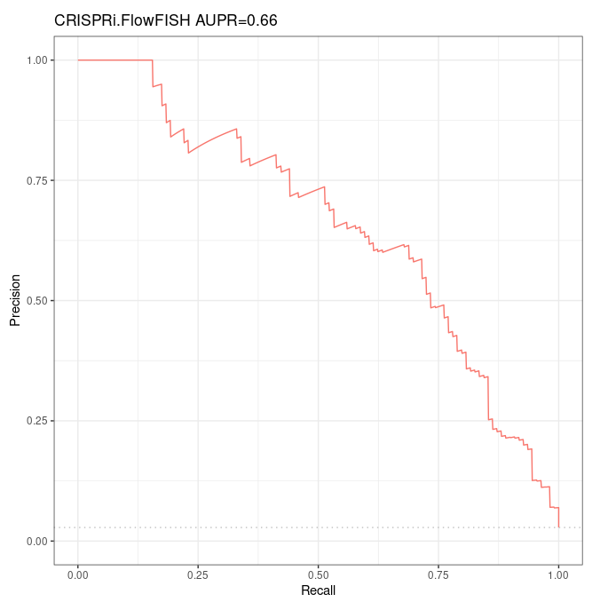

# Original ABC model predictions on K562

Adapted from [ABC model's README on github](https://github.com/broadinstitute/ABC-Enhancer-Gene-Prediction).

The Activity-by-contact model predicts which enhancers regulate which genes on a cell type specific basis.

## Characteristics for this run

* Here we verify that we find the same AUPR as Fulco et al, based on their (109 ground positives, 3754 ground negatives) CRISPRi-FlowFISH dataset, available in `/work2/project/regenet/results/gscreen/homo_sapiens/hg19/crispr-flowfish/k562` (private)
* These tables already contain the ABC scores, so there should be no difference at all between the AUPR and Precision-Recall curves we compute and the ones in Fulco et al paper. The objective was only to ensure we used the expected data *(later on we shall verify that we obtain the same ABC scores if we re-run the ABC model starting with these data)*.

## Preprocessing

To obtain the \texttt{CRiFF} reference set we first downloaded Table S6a from Fulco et al 2019 as a tsv file, and then obtained the 109 positive and the 3754 negative E/G relationships performing the following filters (the negatives are indeed defined as either not significant or not associated to a decrease in gene expression):

```bash
awk 'NR==2{gsub(/\ /,".",$0); header=$0; OFS="\t"; 
print header > "109.fulco.positives.tsv"; 
print header > "3754.fulco.negatives.tsv"}
NR>=3{
split($0,a,"\t");
if(a[6]!="promoter"&&(a[10]=="TRUE"||a[17]>0.8))
{ 
if(a[10]=="TRUE"&&a[8]<0)
{
print > "109.fulco.positives.tsv";
}
else
{
print > "3754.fulco.negatives.tsv";
}}}' tableS6a.tsv
```

Merging:

```bash
awk 'BEGIN{FS="\t"; OFS="\t"} {if(NR==1){printf "interaction\t"} else{printf "1\t"}; print $1, $2, $3, $5, $19, $22, $23}' 109.fulco.positives.tsv > 3863.fulco.tsv
```

```bash
tail -n +2 3754.fulco.negatives.tsv |awk 'BEGIN{FS="\t"; OFS="\t"} {print 0, $1, $2, $3, $5, $19, $22, $23}' >> 3863.fulco.tsv
```

> ```bash
> $ wc -l 3863.fulco.tsv 
> 3864
> ```

## Precision-Recall curves

We obtain the very same Precision-Recall curve and AUPR as Fulco et al (which was totally expected as we used their data directly, without computing anything by ourselves).

