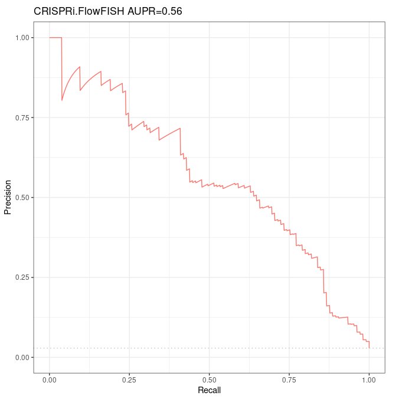

#  ABC model predictivity over K562 CRISPRi-FlowFISH

## Characteristics for this run

### Objectives

* To compute ABC predictions over K562 using same accessions as Fulco et al, then to verify we obtain same AUPR as Fulco et al over their CRISPRi-FlowFISH validation dataset.
* Here we focus on the intersection with the CRISPRi-FlowFISH validation dataset. See dedicated notebbok to see how predictions were computed.

### Accessions

* dnase_rep1 = "ENCFF001DOX"
  see https://www.encodeproject.org/files/ENCFF001DOX/
  
  > Original file name `hg19/wgEncodeUwDnase/wgEncodeUwDnaseK562AlnRep1.bam`
  
  (actually `wgEncodeUwDnaseK562AlnRep1.bam` is the name fiven in Supplementary Table 4)
  
* dnase_rep2 = "wgEncodeUwDnaseK562AlnRep2" 
            
            well we found the new accession name corresponding to wgEncodeUwDnaseK562AlnRep1.bam, ENCFF001DOX (archived), but not to `wgEncodeUwDnaseK562AlnRep2.bam`.
            Fortunately we found the file here: http://hgdownload.cse.ucsc.edu/goldenpath/hg19/encodeDCC/wgEncodeUwDnase/
            
* h3k27_rep1 = "ENCFF384ZZM" # exp ENCSR000AKP (same as Fulco et al)

* h3k27_rep2 = "ENCFF070PWH" # exp ENCSR000AKP (same as Fulco et al)

* rnaseq_rep1 = "ENCFF172GIN" # exp ENCSR000CPH (different from rnaseq used by Fulco et al)

* rnaseq_rep2 = "ENCFF768TKT" # exp ENCSR000CPH (different from Fulco et al rnaseq used by Fulco et al)

* gene_annotation = "/work2/project/fragencode/data/species.bk/homo_sapiens/hg19.gencv19/homo_sapiens.gtf"

* gnid_gname = "/work2/project/fragencode/data/species.bk/homo_sapiens/hg19.gencv19/homo_sapiens.gnid.gnname.tsv"

* blacklist_link = "https://github.com/Boyle-Lab/Blacklist/raw/master/lists/hg19-blacklist.v2.bed.gz"

* Ubiquitously expressed genes: obtained from Fulco et al Supplementary Tables

### General remarks

* We kept chromosomes only (we removed scaffolds) after calling peaks with macs2
* We concatenated the counts from the 2 DNase-seq replicates
* We averaged the gene expressions in TPM obtained from the 2 RNA-seq replicates

## Code

```bash
conda activate base && module load bioinfo/bedtools-2.27.1
```

```bash
srun --mem=64G --pty bash
```

> ```bash
> wc -l /work2/project/regenet/workspace/thoellinger/CRISPRi_FlowFISH/k562/3863.fulco.bedpe.sorted
> ```
>
> 3863
>
> ```bash
> bedtools intersect -sorted -u -a /work2/project/regenet/workspace/thoellinger/CRISPRi_FlowFISH/k562/3863.fulco.bedpe.sorted -b ABC_output/Predictions/AllPredictions.bedpe.sorted -g reference/chr_sizes |wc -l
> ```
>
> 3640

```bash
bedtools intersect -sorted -wo -a ABC_output/Predictions/AllPredictions.bedpe.sorted -b /work2/project/regenet/workspace/thoellinger/CRISPRi_FlowFISH/k562/3863.fulco.bedpe.sorted -g reference/chr_sizes > ABC_output/Predictions/enhancer_predictions_intersected_with_CRISPRi_FlowFISH.bedpe
```

> ```bash
> wc -l ABC_output/Predictions/enhancer_predictions_intersected_with_CRISPRi_FlowFISH.bedpe
> ```
>
> 1597054

Not perfect, but enough to continue.

When we keep only the lines for which the gene ids are the same, there are still > 3863 predictions. Actually, multiple candidates sometimes overlap the same validation element, resulting in multiple ABC scores for a single validation data.

How to choose which ones to keep?

## First strategy: we keep the ones that maximize the ABC score

### Processing

> ```bash
> awk 'BEGIN{FS="\t"} {if($7==$24){print $7, $24}}' ABC_output/Predictions/enhancer_predictions_intersected_with_CRISPRi_FlowFISH.bedpe |wc -l
> ```
>
> 3768

```bash
awk 'BEGIN{FS="\t"; OFS="\t"} {if($7==$24){print $23, $13, $14, $15, $24, $8, $25}}' ABC_output/Predictions/enhancer_predictions_intersected_with_CRISPRi_FlowFISH.bedpe |awk 'BEGIN{FS="\t"; OFS="\t"} {uniq=$1"\t"$2"\t"$3"\t"$4"\t"$5; if($6>val[uniq]){val[uniq]=$6}} END{for(u in val){print u, val[u]}}' > ABC_output/Predictions/Predictions_over_CRISPRi_FlowFISH.bedpe
```

> ```bash
> wc -l ABC_output/Predictions/Predictions_over_CRISPRi_FlowFISH.bedpe
> ```
>
> 3640

Over these 3640 predictions remaining (over 3863 contained in the validation dataset), 105 positives (among 109) remain. There are 128 `NA` values in the ABC scores, but none of them pertain to the 105 predictions for ground positives.

### Analysis with R (results)



