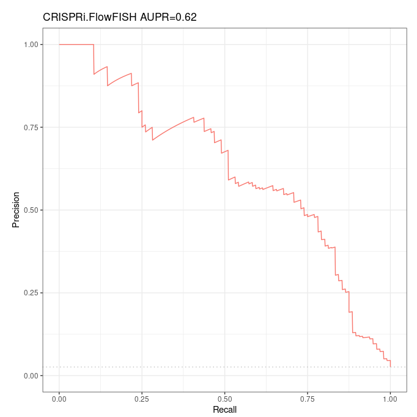
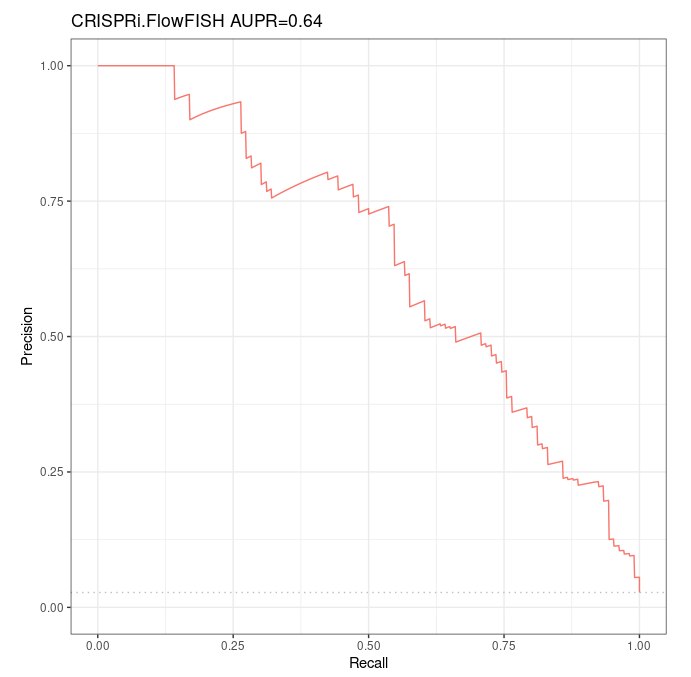

# Summary of our investigations on ABC model over Fulco et al 's CRISPRi-FlowFISH validation dataset

## Summary

### Motivations

In order to compare the performances of Fulco et al ‘s to other predictors over both Fulco et al ‘s CRISPRi-FlowFISH (CRiFF) reference dataset for enhancer-gene interactions, and Moore et al ‘s Benchmarks of Enhancers-Gene Interactions (BENGI), we performed several tests to ensure that we use the ABC model correctly. To that purpose, we tried to obtain similar AUPR to those given by Fulco et al ‘s, for the predictions made by their ABC model over their CRiFF validation dataset.

### General remarks

- We have done everything in our power to maximize the intersection between our accessions and reference annotations and those used by Fulco et al, **only for the fourth (RefSeq 59) and fifth (RefSeq 56) run. For all the other runs, we could have done better.** 
- In the CRiFF dataset, containing 3863 element-gene pairs, of which 109 are considered as ground positives, and the other as ground negatives ; there are exactly 59 distinct genes involved. We found a change in the nature for 3 of them, which became non-coding in the RefSeq (p13) annotation we used.

These 3 non-conding genes are involved in 6 ground positives of CRiFF, so that if we consider coding genes only, the CRiFF validation dataset restricts to exactly 103 ground positives, and a total of 3854 element-gene pairs.

- We did not use any includelist (not even containing only the 500 bp regions around the TSS of coding genes) when computing predictions over the BENGI datasets.
- To ensure the ABC model computes predictions for the validations dataset we’re interested in, whatever it is ; we see two main methods, none of which is described in Fulco et al ‘s paper / Github:
  1. forcibly include the regions of interest in candidate regions using the includelist
  2. bypass step 1 by directly providing the ABC model with the regions of interest

This second way seems quite unnatural and biased, but this is the one we used when computing predictions with the ABC model over BENGI validation datasets. Maybe we should try to run new predictions over BENGI datasets using an includelist. Proceeding way 1 or 2 induced huge differences over the CRiFF set - that is likely the same with BENGI.

### Accessions we used when working with RefSeq (not with GENCODE)

#### **Chromatin accessibility (****DNase-seq)**

- dnase_rep1 = ENCFF001DOX see https://www.encodeproject.org/files/ENCFF001DOX/

The name given in Supplementary Table 4 is actually wgEncodeUwDnaseK562AlnRep1.bam, yet it is mentioned in the link given above that hg19/wgEncodeUwDnase/wgEncodeUwDnaseK562AlnRep1.bam is nothing but the original name given to the replicate which is now referred to as ENCFF001DOX.

- dnase_rep2 = wgEncodeUwDnaseK562AlnRep2

I did not manage to find a new name corresponding to replicate 2, wgEncodeUwDnaseK562AlnRep2.bam. Fortunately the replicate 2 was available for download under its old name here: http://hgdownload.cse.ucsc.edu/goldenpath/hg19/encodeDCC/wgEncodeUwDnase/

#### **Histone marks h3k27ac (ChIP-seq)**

- h3k27_rep1 = ENCFF384ZZM # exp ENCSR000AKP (same as Fulco et al)
- h3k27_rep2 = ENCFF070PWH # exp ENCSR000AKP (same as Fulco et al)

Here is all the information given in Supplementary Table 4: 

ENCFF384ZZM, ENCFF070PWH

ENCFF070PWH used for reproducibility analysis only (Supplementary Fig. 4). **Not** used to compute ABC score

Note that it is clearly written that **replicate 2 was not used** to compute the ABC score.

#### **Gene expression (polyA+ RNA-seq)**

Fulco et al. give the [following GEO accession](https://www.ncbi.nlm.nih.gov/geo/query/acc.cgi?acc=GSE87257) in Supplementary Table 4: GSE87257. The title of this serie in GEO browser is "Systematic mapping of functional enhancer-promoter connections with CRISPR interference". 

**Note that this accession is never (and shall not be!) used to compute the ABC predictions. The RNA-seq data are the one used to build the CRISPRi-FlowFISH validation dataset.**

Yet gene expression is required to run the ABC model (only to distinguish between expressed and non expressed genes), and the authors did not provide the accession they used to that purpose (neither in the paper nor the Supplementary information). Hopefully, the accession name **ENCFF934YBO** appears in the small example they give in their Github over chr22. Based on this, we used the following:

- rnaseq = ENCFF934YBO # exp ENCSR000AEM

#### **Gene annotation**

- *gene_annotation*: we downloaded it from https://hgdownload.soe.ucsc.edu/goldenPath/hg19/bigZips/genes/hg19.refGene.gtf.gz

and performed several filters, depending on the run.

The hg19.refGene.gtf file contains transcripts, CDS, exons, start_codon, stop_codon, 3UTR and 5UTR.

Taking only coding genes we obtain a total of 19366 genes.

Taking only coding genes, the full body of which is between 300 kbp and 2 Mbp, we obtain a total of 19323 genes.

- *gnid_gname*: /work2/project/fragencode/data/species.bk/homo_sapiens/hg19.gencv19/homo_sapiens.gnid.gnname.tsv

required to create the expression table as counts as the RNA-seq TSV used contains Ensembl gene ids, not RefSeq gene names.

#### **Blocklist**

Provided by Fulco et al. https://github.com/Boyle-Lab/Blacklist/raw/master/lists/hg19-blacklist.v2.bed.gz

It consists of regions described by their genomic loci, not gene names/ids.

#### **Ubiquitously expressed genes**

List provided by Fulco et al. It contains 847 gene names. Unfortunately, only 791 of these genes match our custom RefSeq annotation.

Note that of those 847 gene names, only 831 match Fulco et al ‘s full (before filters) RefSeq annotation, so...

For some runs, we directly used the 847 gene names or the 791 gene names that match our custom RefSeq annotation. For some others (fourth run, RefSeq59 ; and fifth run, RefSeq 56), we intersected the 831/847 gene names matching Fulco et al’s full annotation (and only these ones, for which we have the respective loci) with our custom RefSeq annotation. This resulted in a list of 844 ubiquitously expressed genes.

All these files can be found in

/work2/project/regenet/workspace/thoellinger/ABC-Enhancer-Gene-Prediction/reference

under the following names

- [UbiquitouslyExpressedGenesHG19.txt](http://UbiquitouslyExpressedGenesHG19.txt) (847)
- [UbiquitouslyExpressedGenesHG19_with_gene_details_from_table_S5b_intersected_with_our_RefSeq_filtered_annotation.txt](http://UbiquitouslyExpressedGenesHG19_with_gene_details_from_table_S5b_intersected_with_our_RefSeq_filtered_annotation.txt) (844)
- [UbiquitouslyExpressedGenesHG19_with_gene_details_from_table_S5b_intersected_with_our_RefSeq_filtered_annotation_with_3_more_genes.txt](http://UbiquitouslyExpressedGenesHG19_with_gene_details_from_table_S5b_intersected_with_our_RefSeq_filtered_annotation_with_3_more_genes.txt) (844)

## To conclude

One shall better focus on 4th and 5th runs. The other ones are only here for record and comparison purposes.

Note that the reference should be run 5th. For run 4th willingly, I willingly included 3 non-coding genes "by hand" - therefore introduced a bias - in order to match the old annotation used by Fulco et al. (in which those 3 genes were still considered as coding, whereas now they aren't).

## First run (GENCODE)

### Notebook

[http://genoweb.toulouse.inra.fr/~thoellinger/notes/notes_ABC/K562/ABC_over_K562.html](http://genoweb.toulouse.inra.fr/~thoellinger/notes/notes_ABC/K562/ABC_over_K562.html)

### Accessions

- DNase-seq accessions , ChIP-seq and blacklist are the very same as those used by Fulco et al
- I used 2 RNA-seq replicates, none of which is the same as the one used by Fulco et al
- The gene annotation is not the same at all. Fulco et al used a RefSeq annotation ; here I used a GENCODE annotation (GRCh37 version 19). Moreover, I used all 57,228 genes (coding + non-coding, without constraints on gene body length).
- Ubiquitously expressed genes: we directly used the 847 Ubiquitously expressed genes names provided by Fulco et al., but only 791 of them are in the gene annotation we used.
- Validation dataset: the whole CRiFF validation dataset, yet we have only 3640 predictions (out of 3863 element-gene pairs in the CRiFF dataset). 105 positives (among 109 in CRiFF) remain. We had to arbitrarily choose between multiple distinct predictions for the same element
- We **did** not include TSS-centred 500 bp regions in the includelist. We did not even used an includelist. We should have.
- We **did not** include candidate regions found in the validation dataset in the includelist.  We found predictions for only 3640 pairs our of the 3863 pairs of the validation dataset. Moreover, we had to arbitrarily choose between multiple distinct predictions for the same element-gene pair of the validation dataset, in some cases (~100 cases). We chose to keep the ones that maximize the ABC score. We obtained predictions for 105 positives out of 109 ground positives.
- In Step 1, we used nStrongestPeaks 150,000. We should have used nStrongestPeaks 175,000 as this is the default parameter and Fulco et al suggest to use 150,000 only for other cell lines. We obtained only 136,205 candidate regions where Fulco et al obtained 162,181 candidate regions.

### Comments

- A lot of improvements could have been made. We should use the same RNA-seq replicate as Fulco et al, filter our GENCODE annotation for coding genes, the body of which must be comprised between 300 kbp and 2 Mbp, we should intersect the ubiquitously expressed gene names with our gene annotation to have more ubiquitously expressed genes, we should use a white-list, and we should keep 175,000 peaks instead of 150,000.

### Results

We have done so many inaccuracies that the results we obtained are not really relevant. Yet, we still obtained a decent AUPR of 0,56.

## Second run (RefSeq 54 outside whitelist)

### Notebook

[http://genoweb.toulouse.inra.fr/~thoellinger/notes/notes_ABC/K562/april_K562_candidates_not_in_whitelist_56_genes/april_K562_candidates_NOT_in_whitelist.html](http://genoweb.toulouse.inra.fr/~thoellinger/notes/notes_ABC/K562/april_K562_candidates_not_in_whitelist_56_genes/april_K562_candidates_NOT_in_whitelist.html)

### Accessions

- DNase-seq, ChIP-seq and blacklist are the same as those used by Fulco et al. polyA+
- RNA-seq is likely the same. 
- The gene annotation is not the same but should be similar: starting from the most recent (p13) RefSeq annotation over GRCh19, we first kept only coding genes, the body of which is between 300 kbp and 2 Mbp.
- Ubiquitously expressed genes: we directly used the 847 Ubiquitously expressed genes names provided by Fulco et al., but only 791 of them are in the gene annotation we used.
- Validation dataset: we kept only the part of the CRiFF validation dataset (involving 59 genes) involving one of the 56 coding genes ; and replaced 2 gene names with gene names that match our curated RefSeq annotation ; so that each of the 56 gene name contained in our custom CRiFF dataset is found in our custom RefSeq annotation.
- TSS-centred 500 bp regions: For each gene, we chose the TSS that maximizes the number of distinct coding isoforms using this TSS. This is the method Fulco et al used. We included all these TSS-centred regions in the white-list, as Fulco et al did.
- We **did not** include candidate regions found in the validation dataset in the white-list.  Doing so, we found predictions for only 3681 pairs our of the 3863 pairs of the validation dataset. Moreover, we had to arbitrarily choose between multiple distinct predictions for the same element-gene pair of the validation dataset, in some cases (~100 cases). We chose to keep the ones that maximize the ABC score. We obtained predictions for only 96 positives out of 109 ground positives.
- In Step 1, we used nStrongestPeaks 175,000 as this is the default parameter and Fulco et al suggest to use 150,000 only for other cell lines. We obtained 163,706 candidate regions where Fulco et al obtained 162,181 candidate regions.

### Comments

- In this run, we did not include all regions of the validation dataset in the whitelist. Not only this resulted in lacking predictions for a lot of element-gene pairs of the validation dataset, but also we had to make an arbitrary choice between multiple predictions for a single reference pair in some cases. In the following runs, we directly included in the whitelist all regions found in the validation dataset, and this solved the problem.
- In this run, we worked with 791 (out of 847 provided by Fulco et al) ubiquitously expressed genes. We could have done better: in the following run, we obtained 844 genes that intersect one of the Fulco et al ‘s 831 ubiquitously expressed genes for which we have a detailed annotation.

### Results

The ABC model made predictions for 3681 of the 3863 pairs contained in the CRiFF validation dataset. We had to arbitrarily choose between multiple distinct predictions for the same element-gene pair of the validation dataset, in ~ 100 cases. We have predictions for 96 ground positives only over 109 ground positives.

Over this reduced validation dataset containing 96 ground positives and 3585 ground negatives, the Precision-Recall curve is as follows:

Note that this AUPR can not strictly speaking be compared to the AUPR of 0,65 found by Fulco et al, as we work with a smaller validation dataset (with ~12% less ground positives).

###  

## Third run (RefSeq 54 in whitelist)

Irrelevant. Same as fifth run but of poorer quality (here we did not deal with the 2 coding genes, the name of which has changed, in the CRiFF set). Better see fourth and fifth runs.

## Fourth run (RefSeq 59)

### Notebook

[http://genoweb.toulouse.inra.fr/~thoellinger/notes/notes_ABC/K562/april_K562_59_genes/april_K562_59_genes.html](http://genoweb.toulouse.inra.fr/~thoellinger/notes/notes_ABC/K562/april_K562_59_genes/april_K562_59_genes.html)

### Accessions

- DNase-seq, ChIP-seq and blacklist are the same as those used by Fulco et al. polyA+
- RNA-seq is likely the same. 
- The gene annotation is not the same but should be similar: starting from the most recent (p13) RefSeq annotation over GRCh19, we first kept only coding genes, the body of which is between 300 kbp and 2 Mbp. Then we added by hand the 3/59 genes in the CRiFF validation dataset, the nature of which has changed to non-coding.
- Ubiquitously expressed genes: we intersected the 847 Ubiquitously expressed genes names provided by Fulco et al., with the full gene annotation they used, in order to retrieve genomic loci of these genes. This resulted in a list of 831 genes. Then, we intersected these 831 genes with our custom RefSeq annotation. Finally, we obtained a list of 844 ubiquitously expressed genes.
- Validation dataset: we kept the whole CRiFF validation dataset (involving 59 genes), but we replaced 2 gene names with gene names that match our curated RefSeq annotation ; so that every gene name is found in our RefSeq annotation.
- TSS-centred 500 bp regions: For each gene, we chose the TSS that maximizes the number of distinct coding isoforms using this TSS. This is the method Fulco et al used. We included all these TSS-centred regions in the white-list, as Fulco et al did.
- To ensure that predictions are computed for all pairs of the validations dataset, we also included in the white-list all candidate regions found in the validation dataset. We don’t know if this is the right way to proceed. Doing so, we found predictions for 3860 pairs our of the 3863 pairs of the validation dataset. The 3 pairs for which we have no predictions are 3 ground positives, ie we have predictions for 106/109 ground positives only.
- In Step 1, we used nStrongestPeaks 175,000 as this is the default parameter and Fulco et al suggest to use 150,000 only for other cell lines. We obtained 163,654 candidates regions where Fulco et al obtained 162,181 candidate regions.

### Comments

- Please note that this run is willingly biased, as we included by hand 3 non-coding genes after having filtered our annotation to keep only coding genes. Doing so, we wanted to forcibly include all 59 genes of the whole CRiFF validation dataset in our gene annotation file, in order to verify that in similar conditions, we find similar performances as Fulco et al did. Hopefully we do (AUPR=0,64 where Fulco et al found 0,65, see results below). We recall that these 3 non-coding genes were still considered as coding genes in the old annotation used by Fulco et al.

### Results

The ABC model made predictions for 3860 of the 3863 pairs contained in the CRiFF validation dataset. The 3 pairs missing are ground positives - that is, we have predictions for 106 ground positives only over 109 ground positives.

Over this reduced validation dataset containing 106 ground positives and 3754 ground negatives, the Precision-Recall curve is as follows:

We recall that over their whole CRiFF validation dataset, in very similar conditions / with similar accessions, Fulco et al. found an AUPR of 0,65 ; yet with a quite different Precision-Recall curve.

## Fifth run (RefSeq 56)

### Notebook

[http://genoweb.toulouse.inra.fr/~thoellinger/notes/notes_ABC/K562/april_K562_56_genes/april_K562_56_genes.html](http://genoweb.toulouse.inra.fr/~thoellinger/notes/notes_ABC/K562/april_K562_56_genes/april_K562_56_genes.html)

### Accessions

- DNase-seq, ChIP-seq and blacklist are the same as those used by Fulco et al. polyA+
- RNA-seq is likely the same. 
- The gene annotation is not the same but should be similar: starting from the most recent (p13) RefSeq annotation over GRCh19, we first kept only coding genes, the body of which is between 300 kbp and 2 Mbp.
- Ubiquitously expressed genes: we intersected the 847 Ubiquitously expressed genes names provided by Fulco et al., with the full gene annotation they used, in order to retrieve genomic loci of these genes. This resulted in a list of 831 genes. Then, we intersected these 831 genes with our custom RefSeq annotation. Finally, we obtained a list of 844 ubiquitously expressed genes (the same as in fourth run).
- Validation dataset: we kept only the part of the CRiFF validation dataset (involving 59 genes) involving one of the 56 coding genes ; and replaced 2 gene names with gene names that match our curated RefSeq annotation ; so that each of the 56 gene name contained in our custom CRiFF dataset is found in our custom RefSeq annotation.
- TSS-centred 500 bp regions: For each gene, we chose the TSS that maximizes the number of distinct coding isoforms using this TSS. This is the method Fulco et al used. We included all these TSS-centred regions in the white-list, as Fulco et al did.
- To ensure that predictions are computed for all pairs of our custom validation dataset, we also included in the white-list all candidate regions found in the validation dataset. We don’t know if this is the right way to proceed. Doing so, we found predictions for 3851 pairs our of the 3863 pairs of the validation dataset. Of the 12 pairs for which we have no predictions, 9 are ground positives, ie we have predictions for 100 /109 ground positives only.
- In Step 1, we used nStrongestPeaks 175,000 as this is the default parameter and Fulco et al suggest to use 150,000 only for other cell lines. We obtained 163,653 candidates regions where Fulco et al obtained 162,181 candidate regions.

### Comments

- The custom CRiFF validation dataset (let’s denote it cCRiFF for coding-CRiFF) we used contains 3854 element-gene pairs (out of 3863 in the whole CRiFF set) and involves 56 genes (out of 59). This is the dataset we will consider as the right reference CRISPRi-FlowFISH dataset starting from now, when working with the RefSeq p13 annotation.

### Results

The ABC model made predictions for 3851 of the 3854 pairs contained in the cCRiFF validation dataset. We have predictions for 100 ground positives only over 109 ground positives in the CRiFF dataset (103 in the cCRiFF dataset).

Over this reduced validation dataset containing 100 ground positives and 3751 ground negatives, the Precision-Recall curve is as follows:

As the coding-CRiFF set is the one we take as reference, we shall consider this AUPR of 0,63 as **the** AUPR we found for ABC model over K562 CRiFF. Note that this AUPR can not strictly speaking be compared to the AUPR of 0,65 found by Fulco et al, as we work with a smaller validation dataset (with ~10% less ground positives).

 