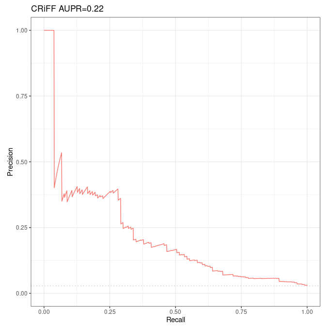

# Guidelines to run the Moore et al 's Average rank method over Fulco et al CRISPRi-FlowFISH validation dataset for K562

## Prerequisites

### Step 1: run Distance method

See [dedicated guide](../distance_method/distance_over_fulco_et_al_crispri.html).

### Step 2: run DNase-expression correlation method

See [dedicated guide](../dnase_expression_correlation/correlation_method_with_code.html).

## Partial reimplementation of `Run-Average-Rank.sh`

We adapted of `local_Scripts/Unsupervised-Methods/Run-Average-Rank.sh` in `local_Scripts/Unsupervised-Methods/CRISPRiFF_Run-Average-Rank.sh` to use the CRISPRi-FlowFISH validation dataset. 

```bash
#!/bin/bash

# Inserm computer
#workDir=~/Documents
# Personal computer
#workDir=~/Documents/INSERM
# Genotoul
workDir=/work2/project/regenet/workspace/thoellinger

distance=$workDir/BENGI/Distance-Method/Results/K562.CRISPRi-FlowFISH-Distance.txt
correlation=$workDir/BENGI/Correlation-Methods/Sheffield/Results/K562.CRISPRi-FlowFISH-Correlation.txt

output_dir=$workDir/BENGI/Correlation-Methods/Average-Rank
mkdir -p $output_dir

# if the local decimal separator in bash is "," (personal computer, genotoul, ...)
paste $distance $correlation |awk '{print $1 "\t" $2 "\t" $6}' |tr . , | \
    sort -k2,2gr | awk 'BEGIN{x=0;r=0}{if (x != $2) r +=1; print $0 \
    "\t" r; x=$2}' | sort -k3,3gr | awk 'BEGIN{x=0;r=0}{if (x != $3) \
    r +=1; print $0 "\t" r "\t" ($NF+r)/2; x=$3}' | sort -k6,6g | \
    awk '{print $1 "\t" 1/$6 "\t" $2 "\t" $3 "\t" $4 "\t" $5 "\t" $6}' |tr , . > $output_dir/K562.CRISPRi-FlowFISH-Average-Rank.txt

# if the local decimal separator in bash is ".":
#paste $distance $correlation | awk '{print $1 "\t" $2 "\t" $6}' | \
#    sort -k2,2gr | awk 'BEGIN{x=0;r=0}{if (x != $2) r +=1; print $0 \
#    "\t" r; x=$2}' | sort -k3,3gr | awk 'BEGIN{x=0;r=0}{if (x != $3) \
#    r +=1; print $0 "\t" r "\t" ($NF+r)/2; x=$3}' | sort -k6,6g | \
#    awk '{print $1 "\t" 1/$6 "\t" $2 "\t" $3 "\t" $4 "\t" $5 "\t" $6}' > $output_dir/K562.CRISPRi-FlowFISH-Average-Rank.txt
```

Note that we replaced

> ```bash
> sort -k3,3gr | awk 'BEGIN{x=0;r=0}{if (x != $2) \
>     r +=1; print $0 "\t" r "\t" ($NF+r)/2; x=$2}' 
> ```

which seems to be an error, with

> ```bash
> sort -k3,3gr | awk 'BEGIN{x=0;r=0}{if (x != $3) \
>     r +=1; print $0 "\t" r "\t" ($NF+r)/2; x=$3}' 
> ```

The reason is that the code does as follows:

*  first, distance and correlation results (which are assumed sorted the very same way - which is the case if they were computed using the dedicated guides) are merged
*  then, the rank of inverse distances are computed (the smaller the distance, the smaller the rank) with `sort -k2,2gr | awk 'BEGIN{x=0;r=0}{if (x != $2) r +=1; print $0 "\t" r; x=$2}'`. So the condition on `x=$2` (`$2` being the inverse distance) ensures the rank remains the same when consecutive inverse distances are constant.
*  then, the rank of the DNase-expression correlation method, plus the average distance-correlation rank, are computed (the greater the correlation, the smaller the rank) with `sort -k3,3gr | awk 'BEGIN{x=0;r=0}{if (x != $3) r +=1; print $0 "\t" r "\t" ($NF+r)/2; x=$3}'`. So a condition on `$2` (value of the inverse distance) instead of `$3` (the correlation) would not make sense.

**One should also note that we added `tr . ,` at the beginning of the code and `tr , .` at the end. This is needed on every computer where bash default decimal separator is "," instead of ".".**

At the end of the day, the fields are as follow:

* interaction (ground truth)
* final score = 1 / (average rank), such that the smaller the rank, the greater the score (=> high score = interaction suspected)
* inverse distance
* DNase-expression correlation
* inverse distance rank (the smaller the distance, the smaller the rank)
* DNase-expression correlation rank (the greater the correlation, the smaller the rank)
* average rank (= 1 over final score)

## Running the code for BENGI benchmarks over GM12878

If working on Genotoul:

```bash
conda activate base && conda activate abcmodel && conda activate py2 && module load bioinfo/bedtools-2.27.1
```

```bash
srun --pty bash
```

Now:

```bash
./local_Scripts/Unsupervised-Methods/CRISPRiFF_Run-Average-Rank.sh
```

## Analysis with R

### Code

```{css,echo=F}
.badCode {
background-color: #C9DDE4;
}
```

```{r setup, echo=FALSE, cache=FALSE}
library(knitr)
## Global options
options(max.print="75")
opts_chunk$set(echo=TRUE,
	             cache=FALSE,
               prompt=FALSE,
               tidy=TRUE,
               comment=NA,
               message=FALSE,
               warning=FALSE,
               class.source="badCode")
opts_knit$set(width=75)
```

```{r}
library(ggplot2)
library(ggpubr) # for ggarrange
library(dplyr) # for bind_rows

# Tools for precision-recall : (see https://classeval.wordpress.com/tools-for-roc-and-precision-recall/)
library(precrec)
#library(ROCR)
#library(pROC)
#library(PRROC)
```

```{r, results="hide"}
rm(list = ls())

# Personal
work_dir = "~/Documents/INSERM/"
# Inserm
#work_dir = "~/Documents/"

#####################
## Distance method ##
#####################

path_to_results = paste(work_dir, "BENGI/Correlation-Methods/Average-Rank/", sep='')
file_names = c("K562.CRISPRi-FlowFISH-Average-Rank.txt")
short_names = c('CRiFF')

nb_files = length(file_names)

colnames <- c('interaction', 'score', 'inverse.distance', 'correlation', 'inverse.distance.rank', 'correlation.rank', 'average.rank')
results <- sapply(file_names, simplify=FALSE, function(file_name){
  Df <- read.table(paste(path_to_results, as.character(file_name), sep=''), sep='\t')
  Df[[1]] <- factor(Df[[1]], levels=c(0,1), labels=c("no interaction", "interaction"))
  names(Df) <- colnames
  return(Df)
})
names(results) <- short_names

#library(dplyr)
All_results <- bind_rows(results, .id = 'method')
```

```{r}
ggplot(aes(y = average.rank, x = method, fill = interaction), data = All_results) + geom_boxplot()
```

```{r}
sscurves_avg_rank <- list()
sscurves_avg_rank <- sapply(results, simplify=FALSE, function(Df){
  evalmod(scores = Df$score, labels = Df$interaction) # comes with "precrec" library
})
```


```{r}
#library(ggplot2)
p1 <- autoplot(sscurves_avg_rank[[1]], curvetype = c("PRC")) + ggtitle(paste(short_names[1], signif(attr(sscurves_avg_rank[[1]], 'auc')[[4]][2], digits=2), sep = " AUPR="))

# ggarrange comes with library('ggpubr')
figure <- ggarrange(p1,
                    ncol = 1, nrow = 1)
figure
```

### Results



*Precision-Recall curves and AUPR of Moore et al's Average-rank method over Fulco et al validation dataset intersected with ccRE (103 positives and 3569 negatives).*

