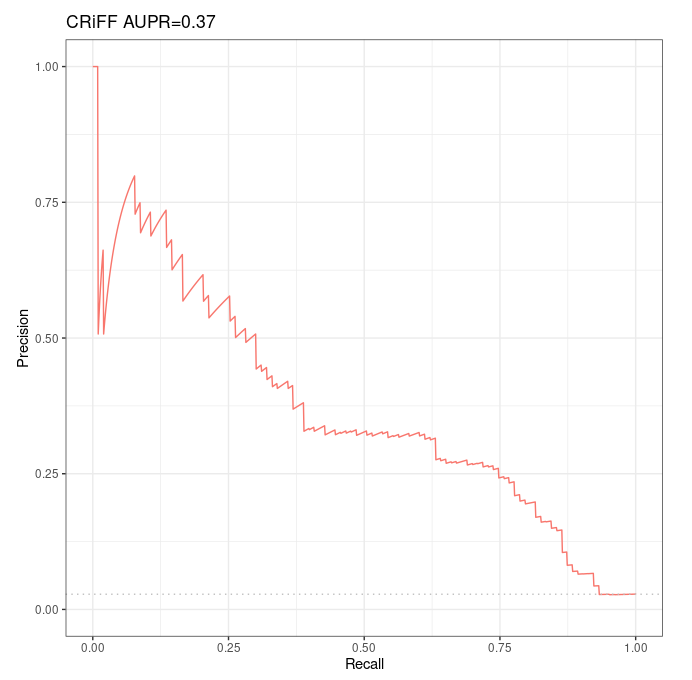

# Evaluation of Moore et al 's Distance Method over Fulco et al CRISPRi-FlowFISH validation dataset

## Requirements

* `Python 2` for `rank.distance.py` which is called by `Run-Distance-Method.sh`
* the CRISPRi-FlowFish validation dataset from Fulco et al 2019, which is composed of 109 ground positives + 3752 ground negatives, see introduction
* list of all ccRE
* TSS annotation

## Data preprocessing

We start with the following:

```bash
$workDir/CRISPRi_FlowFISH/
└── k562
    ├── 109.fulco.positives.tsvbas
    ├── 3754.fulco.negatives.tsv
    ├── 3863.fulco.tsv
    ├── fulco_2019_som.pdf
    ├── fulco_natgenet_2019_ep_reg_1000s_crispr.pdf
    ├── fulco_somtables.xlsx
    ├── README.sh
    ├── tableS3a.tsv
    └── tableS6a.fromrow2.tsv
```

> ```bash
> $ head -n 3 CRISPRi_FlowFISH/k562/3863.fulco.tsv
> ```
>
> interaction	chr	start	end	Normalized.HiC.Contacts	Activity	ABC.Score
> 1	chr8	128969925	128972445	14.38244355	4.994596	0.00562307801
> 1	chr8	128973565	128976065	14.38244355	8.63099	0.009717048201

We must convert `3863.fulco.tsv` in the suitable file format for `Run-Distance-Method.sh`, which is as follows:

> ```bash
> $ head -n 1 Benchmark/All-Pairs.Natural-Ratio/GM12878.CHiC-Benchmark.v3.txt
> ```
>
> EH37E0279866	ENSG00000271614.1	1 	cv-3

Hence we will have to `bedtools intersect` the validation dataset with ccRE. First we need to convert the validation dataset to bedpe, so we do:

```bash
tail -n +2 3863.fulco.tsv > 3863.fulco.noheader.tsv
```

```bash
awk 'BEGIN{FS="\t"; OFS="\t"} {if(NR==FNR){gnid[$2]=$1; next}; print $2, $3, $4, ".", -1, -1, $2":"$3"-"$4"::"$5, $8, ".", ".", $1, gnid[$5]}' /work2/project/fragencode/data/species.bk/homo_sapiens/hg19.gencv19/homo_sapiens.gnid.gnname.tsv 3863.fulco.noheader.tsv > 3863.fulco.bedpe
```

yielding:

> ```bash
> head -n 5 3863.fulco.bedpe
> ```
>
> chr8	128969925	128972445	.	-1	-1	chr8:128969925-128972445::MYC	0.00562307801	.	.	1	ENSG00000136997.10
> chr8	128973565	128976065	.	-1	-1	chr8:128973565-128976065::MYC	0.009717048201	.	.	1	ENSG00000136997.10
> chr8	130702125	130704625	.	-1	-1	chr8:130702125-130704625::MYC	0.04272163371	.	.	1	ENSG00000136997.10
> chr8	130709145	130711645	.	-1	-1	chr8:130709145-130711645::MYC	0.006183403862	.	.	1	ENSG00000136997.10
> chrX	48641372	48641493	.	-1	-1	chrX:48641372-48641493::GATA1	0.0921316669	.	.	1	ENSG00000102145.9

Problem: for 3 lines, no gene id is found, as we see with:

> ```bash
> awk 'BEGIN{FS="\t"} {occurence[$12]++} END{for(u in occurence){print u, occurence[u]}}' 3863.fulco.bedpe |sort -rnk2,2
> ```

Moreover, 2 of these 3 lines are ground positives:

> ```bash
> awk 'BEGIN{FS="\t"} {if($12==""){print $0}}' 3863.fulco.bedpe 
> ```
>
> chr8	130701606	130701940	.	-1	-1	chr8:130701606-130701940::PVT1-TSS1	0.002177529321	.	.	1	
> chr8	130704704	130705463	.	-1	-1	chr8:130704704-130705463::PVT1-TSS1	0.00565028776	.	.	1	
> chr8	130594026	130594707	.	-1	-1	chr8:130594026-130594707::PVT1-TSS1	0.0005465308981	.	.	0

What should we do? We propose to manually replace the gene name `PVT1-TSS1` with `PVT1`, which, this time, is found in our reference `gnid_gname`:

> ```bash
> awk '$2 ~ /(^PVT1$)/' /work2/project/fragencode/data/species.bk/homo_sapiens/hg19.gencv19/homo_sapiens.gnid.gnname.tsv
> ```
>
>
> ENSG00000249859.3	PVT1

So we do:

> ```bash
> # verify it's ok / 3 occurences of "ENSG00000249859.3" should be found
> awk 'BEGIN{FS="\t"; OLS="\t"} {if($12!=""){print $0} else{print $0"ENSG00000249859.3"}}' 3863.fulco.bedpe |awk 'BEGIN{FS="\t"} {occurence[$12]++} END{for(u in occurence){print u, occurence[u]}}' |sort -rnk2,2
> ```

If it's ok then:

```bash
mv 3863.fulco.bedpe temp && awk 'BEGIN{FS="\t"; OLS="\t"} {if($12!=""){print $0} else{print $0"ENSG00000249859.3"}}' temp > 3863.fulco.bedpe && rm temp
```

Now we need to sort it. In Fulco et al 2019 paper we found:

> **Genome build**. All coordinates in the human genome are reported using build hg19.

So we use the following genome file: `/work2/project/regenet/workspace/thoellinger/ABC-Enhancer-Gene-Prediction/reference/chr_sizes`. Now:

```bash
srun --mem=8G --pty bash
```

```bash
conda activate base && module load bioinfo/bedtools-2.27.1
```

```bash
bedtools sort -faidx /work2/project/regenet/workspace/thoellinger/ABC-Enhancer-Gene-Prediction/reference/chr_sizes -i 3863.fulco.bedpe > 3863.fulco.bedpe.sorted
```

```bash
bedtools sort -faidx /work2/project/regenet/workspace/thoellinger/ABC-Enhancer-Gene-Prediction/reference/chr_sizes -i /work2/project/regenet/workspace/thoellinger/BENGI/Benchmark/Annotations/hg19-cCREs.bed > /work2/project/regenet/workspace/thoellinger/BENGI/Benchmark/Annotations/hg19-cCREs.sorted.bed
```

Finally:

```bash
bedtools intersect -sorted -wo -a 3863.fulco.bedpe.sorted -b /work2/project/regenet/workspace/thoellinger/BENGI/Benchmark/Annotations/hg19-cCREs.sorted.bed -g /work2/project/regenet/workspace/thoellinger/ABC-Enhancer-Gene-Prediction/reference/chr_sizes > 3863_ccRE_intersect.fulco.tsv
```

Remark: I don't really understand why it was necessary to provide the genome file for `bedtools intersect` (it did not work without the genome file). Until now, I think I never had to provide the genome file when using `bedtools intersect`.

> ```bash
> $ wc -l 3863_ccRE.fulco.tsv 
> 5111
> ```
>
> ```bash
> $ head -n 1 3863_ccRE_intersect.fulco.tsv 
> ```
>
> chr1	3691278	3691778	.	-1	-1	chr1:3691278-3691778::CEP104	0.02606174446	.	.	15.67532312	8.056414	chr1	3690934	3693352	EH37D0003113	EH37E1056193	Promoter-like	500

Now, when there are more than 1 line for a single entry of Fulco et al. validation dataset, we keep only the one that maximize the intersect with the ccRE (note: later on we shall verify that it is okay to use all ccRE - I mean, if it would not be better to use only ccRE-dELS, to prevent reducing the intersection if we need to evaluate the predictions on the BENGI datasets...)

Doing so, only 3672 lines remain: we lost 191 pairs. Among these pairs, 103 positives remain.

```bash
awk 'BEGIN{FS="\t"; OFS="\t"} {if($19>intersection[$7]){intersection[$7]=$19; line[$7]=$17"\t"$12"\t"$11}} END{for(u in line){print line[u]}}' 3863_ccRE_intersect.fulco.tsv > 3672_ccRE_gene_pairs.fulco.txt
```

## Partial reimplementation

### Introduction

First of all we made a copy of all scripts, ie we duplicated `Scripts` folder in a new folder which we named `local_Scripts`.

### Content of `Run-Distance-Method.sh`

We adapted of `local_Scripts/Unsupervised-Methods/Run-Distance-Method.sh` in `local_Scripts/Unsupervised-Methods/CRISPRiFF_Run-Distance-Method.sh` to use the CRISPRi-FlowFISH validation dataset. 

```bash
#!/bin/bash

# Inserm computer
#workDir=~/Documents
# Personal computer
#workDir=~/Documents/INSERM
# Genotoul
workDir=/work2/project/regenet/workspace/thoellinger

setDir=$workDir/CRISPRi_FlowFISH
train=$setDir/3672_ccRE_gene_pairs.fulco.txt
outputDir=$workDir/BENGI/Distance-Method/Results
ccres=$workDir/BENGI/Benchmark/Annotations/hg19-cCREs.bed
scriptDir=$workDir/BENGI/local_Scripts/Unsupervised-Methods
tss=$workDir/BENGI/Benchmark/Annotations/GENCODEv19-TSSs.bed

mkdir -p $outputDir

python $scriptDir/rank.distance.py $tss $ccres \
 $train $outputDir/K562.CRISPRi-FlowFISH-Distance.txt.unsorted

sort -t $'\t' -k 3,4 $outputDir/K562.CRISPRi-FlowFISH-Distance.txt.unsorted > $outputDir/K562.CRISPRi-FlowFISH-Distance.txt
rm $outputDir/K562.CRISPRi-FlowFISH-Distance.txt.unsorted
```

### Content of `rank.distance.py.sh`

We replaced the content of `rank.distance.py.sh` with the following (the 2 columns we added in the output basically change nothing in the results, but are going to help us make sure results are sorted correctly when we are going to use them as an input for the Average Rank method. Still, that's not strictly necessary).

```python
import sys, numpy as np

def Create_TSS_Dict(tss):
    tss=open(tss)
    tssDict={}
    for line in tss:
        line=line.rstrip().split("\t")
        if line[6] in tssDict:
            tssDict[line[6]].append(int(line[1]))
        else:
            tssDict[line[6]]=[int(line[1])]
    tss.close()
    return tssDict

def Create_Enhancer_Dict(enhancers):
    enhancers=open(enhancers)
    enhancerDict={}
    for line in enhancers:
        line=line.rstrip().split("\t")
        enhancerDict[line[4]]=[int(line[1]),int(line[2])]
    enhancers.close()
    return enhancerDict


    
tss=sys.argv[1]
tssDict=Create_TSS_Dict(tss)

enhancers=sys.argv[2]
enhancerDict=Create_Enhancer_Dict(enhancers)

links=open(sys.argv[3])
output=open(sys.argv[4], "w+")
distanceArray=[]

for line in links:
    line=line.rstrip().split("\t")
    m=1000000000000
    for x in tssDict[line[1].rstrip()]:
        a=min([abs(enhancerDict[line[0].rstrip()][0]-x),abs(enhancerDict[line[0].rstrip()][1]-x)])
        if a < m:
            m=a
    if m == 0:
        print >> output, line[2]+"\t"+str(1)+"\t"+line[0]+"\t"+line[1]
    else:
        print >> output, line[2]+"\t"+str(1/float(m))+"\t"+line[0]+"\t"+line[1]
#    if m == 0:
#        print >> output, line[2]+"\t"+str(1)
#    else:
#        print >> output, line[2]+"\t"+str(1/float(m))
    distanceArray.append(m)

links.close()
output.close()
```

## Running the code

```bash
conda activate base && conda activate py2
```

```bash
./local_Scripts/Unsupervised-Methods/CRISPRiFF_Run-Distance-Method.sh
```

## Analysis with R

### Code (Rmd)

```{css,echo=F}
.badCode {
background-color: #C9DDE4;
}
```

```{r setup, echo=FALSE, cache=FALSE}
library(knitr)
## Global options
options(max.print="75")
opts_chunk$set(echo=TRUE,
	             cache=FALSE,
               prompt=FALSE,
               tidy=TRUE,
               comment=NA,
               message=FALSE,
               warning=FALSE,
               class.source="badCode")
opts_knit$set(width=75)
```

```{r}
library(ggplot2)
library(ggpubr) # for ggarrange
library(dplyr) # for bind_rows

# Tools for precision-recall : (see https://classeval.wordpress.com/tools-for-roc-and-precision-recall/)
library(precrec)
#library(ROCR)
#library(pROC)
#library(PRROC)
```

```{r, results="hide"}
rm(list = ls())

# Personal
work_dir = "~/Documents/INSERM/"
# Inserm
#work_dir = "~/Documents/"

#####################
## Distance method ##
#####################

path_to_results = paste(work_dir, "BENGI/Distance-Method/Results/", sep='')
file_names = c("K562.CRISPRi-FlowFISH-Distance.txt")
short_names = c('CRiFF')

nb_files = length(file_names)

distance_colnames <- c('interaction', 'inverse.distance')
distance <- sapply(file_names, simplify=FALSE, function(file_name){
  Df <- read.table(paste(path_to_results, as.character(file_name), sep=''), sep='\t')
  Df[[1]] <- factor(Df[[1]], levels=c(0,1), labels=c("no interaction", "interaction"))
  names(Df) <- distance_colnames
  return(Df)
})
names(distance) <- short_names

#library(dplyr)
Distances <- bind_rows(distance, .id = 'method')
```

```{r}
ggplot(aes(y = inverse.distance, x = method, fill = interaction), data = Distances) + geom_boxplot()
```

```{r}
sscurves_distance <- list()
sscurves_distance <- sapply(distance, simplify=FALSE, function(Df){
  evalmod(scores = Df$inverse.distance, labels = Df$interaction) # comes with "precrec" library
})
```


```{r}
#library(ggplot2)
p1 <- autoplot(sscurves_distance[[1]], curvetype = c("PRC")) + ggtitle(paste(short_names[1], signif(attr(sscurves_distance[[1]], 'auc')[[4]][2], digits=2), sep = " AUPR="))

# ggarrange comes with library('ggpubr')
figure <- ggarrange(p1,
                    ncol = 1, nrow = 1)
figure
```

### Results



*Precision-Recall curves and AUPR of Moore et al's Distance method over Fulco et al validation dataset intersected with ccRE (103 positives and 3569 negatives).*