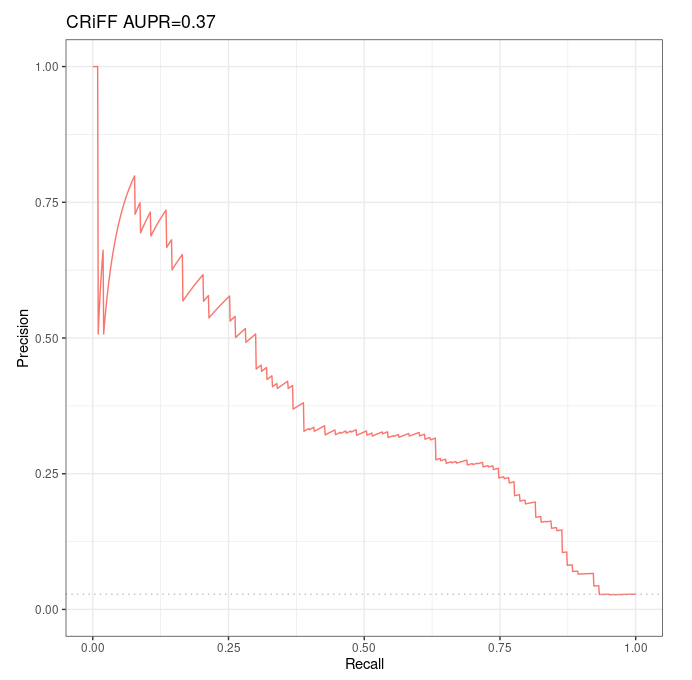

# Evaluation of Moore et al 's Distance Method over Fulco et al CRISPRi-FlowFISH validation dataset

## Objectives

Our objectives were:

* to ensure the AUPR of the Distance method remains approximately the same when we intersect the CRISPRi-FlowFISH validation dataset with ccRE (as Moore et al 's Distance method takes ccRE only as candidate regions)
* to compute predictions with Distance method to later use them as input for the Average rank method

See detailed procedure [here](/notes_BENGI/CRISPRi_FlowFISH/distance_method/distance_over_fulco_et_al_crispri).

## Results

*Precision-Recall curves and AUPR of Moore et al's Distance method over Fulco et al validation dataset intersected with ccRE (103 positives and 3569 negatives).*