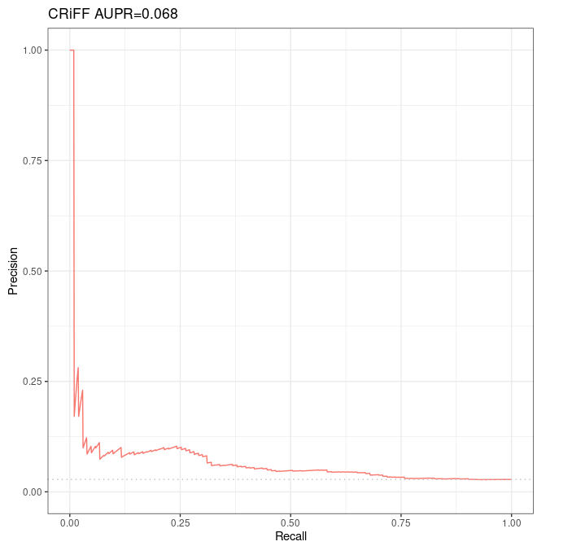

# Evaluation of Moore et al 's DNase-expression correlation method over Fulco et al CRISPRi-FlowFISH validation dataset

## Prerequisites

First we need to download the curated DNase counts from [http://big.databio.org/papers/RED/supplement/](http://big.databio.org/papers/RED/supplement/) (see p. 14 of the BENGI paper).

> ```bash
> Correlation-Methods/
> └── Sheffield
>     └── Signal-Matrices
>         ├── dhs112_v3_int.bed
>         ├── dhs112_v3_int.bed.gz
>         └── exp112.bed
> ```

Note that, in the Python code, we will have to use the appropriate argument for the column 87 of `exp112.bed`, corresponding to K562, to be selected instead of the one corresponding to GM12878. Fortunately, it suffices to provide "K562" as an argument for this purpose.

## Partial reimplementation of `Run-Sheffield.sh`

First of all we made a copy of all scripts, ie we duplicated `Scripts` folder in a new folder which we named `local_Scripts`.

We adapted of `local_Scripts/Unsupervised-Methods/Run-Sheffield.sh` in `local_Scripts/Unsupervised-Methods/CRISPRiFF_Run-Sheffield.sh` to use the CRISPRi-FlowFISH validation dataset. 

```bash
#!/bin/bash

#################
## DEPENDENCIES #
#################
# bedtools
# python2
# scipy

#################
## INPUT ARGS: ##
#################
# $1: `intermediate_output` relative_path to parent folder for intermediate results.
#                           Folder need not exist yet.

# WARNING: some inputs are not passed as args, see code below!

#################
#### OUTPUT #####
#################
# els.bed: input data (DNase, expression) are intersected with ccREs
#          Then, the result is sorted and uniqued. 
# enhancer-matrix.bed
# genes
# genesFull

# Inserm computer
#workDir=~/Documents
# Personal computer
#workDir=~/Documents/INSERM
# Genotoul
workDir=/work2/project/regenet/workspace/thoellinger

ccres=$workDir/BENGI/Benchmark/Annotations/hg19-cCREs.bed
gnid_gname=/work2/project/fragencode/data/species.bk/homo_sapiens/hg19.gencv19/homo_sapiens.gnid.gnname.tsv

# One must create the following repository before launching the script:
signalDir=$workDir/BENGI/Correlation-Methods/Sheffield/
featureDir=$signalDir/Signal-Matrices # must contain DNase counts and gene expression
#                                       "dhs112_v3_int.bed", "exp112.bed"
# see (http://big.databio.org/papers/RED/supplement/)

intermediate_outputs_dir=$1 # All output that are not final results are
#                         going to be stored here. Need not exist before launching the
#                         script

intermediate_outputs=$intermediate_outputs_dir/K562.CRISPRi.FlowFISH
genes=$intermediate_outputs/genes # need not exist yet
genesFull=$intermediate_outputs/genesFull # need not exist yet
els=$intermediate_outputs/els.bed # need not exist yet
enhancer_matrix=$intermediate_outputs/enhancer-matrix.txt # need not exist yet

biosample=K562
echo $biosample

train=/work2/project/regenet/workspace/thoellinger/CRISPRi_FlowFISH/k562/3672_ccRE_gene_pairs.fulco.txt

scriptDir=$workDir/BENGI/local_Scripts/Unsupervised-Methods
outputDir=$signalDir/Results

mkdir -p $outputDir
mkdir -p $intermediate_outputs

# dhs112_v3_int.bed (http://big.databio.org/papers/RED/supplement/) is space-delimited
# so we first replace spaces by tabs. It contains the DNase counts over whole genome
# for 112 cell types.
# exp112.bed: idem. It contains the gene expressions for 112 cell types.
if [[ ! -f $els ]]; then
    echo "Finding ccRE-dELS in input data..."
    awk 'FNR==NR {x[$1];next} ($5 in x)'  $train $ccres | awk '{print $1 "\t" \
        $2 "\t" $3 "\t" $5}' | sort -u > $els
fi

# Warning: the following requires a lot of memory
if [[ ! -f $featureDir/dhs112_v3_int_tab.bed ]]; then
    echo "dhs112 => dhs112_tab..."
    awk 'BEGIN{} {n=split($0, line, " "); ORS="\n"; print line[0]; ORS="\t"; for(u=1; u<n; u++){print line[u]}; ORS=""; print line[n]}' $featureDir/dhs112_v3_int.bed > $featureDir/dhs112_v3_int_tab.bed
fi

if [[ ! -f $enhancer_matrix ]]; then
    echo "Building enhancer matrix (DNase counts for all the input cell types) using bedtools... This can take several minutes..."
    bedtools intersect -wo -a $els -b $featureDir/dhs112_v3_int_tab.bed > $enhancer_matrix
fi
# enhancer-matrix.txt contains:
# $1 to $4: enhancer infos, bed-like format
# $5 to $7: for the current enhancer, chr, start and end of an overlapping DHS.
# $8 to $(n_columns-1): respective DNase counts for all the 112
# 						cell types encountered in dhs112_v3_int_tab.bed
# $n_columns: length (in bp) of the overlap

if [[ ! -f $genes ]]; then
    echo "Finding all genes in input..."
    cat $train | awk '{print $2}' | sort -u  > $genes
fi

if [[ ! -f $genesFull ]]; then
    echo "Computing gene list (<id> <name>)..."
    awk 'FNR==NR {x[$1];next} ($1 in x)' $genes $gnid_gname > $genesFull
fi

if [[ ! -f $featureDir/exp112_tab.bed ]]; then
    echo "Adapting expression file format..."
    awk '{n=split($0, line, " "); ORS="\n"; if(NR==1){ORS=""}; print line[0]; ORS="\t"; for(u=1; u<n; u++){print line[u]}; ORS=""; print line[n]}' $featureDir/exp112.bed > $featureDir/exp112_tab.bed
fi

# we replaced `$stats` by NOTHING as we do not use this argument.
# "$biosample" is not a window dressing argument, it is the key of a dictionnary defined in the Python script, which provide the correct
# column of "exp112_tab.bed"
echo "Running python script... This can take several minutes..."
python $scriptDir/sheffield.correlation.py $featureDir/exp112_tab.bed $genesFull $enhancer_matrix NOTHING $train $biosample |sort -t $'\t' -k 5,6 > $outputDir/$biosample.CRISPRi-FlowFISH-Correlation.txt
```

## Partial reimplementation of `sheffield.correlation.py`

We adapted of `local_Scripts/Unsupervised-Methods/sheffield.correlation.py` in `local_Scripts/Unsupervised-Methods/CRISPRiFF_sheffield.correlation.py.sh` to use the CRISPRi-FlowFISH validation dataset.

Actually, we had nothing to change wrt our previous partial reimplementations.

```bash
#!/usr/bin/python
# -*- coding: utf-8 -*-

import sys, scipy, math
from scipy import stats

import numpy as np # to reconstruct statDict "by hand"

from itertools import groupby
# We use all_equal to prevent a division-by-zero error in Calculate_Correlation
def all_equal(iterable):
    g = groupby(iterable)
    return next(g, True) and not next(g, False)

def Process_Biosample(biosample):
	biosampleDict={"GM12878":28, "HeLa":50, "K562":88,"HMEC":59,"NHEK":100}
	if biosample in biosampleDict:
		return biosampleDict[biosample]
	else:
		return "no"

def Calculate_Correlation(array1, array2):
        if not (all_equal(array1) or all_equal(array2)):
	        stat=stats.pearsonr(array1, array2)[0]
        else:
                stat = float('NaN')
	return stat

def Create_Gene_Dict(genes):
	geneDict={}
	genes.next() #skips header
	for line in genes:
		line=line.rstrip().split("\t")
		geneDict[line[3]]=[float(i) for i in line[5:]]
	return geneDict

def Create_ELS_Dict(els, column):
	elsDictA={}
	elsDictB={}
	for line in els:
		line=line.rstrip().split("\t")
		if column == "no":
			score=max(float(i) for i in line[7:-1])
		else:
			score=float(line[column])
		if line[3] not in elsDictA:
			elsDictA[line[3]]=[float(line[-1]),score] # [size of overlap, counts fot the cell type considered]
			elsDictB[line[3]]=[float(i) for i in line[7:-1]] # [size of overlap, [counts for all cell types]]
		elif elsDictA[line[3]][0] < float(line[-1]):
		# See comment below first. Here, same kind of thing, but it is about maximizing the overlap.
		# Note that first the overlap is maximized, and only then the counts are maximized.
		# This has SEVERE IMPLICATIONS: if there are 1000 counts for a candidate enhancer with which the
		# overlap is 149, and at best 3 counts for enhancers with overlap 150, the ones with overlap 150 and 3
		# counts only are kept...
		# To prevent such a "side effect", one may replace the following "elif" with an "if"
                # I personnaly think this side effect is undesirable, but here we keep the "elif"
                # to obtain the same results as Moore et al.
			elsDictA[line[3]]=[float(line[-1]),score]
			elsDictB[line[3]]=[float(i) for i in line[7:-1]]
		elif elsDictA[line[3]][1] < score: # note that all peak widths are 150
		# if counts for another open chromatin region overlapping this enhancer has already been written,
		# but are fewer than for the current open chromatin region overlapping this same enhancer,
		# then we overwrite the counts with these new ones.
		# At the end of the day, this results in taking into account, for each enhancer, only the open chromatin
             # region that maximize the counts of DNase over a given enhancer ; although the selection is made among
             # regions that maximize the overlap only, see comment above.
			elsDictA[line[3]]=[float(line[-1]),score]
			elsDictB[line[3]]=[float(i) for i in line[7:-1]]

	# Well at the end of the day, elsDictB[key="enhancer id"] = [max overlap with a DHS, max counts in this DHS]
	return elsDictB, elsDictA

def Create_Symbol_Dict(symbols):
	symbolDict={}
	for line in symbols:
		line=line.rstrip().split("\t")
		symbolDict[line[0]]=line[1]
	return symbolDict

def Create_Stat_Dict(stats):
	# For now we know that:
	# stat (argv[4]) must contain at least 3 columns
	# first column is a gene id (see for loop at the end of the code)
	# 2nd and 3rd columns are float / real numbers.
	# Both are later compared to correlations.
	statDict={}
	for line in stats:
		line=line.rstrip().split("\t")
		statDict[line[0].rstrip()]=[float(line[1]),float(line[2])]
	return statDict

genes=open(sys.argv[1]) # gene expression
geneDict=Create_Gene_Dict(genes)
genes.close()
# geneDict[key = "gene NAME (not id)"] = [expression in cell line 1, expression in cell line 2, etc]

symbols=open(sys.argv[2]) # gene annotation
symbolDict=Create_Symbol_Dict(symbols)
symbols.close()

column=Process_Biosample(sys.argv[6]) # the correct column is 28 for GM12878

els=open(sys.argv[3]) # ccRE expression
elsDict, test =Create_ELS_Dict(els,column)
els.close()
# elsDict[key="enhancer id"] = [max overlap of this enhancer with a DHS, max counts for this max overlap]

# For now we try to rebuild statArray directly in this script.
#stat=open(sys.argv[4])
#statArray = Create_Stat_Dict(stat)
#stat.close()

# On essaye ci-dessous
# On le fait volontairement d'une maniere très peu optimisée, c'est juste pour tester, en évitant d'induire d'autres sources
# potentielles de problèmes

pairs=open(sys.argv[5]) # BENGI benchmark
all_cor = {}
for line in pairs:
	line=line.rstrip().split("\t")
	els=line[0] # candidate enhancer id
	gene=symbolDict[line[1].rstrip()] # name (not id) of candidate paired gene
	if els in elsDict and gene in geneDict:
		if gene in all_cor:
			all_cor[gene].append(Calculate_Correlation(elsDict[els],geneDict[gene]))
		else:
			all_cor[gene] = [Calculate_Correlation(elsDict[els],geneDict[gene])]
pairs.close()
# Now for each gene name of gene id found in the benchmark pairs, all_cor[gene] should
# be the list of the correlations of its expression accross all cell lines, with
# the counts of DNase accross all cell lines, for enhancers it is paired with

pairs=open(sys.argv[5]) # BENGI benchmark
statArray = {}
for line in pairs: #inutile il suffit de boucler sur tous les genes trouves, une seule fois chacun, qu'on aurait du enregistrer precedemment deja
	line=line.rstrip().split("\t")
	els=line[0] # candidate enhancer id
	gene=symbolDict[line[1].rstrip()] # name (not id) of candidate paired gene
	if els in elsDict and gene in geneDict:
		if gene not in statArray:
			statArray[gene] = [np.mean(all_cor[gene]), np.std(all_cor[gene])]
pairs.close()

pairs=open(sys.argv[5]) # BENGI benchmark

for line in pairs:
	line=line.rstrip().split("\t")
	els=line[0] # candidate enhancer
	gene=symbolDict[line[1].rstrip()] # name (not id) of candidate paired gene
	if els in elsDict and gene in geneDict:
		cor=Calculate_Correlation(elsDict[els],geneDict[gene]) # correlation between counts of DNase over els and gene expression accross the 112 biosamples

		# cor est la corrélation entre les counts max de DNase sur els, et l'expression du gène appairé avec cet els.

		# On a dit que :
		# statArray devait être issu d'un fichier de trois colonnes qui est tel que :
		# La clef est un id de gene (visiblement plutôt un NOM de gène ! - pourquoi pas...)
		# La première valeur est, pour chaque gène, la corrélation moyenne qu'on trouve entre ce gène et les ccRE auxquels il est appairé
		# La deuxième valeur est, pour chaque gène, l'écart-type de ces mêmes corrélations.

		if math.isnan(cor):
			cor=0
		if statArray[gene][1] != 0:
			Z=(cor-statArray[gene][0])/statArray[gene][1]
		else:
			Z=0
		p=stats.norm.sf(abs(Z))*2
		print line[2], "\t", cor, "\t", p, "\t", Z, "\t", els, "\t", line[1]

	else:
		pass
		print line[2], "\t", -100, "\t", 1, "\t", -100, "\t", els, "\t", line[1]
```

## Running the code for BENGI benchmarks over GM12878

If working on Genotoul, start with:

```bash
conda activate base && conda activate abcmodel && conda activate py2 && module load bioinfo/bedtools-2.27.1
```

and before launching the script, do not forget (a lot of memory is required):

```bash
srun --mem=8G --pty bash
```

Now it suffices to run `Run-Sheffield.sh` over the CRISPRi-FlowFISH validation dataset:

```bash
./local_Scripts/Unsupervised-Methods/CRISPRiFF_Run-Sheffield.sh Correlation-Methods/Sheffield
```

> ```bash
> ./local_Scripts/Unsupervised-Methods/Run-Sheffield.sh GM12878.CHiC v3 Correlation-Methods/Sheffield
> ```
>
> K562
> Finding ccRE-dELS in input data...
> Building enhancer matrix (DNase counts for all the input cell types) using bedtools... This can take several minutes...
> Finding all genes in input...
> Computing gene list (<id> <name>)...
> Running python script... This can take several minutes...

## Analysis with R

### Code

```{css,echo=F}
.badCode {
background-color: #C9DDE4;
}
```

```{r setup, echo=FALSE, cache=FALSE}
library(knitr)
## Global options
options(max.print="75")
opts_chunk$set(echo=TRUE,
	             cache=FALSE,
               prompt=FALSE,
               tidy=TRUE,
               comment=NA,
               message=FALSE,
               warning=FALSE,
               class.source="badCode")
opts_knit$set(width=75)
```

```{r}
library(ggplot2)
library(ggpubr) # for ggarrange
library(dplyr) # for bind_rows

# Tools for precision-recall : (see https://classeval.wordpress.com/tools-for-roc-and-precision-recall/)
library(precrec)
#library(ROCR)
#library(pROC)
#library(PRROC)
```

```{r, results="hide"}
rm(list = ls())

# Personal
work_dir = "~/Documents/INSERM/"
# Inserm
#work_dir = "~/Documents/"

#####################
## Distance method ##
#####################

path_to_results = paste(work_dir, "BENGI/Correlation-Methods/Sheffield/Results/", sep='')
file_names = c("K562.CRISPRi-FlowFISH-Correlation.txt")
short_names = c('CRiFF')

nb_files = length(file_names)

colnames <- c('interaction', 'cor', 'p', 'Z', 'ccRE', 'gene')
results <- sapply(file_names, simplify=FALSE, function(file_name){
  Df <- read.table(paste(path_to_results, as.character(file_name), sep=''), sep='\t')
  Df[[1]] <- factor(Df[[1]], levels=c(0,1), labels=c("no interaction", "interaction"))
  names(Df) <- colnames
  return(Df)
})
names(results) <- short_names

#library(dplyr)
All_results <- bind_rows(results, .id = 'method')
```

```{r}
ggplot(aes(y = cor, x = method, fill = interaction), data = All_results) + geom_boxplot()
```

```{r}
sscurves_dnase_expression <- list()
sscurves_dnase_expression <- sapply(results, simplify=FALSE, function(Df){
  evalmod(scores = Df$cor, labels = Df$interaction) # comes with "precrec" library
})
```


```{r}
#library(ggplot2)
p1 <- autoplot(sscurves_dnase_expression[[1]], curvetype = c("PRC")) + ggtitle(paste(short_names[1], signif(attr(sscurves_dnase_expression[[1]], 'auc')[[4]][2], digits=2), sep = " AUPR="))

# ggarrange comes with library('ggpubr')
figure <- ggarrange(p1,
                    ncol = 1, nrow = 1)
figure
```

### Results


