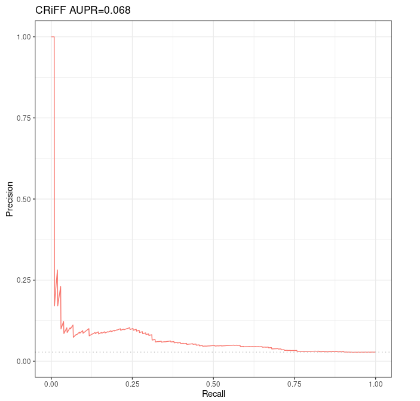

# Evaluation of Moore et al 's DNase-expression correlation method over Fulco et al CRISPRi-FlowFISH validation dataset

## Prerequisites

See detailed procedure here: [http://genoweb.toulouse.inra.fr/~thoellinger/notes/notes_BENGI/CRISPRi_FlowFISH/dnase_expression_correlation/correlation_method_with_code.html](http://genoweb.toulouse.inra.fr/~thoellinger/notes/notes_BENGI/CRISPRi_FlowFISH/dnase_expression_correlation/correlation_method_with_code.html)

## Results

*Precision-Recall curves and AUPR of Moore et al's DNase-expression correlation method over Fulco et al validation dataset intersected with ccRE (103 positives and 3569 negatives).*