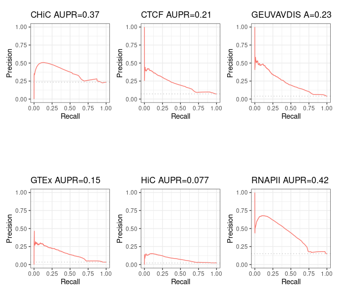
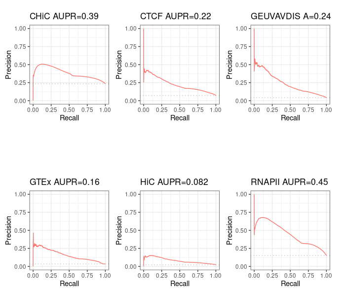
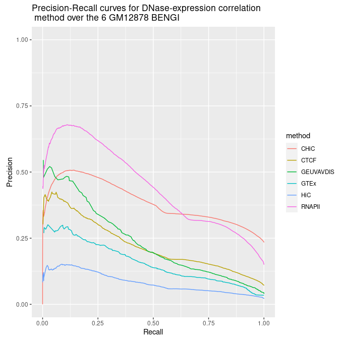

# Guidelines to run the Average rank method over BENGI for GM12878

## Prerequisites

### Step 1: run Distance method

See [dedicated guide](/notes_BENGI/distance_method/distance_evaluation_with_code).

### Step 2: run DNase-expression correlation method

See [dedicated guide](/notes_BENGI/dnase_expression_correlation/correlation_method_with_code).

## Partial reimplementation of `Run-Average-Rank.sh`

We replaced the content of `local_Scripts/Unsupervised-Methods/Run-Average-Rank.sh` with the following:

```bash
#!/bin/bash

data=$1
version=$2

# Inserm computer
#workDir=~/Documents
# Personal computer
#workDir=~/Documents/INSERM
# Genotoul
workDir=/work2/project/regenet/workspace/thoellinger

distance=$workDir/BENGI/Distance-Method/Results/$data-Distance.$version.txt
correlation=$workDir/BENGI/Correlation-Methods/Sheffield/Results/$data-Correlation.$version.txt

output_dir=$workDir/BENGI/Correlation-Methods/Average-Rank
mkdir -p $output_dir

# for old format of distance method resulting files (with 2 columns),
# with "." as local decimal separator in bash, use:
#paste $distance $correlation | awk '{print $1 "\t" $2 "\t" $4}' | \
#    sort -k2,2gr | awk 'BEGIN{x=0;r=0}{if (x != $2) r +=1; print $0 \
#    "\t" r; x=$2}' | sort -k3,3gr | awk 'BEGIN{x=0;r=0}{if (x != $3) \
#    r +=1; print $0 "\t" r "\t" ($NF+r)/2; x=$3}' | sort -k6,6g | \
#    awk '{print $1 "\t" 1/$6 "\t" $2 "\t" $3 "\t" $4 "\t" $5 "\t" $6}' > $output_dir/$data-Average-Rank.$version.txt

# for new format of distance method resulting files (with 4 columns), use:

# if the local decimal separator in bash is "," (personal computer, genotoul, ...)
paste $distance $correlation |awk '{print $1 "\t" $2 "\t" $6}' |tr . , | \
    sort -k2,2gr | awk 'BEGIN{x=0;r=0}{if (x != $2) r +=1; print $0 \
    "\t" r; x=$2}' | sort -k3,3gr | awk 'BEGIN{x=0;r=0}{if (x != $3) \
    r +=1; print $0 "\t" r "\t" ($NF+r)/2; x=$3}' | sort -k6,6g | \
    awk '{print $1 "\t" 1/$6 "\t" $2 "\t" $3 "\t" $4 "\t" $5 "\t" $6}' |tr , . > $output_dir/$data-Average-Rank.$version.txt

# if the local decimal separator in bash is ".":
#paste $distance $correlation | awk '{print $1 "\t" $2 "\t" $6}' | \
#    sort -k2,2gr | awk 'BEGIN{x=0;r=0}{if (x != $2) r +=1; print $0 \
#    "\t" r; x=$2}' | sort -k3,3gr | awk 'BEGIN{x=0;r=0}{if (x != $3) \
#    r +=1; print $0 "\t" r "\t" ($NF+r)/2; x=$3}' | sort -k6,6g | \
#    awk '{print $1 "\t" 1/$6 "\t" $2 "\t" $3 "\t" $4 "\t" $5 "\t" $6}' > $output_dir/$data-Average-Rank.$version.txt
```

Note that we replaced

> ```bash
> sort -k3,3gr | awk 'BEGIN{x=0;r=0}{if (x != $2) \
>     r +=1; print $0 "\t" r "\t" ($NF+r)/2; x=$2}' 
> ```

which seems to be an error, with

> ```bash
> sort -k3,3gr | awk 'BEGIN{x=0;r=0}{if (x != $3) \
>     r +=1; print $0 "\t" r "\t" ($NF+r)/2; x=$3}' 
> ```

The reason is that the code does as follows:

*  first, distance and correlation results (which are assumed sorted the very same way - which is the case if they were computed using the dedicated guides mentioned in the prerequisites) are merged
*  then, the ranks of inverse distances are computed (the smaller the distance, the smaller the rank) with `sort -k2,2gr | awk 'BEGIN{x=0;r=0}{if (x != $2) r +=1; print $0 "\t" r; x=$2}'`. So the condition on `x=$2` (`$2` being the inverse distance) ensures the rank remains the same when consecutive inverse distances are constant.
*  then, the rank of the DNase-expression correlation method, plus the average distance-correlation rank, are computed (the greater the correlation, the smaller the rank) with `sort -k3,3gr | awk 'BEGIN{x=0;r=0}{if (x != $3) r +=1; print $0 "\t" r "\t" ($NF+r)/2; x=$3}'`. So a condition on `$2` (value of the inverse distance) instead of `$3` (the correlation) would not make sense.

In the analysis, we will see that using `$2` as Moore et al, leads to the very same results (AUPR of predictions over the 6 BENGI for GM12878) as in their paper ; and using `$3`, which we think is the correct way to do ; gives similar but slightly better results!

**One should also note that we added `tr . ,` at the beginning of the code and `tr , .` at the end. This is needed on every computer where bash default decimal separator is "," instead of ".".**

At the end of the day, the fields are as follows:

* interaction (ground truth)
* final score = 1 / (average rank), such that the smaller the rank, the greater the score (=> high score = interaction suspected)
* inverse distance
* DNase-expression correlation
* inverse distance rank (the smaller the distance, the smaller the rank)
* DNase-expression correlation rank (the greater the correlation, the smaller the rank)
* average rank (= 1 over final score)

## Running the code for BENGI benchmarks over GM12878

If working on Genotoul:

```bash
conda activate base && conda activate abcmodel && conda activate py2 && module load bioinfo/bedtools-2.27.1
```

```bash
srun --pty bash
```

Now:

```bash
./local_Scripts/Unsupervised-Methods/Run-Average-Rank.sh GM12878.CHiC v3
```

```bash
./local_Scripts/Unsupervised-Methods/Run-Average-Rank.sh GM12878.CTCF-ChIAPET v3
```

etc

## Analysis with R

### Code

```{css,echo=F}
.badCode {
background-color: #C9DDE4;
}
```

```{r setup, echo=FALSE, cache=FALSE}
library(knitr)
## Global options
options(max.print="75")
opts_chunk$set(echo=TRUE,
	             cache=FALSE,
               prompt=FALSE,
               tidy=TRUE,
               comment=NA,
               message=FALSE,
               warning=FALSE,
               class.source="badCode")
opts_knit$set(width=75)
```

```{r}
library(ggplot2)
library(ggpubr) # for ggarrange
library(dplyr) # for bind_rows

# Tools for precision-recall : (see https://classeval.wordpress.com/tools-for-roc-and-precision-recall/)
library(precrec)
#library(ROCR)
#library(pROC)
#library(PRROC)
```

```{r, results="hide"}
rm(list = ls())

# Personal
work_dir = "~/Documents/INSERM/"
# Inserm
#work_dir = "~/Documents/"

path_to_results = paste(work_dir, "BENGI/Correlation-Methods/Average-Rank/", sep='')
file_names = c("GM12878.CHiC-Average-Rank.v3.txt", "GM12878.CTCF-ChIAPET-Average-Rank.v3.txt", "GM12878.GEUVADIS-Average-Rank.v3.txt", "GM12878.GTEx-Average-Rank.v3.txt", "GM12878.HiC-Average-Rank.v3.txt", "GM12878.RNAPII-ChIAPET-Average-Rank.v3.txt")
short_names = c('CHiC', 'CTCF', 'GEUVAVDIS', 'GTEx', 'HiC', 'RNAPII')

nb_files = length(file_names)

colnames <- c('interaction', 'score', 'inverse.distance', 'correlation', 'inverse.distance.rank', 'correlation.rank', 'average.rank')
results <- sapply(file_names, simplify=FALSE, function(file_name){
  Df <- read.table(paste(path_to_results, as.character(file_name), sep=''), sep='\t')
  Df[[1]] <- factor(Df[[1]], levels=c(0,1), labels=c("no interaction", "interaction"))
  names(Df) <- colnames
  return(Df)
})
names(results) <- short_names

#library(dplyr)
All_results <- bind_rows(results, .id = 'method') # requires library(dplyr)
```

```{r}
str(results)
summary(results$CHiC)
```

```{r}
ggplot(aes(y = average.rank, x = method, fill = interaction), data = All_results) + geom_boxplot()
```

```{r}
sscurves_avg_rank <- list()s
sscurves_avg_rank <- sapply(results, simplify=FALSE, function(Df){
  evalmod(scores = Df$score, labels = Df$interaction) # comes with "precrec" library
})
```

```{r}
#library(ggplot2)
p1 <- autoplot(sscurves_avg_rank[[1]], curvetype = c("PRC")) + ggtitle(paste(short_names[1], signif(attr(sscurves_avg_rank[[1]], 'auc')[[4]][2], digits=2), sep = " AUPR="))
p2 <- autoplot(sscurves_avg_rank[[2]], curvetype = c("PRC")) + ggtitle(paste(short_names[2], signif(attr(sscurves_avg_rank[[2]], 'auc')[[4]][2], digits=2), sep = " AUPR="))
p3 <- autoplot(sscurves_avg_rank[[3]], curvetype = c("PRC")) + ggtitle(paste(short_names[3], signif(attr(sscurves_avg_rank[[3]], 'auc')[[4]][2], digits=2), sep = " A="))
p4 <- autoplot(sscurves_avg_rank[[4]], curvetype = c("PRC")) + ggtitle(paste(short_names[4], signif(attr(sscurves_avg_rank[[4]], 'auc')[[4]][2], digits=2), sep = " AUPR="))
p5 <- autoplot(sscurves_avg_rank[[5]], curvetype = c("PRC")) + ggtitle(paste(short_names[5], signif(attr(sscurves_avg_rank[[5]], 'auc')[[4]][2], digits=2), sep = " AUPR="))
p6 <- autoplot(sscurves_avg_rank[[6]], curvetype = c("PRC")) + ggtitle(paste(short_names[6], signif(attr(sscurves_avg_rank[[6]], 'auc')[[4]][2], digits=2), sep = " AUPR="))

# ggarrange comes with library('ggpubr')
figure <- ggarrange(p1, p2, p3, p4, p5, p6,
                    ncol = 3, nrow = 2)
figure
```


Alternatively we can plots all Precision - Recall curves on the same graph.

```{r}
all_sscurves_avg_rank <- sapply(sscurves_avg_rank, simplify = FALSE, function(obj){
  Df <- data.frame(obj$prcs[[1]]$x, obj$prcs[[1]]$y)
  names(Df) <- c('x', 'y')
  return(Df)
})
all_sscurves_avg_rank <- bind_rows(all_sscurves_avg_rank, .id = 'method')

total_nrow = nrow(all_sscurves_avg_rank)
max_nb_points_to_plot = 20000
if(total_nrow>max_nb_points_to_plot){
  set.seed(1)
  samples_points = sample(1:total_nrow, min(max_nb_points_to_plot, total_nrow), replace=TRUE)
} else{
  samples_points = 1:total_nrow
}


ggplot(aes(y = y, x = x, color = method), data = all_sscurves_avg_rank[samples_points,]) + geom_line() + ylim(0,1) + xlab('Recall') + ylab('Precision') + ggtitle("Precision-Recall curves for DNase-expression correlation\n method over the 6 GM12878 BENGI")
```

### Results

One can also directly have a look at the summarized results here: http://genoweb.toulouse.inra.fr/~thoellinger/notes/notes_BENGI/avg_rank_method/summary_avg_rank_method.html

#### Not correcting the error in `Run-Average-Rank.sh` gives same results as in the paper

If we keep the small mistake found in `Run-Average-Rank.sh`, we find (hopefully!) the very same Precision - Recall curves as authors:



#### Correct results

If we correct the small error found in `Run-Average-Rank.sh`, we obtain the following results.





