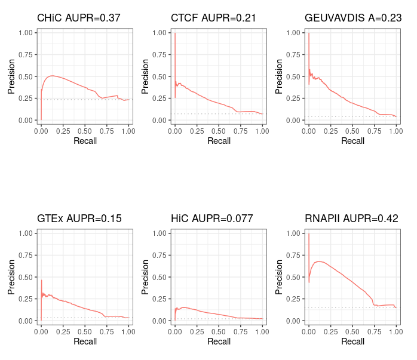

# Average rank method over BENGI for GM12878

## Prerequisites

Detailed procedure is explained [here](/notes_BENGI/avg_rank_method/avg_rank_method_with_code).

## Not correcting the error in `Run-Average-Rank.sh` gives same results as in the paper

If we keep the small mistake found in `Run-Average-Rank.sh`, we find (hopefully!) the very same Precision - Recall curves as authors:

## Correct results

If we correct the small error found in `Run-Average-Rank.sh`, we obtain the following results.

