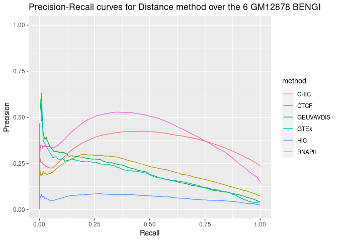

# Evaluation of the Distance method over the 6 BENGI for GM12878

## Requirements

* `Python 2` for `rank.distance.py` which is called by `Run-Distance-Method.sh`
* the list of ccRE curated by BENGI authors (*note that `Run-Distance-Method.sh` did not work when we tried with the cell-type specific ccRE downloaded from the ENCODE portal with the accession authors mention in Additional file 1 : Table S1a, but we should try again now that we know that ccRE considered by Moore et al. for BENGI are ccRE-dELS, so maybe we should have filtered out ccRE that are not dELS*).

## Partial reimplementation

### Introduction

First of all we made a copy of all Moore et al' scripts, ie we duplicated `Scripts` folder in a new folder which we named `local_Scripts`.

### (Optional) Accessions for ENCODE ccRE

(NOT NEEDED) First we tried to download the same ccRE for GM12878 as authors: [ENCFF028SGJ](https://www.encodeproject.org/files/ENCFF028SGJ/).

> We used cCRE-ELS from V1 of the ENCODE Registry of cCRE available on the ENCODE portal found under the accessions provided in Additional file 1: Table S1a.
>
> We selected all cCRE-ELS (RGB color code 255,205,0) that were distal (i.e., greater than 2 kb from an annotated TSS, GENCODE v19).

| **Table S1a: Accessions for ENCODE cCREs** |                          |                    |
| ------------------------------------------ | ------------------------ | ------------------ |
| **Biosample**                              | **Annotation accession** | **File accession** |
| GM12878                                    | ENCSR480YCS              | ENCFF028SGJ        |
| HeLa                                       | ENCSR451UAK              | ENCFF280NBC        |
| K562                                       | ENCSR502KJC              | ENCFF087BWH        |
| HMEC                                       | ENCSR981LWT              | ENCFF118ODG        |
| IMR-90                                     | ENCSR593JKE              | ENCFF570LUD        |
| NHEK                                       | ENCSR376OQT              | ENCFF647RSA        |
| CD34+ cells                                | ENCSR970YPW              | ENCFF901IGB        |
| thyroid                                    | ENCSR282MAC              | ENCFF424EYY        |
| stomach                                    | ENCSR551OAQ              | ENCFF875YRD        |
| pancreas                                   | ENCSR529CSY              | ENCFF674CIO        |
| ovary                                      | ENCSR117DKP              | ENCFF687KJI        |
| sigmoid colon                              | ENCSR117AJU              | ENCFF850HCP        |
| liver                                      | ENCSR935NWB              | ENCFF161TKO        |

```bash
wget https://www.encodeproject.org/files/ENCFF028SGJ/@@download/ENCFF028SGJ.bed.gz -P ~/Documents/INSERM/results/ccREs/homo_sapiens/hg19/
```

```bash
gzip -cd ~/Documents/INSERM/results/ccREs/homo_sapiens/hg19/ENCFF028SGJ.bed.gz > ~/Documents/INSERM/results/ccREs/homo_sapiens/hg19/ENCFF028SGJ.bed
```

```bash
awk '$9 ~ /^(255\,205\,0$)/ {print $0}' ~/Documents/INSERM/results/ccREs/homo_sapiens/hg19/ENCFF028SGJ.bed > ~/Documents/INSERM/results/ccREs/homo_sapiens/hg19/ccREs_ELS_GM12878_from_ENCFF028SGJ.bed
```

> ```bash
> $ head ~/Documents/INSERM/results/ccREs/homo_sapiens/hg19/ccREs_ELS_GM12878_from_ENCFF028SGJ.bed
> chr1	762779	763008	EH37E1055291	0	.	762779	763008	255,205,0
> ...
> ```

We first tried to run `Run-Distance-Method.sh` (see content in the following section) with these ccRE, but it did not work. Script execution yielded the following error:

> ```bash
> $ Unsupervised-Methods/Run-Distance-Method.sh GM12878.CHiC v3 normal 0.2
> Traceback (most recent call last):
> File "/home/thoellinger/Documents/BENGI/local_Scripts/Unsupervised-Methods/rank.distance.py", line 40, in <module>
>  a=min([abs(enhancerDict[line[0].rstrip()][0]-x),abs(enhancerDict[line[0].rstrip()][1]-x)])
> KeyError: 'EH37E0279866'
> ```

Now we know that we should have filtered these ccRE to keep only ccRE-dELS, that is, ccRE with enhancer-like signature for GM12878 that are located distal (>= 2 kb) from any ENCODE-annotated TSS.

Anyways, in the following we use the list directly provided by Moore et al on BENGI Github.

REMARK: there is a mistake in Complement 3 Fig 2. § Remove Ambiguous Pairs and $ All pairs, natural ratio have been permuted (as confirmed by quantitative data in other tables from original paper).

### Content of `Run-Distance-Method.sh`

We replaced the content of `local_Scripts/Unsupervised-Methods/Run-Distance-Method.sh` with the following (otherwise it did not work):

```bash
#!/bin/bash

data=$1
version=$2
mode=$3
cutoff=$4

# Inserm computer
#workDir=~/Documents
# Personal computer
#workDir=~/Documents/INSERM
# Genotoul
workDir=/work2/project/regenet/workspace/thoellinger

setDir=$workDir/BENGI/Benchmark/All-Pairs.Natural-Ratio
train=$setDir/$data-Benchmark.$version.txt
outputDir=$workDir/BENGI/Distance-Method/Results
ccres=$workDir/BENGI/Benchmark/Annotations/hg19-cCREs.bed # the only one that works
scriptDir=$workDir/BENGI/local_Scripts/Unsupervised-Methods
tss=$workDir/BENGI/Benchmark/Annotations/GENCODEv19-TSSs.bed
exp=~/Lab/Target-Gene/Benchmark/Characteristics/GM12878-TPM-Expression.txt

mkdir -p $outputDir


if [ $mode == "normal" ]
then
python $scriptDir/rank.distance.py $tss $ccres \
 $train $outputDir/$data-Distance.$version.txt.unsorted
elif [ $mode == "expression" ]
then
python $scriptDir/rank.expression.distance.py $tss $ccres \
 $train $exp $cutoff $outputDir/$data-Distance-Expression.$cutoff.txt
fi

sort -t $'\t' -k 3,4 $outputDir/$data-Distance.$version.txt.unsorted > $outputDir/$data-Distance.$version.txt
rm $outputDir/$data-Distance.$version.txt.unsorted
```

### Content of `rank.distance.py.sh`

We replaced the content of `rank.distance.py.sh` with the following (the 2 columns we added in the output basically change nothing in the results, but are going to help us to make sure that the results are sorted correctly when using them as an input for the Average Rank method. Still, that's not strictly necessary).

```python
import sys, numpy as np

def Create_TSS_Dict(tss):
    tss=open(tss)
    tssDict={}
    for line in tss:
        line=line.rstrip().split("\t")
        if line[6] in tssDict:
            tssDict[line[6]].append(int(line[1]))
        else:
            tssDict[line[6]]=[int(line[1])]
    tss.close()
    return tssDict

def Create_Enhancer_Dict(enhancers):
    enhancers=open(enhancers)
    enhancerDict={}
    for line in enhancers:
        line=line.rstrip().split("\t")
        enhancerDict[line[4]]=[int(line[1]),int(line[2])]
    enhancers.close()
    return enhancerDict


    
tss=sys.argv[1]
tssDict=Create_TSS_Dict(tss)

enhancers=sys.argv[2]
enhancerDict=Create_Enhancer_Dict(enhancers)

links=open(sys.argv[3])
output=open(sys.argv[4], "w+")
distanceArray=[]

for line in links:
    line=line.rstrip().split("\t")
    m=1000000000000
    for x in tssDict[line[1].rstrip()]:
        a=min([abs(enhancerDict[line[0].rstrip()][0]-x),abs(enhancerDict[line[0].rstrip()][1]-x)])
        if a < m:
            m=a
    if m == 0:
        print >> output, line[2]+"\t"+str(1)+"\t"+line[0]+"\t"+line[1]
    else:
        print >> output, line[2]+"\t"+str(1/float(m))+"\t"+line[0]+"\t"+line[1]
#    if m == 0:
#        print >> output, line[2]+"\t"+str(1)
#    else:
#        print >> output, line[2]+"\t"+str(1/float(m))
    distanceArray.append(m)

links.close()
output.close()
```

## Running the code

```bash
.local_Scripts/Unsupervised-Methods/Run-Distance-Method.sh GM12878.CHiC v3 normal 0.2
```

```bash
.local_Scripts/Unsupervised-Methods/Run-Distance-Method.sh GM12878.CTCF-ChIAPET v3 normal 0.2
```

... and so on for every benchmarks.

## Analysis with R

### Code & results

```R
library(ggplot2)
library(ggpubr)  # for ggarrange
library(dplyr)  # for bind_rows

# Tools for precision-recall : (see
# https://classeval.wordpress.com/tools-for-roc-and-precision-recall/)
library(precrec)
# library(ROCR) library(pROC) library(PRROC)

rm(list = ls())

# Personal
work_dir = "~/Documents/INSERM/"
# Inserm work_dir = '~/Documents/'

path_to_results = paste(work_dir, "BENGI/Distance-Method/Results/", sep = "")
file_names = c("GM12878.CHiC-Distance.v3.txt", "GM12878.CTCF-ChIAPET-Distance.v3.txt", 
    "GM12878.GEUVADIS-Distance.v3.txt", "GM12878.GTEx-Distance.v3.txt", "GM12878.HiC-Distance.v3.txt", 
    "GM12878.RNAPII-ChIAPET-Distance.v3.txt")
short_names = c("CHiC", "CTCF", "GEUVAVDIS", "GTEx", "HiC", "RNAPII")

nb_files = length(file_names)

distance_colnames <- c("interaction", "inverse.distance")
distance <- sapply(file_names, simplify = FALSE, function(file_name) {
    Df <- read.table(paste(path_to_results, as.character(file_name), sep = ""), sep = "\t")
    Df[[1]] <- factor(Df[[1]], levels = c(0, 1), labels = c("no interaction", "interaction"))
    names(Df) <- distance_colnames
    return(Df)
})
names(distance) <- short_names

# library(dplyr)
Distances <- bind_rows(distance, .id = "method")

str(distance)

List of 6
 $ CHiC     :'data.frame':  375728 obs. of  2 variables:
  ..$ interaction     : Factor w/ 2 levels "no interaction",..: 2 2 2 2 2 2 2 2 2 2 ...
  ..$ inverse.distance: num [1:375728] 5.90e-06 5.91e-06 5.64e-06 3.59e-04 1.56e-05 ...
 $ CTCF     :'data.frame':  105016 obs. of  2 variables:
  ..$ interaction     : Factor w/ 2 levels "no interaction",..: 2 2 2 2 2 2 2 2 2 2 ...
  ..$ inverse.distance: num [1:105016] 3.10e-05 8.10e-05 3.08e-05 2.51e-05 4.80e-05 ...
 $ GEUVAVDIS:'data.frame':  50999 obs. of  2 variables:
  ..$ interaction     : Factor w/ 2 levels "no interaction",..: 2 2 2 2 2 2 2 2 2 2 ...
  ..$ inverse.distance: num [1:50999] 4.76e-05 1.32e-04 1.52e-04 5.00e-06 1.80e-05 ...
 $ GTEx     :'data.frame':  38200 obs. of  2 variables:
  ..$ interaction     : Factor w/ 2 levels "no interaction",..: 2 2 2 2 2 2 2 2 2 2 ...
  ..$ inverse.distance: num [1:38200] 6.19e-05 1.32e-04 1.52e-04 2.06e-04 2.85e-04 ...
 $ HiC      :'data.frame':  153739 obs. of  2 variables:
  ..$ interaction     : Factor w/ 2 levels "no interaction",..: 2 2 2 2 2 2 2 2 2 2 ...
  ..$ inverse.distance: num [1:153739] 2.01e-06 1.71e-06 1.71e-06 6.17e-06 2.48e-06 ...
 $ RNAPII   :'data.frame':  157235 obs. of  2 variables:
  ..$ interaction     : Factor w/ 2 levels "no interaction",..: 2 2 2 2 2 2 2 2 2 2 ...
  ..$ inverse.distance: num [1:157235] 6.17e-05 6.19e-05 2.68e-05 1.05e-05 1.04e-05 ...

ggplot(aes(y = inverse.distance, x = method, fill = interaction), data = Distances) + 
    geom_boxplot()
```


```R
# models <- list() models <- sapply(distance, simplify=FALSE, function(Df){
# return(glm(interaction ~ inverse.distance, family = binomial, data=Df)) })

# for(k in 1:nb_files){ print(summary(models[[k]])) }

sscurves <- list()
sscurves <- sapply(distance, simplify = FALSE, function(Df) {
    evalmod(scores = Df$inverse.distance, labels = Df$interaction)  # comes with 'precrec' library
})

# library(ggplot2)
p1 <- autoplot(sscurves[[1]], curvetype = c("PRC")) + ggtitle(paste(short_names[1], 
    signif(attr(sscurves[[1]], "auc")[[4]][2], digits = 2), sep = " AUPR="))
p2 <- autoplot(sscurves[[2]], curvetype = c("PRC")) + ggtitle(paste(short_names[2], 
    signif(attr(sscurves[[2]], "auc")[[4]][2], digits = 2), sep = " AUPR="))
p3 <- autoplot(sscurves[[3]], curvetype = c("PRC")) + ggtitle(paste(short_names[3], 
    signif(attr(sscurves[[3]], "auc")[[4]][2], digits = 2), sep = " A="))
p4 <- autoplot(sscurves[[4]], curvetype = c("PRC")) + ggtitle(paste(short_names[4], 
    signif(attr(sscurves[[4]], "auc")[[4]][2], digits = 2), sep = " AUPR="))
p5 <- autoplot(sscurves[[5]], curvetype = c("PRC")) + ggtitle(paste(short_names[5], 
    signif(attr(sscurves[[5]], "auc")[[4]][2], digits = 2), sep = " AUPR="))
p6 <- autoplot(sscurves[[6]], curvetype = c("PRC")) + ggtitle(paste(short_names[6], 
    signif(attr(sscurves[[6]], "auc")[[4]][2], digits = 2), sep = " AUPR="))

# ggarrange comes with library('ggpubr')
figure <- ggarrange(p1, p2, p3, p4, p5, p6, ncol = 3, nrow = 2)
figure
```


```R
sapply(sscurves, function(obj) {
    print(attr(obj, "auc")[[4]])
})

[1] 0.7139561 0.3576956
[1] 0.7886157 0.2106370
[1] 0.8318174 0.1970309
[1] 0.8406652 0.1850969
[1] 0.78758570 0.06315752
[1] 0.8265180 0.4107173

          CHiC      CTCF GEUVAVDIS      GTEx        HiC    RNAPII
[1,] 0.7139561 0.7886157 0.8318174 0.8406652 0.78758570 0.8265180
[2,] 0.3576956 0.2106370 0.1970309 0.1850969 0.06315752 0.4107173
```

```R
all_sscurves <- sapply(sscurves, simplify = FALSE, function(obj) {
    Df <- data.frame(obj$prcs[[1]]$x, obj$prcs[[1]]$y)
    names(Df) <- c("x", "y")
    return(Df)
})
all_sscurves <- bind_rows(all_sscurves, .id = "method")

total_nrow = nrow(all_sscurves)
max_nb_points_to_plot = 20000
if (total_nrow > max_nb_points_to_plot) {
    set.seed(1)
    samples_points = sample(1:total_nrow, min(max_nb_points_to_plot, total_nrow), 
        replace = TRUE)
} else {
    samples_points = 1:total_nrow
}
```


```R
ggplot(aes(y = y, x = x, color = method), data = all_sscurves[samples_points, ]) + 
    geom_line() + ylim(0, 1) + xlab("Recall") + ylab("Precision") + ggtitle("Precision-Recall curves for Distance method over the 6 GM12878 BENGI")
```


