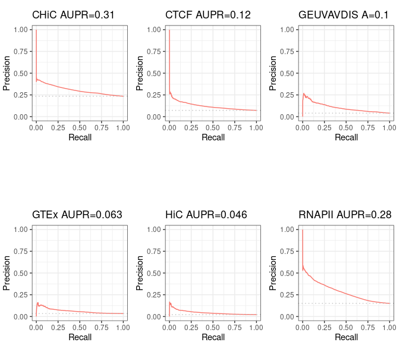
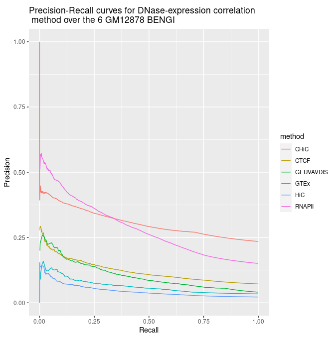

# Evaluation of DNase expression method over the 6 BENGI for GM12878

We ran Moore et al' implementation (with some necessary modifications) of the DNase-expression correlation method over the 6 BENGI for GM12878, to ensure we find the same results (so that we can make comparisons with further tests). See details here: [http://genoweb.toulouse.inra.fr/~thoellinger/notes/notes_BENGI/dnase_expression_correlation/correlation_method_with_code.html](http://genoweb.toulouse.inra.fr/~thoellinger/notes/notes_BENGI/dnase_expression_correlation/correlation_method_with_code.html)

We obtained the following Precision - Recall and AUPR, which are, indeed, the same as in Moore et al' paper & supplementary figures.

