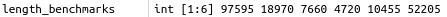
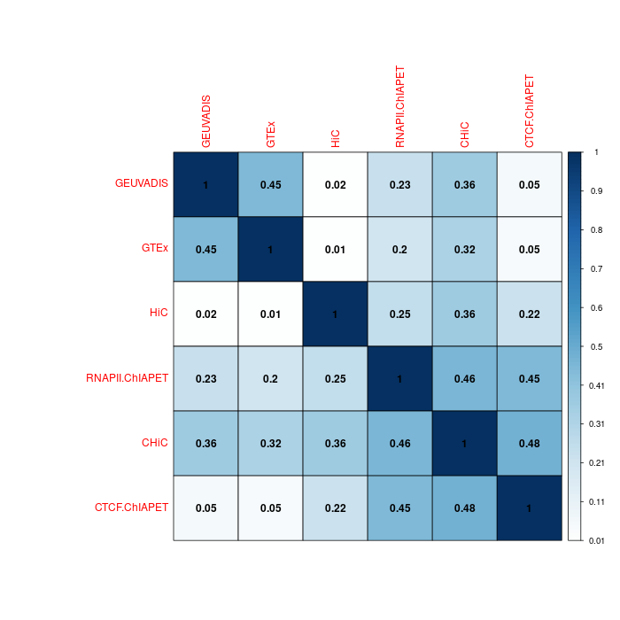
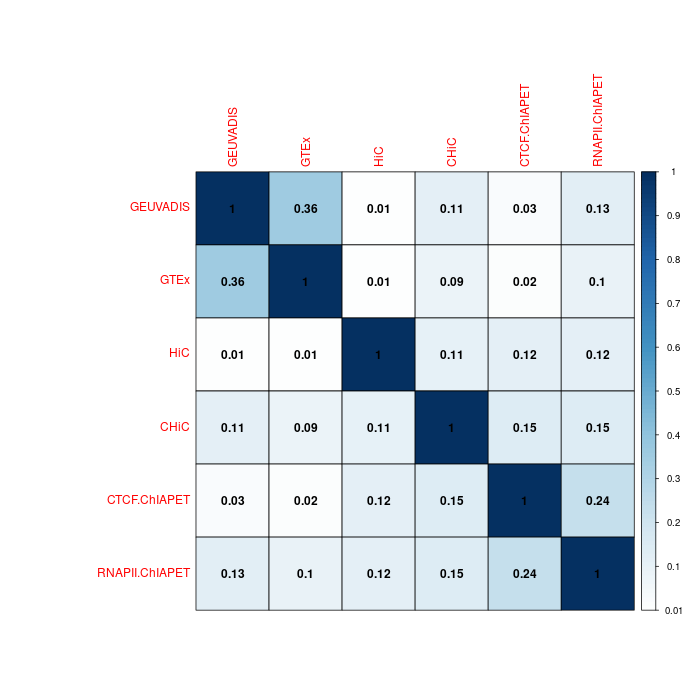
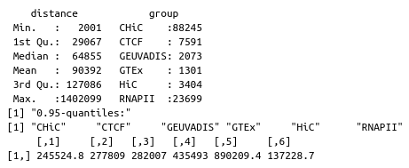
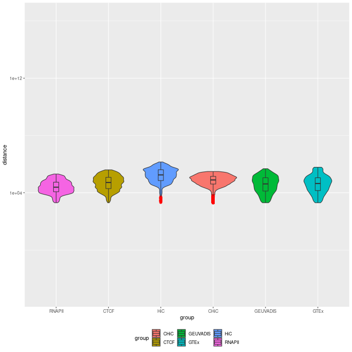

# Summary statistics on BENGI GM12878 benchmarks

## Context

We compute summary statistics on the BENGI benchmarks (*Jill E. Moore, Henry E. Pratt, Michael J. Purcaro et Zhiping Weng*, [https://genomebiology.biomedcentral.com/articles/10.1186/s13059-019-1924-8](https://genomebiology.biomedcentral.com/articles/10.1186/s13059-019-1924-8) in order to verify we find the same as those given by the authors.

## Remarks

The R code used to compute results below is detailed here: [http://genoweb.toulouse.inra.fr/~thoellinger/notes/notes_BENGI/summary_statistics_BENGI/summary_BENGI_bedpe.html](http://genoweb.toulouse.inra.fr/~thoellinger/notes/notes_BENGI/summary_statistics_BENGI/summary_BENGI_bedpe.html)

## Introduction

> ```bash
> $ head GM12878.CHiC-Benchmark.v4.txt
> EH37E0466501	ENSG00000206181.4	1 	cv-2
> EH37E0466501	ENSG00000267587.1	0 	cv-2
> ...
> # <enhancer_id> <gene_id (hg19)> <interaction?> <cross_val_group>
> ```

First we verify that the reported genes ids are not degenerate with respect to reported gene version. 

> ```bash
> $ awk '!id[$2]++ {print $2}' GM12878.CHiC-Benchmark.v4.txt |wc -l
> 28455 -> number of unique gene ids (with gene version)
> ```
>
> ```bash
> $ awk 'BEGIN{FS="\t"} {split($2,id,"."); if(!complete_id[$2]){nb_versions[id[1]]++}; complete_id[$2]++} END{for(u in nb_versions){print u, nb_versions[u]}}' GM12878.CHiC-Benchmark.v4.txt |wc -l
> 28455 -> number of unique gene ids (without gene versions)
> ```

=> seems ok, only one version / gene at least in that particular benchmark. Indeed, 

```bash
awk 'BEGIN{FS="\t"} {split($2,id,"."); if(!complete_id[$2]){nb_versions[id[1]]++}; complete_id[$2]++} END{for(u in nb_versions){if(nb_versions[u]>1){print u, nb_versions[u]}}}' GM12878.CHiC-Benchmark.v4.txt
```

yields nothing.

### Overlap coefficient

Remark: there are more (up to 4 times more) positives with natural ratio than with fixed ratio, as explained p. 13 in the paper § Generation of Negative pairs.

> "For the fixed ratio datasets, we also excluded genes that were in the positi	ve pairs for the cCREs-ELS in other BENGI datasets before randomly selecting the negatives. **If a cCRE-ELS exhibited fewer than four negative pairs, then it was excluded from this fixed ratio set.**"

Excluding positives from the other BENGI datasets before selecting the negatives possibly leads to less than 4 negatives remaining for each positive, meaning some positives must be excluded **(later on we shall verify this**)

***Natural ratio***


***Fixed ratio***




#### Version A: all pairs for 3D chromatin interactions, natural ratio



Same as (Fig. 2a) in the paper => OK.

#### Version B: all pairs for 3D chromatin interactions, fixed ratio



Clearly less overlapping between datasets with fixed ratio.

### Distance distribution

#### Summary statistics on raw BENGI datasets



*0.95-quantiles of distance distribution of the 6 GM12878 benchmarks*



*Distance distribution of enhancer-gene interactions*

In order to have more reliable results and to facilitate further analysis, we reprocessed data to have all useful information in a unique `.bedpe` file per benchmark. We use a Python script to that purpose, `BENGI_to_bedpe.py` (see dedicated notebook/guidelines, for instance: http://genoweb.toulouse.inra.fr/~thoellinger/notes/notes_BENGI/BENGI_to_custom_bedpe.html).

#### Distance distributions using authors `calculate.distance.py`

`Python2` required.

```bash
cd ~/Documents/INSERM/BENGI && conda activate py2
```

Warning: it is not possible to use the script directly without modifying it as the enhancer dictionary is built by default with rDHS accession instead of ccRE accession ([3] instead of [4]). So we first have to replace line 20:

> ```python
> enhancerDict[line[3]]=[int(line[1]),int(line[2])]
> ```

with the following:

> ```python
> enhancerDict[line[4]]=[int(line[1]),int(line[2])]
> ```

Now:

```bash
python local_Scripts/Generate-Benchmark/calculate.distance.py ~/Documents/INSERM/BENGI/Benchmark/Annotations/GENCODEv19-TSSs.bed ~/Documents/INSERM/BENGI/Benchmark/Annotations/hg19-cCREs.bed ~/Documents/INSERM/BENGI/Benchmark/All-Pairs.Natural-Ratio/GM12878.CHiC-Benchmark.v3.txt ~/Documents/INSERM/BENGI/Benchmark/All-Pairs.Natural-Ratio/GM12878.CHiC-Benchmark.v3.distances.txt
```

It worked correctly and yielded:

> ```bash
> 289224.0 # (print np.percentile(distanceArray,95))
> ```

CHiC: 289224.0

CTCF-ChIAPET: 373167.75

GEUVADIS: 454695.2

GTEx: 570084.45

HiC: 1322447.9000000001

RNAPII-ChIAPET: 191565.0
