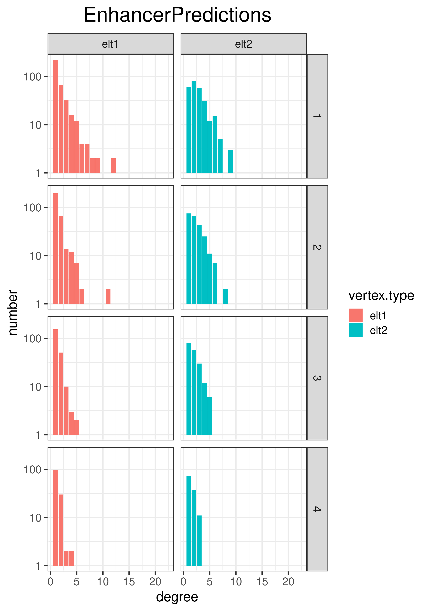

# Compute summary statistics on a bedpe file

## Using `bedpe.sumstats.sh`

### Find min-max

One can find min and max scores of a standard `.bedpe` file using:

```bash
awk 'BEGIN{FS="\t"; max=0;} {if($8>max){max=$8}} END{print max;}' EnhancerPredictions.bedpe
awk 'BEGIN{FS="\t"; min=1;} {if($8<min){min=$8}} END{print min;}' EnhancerPredictions.bedpe
```

### Launch `bedpe.sumstats.sh`

Then in order to compute summary statistics (replace `0` and `0.27` with min and max respectively) one may use the following script:

```bash
cd <where_the_bedpe_is_located>
mkdir sumstats
cd sumstats
~/scripts/sarah_djebali/bedpe.sumstats.sh ../EnhancerPredictions.bedpe.gz "0-0.27" "500-500"
```

It will produce the following outputs:
> ```
> Distance_by_score.quantile.density.png       EnhancerPredictions.scorequantile.bedpe.gz  refelt.scorequantile.nbconn.nbtimes.tsv
> Distance.png                                 refelt.scorequantile.fraglength.png         Score.png
> dist.score.quantiles.tsv.gz                  refelt.scorequantile.fraglength.tsv.gz      scorequantile.refelt.nb.fraglength.distrib.tsv
> EnhancerPredictions.nbconn.acc.to.score.tsv  refelt.scorequantile.nbconn.nbtimes.png
> ```

The outputs include plots that help to immediately visualize the results. For instance:

```bash
eog Distance_by_score.quantile.density.png
```

> `eog` stands for *eye of gnome*, the default gnome image viewer


*Number of connections of element 1 and of element 2. Here elt 1 are enhancers and elt 2 are TSS: a TSS usually makes more connections to enhancers, than enhancers make connections to TSS (the four screens distinguish between the four score-quartiles)*

